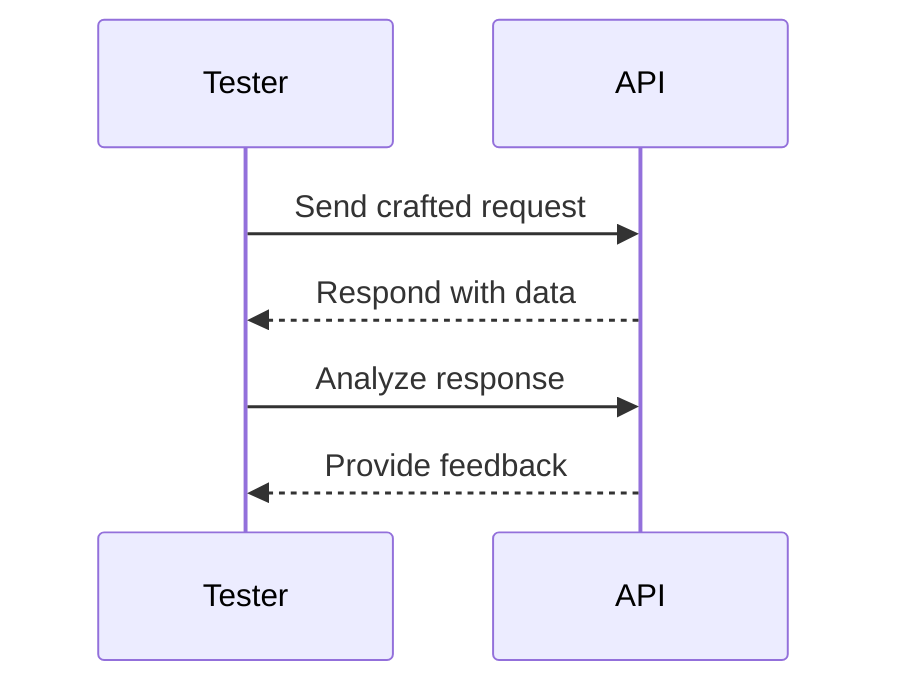
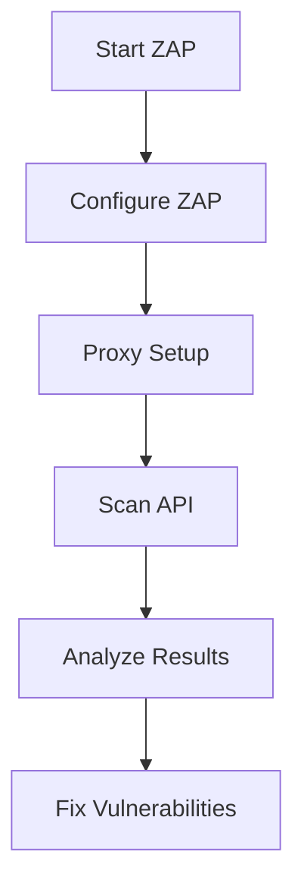

## Course Introduction and Prerequisites

### Welcome to the API Security Course

Welcome to the API Security course! This course is designed to provide you with a comprehensive understanding of the security aspects of Application Programming Interfaces (APIs). Whether you are a beginner or an experienced professional, this course will cover everything you need to know about securing APIs, from basic concepts to advanced techniques.

### No Prerequisites Required

One of the key features of this course is that there are no prerequisites required to start learning. This means that you do not need prior knowledge of specific tools or technologies to follow along. Every concept will be explained from the ground up, ensuring that you can understand and apply the principles effectively.

### Comprehensive Coverage

The course will cover various topics related to API security, including:

- Understanding the basics of APIs
- Common vulnerabilities in APIs
- Techniques for testing and securing APIs
- Real-world examples and case studies
- Tools and resources for API security

### Hunter 2.0 Optional but Recommended

While there are no prerequisites for this course, it is highly recommended that you take the Hunter 2.0 course. Hunter 2.0 provides detailed information on vulnerability escalation and other advanced topics that complement the material covered here. However, this course will focus on identifying and expressing vulnerabilities, rather than delving into the specifics of escalation.

### Course Structure

The course is structured to ensure that you gain a deep understanding of API security. Each section will cover a specific aspect of API security, starting with the fundamentals and gradually moving towards more complex topics.

### What Are APIs?

Before diving into the security aspects, let's first understand what APIs are. An API, or Application Programming Interface, is a set of rules and protocols for building and interacting with software applications. APIs allow different software components to communicate with each other, enabling data exchange and functionality sharing.

#### Why APIs Matter

APIs are crucial in modern software development because they enable:

- **Interoperability**: Different systems can communicate and share data seamlessly.
- **Modularity**: Systems can be built using modular components, making them easier to maintain and scale.
- **Reusability**: Code can be reused across different applications, reducing development time and effort.

#### Real-World Examples

Consider the following real-world examples where APIs play a critical role:

- **Social Media Platforms**: Facebook, Twitter, and Instagram use APIs to allow third-party developers to integrate their services.
- **Payment Gateways**: PayPal, Stripe, and Braintree use APIs to facilitate secure transactions.
- **Weather Services**: OpenWeatherMap provides APIs to fetch weather data for various locations.

### Common Vulnerabilities in APIs

APIs, like any other software component, are susceptible to various security vulnerabilities. Some of the most common vulnerabilities include:

- **Injection Attacks**: SQL injection, command injection, etc.
- **Broken Authentication**: Weak authentication mechanisms.
- **Sensitive Data Exposure**: Inadequate protection of sensitive data.
- **XML External Entities (XXE)**: Exploiting XML parsers.
- **Security Misconfiguration**: Improperly configured security settings.
- **Cross-Site Scripting (XSS)**: Injecting malicious scripts into web pages.
- **Insecure Deserialization**: Exploiting deserialization vulnerabilities.
- **Insufficient Logging & Monitoring**: Lack of proper logging and monitoring mechanisms.

#### Real-World Breaches

Several high-profile breaches have been attributed to API vulnerabilities. Here are a few recent examples:

- **Capital One Data Breach (CVE-2019-11510)**: A misconfigured API exposed sensitive customer data.
- **Twitter API Bug (CVE-2020-14720)**: A vulnerability in the Twitter API allowed unauthorized access to user data.
- **Zoom API Vulnerability (CVE-2020-13952)**: A flaw in the Zoom API allowed attackers to bypass authentication.

### Techniques for Testing and Securing APIs

To ensure the security of APIs, it is essential to perform thorough testing and implement robust security measures. Here are some key techniques:

#### API Penetration Testing

API penetration testing involves simulating attacks to identify and exploit vulnerabilities. This helps in understanding the security posture of the API and identifying areas for improvement.

##### Example: API Penetration Testing Workflow



#### Secure Coding Practices

Secure coding practices are essential to prevent vulnerabilities from being introduced during the development phase. Some best practices include:

- **Input Validation**: Validate all inputs to ensure they meet expected formats and constraints.
- **Output Encoding**: Encode outputs to prevent injection attacks.
- **Authentication and Authorization**: Implement strong authentication mechanisms and enforce proper authorization checks.
- **Error Handling**: Handle errors gracefully to avoid exposing sensitive information.

##### Example: Secure Input Validation

```python
def validate_input(input_data):
    if not isinstance(input_data, str):
        raise ValueError("Input must be a string")
    if len(input_data) > 100:
        raise ValueError("Input exceeds maximum length")
    return input_data

# Vulnerable code
input_data = "malicious input"
print(validate_input(input_data))

# Secure code
try:
    print(validate_input(input_data))
except ValueError as e:
    print(f"Validation error: {e}")
```

#### Secure Configuration Management

Proper configuration management is crucial to ensure that security settings are correctly applied. This includes:

- **Disabling Unnecessary Features**: Disable any features that are not required to reduce the attack surface.
- **Enforcing Strong Encryption**: Use strong encryption algorithms and protocols to protect data in transit and at rest.
- **Regular Audits**: Conduct regular audits to ensure compliance with security policies and standards.

##### Example: Secure Configuration Management

```yaml
# Vulnerable configuration
server:
  port: 8080
  ssl:
    enabled: false

# Secure configuration
server:
  port: 443
  ssl:
    enabled: true
    key-store: path/to/keystore.jks
    key-store-password: securepassword
```

### Real-World Examples and Case Studies

To reinforce the concepts learned, let's look at some real-world examples and case studies.

#### Capital One Data Breach (CVE-2019-11510)

In July 2019, Capital One suffered a data breach due to a misconfigured API. The attacker exploited a vulnerability in the API to access sensitive customer data.

##### Vulnerable API Configuration

```json
{
  "api": {
    "endpoint": "/data",
    "methods": ["GET", "POST"],
    "authentication": false,
    "rate_limit": 100
  }
}
```

##### Secure API Configuration

```json
{
  "api": {
    "endpoint": "/data",
    "methods": ["GET", "POST"],
    "authentication": true,
    "rate_limit": 100,
    "allowed_ips": ["192.168.1.1"]
  }
}
```

#### Twitter API Bug (CVE-2020-14720)

In March 2020, a vulnerability in the Twitter API allowed attackers to bypass authentication and access user data.

##### Vulnerable API Request

```http
GET /users/:id HTTP/1.1
Host: api.twitter.com
Authorization: Bearer <token>
```

##### Secure API Request

```http
GET /users/:id HTTP/1.1
Host: api.twitter.com
Authorization: Bearer <token>
X-Twitter-Client-Version: 1.0
```

### Tools and Resources for API Security

There are several tools and resources available to help with API security. Some popular ones include:

- **OWASP ZAP**: A free and open-source tool for scanning and testing web applications.
- **Burp Suite**: A comprehensive toolkit for web application security testing.
- **Postman**: A popular tool for testing and documenting APIs.
- **Swagger**: A framework for designing, building, documenting, and consuming RESTful web services.

#### Example: Using OWASP ZAP for API Testing



### How to Prevent / Defend Against API Vulnerabilities

To prevent and defend against API vulnerabilities, it is essential to implement a multi-layered approach. Here are some key strategies:

#### Detection

- **Logging and Monitoring**: Implement comprehensive logging and monitoring to detect suspicious activities.
- **Intrusion Detection Systems (IDS)**: Use IDS to detect and alert on potential security incidents.

##### Example: Logging and Monitoring

```bash
# Vulnerable logging
logger.info("User accessed endpoint")

# Secure logging
logger.info("User %s accessed endpoint %s", user_id, endpoint)
```

#### Prevention

- **Secure Coding Practices**: Follow secure coding practices to prevent vulnerabilities from being introduced.
- **Regular Audits**: Conduct regular security audits to ensure compliance with security policies and standards.

##### Example: Secure Coding Practices

```python
# Vulnerable code
user_input = request.form['username']
query = f"SELECT * FROM users WHERE username = '{user_input}'"

# Secure code
user_input = request.form['username']
query = "SELECT * FROM users WHERE username = %s"
cursor.execute(query, (user_input,))
```

#### Secure Configuration Management

- **Disable Unnecessary Features**: Disable any features that are not required to reduce the attack surface.
- **Enforce Strong Encryption**: Use strong encryption algorithms and protocols to protect data in transit and at rest.

##### Example: Secure Configuration Management

```yaml
# Vulnerable configuration
server:
  port: 8080
  ssl:
    enabled: false

# Secure configuration
server:
  port: 443
  ssl:
    enabled: true
    key-store: path/to/keystore.jks
    key-store-password: securepassword
```

### Hands-On Labs

To reinforce the concepts learned, it is recommended to practice with hands-on labs. Here are some well-known labs that fit this topic's domain:

- **PortSwigger Web Security Academy**: Offers a wide range of labs for web application security, including API security.
- **OWASP Juice Shop**: A deliberately insecure web application for practicing web security skills.
- **DVWA (Damn Vulnerable Web Application)**: A PHP/MySQL web application that is riddled with vulnerabilities for educational purposes.
- **WebGoat**: An interactive, gamified training application for learning web security.

#### Example: PortSwigger Web Security Academy

PortSwigger Web Security Academy offers a variety of labs for practicing API security. Here is an example of a lab exercise:

##### Lab Exercise: API Injection Attack

**Objective**: Identify and exploit an injection vulnerability in an API endpoint.

**Steps**:

1. **Identify the Vulnerable Endpoint**: Use Burp Suite to identify the API endpoint that is vulnerable to injection attacks.
2. **Craft the Attack Payload**: Craft a payload that exploits the injection vulnerability.
3. **Exploit the Vulnerability**: Send the crafted payload to the API endpoint and observe the response.

##### Example: Crafting the Attack Payload

```http
POST /api/users/search HTTP/1.1
Host: vulnerable-app.com
Content-Type: application/json

{
  "search": "' OR '1'='1"
}
```

##### Expected Response

```json
{
  "status": "success",
  "data": [
    {
      "id": 1,
      "username": "admin",
      "email": "admin@example.com"
    },
    {
      "id": 2,
      "username": "user1",
      "email": "user1@example.com"
    }
  ]
}
```

### Conclusion

This course provides a comprehensive introduction to API security, covering the basics of APIs, common vulnerabilities, testing techniques, and secure coding practices. By following the material and practicing with hands-on labs, you will gain a deep understanding of how to secure APIs effectively.

Thank you for joining this course, and we look forward to seeing you in upcoming courses on API security and other related topics.

---
<!-- nav -->
[[API Security/01-Course Introduction/02-Course Prerequists/00-Overview|Overview]] | [[02-Course Prerequisites|Course Prerequisites]]
