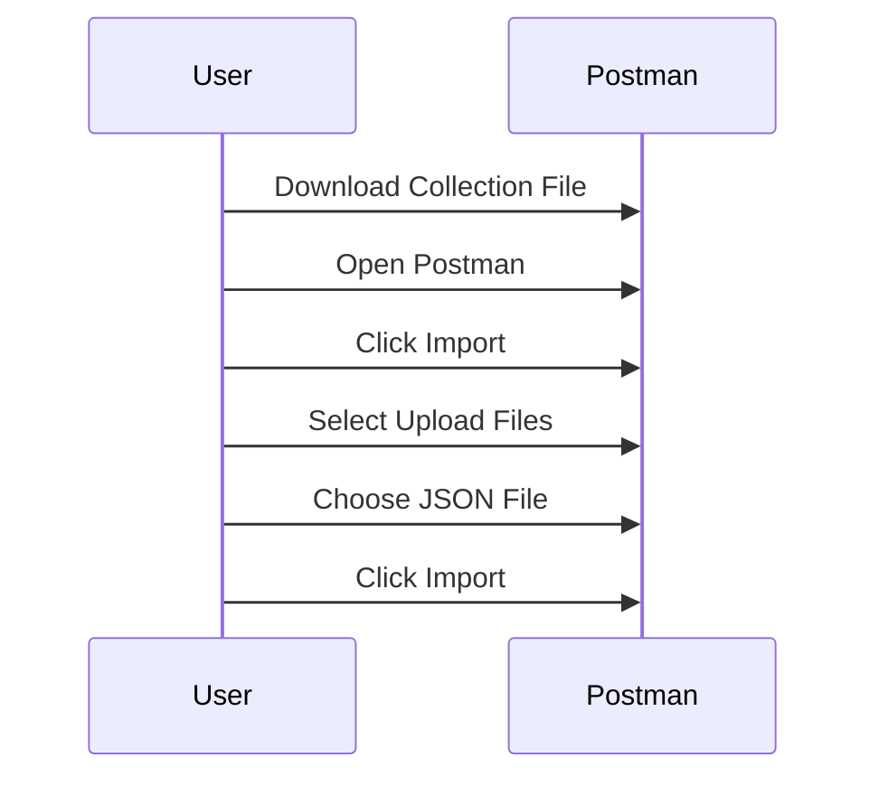

## Importing API Collections

### What is an API Collection?

An API collection is a group of related API endpoints and requests that can be organized and executed together. Tools like Postman allow you to create, manage, and share API collections, making it easier to test and document APIs.

### How to Import an API Collection in Postman

Postman is a popular tool for API development and testing. To import an API collection in Postman:

1. **Download the Collection File**: Obtain the collection file, usually in JSON format.
2. **Open Postman**: Launch the Postman application.
3. **Import the Collection**:
    - Click on `Import` in the left sidebar.
    - Choose `Upload Files` and select the downloaded JSON file.
    - Click `Import`.



### Example of an API Collection

Here is an example of a simple API collection in JSON format:

```json
{
  "info": {
    "name": "Sample API Collection",
    "schema": "https://schema.getpostman.com/json/collection/v2.1.0/collection.json"
  },
  "item": [
    {
      "name": "Get Users",
      "request": {
        "method": "GET",
        "header": [],
        "url": {
          "raw": "https://api.example.com/users",
          "host": [
            "api",
            "example",
            "com"
          ],
          "path": [
            "users"
          ]
        }
      },
      "response": []
    },
    {
      "name": "Create User",
      "request": {
        "method": "POST",
        "header": [
          {
            "key": "Content-Type",
            "value": "application/json"
          }
        ],
        "body": {
          "mode": "raw",
          "raw": "{\n  \"username\": \"newuser\",\n  \"email\": \"newuser@example.com\"\n}"
        },
        "url": {
          "raw": "https://api.example.com/users",
          "host": [
            "api",
            "example",
            "com"
          ],
          "path": [
            "users"
          ]
        }
      },
      "response": []
    }
  ]
}
```

### How to Prevent / Defend Against Misuse of API Collections

#### Detection
- **Monitor API Usage**: Implement logging and monitoring tools to track API usage patterns.
- **Rate Limiting**: Set rate limits to prevent abuse and ensure fair usage.

#### Prevention
- **Secure API Collections**: Ensure that API collections are shared securely and only with authorized users.
- **Use Secure Authentication Mechanisms**: Implement strong authentication methods such as OAuth 2.0 or JWT.

#### Secure Coding Fixes
- **Vulnerable Code Example**:
  ```json
  {
    "info": {
      "name": "Insecure API Collection",
      "schema": "https://schema.getpostman.com/json/collection/v2.1.0/collection.json"
    },
    "item": [
      {
        "name": "Get Users",
        "request": {
          "method": "GET",
          "header": [],
          "url": {
            "raw": "http://api.example.com/users",
            "host": [
              "api",
              "example",
              "com"
            ],
            "path": [
              "users"
            ]
          }
        },
        "response": []
      }
    ]
  }
  ```

- **Fixed Code Example**:
  ```json
  {
    "info": {
      "name": "Secure API Collection",
      "schema": "https://schema.getpostman.com/json/collection/v2.1.0/collection.json"
    },
    "item": [
      {
        "name": "Get Users",
        "request": {
          "method": "GET",
          "header": [
            {
              "key": "Authorization",
              "value": "Bearer {{access_token}}"
            }
          ],
          "url": {
            "raw": "https://api.example.com/users",
            "host": [
              "api",
              "example",
              "com"
            ],
            "path": [
              "users"
            ]
          }
        },
        "response": []
      }
    ]
  }
  ```

---
<!-- nav -->
[[05-Generating API Keys|Generating API Keys]] | [[API Security/02-Preparing for API Pentest/01-Bug Bounty Perspective to Find API Endpoints/00-Overview|Overview]] | [[07-Preparing for API Penetration Testing from a Bug Bounty Perspective|Preparing for API Penetration Testing from a Bug Bounty Perspective]]
