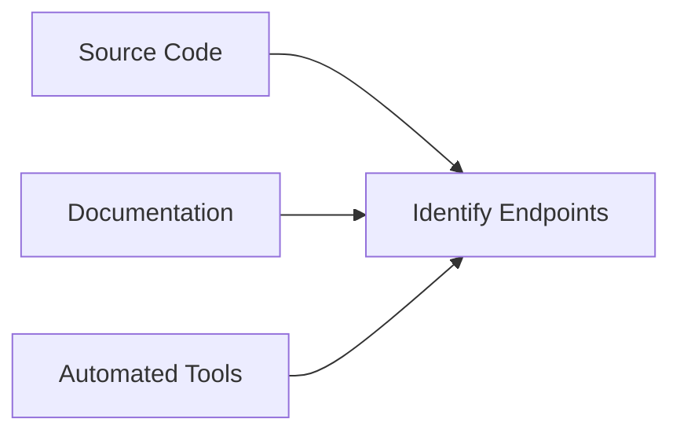
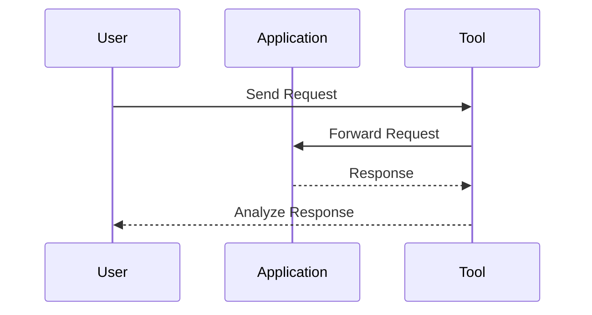

## Preparing for API Pentest: Bug Bounty Perspective to Find API Endpoints

### Background Theory

When preparing for an API pentest, especially from a bug bounty perspective, it is crucial to understand the underlying architecture and components of the API. An API (Application Programming Interface) is a set of rules and protocols for building and integrating application software. In the context of web applications, APIs are often used to facilitate communication between different services or components.

#### RESTful APIs

REST (Representational State Transfer) is an architectural style for designing networked applications. A RESTful API is designed around a set of resources, which are identified by URIs (Uniform Resource Identifiers). These resources can be manipulated using standard HTTP methods such as GET, POST, PUT, DELETE, etc.

#### Authentication Mechanisms

Authentication is the process of verifying the identity of a user or service. In the context of API security, authentication mechanisms are essential to ensure that only authorized entities can access the API endpoints. Common authentication mechanisms include:

- **Basic Authentication**: This method uses a simple username and password combination encoded in Base64.
- **Token-Based Authentication**: This method uses tokens, such as JWT (JSON Web Tokens), to authenticate users.
- **OAuth**: This is an open-standard authorization protocol or framework that provides applications secure designated access.

### Finding API Endpoints

Finding API endpoints is a critical step in preparing for an API pentest. This involves identifying the various endpoints that the API exposes and understanding their functionality. Here are some techniques to find API endpoints:

#### Static Analysis

Static analysis involves examining the source code or documentation of the application to identify API endpoints. This can be done manually or using automated tools.



#### Dynamic Analysis

Dynamic analysis involves interacting with the application in real-time to discover API endpoints. This can be done using tools like Burp Suite, OWASP ZAP, or Postman.



### Real-World Examples

#### CVE-2021-21972: Unauthenticated Access to Admin API

In 2021, a vulnerability was discovered in a popular web application framework, allowing unauthenticated access to admin API endpoints. This vulnerability allowed attackers to manipulate sensitive data and perform unauthorized actions.

**Vulnerable Code Example:**

```python
@app.route('/admin/api', methods=['GET'])
def admin_api():
    # Vulnerable code here
    return jsonify(data)
```

**Fixed Code Example:**

```python
from flask import Flask, jsonify, request
from functools import wraps

app = Flask(__name__)

def require_auth(f):
    @wraps(f)
    def decorated_function(*args, **kwargs):
        auth_header = request.headers.get('Authorization')
        if not auth_header:
            return jsonify({'error': 'Unauthorized'}), 401
        # Additional authentication logic here
        return f(*args, **kwargs)
    return decorated_function

@app.route('/admin/api', methods=['GET'])
@require_auth
def admin_api():
    # Secure code here
    return jsonify(data)
```

### How to Prevent / Defend

#### Detection

To detect unauthorized access to API endpoints, you can implement logging and monitoring mechanisms. This includes logging all incoming requests and analyzing them for suspicious activity.

**Example Log Entry:**

```http
GET /api/v1/users HTTP/1.1
Host: example.com
Authorization: Bearer <token>
User-Agent: Mozilla/5.0
```

#### Prevention

To prevent unauthorized access, you should implement robust authentication and authorization mechanisms. This includes:

- **Using Strong Authentication Mechanisms**: Implement token-based authentication or OAuth to ensure that only authorized users can access the API.
- **Rate Limiting**: Implement rate limiting to prevent brute-force attacks.
- **Input Validation**: Validate all input parameters to prevent injection attacks.

#### Secure Coding Practices

- **Use HTTPS**: Ensure that all API communications are encrypted using HTTPS.
- **Implement CORS Policies**: Configure Cross-Origin Resource Sharing (CORS) policies to restrict access to your API from unauthorized domains.

### Complete Example

#### Vulnerable Configuration

**nginx.conf:**

```nginx
server {
    listen 80;
    server_name example.com;

    location /api/v1 {
        proxy_pass http://backend;
    }
}
```

#### Secure Configuration

**nginx.conf:**

```nginx
server {
    listen 443 ssl;
    server_name example.com;

    ssl_certificate /etc/nginx/ssl/example.crt;
    ssl_certificate_key /etc/nginx/ssl/example.key;

    location /api/v1 {
        proxy_pass http://backend;
        add_header 'Access-Control-Allow-Origin' 'https://trusted-domain.com';
        add_header 'Access-Control-Allow-Methods' 'GET, POST, OPTIONS';
        add_header 'Access-Control-Allow-Headers' 'Authorization, Content-Type';
    }
}
```

### Hands-On Labs

For hands-on practice, consider the following labs:

- **PortSwigger Web Security Academy**: Offers a comprehensive set of labs covering various aspects of web security, including API security.
- **OWASP Juice Shop**: A deliberately insecure web application that allows you to practice finding and exploiting vulnerabilities.
- **DVWA (Damn Vulnerable Web Application)**: Another intentionally vulnerable web application for practicing web security skills.

By thoroughly understanding the concepts, techniques, and best practices covered in this chapter, you will be well-prepared to conduct effective API pentests and enhance the security of your applications.

---
<!-- nav -->
[[07-Preparing for API Penetration Testing from a Bug Bounty Perspective|Preparing for API Penetration Testing from a Bug Bounty Perspective]] | [[API Security/02-Preparing for API Pentest/01-Bug Bounty Perspective to Find API Endpoints/00-Overview|Overview]] | [[API Security/02-Preparing for API Pentest/01-Bug Bounty Perspective to Find API Endpoints/09-Conclusion|Conclusion]]
