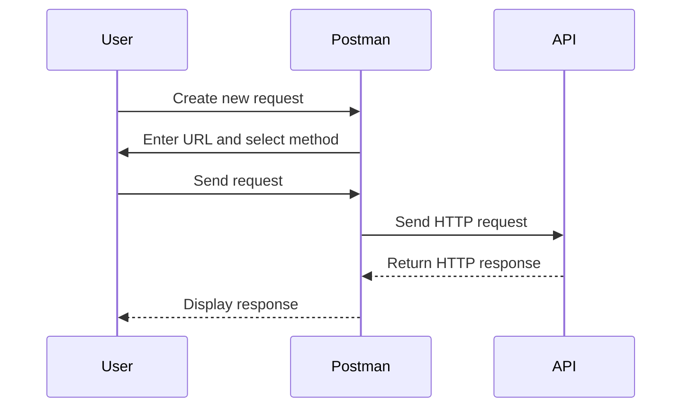
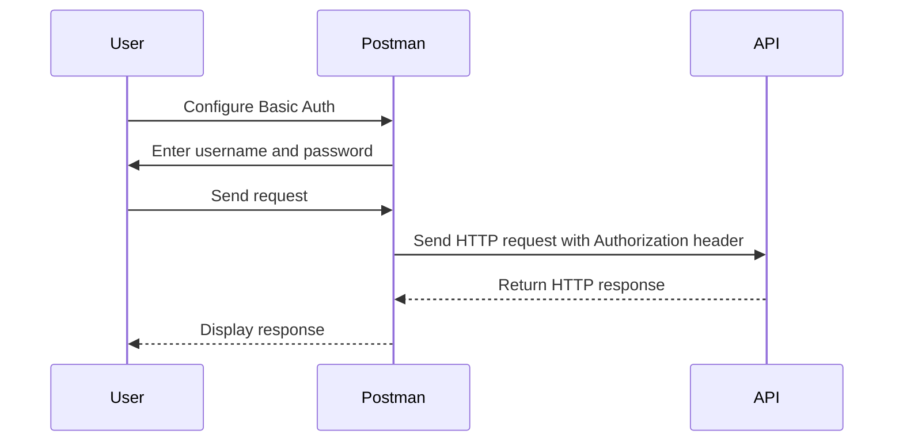
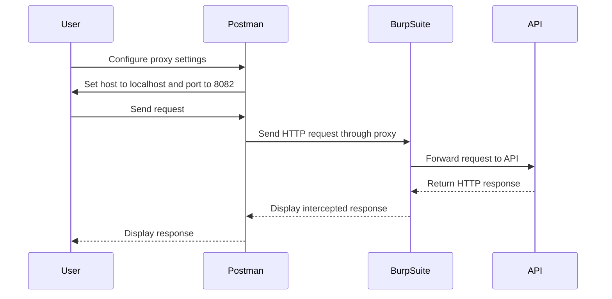

## Introduction to API Pentesting and Tools

API (Application Programming Interface) pentesting is a critical aspect of ensuring the security and robustness of modern applications. APIs are often the backbone of web services, enabling communication between different components of a system. However, they can also be a significant attack surface if not properly secured. In this chapter, we will delve into the process of preparing for an API pentest using tools like Postman and Burp Suite.

### Why API Pentesting Matters

APIs are increasingly becoming the primary interface for web applications, mobile apps, and IoT devices. They handle sensitive data such as personal information, financial details, and authentication tokens. A poorly secured API can lead to data breaches, unauthorized access, and other security vulnerabilities. Recent high-profile breaches, such as the Capital One breach in 2019 (CVE-2019-11510), highlight the importance of thorough API security testing.

### Tools Used in API Pentesting

Two popular tools used in API pentesting are Postman and Burp Suite:

- **Postman**: A powerful tool for creating, sending, and testing HTTP requests. It supports various authentication methods, including Basic Auth, OAuth, and more.
- **Burp Suite**: An integrated platform for performing security testing of web applications. It includes tools for intercepting and modifying HTTP requests and responses.

### Setting Up Postman for API Testing

To begin, ensure you have Postman installed on your machine. You can download it from the official website: https://www.postman.com/downloads/

#### Creating a New Request in Postman

1. Open Postman and create a new request.
2. Enter the URL of the API endpoint you wish to test.
3. Select the appropriate HTTP method (GET, POST, PUT, DELETE, etc.).



### Configuring Basic Authentication in Postman

Basic Authentication is a simple method of encoding a username and password pair. It is widely used but should be avoided for sensitive data due to its lack of encryption.

1. Click on the "Authorization" tab in the request builder.
2. Select "Basic Auth".
3. Enter the username and password.



### Example of a GET Request with Basic Auth

Let's consider a scenario where we are testing a GET request to retrieve user data from an API endpoint.

#### Raw HTTP Request

```http
GET /api/users HTTP/1.1
Host: example.com
Authorization: Basic YWRtaW46MTIzNDU2
```

- **Authorization Header**: The value `YWRtaW46MTIzNDU2` is the Base64 encoded string of `admin:123456`.

#### Full HTTP Response

```http
HTTP/1.1 200 OK
Date: Mon, 23 Jan 2023 12:00:00 GMT
Content-Type: application/json
Content-Length: 1024

{
    "users": [
        {
            "id": 1,
            "name": "John Doe",
            "email": "john.doe@example.com"
        },
        {
            "id": 2,
            "name": "Jane Smith",
            "email": "jane.smith@example.com"
        }
    ]
}
```

### Intercepting Requests with Burp Suite

Burp Suite is a powerful tool for intercepting and modifying HTTP requests and responses. To set up Burp Suite for intercepting requests from Postman:

1. Start Burp Suite and go to the Proxy tab.
2. Set the listening port to 8082.
3. Configure Postman to use Burp Suite as a proxy.

#### Configuring Postman to Use Burp Suite Proxy

1. Go to the "Proxy" tab in Postman settings.
2. Enable the proxy and set the host to `localhost` and the port to `8082`.



### Analyzing Intercepts in Burp Suite

Once the request is intercepted, you can analyze it in Burp Suite:

1. Go to the Proxy tab in Burp Suite.
2. View the intercepted request and response.
3. Modify the request if needed and resend it.

#### Example of a POST Request with Headers

Consider a scenario where we are testing a POST request to create a new user.

#### Raw HTTP Request

```http
POST /api/users HTTP/1.1
Host: example.com
Authorization: Basic YWRtaW46MTIzNDU2
Content-Type: application/json
Content-Length: 54

{
    "name": "New User",
    "email": "new.user@example.com"
}
```

#### Full HTTP Response

```http
HTTP/1.1 201 Created
Date: Mon, 23 Jan 2023 12:00:00 GMT
Content-Type: application/json
Content-Length: 1024

{
    "id": 3,
    "name": "New User",
    "email": "new.user@example.com"
}
```

### Common Pitfalls and How to Prevent Them

#### Incorrect Configuration of Basic Auth

**Vulnerable Code**

```json
{
    "url": "https://example.com/api/users",
    "method": "GET",
    "headers": {
        "Authorization": "Basic YWRtaW46MTIzNDU2"
    }
}
```

**Secure Code**

Ensure that Basic Auth is only used over HTTPS to encrypt the credentials.

```json
{
    "url": "https://example.com/api/users",
    "method": "GET",
    "headers": {
        "Authorization": "Basic YWRtaW46MTIzNDU2"
    }
}
```

#### Improper Handling of Error Responses

**Vulnerable Code**

```json
{
    "url": "https://example.com/api/users",
    "method": "POST",
    "headers": {
        "Authorization": "Basic YWRtaW46MTIzNDU2",
        "Content-Type": "application/json"
    },
    "body": {
        "name": "New User",
        "email": "new.user@example.com"
    }
}
```

**Secure Code**

Ensure proper handling of error responses and provide meaningful error messages.

```json
{
    "url": "https://example.com/api/users",
    "method": "POST",
    "headers": {
        "Authorization": "Basic YWRtaW46MTIzNDU2",
        "Content-Type": "application/json"
    },
    "body": {
        "name": "New User",
        "email": "new.user@example.com"
    }
}
```

### Detection and Prevention Strategies

#### Detection

- Use tools like Burp Suite to intercept and analyze HTTP requests and responses.
- Monitor logs for unusual activity and unauthorized access attempts.

#### Prevention

- Implement strong authentication mechanisms such as OAuth 2.0.
- Ensure all API endpoints are protected by HTTPS.
- Regularly perform security audits and penetration tests.

### Hands-On Practice Labs

For hands-on practice, consider the following labs:

- **PortSwigger Web Security Academy**: Offers comprehensive modules on API security.
- **OWASP Juice Shop**: A deliberately insecure web app for practicing security testing.
- **DVWA (Damn Vulnerable Web Application)**: Another popular lab for learning web security.

By thoroughly understanding and applying these concepts, you can significantly enhance the security of your APIs and protect against potential vulnerabilities.

---
<!-- nav -->
[[API Security/02-Preparing for API Pentest/04-Postman Request Intercept in Burpsuite/00-Overview|Overview]] | [[02-Introduction to API Pentesting with Postman and Burp Suite|Introduction to API Pentesting with Postman and Burp Suite]]
