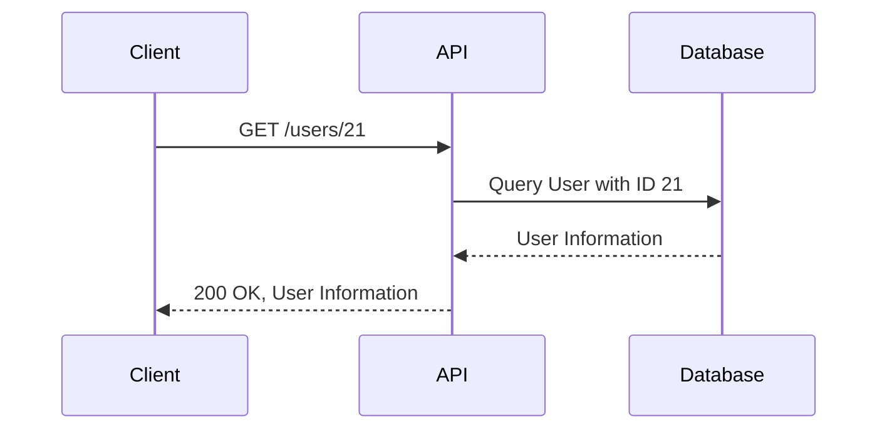

## Introduction to API Pentesting with Swagger Files

API pentesting, or penetration testing, is a crucial process in ensuring the security of web applications and services. One of the most effective tools for simplifying this process is the use of Swagger files (also known as OpenAPI specifications). These files provide a structured way to describe the APIs, making it easier to understand their functionalities and test them for security vulnerabilities.

### What is Swagger?

Swagger is a set of open-source tools built around the OpenAPI Specification (OAS) that helps developers design, build, document, and consume RESTful web services. The OpenAPI Specification is a language-agnostic interface to RESTful APIs which allows both humans and computers to discover and understand the capabilities of a service without access to source code, documentation, or through network traffic inspection.

### Why Use Swagger for API Pentesting?

Using Swagger files for API pentesting offers several advantages:

1. **Structured Documentation**: Swagger provides a standardized way to document APIs, making it easier to understand the structure and functionality of the API.
2. **Automated Testing**: Tools like Postman and Swagger UI can automatically generate test cases based on the Swagger specification, reducing the time and effort required to manually create tests.
3. **Comprehensive Coverage**: Swagger files typically cover all endpoints, parameters, and response types, ensuring comprehensive coverage during testing.
4. **Ease of Use**: Swagger UI provides an interactive interface to test API endpoints, making it easy to simulate various scenarios and identify potential vulnerabilities.

### How Swagger Works

Swagger works by defining a set of rules and conventions for describing APIs. These descriptions are written in JSON or YAML format and include details such as:

- **Endpoints**: The URLs that the API uses.
- **Methods**: The HTTP methods (GET, POST, PUT, DELETE, etc.) supported by each endpoint.
- **Parameters**: The input parameters required by each endpoint.
- **Responses**: The expected output formats and status codes.

Here is an example of a simple Swagger file in YAML format:

```yaml
openapi: 3.0.0
info:
  title: Sample API
  description: A sample API to demonstrate Swagger usage
  version: 1.0.0
servers:
  - url: https://api.example.com/v1
paths:
  /users:
    get:
      summary: Get a list of users
      responses:
        '200':
          description: A list of users
          content:
            application/json:
              schema:
                type: array
                items:
                  $ref: '#/components/schemas/User'
components:
  schemas:
    User:
      type: object
      properties:
        id:
          type: integer
        name:
          type: string
```

### Real-World Example: Recent Breaches Involving APIs

One notable example of an API-related breach is the Capital One data breach in 2019 (CVE-2019-11510). This breach involved an API misconfiguration that allowed unauthorized access to sensitive customer data. The attacker exploited a misconfigured WAF rule that exposed a server-side request forgery (SSRF) vulnerability, leading to unauthorized access to the API.

### Using Swagger for API Pentesting

To effectively use Swagger for API pentesting, follow these steps:

1. **Obtain the Swagger File**: Ensure you have the Swagger file for the API you want to test. This file should be provided by the API developer or can be generated using tools like Swagger Codegen.

2. **Import the Swagger File**: Import the Swagger file into a tool like Swagger UI or Postman. This will allow you to interactively test the API endpoints.

3. **Test Endpoints**: Use the interactive interface to test different endpoints, parameters, and methods. Pay special attention to endpoints that handle sensitive data or perform critical operations.

4. **Simulate Attack Scenarios**: Simulate various attack scenarios, such as SQL injection, cross-site scripting (XSS), and broken authentication. Use the Swagger file to understand the expected behavior and identify deviations.

### Example: Testing an API Endpoint

Let's consider an example where we are testing an API endpoint that retrieves user information. Here is the Swagger definition for this endpoint:

```yaml
paths:
  /users/{id}:
    get:
      summary: Get user information by ID
      parameters:
        - name: id
          in: path
          required: true
          schema:
            type: integer
      responses:
        '200':
          description: User information
          content:
            application/json:
              schema:
                $ref: '#/components/schemas/User'
```

#### Testing the Endpoint

1. **Formulate the Request**:
   - Use the Swagger UI to formulate the request. For example, you might set the `id` parameter to `21`.

2. **Execute the Request**:
   - Click on the "Try it out" button in Swagger UI to execute the request.
   - The request will be sent to the API, and the response will be displayed.

3. **Analyze the Response**:
   - Check the response to ensure it contains the expected user information.
   - Look for any unexpected data or errors in the response.

Here is an example of the HTTP request and response:

```http
GET /users/21 HTTP/1.1
Host: api.example.com
Accept: application/json
```

```http
HTTP/1.1 200 OK
Content-Type: application/json

{
  "id": 21,
  "name": "John Doe",
  "email": "john.doe@example.com"
}
```

### Common Pitfalls and How to Avoid Them

When using Swagger for API pentesting, there are several common pitfalls to be aware of:

1. **Incomplete Documentation**: Ensure the Swagger file covers all endpoints and scenarios. Missing documentation can lead to incomplete testing.
2. **Incorrect Parameter Handling**: Verify that all parameters are correctly handled by the API. Incorrect handling can lead to vulnerabilities such as SQL injection or XSS.
3. **Insufficient Authentication**: Ensure that all endpoints require proper authentication. Unsecured endpoints can be exploited by attackers.
4. **Sensitive Data Exposure**: Check that sensitive data is not unnecessarily exposed through API responses. This can lead to data breaches.

### How to Prevent / Defend Against API Vulnerabilities

#### Secure Coding Practices

1. **Input Validation**: Always validate input parameters to prevent injection attacks. Use libraries and frameworks that provide built-in validation mechanisms.
2. **Authentication and Authorization**: Implement strong authentication mechanisms and ensure that all endpoints are properly authorized. Use OAuth 2.0 or JWT for secure token-based authentication.
3. **Data Masking**: Mask sensitive data in API responses to prevent exposure. Use encryption and hashing techniques to protect sensitive information.

#### Example: Secure vs. Insecure Code

Here is an example of insecure code that does not validate input parameters:

```python
@app.route('/users/<int:id>', methods=['GET'])
def get_user(id):
    user = db.query(User).filter_by(id=id).first()
    return jsonify(user)
```

And here is the secure version with input validation:

```python
@app.route('/users/<int:id>', methods=['GET'])
def get_user(id):
    if not validate_id(id):
        abort(400, description="Invalid user ID")
    user = db.query(User).filter_by(id=id).first()
    return jsonify(user)

def validate_id(id):
    # Add validation logic here
    return True
```

#### Configuration Hardening

1. **Secure Headers**: Configure your API server to use secure HTTP headers such as Content-Security-Policy, X-Frame-Options, and Strict-Transport-Security.
2. **Rate Limiting**: Implement rate limiting to prevent brute-force attacks and denial-of-service (DoS) attacks.
3. **Logging and Monitoring**: Enable detailed logging and monitoring to detect and respond to suspicious activity.

#### Example: Secure Headers Configuration

Here is an example of configuring secure headers in an Nginx server:

```nginx
server {
    listen 443 ssl;
    server_name api.example.com;

    ssl_certificate /etc/nginx/ssl/api.example.com.crt;
    ssl_certificate_key /etc/nginx/ssl/api.example.com.key;

    add_header Content-Security-Policy "default-src 'self'";
    add_header X-Frame-Options DENY;
    add_header Strict-Transport-Security "max-age=31536000; includeSubDomains";

    location / {
        proxy_pass http://localhost:8000;
    }
}
```

### Conclusion

Using Swagger files for API pentesting can significantly simplify the process and improve the effectiveness of security testing. By following best practices and implementing secure coding and configuration techniques, you can help ensure the security of your APIs and protect against potential vulnerabilities.

### Practice Labs

For hands-on practice with API security, consider the following labs:

- **PortSwigger Web Security Academy**: Offers a series of labs focused on API security, including SQL injection, XSS, and broken authentication.
- **OWASP Juice Shop**: A deliberately insecure web application that includes API endpoints for testing and exploitation.
- **DVWA (Damn Vulnerable Web Application)**: Another intentionally vulnerable web application that includes API components for security testing.

These labs provide practical experience in identifying and mitigating API vulnerabilities, helping you to become proficient in API security.



This diagram illustrates the sequence of events when a client requests user information from an API. Understanding this flow is crucial for identifying potential vulnerabilities and implementing appropriate security measures.

---
<!-- nav -->
[[API Security/02-Preparing for API Pentest/05-Simplifying API Pentest with Swagger files/00-Overview|Overview]] | [[02-Introduction to API Pentesting|Introduction to API Pentesting]]
