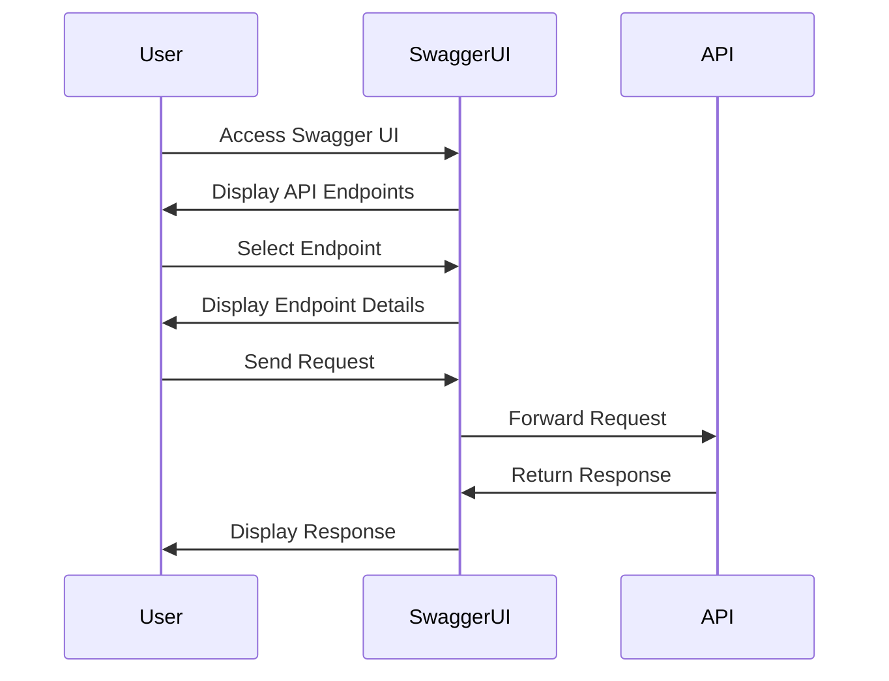

## Preparing for API Pentest with Swagger Files

### Introduction to API Pentesting

API pentesting, or penetration testing, is the process of simulating cyber attacks on an application programming interface (API) to identify vulnerabilities and weaknesses. This is crucial because APIs often serve as the backbone of modern web applications, handling sensitive data and critical business logic. Ensuring the security of APIs is essential to protect against unauthorized access, data breaches, and other malicious activities.

### Understanding OpenAPI and Swagger

#### What is OpenAPI?

OpenAPI, formerly known as Swagger, is a specification for machine-readable interface files for describing, producing, consuming, and visualizing RESTful web services. It defines a standard, language-agnostic interface to RESTful APIs which allows both humans and computers to discover and understand the capabilities of the service without access to source code, documentation, or through network traffic inspection.

#### Why Use OpenAPI?

Using OpenAPI simplifies the process of documenting and testing APIs. It provides a standardized way to describe the structure of an API, including:

- **Endpoints**: The specific URLs that the API uses.
- **Methods**: The HTTP methods (GET, POST, PUT, DELETE, etc.) used to interact with the endpoints.
- **Parameters**: The input parameters required by the API.
- **Responses**: The expected output formats and status codes.

This standardization makes it easier for developers, testers, and security professionals to understand and interact with the API.

#### How Does OpenAPI Work?

An OpenAPI document is typically written in YAML or JSON format. Here’s an example of a simple OpenAPI document:

```yaml
openapi: 3.0.0
info:
  title: Sample API
  description: A sample API to demonstrate OpenAPI
  version: 1.0.0
servers:
  - url: https://api.example.com/v1
paths:
  /users:
    get:
      summary: Returns a list of users
      responses:
        '200':
          description: A list of users
          content:
            application/json:
              schema:
                type: array
                items:
                  $ref: '#/components/schemas/User'
components:
  schemas:
    User:
      type: object
      properties:
        id:
          type: integer
        name:
          type: string
```

In this example, the `/users` endpoint supports a `GET` method, which returns a list of users in JSON format.

### Using Swagger for API Documentation and Testing

#### What is Swagger?

Swagger is a set of tools built around the OpenAPI Specification. It includes:

- **Swagger Editor**: An online tool for creating and editing OpenAPI documents.
- **Swagger Codegen**: A tool for generating client libraries, server stubs, and API documentation from an OpenAPI definition.
- **Swagger UI**: A tool for rendering interactive API documentation based on an OpenAPI document.

#### Benefits of Swagger

- **Interactive Documentation**: Swagger UI provides a live, interactive interface for testing API endpoints.
- **Automated Testing**: Swagger Codegen can generate test cases and client libraries for automated testing.
- **Consistency**: Ensures that the API documentation is consistent with the actual implementation.

#### Example of Swagger UI

Here’s an example of how Swagger UI might look for an API:



In this sequence diagram, a user interacts with Swagger UI to test an API endpoint. The user selects an endpoint, sends a request, and receives a response, all within the Swagger UI interface.

### Preparing for API Pentest with Swagger Files

#### Steps to Prepare for API Pentest

1. **Generate OpenAPI Document**:
   - Use Swagger Editor to create or edit an OpenAPI document.
   - Ensure the document accurately describes all API endpoints, methods, parameters, and responses.

2. **Use Swagger UI**:
   - Deploy Swagger UI to render the OpenAPI document.
   - Test each endpoint manually to ensure the documentation matches the actual API behavior.

3. **Automate Testing with Swagger Codegen**:
   - Generate client libraries and test cases using Swagger Codegen.
   - Integrate these tests into your continuous integration (CI) pipeline.

#### Example of Generating Client Libraries

Here’s an example of using Swagger Codegen to generate a Python client library:

```bash
java -jar swagger-codegen-cli.jar generate \
     -i api.yaml \
     -l python \
     -o generated-client
```

This command generates a Python client library based on the `api.yaml` OpenAPI document.

### Real-World Examples and Recent Breaches

#### Example: CVE-2021-21972

CVE-2021-21972 is a vulnerability in the OpenAPI Specification itself. This vulnerability allowed attackers to inject arbitrary code into the Swagger UI, leading to potential remote code execution.

**Impact**: This vulnerability affected numerous applications that relied on Swagger UI for API documentation.

**Prevention**:
- **Update Dependencies**: Ensure that all dependencies, including Swagger UI, are up-to-date.
- **Input Validation**: Validate all inputs to prevent code injection attacks.

#### Example: API Breach at Capital One

In 2019, Capital One suffered a significant data breach due to a misconfigured API. The attacker exploited a vulnerability in the API to gain unauthorized access to sensitive customer data.

**Impact**: This breach exposed the personal information of over 100 million customers.

**Prevention**:
- **API Security Best Practices**: Implement proper authentication, authorization, and rate limiting.
- **Regular Audits**: Conduct regular security audits and penetration tests to identify and mitigate vulnerabilities.

### Common Pitfalls and How to Avoid Them

#### Pitfall: Incomplete Documentation

**Problem**: If the OpenAPI document does not accurately describe all API endpoints and behaviors, it can lead to misunderstandings and security vulnerabilities.

**Solution**: Thoroughly test each endpoint and ensure the documentation matches the actual API behavior.

#### Pitfall: Lack of Input Validation

**Problem**: Without proper input validation, attackers can exploit vulnerabilities such as SQL injection, cross-site scripting (XSS), and buffer overflows.

**Solution**: Implement robust input validation and sanitization mechanisms.

#### Pitfall: Insufficient Authentication and Authorization

**Problem**: Weak or missing authentication and authorization mechanisms can allow unauthorized access to sensitive data.

**Solution**: Use strong authentication methods (e.g., OAuth, JWT) and implement role-based access control (RBAC).

### How to Prevent / Defend Against API Vulnerabilities

#### Detection

- **Static Analysis Tools**: Use tools like SonarQube, Fortify, or Checkmarx to analyze the codebase for security vulnerabilities.
- **Dynamic Analysis Tools**: Use tools like Burp Suite, OWASP ZAP, or OWASP Dependency-Check to perform dynamic analysis and identify runtime vulnerabilities.

#### Prevention

- **Secure Coding Practices**: Follow secure coding guidelines and best practices.
- **Regular Security Audits**: Conduct regular security audits and penetration tests to identify and mitigate vulnerabilities.

#### Secure-Coding Fixes

Here’s an example of a vulnerable code snippet and its secure counterpart:

**Vulnerable Code**:
```python
@app.route('/users/<int:user_id>', methods=['GET'])
def get_user(user_id):
    user = db.query(User).filter_by(id=user_id).first()
    return jsonify(user.to_dict())
```

**Secure Code**:
```python
@app.route('/users/<int:user_id>', methods=['GET'])
@auth_required
def get_user(user_id):
    user = db.query(User).filter_by(id=user_id).first()
    if not user:
        abort(404)
    return jsonify(user.to_dict())
```

In the secure version, we added authentication (`@auth_required`) and checked if the user exists before returning the response.

### Complete Example of API Request and Response

Here’s a complete example of an API request and response:

**Request**:
```http
POST /users HTTP/1.1
Host: api.example.com
Content-Type: application/json

{
  "name": "John Doe",
  "email": "john.doe@example.com"
}
```

**Response**:
```http
HTTP/1.1 201 Created
Content-Type: application/json

{
  "id": 1,
  "name": "John Doe",
  "email": "john.doe@example.com"
}
```

### Hands-On Labs for API Security

For hands-on practice in API security, consider the following labs:

- **PortSwigger Web Security Academy**: Offers comprehensive modules on API security, including practical exercises and challenges.
- **OWASP Juice Shop**: A deliberately insecure web application for practicing web security skills, including API security.
- **DVWA (Damn Vulnerable Web Application)**: Another intentionally vulnerable web application for learning and practicing web security techniques.

These labs provide real-world scenarios and challenges to help you master API security concepts and techniques.

### Conclusion

Preparing for API pentesting with Swagger files involves generating accurate OpenAPI documents, using Swagger UI for interactive testing, and automating testing with Swagger Codegen. By following best practices and using the right tools, you can ensure the security of your APIs and protect against potential vulnerabilities. Regular audits and penetration tests are essential to maintaining a secure API environment.

---
<!-- nav -->
[[02-Introduction to API Pentesting|Introduction to API Pentesting]] | [[API Security/02-Preparing for API Pentest/05-Simplifying API Pentest with Swagger files/00-Overview|Overview]] | [[API Security/02-Preparing for API Pentest/05-Simplifying API Pentest with Swagger files/04-Practice Questions & Answers|Practice Questions & Answers]]
