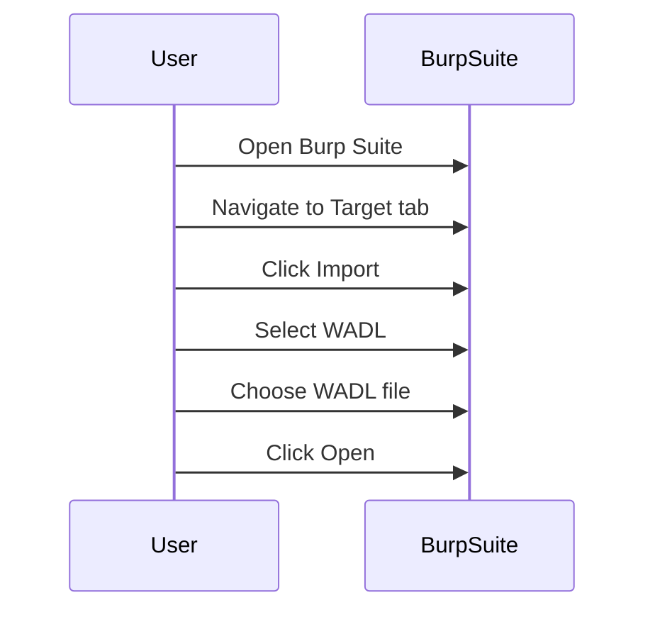
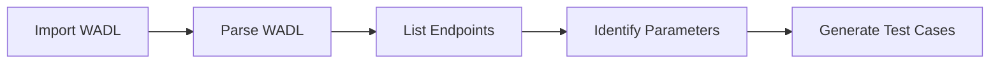

## Introduction to API Pentesting Preparation

API pentesting, or penetration testing, is a crucial process for identifying vulnerabilities in an application’s API layer. This ensures that the API is secure against unauthorized access and potential attacks. In this chapter, we will delve into the preparation steps required for effective API pentesting, focusing specifically on the transformation and capture of WADL (Web Application Description Language) XML files using Burp Suite.

### What is WADL?

WADL is an XML-based language used to describe the resources and methods available in a RESTful web service. It provides a structured way to document the API endpoints, their parameters, and the expected responses. By transforming and analyzing WADL files, pentesters can gain a comprehensive understanding of the API structure and identify potential weaknesses.

### Why Use WADL in API Pentesting?

Using WADL in API pentesting offers several advantages:

1. **Comprehensive Documentation**: WADL files provide detailed documentation of the API, including all endpoints, methods, and parameters.
2. **Automation**: Tools like Burp Suite can automatically generate test cases based on the WADL description, streamlining the pentesting process.
3. **Consistency**: WADL ensures that the pentesting process is consistent and thorough, reducing the likelihood of missing critical areas.

### How to Prepare for API Pentesting Using WADL and Burp Suite

#### Step 1: Obtain the WADL File

The first step in preparing for API pentesting is to obtain the WADL file. This can be done through various means, such as:

- **Manual Creation**: Developers can manually create a WADL file based on the API documentation.
- **Automated Generation**: Tools like Jersey WADL Generator can automatically generate WADL files from Java-based REST services.
- **Third-party Services**: Some third-party services offer WADL generation capabilities for APIs hosted on their platforms.

#### Step 2: Import the WADL File into Burp Suite

Once you have the WADL file, the next step is to import it into Burp Suite. Here’s how to do it:

1. **Open Burp Suite**: Launch Burp Suite and ensure that the proxy is running.
2. **Import WADL File**:
    - Navigate to the `Target` tab.
    - Click on `Import` and select `WADL`.
    - Choose the WADL file you obtained and click `Open`.



#### Step 3: Analyze the Imported WADL File

After importing the WADL file, Burp Suite will parse it and display the API endpoints and methods. You can then analyze these endpoints to identify potential vulnerabilities.

1. **Review Endpoints**: Examine the list of endpoints and their associated methods (GET, POST, PUT, DELETE, etc.).
2. **Identify Parameters**: Look at the parameters required for each endpoint and their data types.
3. **Generate Test Cases**: Burp Suite can automatically generate test cases based on the WADL description.



### Example: Analyzing a WADL File in Burp Suite

Let’s consider a hypothetical WADL file for an API that manages user accounts. The WADL file might look something like this:

```xml
<application xmlns="http://wadl.dev.java.net/2009/02">
    <resources base="https://api.example.com/v1">
        <resource path="users">
            <method name="GET">
                <request>
                    <param name="id" style="query"/>
                </request>
                <response>
                    <representation mediaType="application/json"/>
                </response>
            </method>
            <method name="POST">
                <request>
                    <representation mediaType="application/json"/>
                </request>
                <response>
                    <representation mediaType="application/json"/>
                </response>
            </method>
        </resource>
    </resources>
</application>
```

When imported into Burp Suite, this WADL file would allow you to test both the GET and POST methods for the `/users` endpoint.

### Step 4: Capture and Analyze HTTP Requests

Once the WADL file is imported, you can start capturing and analyzing HTTP requests using Burp Suite’s Repeater tool.

1. **Capture Requests**: Use the proxy to intercept and capture HTTP requests to the API.
2. **Analyze Responses**: Use the Repeater tool to send the captured requests and analyze the responses.

#### Example: Capturing and Analyzing a Request

Suppose you captured the following HTTP request to the `/users` endpoint:

```http
GET /v1/users?id=123 HTTP/1.1
Host: api.example.com
Accept: application/json
```

You can send this request through Burp Suite’s Repeater tool to analyze the response:

```http
HTTP/1.1 200 OK
Content-Type: application/json
Content-Length: 123

{
    "id": 123,
    "name": "John Doe",
    "email": "john.doe@example.com"
}
```

### Step 5: Identify Vulnerabilities

During the analysis, you may encounter various vulnerabilities. One common issue is version disclosure, which can be seen in the given transcript:

```http
HTTP/1.1 404 Not Found
Server: Apache Tomcat/8.5.5
Content-Type: text/html;charset=utf-8
Content-Length: 1024
```

Here, the server header discloses the version of Apache Tomcat being used. This information can be exploited by attackers to target specific vulnerabilities associated with that version.

### How to Prevent / Defend Against Version Disclosure

To prevent version disclosure, you should configure your server to hide the version information. Here’s how to do it for Apache Tomcat:

1. **Edit `server.xml`**:
    - Locate the `server.xml` file in the `conf` directory of your Tomcat installation.
    - Add the following attribute to the `<Connector>` element:

    ```xml
    <Connector port="8080" protocol="HTTP/1.1"
               connectionTimeout="20000"
               redirectPort="8443"
               server="ApacheTomcat" />
    ```

2. **Restart Tomcat**: After making changes, restart the Tomcat server to apply the new configuration.

#### Secure Configuration Example

Before:

```xml
<Connector port="8080" protocol="HTTP/1.1"
           connectionTimeout="20000"
           redirectPort="8443" />
```

After:

```xml
<Connector port="8080" protocol="HTTP/1.1"
           connectionTimeout="20000"
           redirectPort="8443"
           server="ApacheTomcat" />
```

### Real-World Examples and Recent Breaches

Version disclosure has been a contributing factor in several recent breaches. For instance, in the case of the Equifax breach in 2017, attackers exploited a vulnerability in Apache Struts, which was disclosed due to version information being exposed in HTTP headers.

### Hands-On Practice Labs

For hands-on practice, you can use the following labs:

- **PortSwigger Web Security Academy**: Offers a module on API security, including exercises on WADL and Burp Suite.
- **OWASP Juice Shop**: Provides a vulnerable web application that includes API endpoints for testing.

### Conclusion

Preparing for API pentesting using WADL and Burp Suite is a robust approach to identifying and mitigating vulnerabilities in API layers. By following the steps outlined in this chapter, you can effectively analyze and test API endpoints, ensuring that your applications remain secure against potential threats.

---
<!-- nav -->
[[01-Introduction to API Penetration Testing Preparation|Introduction to API Penetration Testing Preparation]] | [[API Security/02-Preparing for API Pentest/06-WADL XML File Transformation and Capture File in Burpsuite/00-Overview|Overview]] | [[03-Introduction to API Pentesting and Preparation|Introduction to API Pentesting and Preparation]]
