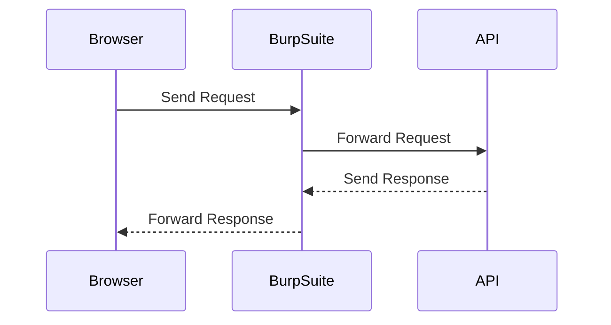
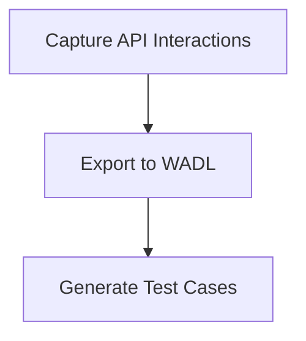
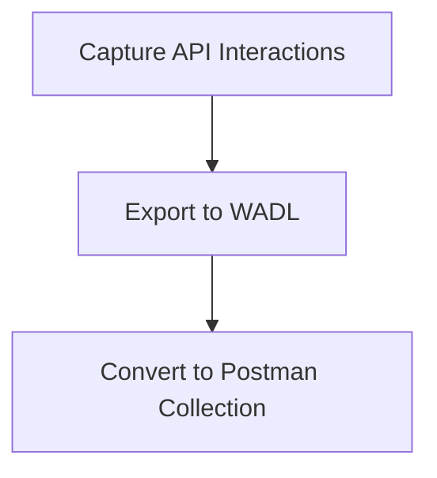

## Introduction to API Pentesting and Preparation

API (Application Programming Interface) pentesting is a crucial aspect of ensuring the security and robustness of web applications. This process involves simulating attacks to identify vulnerabilities in APIs, which can then be addressed to improve overall security. One of the key steps in preparing for an API pentest is transforming and capturing data using tools like WADL (Web Application Description Language) and Burp Suite.

### Understanding WADL and Its Role

WADL is an XML-based language used to describe the resources and methods available in a RESTful web service. It provides a structured way to define the operations that can be performed on a web service, including the HTTP methods, parameters, and expected responses.

#### What is WADL?

WADL stands for Web Application Description Language. It is an XML-based language designed to describe the resources and methods available in a RESTful web service. WADL provides a structured way to define the operations that can be performed on a web service, including the HTTP methods, parameters, and expected responses.

#### Why Use WADL?

Using WADL helps in automating the testing process by providing a clear description of the API endpoints and their expected behavior. This makes it easier to generate test cases and validate the responses against the defined schema.

#### How Does WADL Work?

WADL works by defining the structure of the API endpoints and the operations that can be performed on them. It includes details such as the HTTP methods (GET, POST, PUT, DELETE), the parameters required for each operation, and the expected responses.

```xml
<application xmlns="http://wadl.dev.java.net/2009/02">
    <resources base="http://example.com/api">
        <resource path="users">
            <method name="GET">
                <request>
                    <param name="id" style="query"/>
                </request>
                <response>
                    <representation mediaType="application/json"/>
                </response>
            </method>
        </resource>
    </resources>
</application>
```

In this example, the `users` resource supports a `GET` method with a query parameter `id`. The response is expected to be in JSON format.

### Transforming WADL XML Files

Transforming WADL XML files is a critical step in preparing for an API pentest. This involves converting the WADL description into a format that can be easily used for testing purposes.

#### Identifying Issues in WADL Descriptions

One common issue in WADL descriptions is the incorrect specification of parameter formats. For instance, a parameter might be specified as a query parameter when it should be a form or body parameter.

```xml
<method name="POST">
    <request>
        <param name="policy" style="query"/>
    </request>
    <response>
        <representation mediaType="application/json"/>
    </response>
</method>
```

In this example, the `policy` parameter is incorrectly specified as a query parameter (`style="query"`).

#### Correcting Parameter Formats

To correct this issue, the parameter format should be changed from `query` to `form` or `body`.

```xml
<method name="POST">
    <request>
        <param name="policy" style="form"/>
    </request>
    <response>
        <representation mediaType="application/json"/>
    </response>
</method>
```

By changing the `style` attribute to `form`, we ensure that the parameter is correctly specified as a form parameter.

### Capturing Data Using Burp Suite

Burp Suite is a powerful tool used for web application security testing. It includes features for intercepting and modifying HTTP requests and responses, making it ideal for capturing and analyzing API interactions.

#### Setting Up Burp Suite

To set up Burp Suite for capturing API interactions, follow these steps:

1. **Install Burp Suite**: Download and install Burp Suite from the official website.
2. **Configure Proxy Settings**: Set up your browser to use Burp Suite as a proxy server.
3. **Intercept Traffic**: Enable the intercept feature in Burp Suite to capture HTTP requests and responses.

#### Capturing API Interactions

Once Burp Suite is set up, you can start capturing API interactions. This involves sending requests through the proxy and observing the responses.



In this sequence diagram, the browser sends a request through Burp Suite, which forwards it to the API. The API responds, and the response is captured by Burp Suite before being forwarded to the browser.

### Generating Test Cases from WADL

Generating test cases from WADL descriptions is essential for thorough API testing. This involves transforming the WADL description into a format that can be used for automated testing.

#### Exporting WADL Descriptions

To export WADL descriptions, you can use tools like Burp Suite to capture the API interactions and then convert them into WADL format.



In this graph, the process starts with capturing API interactions, followed by exporting them to WADL format, and finally generating test cases.

#### Example of Exporting to WADL

Here is an example of exporting a captured API interaction to WADL format using Burp Suite:

```xml
<application xmlns="http://wadl.dev.java.net/2009/02">
    <resources base="http://example.com/api">
        <resource path="users">
            <method name="POST">
                <request>
                    <param name="policy" style="form"/>
                </request>
                <response>
                    <representation mediaType="application/json"/>
                </response>
            </method>
        </resource>
    </resources>
</application>
```

This WADL description captures the `POST` method for the `users` resource with a form parameter `policy`.

### Converting WADL to Postman Collections

Converting WADL descriptions to Postman collections is a useful step for further testing and validation.

#### Exporting to Postman

To export WADL descriptions to Postman collections, you can use tools like Burp Suite to capture the API interactions and then convert them into Postman format.



In this graph, the process starts with capturing API interactions, followed by exporting them to WADL format, and finally converting them to Postman collections.

#### Example of Exporting to Postman

Here is an example of exporting a captured API interaction to Postman collection using Burp Suite:

```json
{
    "info": {
        "name": "API Test Collection",
        "description": "Test collection for API interactions",
        "schema": "https://schema.getpostman.com/json/collection/v2.1.0/collection.json"
    },
    "item": [
        {
            "name": "Create User",
            "request": {
                "method": "POST",
                "header": [],
                "body": {
                    "mode": "raw",
                    "raw": "{\n    \"policy\": \"example_policy\"\n}"
                },
                "url": {
                    "raw": "http://example.com/api/users",
                    "host": ["example.com"],
                    "path": ["api", "users"]
                }
            },
            "response": []
        }
    ]
}
```

This Postman collection captures the `POST` method for creating a user with a form parameter `policy`.

### Real-World Examples and Recent Breaches

Recent breaches and vulnerabilities have highlighted the importance of thorough API testing. For example, the Capital One breach in 2019 exposed sensitive customer data due to misconfigured API endpoints.

#### CVE-2019-11510: Capital One Breach

The Capital One breach involved a misconfigured API endpoint that allowed unauthorized access to sensitive customer data. This highlights the importance of proper API testing and validation.

### Pitfalls and Common Mistakes

When preparing for API pentesting, there are several common pitfalls and mistakes to avoid:

1. **Incorrect Parameter Formats**: Ensure that parameters are correctly specified as query, form, or body parameters.
2. **Incomplete WADL Descriptions**: Make sure that all API endpoints and methods are fully described in the WADL.
3. **Ignoring Error Responses**: Always test for error responses and ensure that they are handled correctly.

### How to Prevent / Defend

#### Detection

To detect issues in API interactions, use tools like Burp Suite to capture and analyze HTTP requests and responses. Look for misconfigured endpoints, incorrect parameter formats, and unexpected responses.

#### Prevention

To prevent issues in API interactions, follow these best practices:

1. **Use Proper Parameter Formats**: Ensure that parameters are correctly specified as query, form, or body parameters.
2. **Validate All Inputs**: Validate all inputs to prevent injection attacks and other vulnerabilities.
3. **Implement Rate Limiting**: Implement rate limiting to prevent abuse of API endpoints.

#### Secure Coding Fixes

Here is an example of a vulnerable API endpoint and its secure counterpart:

**Vulnerable Code**

```python
@app.route('/users', methods=['POST'])
def create_user():
    policy = request.args.get('policy')
    # Process the policy
    return jsonify({"status": "success"})
```

**Secure Code**

```python
@app.route('/users', methods=['POST'])
def create_user():
    policy = request.form.get('policy')
    # Validate the policy
    if not validate_policy(policy):
        return jsonify({"status": "error", "message": "Invalid policy"}), 400
    # Process the policy
    return jsonify({"status": "success"})
```

In the secure code, the `policy` parameter is correctly specified as a form parameter and validated before processing.

### Conclusion

Preparing for API pentesting involves transforming and capturing data using tools like WADL and Burp Suite. By following best practices and avoiding common pitfalls, you can ensure the security and robustness of your web applications.

### Practice Labs

For hands-on practice, consider using the following labs:

- **PortSwigger Web Security Academy**: Offers comprehensive training on web security, including API testing.
- **OWASP Juice Shop**: Provides a vulnerable web application for practicing various security techniques.
- **DVWA (Damn Vulnerable Web Application)**: Another popular web application for practicing security techniques.

These labs provide real-world scenarios and challenges to help you master API pentesting and preparation.

---
<!-- nav -->
[[02-Introduction to API Pentesting Preparation|Introduction to API Pentesting Preparation]] | [[API Security/02-Preparing for API Pentest/06-WADL XML File Transformation and Capture File in Burpsuite/00-Overview|Overview]] | [[04-Introduction to API Pentesting and WADL Files|Introduction to API Pentesting and WADL Files]]
