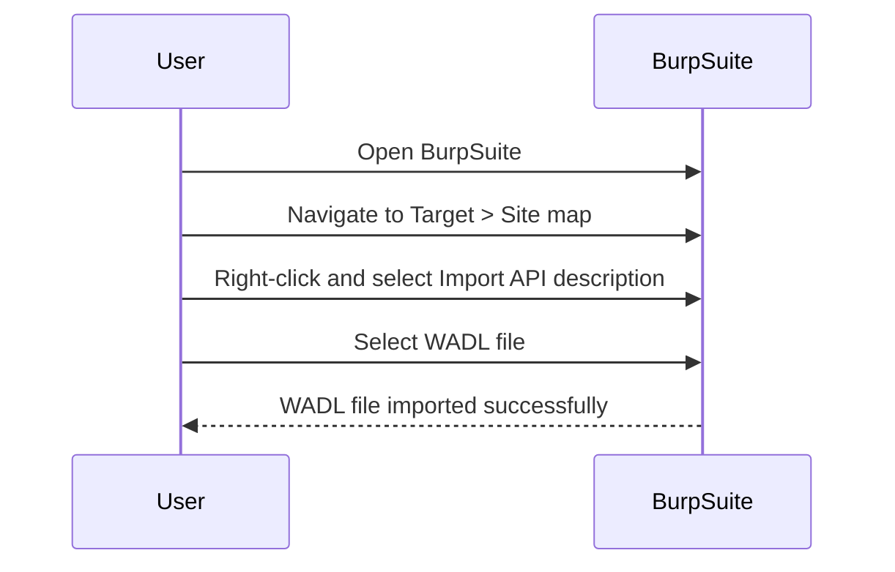
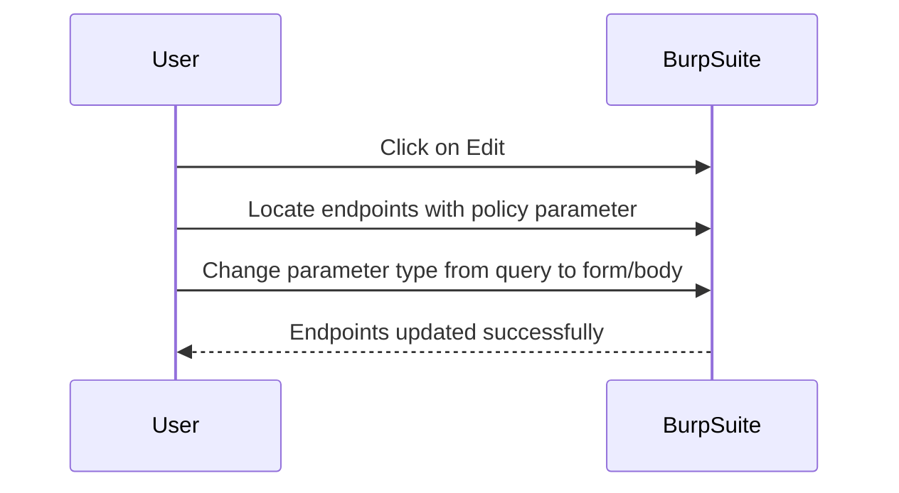
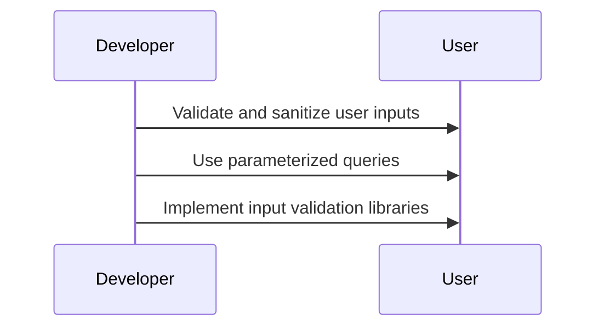
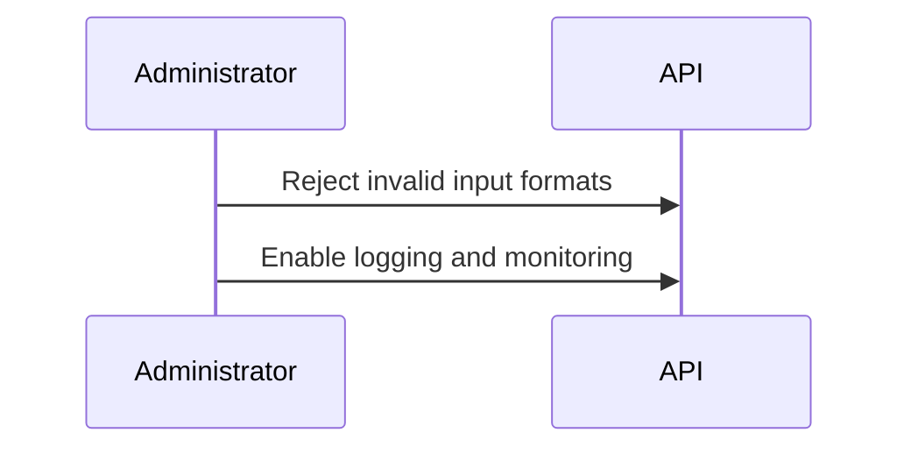
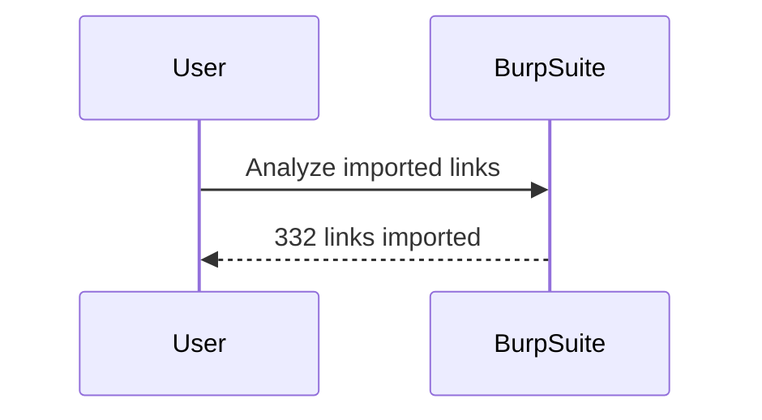
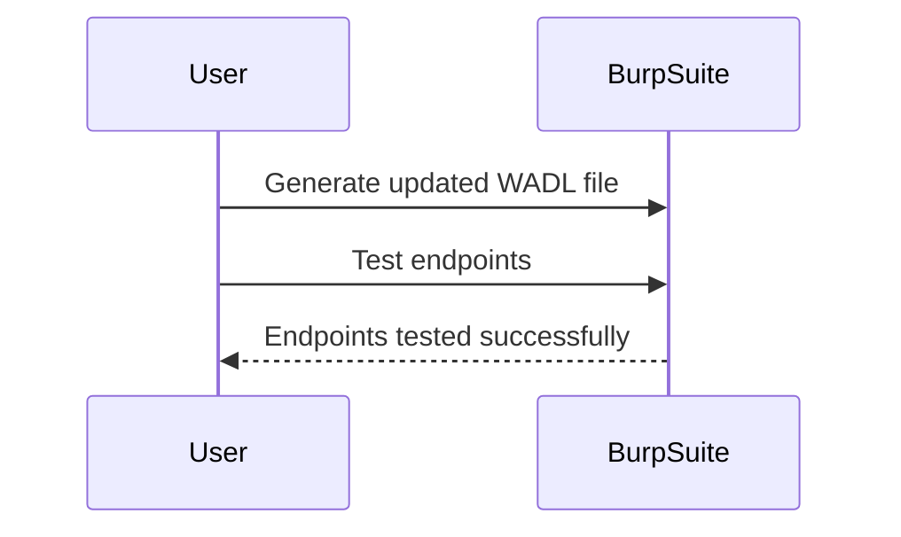

## Introduction to API Pentesting and WADL Files

API pentesting involves systematically testing an application programming interface (API) to identify vulnerabilities and weaknesses. This process helps ensure that APIs are secure and resilient against potential attacks. One critical aspect of API pentesting is understanding and working with WADL (Web Application Description Language) files. WADL is an XML-based language used to describe the structure and behavior of RESTful web services. By transforming and analyzing WADL files, security professionals can gain insights into the API's architecture and identify potential security issues.

### Background Theory of WADL

WADL is an XML-based language designed to describe the structure and behavior of RESTful web services. It provides a standardized way to document the resources, methods, parameters, and media types supported by an API. This documentation is crucial for both developers and security professionals as it allows them to understand the API's capabilities and limitations.

#### Structure of a WADL File

A typical WADL file consists of several key elements:

- **`<resources>`**: Defines the root resource and its children.
- **`<resource>`**: Represents a specific resource within the API.
- **`<method>`**: Specifies the HTTP methods (GET, POST, PUT, DELETE, etc.) supported by the resource.
- **`<param>`**: Describes the parameters required for each method.
- **`<representation>`**: Specifies the data formats (JSON, XML, etc.) that can be returned or accepted by the resource.

Here is an example of a simple WADL file:

```xml
<application xmlns="http://wadl.dev.java.net/2009/02">
    <resources base="http://api.example.com/v1">
        <resource path="users">
            <method name="GET">
                <response>
                    <representation mediaType="application/json"/>
                </response>
            </method>
            <method name="POST">
                <request>
                    <representation mediaType="application/json"/>
                </request>
                <response>
                    <representation mediaType="application/json"/>
                </response>
            </method>
        </resource>
    </resources>
</application>
```

### Transforming WADL Files in BurpSuite

BurpSuite is a popular toolkit for web application security testing. It includes various tools such as a proxy server, scanner, intruder, and more. One of the features of BurpSuite is the ability to import and analyze WADL files, which can help in identifying and exploiting vulnerabilities in APIs.

#### Importing WADL Files in BurpSuite

To prepare for an API pentest using BurpSuite, you need to import the WADL file into the tool. Here’s a step-by-step guide on how to do this:

1. **Open BurpSuite**: Launch the BurpSuite application.
2. **Import WADL File**:
    - Navigate to the `Target` tab.
    - Click on `Site map`.
    - Right-click on the site map and select `Import API description`.
    - Choose the WADL file you want to import.



3. **Analyze Imported Links**:
    - After importing the WADL file, BurpSuite will parse the file and display the imported links.
    - You can see the number of links imported, which in this case is 332.

### Identifying and Fixing Issues in WADL Files

During the import process, BurpSuite may identify issues with the WADL file, particularly with the endpoints. In the given scenario, two endpoints have issues related to the file type parameter named `policy`.

#### Issue Description

The issue is that the `policy` parameter is defined as a query format, but it should be a form or body format. This discrepancy can lead to incorrect handling of the parameter during API calls, potentially causing security vulnerabilities.

#### Steps to Fix the Issue

1. **Edit Endpoints**:
    - Click on the `Edit` button to modify the problematic endpoints.
    - Locate the endpoints with the `policy` parameter and change the parameter type from query to form or body.



2. **Generate and Test Endpoints**:
    - After editing the endpoints, generate the updated WADL file.
    - Test the endpoints to ensure they work correctly and the issue is resolved.

### Real-World Example: CVE-2021-3129

CVE-2021-3129 is a real-world example of a vulnerability in an API that could have been identified through proper WADL analysis and pentesting. This vulnerability was found in the Jenkins CI/CD platform, where improper validation of user input led to remote code execution.

#### Vulnerability Details

- **Vulnerability Type**: Improper Input Validation
- **Impact**: Remote Code Execution
- **Affected Software**: Jenkins CI/CD Platform
- **CVE ID**: CVE-2021-3129

#### How to Prevent / Defend

1. **Secure Coding Practices**:
    - Ensure that all user inputs are properly validated and sanitized.
    - Use parameterized queries and input validation libraries to prevent injection attacks.



2. **Configuration Hardening**:
    - Configure the API to reject invalid input formats.
    - Enable logging and monitoring to detect and respond to suspicious activity.



3. **Regular Security Audits**:
    - Conduct regular security audits and penetration tests to identify and mitigate vulnerabilities.
    - Use tools like BurpSuite to analyze and test the API for security issues.

### Complete Example: Importing and Analyzing WADL in BurpSuite

Let's walk through a complete example of importing and analyzing a WADL file in BurpSuite.

#### Step 1: Import WADL File

1. Open BurpSuite.
2. Navigate to the `Target` tab.
3. Click on `Site map`.
4. Right-click and select `Import API description`.
5. Choose the WADL file you want to import.


#### Step 2: Analyze Imported Links

After importing the WADL file, BurpSuite will display the imported links. Suppose the WADL file contains 332 links.



#### Step 3: Identify and Fix Issues

Suppose two endpoints have issues related to the `policy` parameter being defined as a query format instead of a form or body format.

1. Click on the `Edit` button to modify the problematic endpoints.
2. Locate the endpoints with the `policy` parameter and change the parameter type from query to form or body.


#### Step 4: Generate and Test Endpoints

After editing the endpoints, generate the updated WADL file and test the endpoints to ensure they work correctly and the issue is resolved.



### Conclusion

Preparing for an API pentest involves transforming and analyzing WADL files using tools like BurpSuite. By understanding the structure and behavior of APIs described in WADL files, security professionals can identify and fix potential vulnerabilities. Regular security audits and secure coding practices are essential to prevent and mitigate security risks in APIs.

### Practice Labs

For hands-on practice with API security, consider the following labs:

- **PortSwigger Web Security Academy**: Offers comprehensive modules on API security, including WADL analysis and pentesting.
- **OWASP Juice Shop**: A deliberately insecure web application that includes API-related challenges and vulnerabilities.
- **DVWA (Damn Vulnerable Web Application)**: Provides a variety of web application vulnerabilities, including those related to APIs.

By engaging with these labs, you can gain practical experience in preparing for and conducting API pentests effectively.

---
<!-- nav -->
[[03-Introduction to API Pentesting and Preparation|Introduction to API Pentesting and Preparation]] | [[API Security/02-Preparing for API Pentest/06-WADL XML File Transformation and Capture File in Burpsuite/00-Overview|Overview]] | [[05-Preparing for API Pentest WADL XML File Transformation and Capture File in BurpSuite|Preparing for API Pentest WADL XML File Transformation and Capture File in BurpSuite]]
