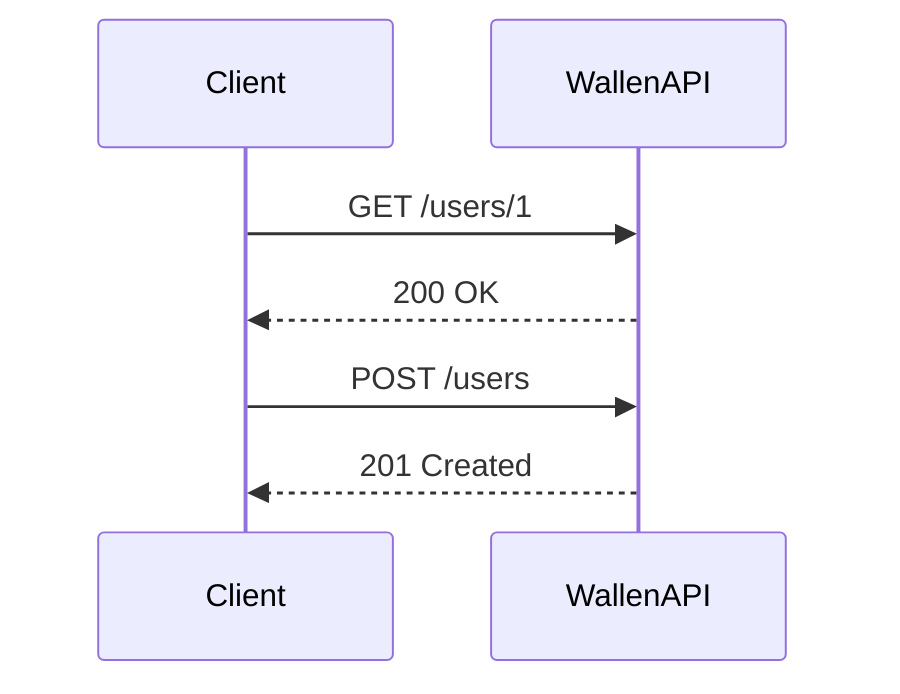

## Introduction to Lab Setup and Postman Document Sharing

Welcome back! In this section, we will delve into the setup of a lab environment for practicing API security. Understanding and mastering API security is crucial as APIs are the backbone of modern applications, facilitating communication between different services and systems. Before diving into live APIs, it's essential to practice in a controlled lab environment to understand the intricacies of how APIs work and how they can be exploited.

### Why Practice in a Lab Environment?

Practicing in a lab environment allows you to:

- **Understand API Mechanics**: Gain a deep understanding of how APIs function, including request-response cycles, authentication mechanisms, and data handling.
- **Identify Vulnerabilities**: Learn to identify common vulnerabilities such as injection attacks, broken authentication, and sensitive data exposure.
- **Develop Defensive Measures**: Implement and test defensive measures to protect APIs from various threats.

Skipping the lab environment and jumping straight into live APIs can lead to significant misunderstandings and potential security risks. Therefore, setting up a lab environment is a critical step in mastering API security.

### Setting Up the Lab Environment

Let's start by setting up the lab environment. We will use a simple API called the "Wallen API" for our demonstrations. This API will help us understand various security concepts and attacks.

#### Step-by-Step Setup Instructions

1. **Install Required Tools**:
    - Ensure you have a development environment set up with Node.js and npm installed.
    - Install Postman for testing and documenting APIs.

2. **Clone the Wallen API Repository**:
    - Clone the repository using the following command:
      ```bash
      git clone https://github.com/example/wallen-api.git
      ```

3. **Navigate to the Directory**:
    - Change directory to the cloned repository:
      ```bash
      cd wallen-api
      ```

4. **Install Dependencies**:
    - Install the required dependencies using npm:
      ```bash
      npm install
      ```

5. **Run the Wallen API**:
    - Start the API server using the following command:
      ```bash
      node app.js
      ```
    - The API should start running on port 8000. You can verify this by checking the console output.

### Sharing Postman Collection

Once the Wallen API is up and running, we will share a Postman collection to facilitate testing and documentation.

#### Creating and Sharing the Postman Collection

1. **Open Postman**:
    - Launch Postman and create a new collection named "Wallen API".

2. **Add Requests to the Collection**:
    - Add various requests to the collection, such as GET, POST, PUT, DELETE, etc., to cover different API endpoints.

3. **Share the Postman Collection**:
    - Export the collection as a JSON file:
      ```json
      {
        "info": {
          "name": "Wallen API",
          "schema": "https://schema.getpostman.com/json/collection/v2.1.0/collection.json"
        },
        "item": [
          {
            "name": "Get User",
            "request": {
              "method": "GET",
              "header": [],
              "url": {
                "raw": "{{base_url}}/users/{{userId}}",
                "host": [
                  "{{base_url}}"
                ],
                "path": [
                  "users",
                  "{{userId}}"
                ]
              }
            }
          }
        ]
      }
      ```
    - Share this JSON file with others so they can import it into their own Postman instances.

4. **Configure Base URL**:
    - Import the shared collection into Postman.
    - Go to the "Variables" tab and set the `base_url` variable to your local IP address and port number (e.g., `http://localhost:8000`).

### Example of a Full HTTP Request and Response

Let's look at an example of a full HTTP request and response for the "Get User" endpoint.

#### HTTP Request

```http
GET /users/1 HTTP/1.1
Host: localhost:8000
User-Agent: PostmanRuntime/7.28.0
Accept: */*
Accept-Encoding: gzip, deflate, br
Connection: keep-alive
```

#### HTTP Response

```http
HTTP/1.1 200 OK
Date: Mon, 20 Mar 2023 12:00:00 GMT
Content-Type: application/json
Content-Length: 54
Connection: keep-alive

{
  "id": 1,
  "name": "John Doe",
  "email": "john.doe@example.com"
}
```

### Common Pitfalls and How to Avoid Them

#### Incorrect Base URL Configuration

One common pitfall is incorrectly configuring the base URL in Postman. Ensure that the `base_url` variable is correctly set to your local IP address and port number.

#### Missing Authentication Headers

Another common issue is forgetting to include necessary authentication headers in requests. Always ensure that required headers like `Authorization` are included in your requests.

### How to Prevent / Defend

#### Secure Coding Practices

Implement secure coding practices to prevent common vulnerabilities:

- **Input Validation**: Validate all inputs to prevent injection attacks.
- **Authentication Mechanisms**: Use strong authentication mechanisms like OAuth 2.0.
- **Data Encryption**: Encrypt sensitive data both in transit and at rest.

#### Example of Secure Code

Here’s an example of insecure code and its secure counterpart:

##### Insecure Code

```javascript
app.get('/users/:id', (req, res) => {
  const userId = req.params.id;
  // Fetch user from database
  res.send(user);
});
```

##### Secure Code

```javascript
app.get('/users/:id', (req, res) => {
  const userId = parseInt(req.params.id); // Sanitize input
  if (isNaN(userId)) {
    return res.status(400).send('Invalid user ID');
  }
  // Fetch user from database
  res.send(user);
});
```

### Real-World Examples and Recent Breaches

#### CVE-2021-21972: Unauthenticated Access in Apache Struts

In 2021, Apache Struts was found to have a vulnerability (CVE-2021-21972) that allowed unauthenticated access to sensitive information. This highlights the importance of proper authentication mechanisms and input validation.

#### Example of Exploitation

```http
GET /struts2-showcase/orders/orderList.action HTTP/1.1
Host: vulnerable.example.com
```

#### Detection and Prevention

- **Regular Audits**: Conduct regular security audits and penetration tests.
- **Patch Management**: Keep all software up to date with the latest security patches.
- **Logging and Monitoring**: Implement logging and monitoring to detect unusual activity.

### Mermaid Diagrams

#### API Request-Response Flow



### Hands-On Labs

For hands-on practice, consider the following labs:

- **PortSwigger Web Security Academy**: Offers comprehensive labs on API security.
- **OWASP Juice Shop**: A deliberately insecure web application for practicing security skills.
- **DVWA (Damn Vulnerable Web Application)**: Provides various levels of difficulty for learning web application security.

By following these steps and practicing in a controlled lab environment, you will gain a solid understanding of API security and be better prepared to handle real-world scenarios.

---

This completes the detailed explanation of setting up a lab environment and sharing Postman collections for API security. Remember, practice is key to mastering these concepts.

---
<!-- nav -->
[[API Security/03-Lab Setup & Postman Document Sharing/01-Lab Setup Postman Document Sharing/00-Overview|Overview]] | [[02-Lab Setup and Postman Document Sharing|Lab Setup and Postman Document Sharing]]
