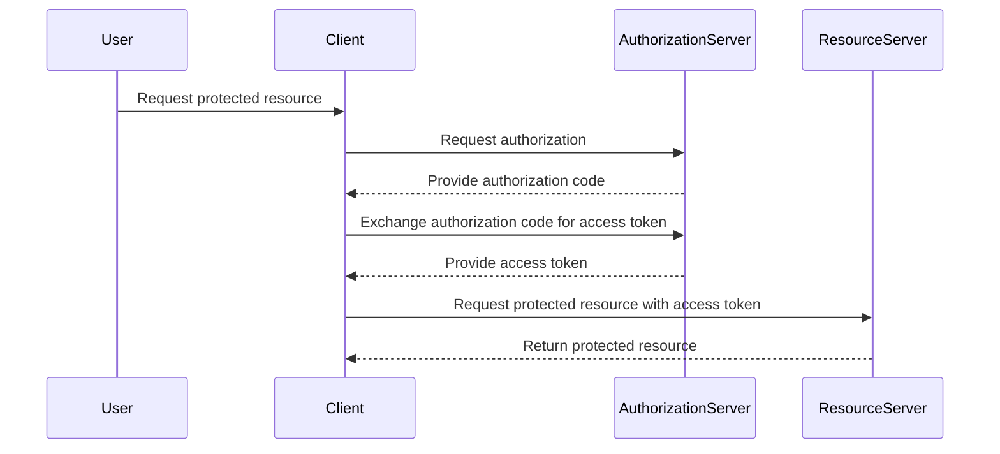

## Introduction to Postman for API Security Testing

### What is Postman?

Postman is a powerful tool designed for developers and testers to interact with APIs. It allows users to send HTTP requests to APIs and view the responses, which is crucial for testing and debugging purposes. Postman supports various types of HTTP requests, including GET, POST, PUT, DELETE, and more. Additionally, it provides features such as environment variables, collection management, and automated testing through scripts.

### Why Use Postman for API Security Testing?

#### Accessibility

One of the primary reasons to use Postman is its accessibility. Postman is available as a desktop application for Windows, macOS, and Linux, as well as a browser extension for Chrome, Firefox, and Safari. This makes it easy to access and use across different platforms and environments. Moreover, Postman offers a free tier with basic functionalities, which is sufficient for most testing needs.

#### Integration Capabilities

Postman integrates seamlessly with other tools and services, such as OAuth, JWT, and API gateways. This integration capability is essential for comprehensive API security testing. For instance, integrating Postman with OAuth allows testers to authenticate and authorize API requests, ensuring that only authorized users can access sensitive data.

#### Collection Management

Postman allows users to organize their API requests into collections. Collections can be shared among team members, making collaboration easier. Each collection can contain multiple requests, and users can group related requests together for better organization. This feature is particularly useful for managing complex API workflows and ensuring consistency in testing.

#### Scripting and Automation

Postman supports scripting through JavaScript, allowing users to automate repetitive tasks and perform advanced testing scenarios. Scripts can be used to set up pre-request conditions, validate responses, and even trigger actions based on specific conditions. This automation capability is crucial for performing thorough security testing and identifying potential vulnerabilities.

### Real-World Examples of Postman Usage

#### Example 1: Testing OAuth Authentication

OAuth is a widely used protocol for authorization. Let's consider a scenario where we need to test an API that requires OAuth authentication. We can use Postman to simulate OAuth authentication and ensure that the API behaves correctly.



In this example, we can use Postman to simulate the client and send requests to the authorization server and resource server. We can also use Postman's built-in OAuth support to handle the authentication process.

#### Example 2: Testing API Rate Limiting

Rate limiting is a common security measure used to prevent abuse of APIs. Let's consider a scenario where we need to test an API that implements rate limiting. We can use Postman to send multiple requests within a short period and observe the behavior of the API.

```mermaid
sequenceDiagram
    participant User
    participant API

    loop Send 100 requests in 1 second
        User->>API: Request 1
        API-->>User: Response 1
        User->>API: Request 2
        API-->>User: Response 2
        ...
        User->>API: Request 100
        API-->>User: Response 100
    end
    User->>API: Exceed rate limit
    API-->>User: Return error response
```

In this example, we can use Postman to send multiple requests to the API and observe the rate-limiting behavior. We can also use Postman's scripting capabilities to automate the process and analyze the results.

### Detailed Steps for Using Postman

#### Setting Up Postman

To get started with Postman, follow these steps:

1. **Download and Install Postman**: Visit the Postman website and download the appropriate version for your operating system. Follow the installation instructions to install Postman on your machine.

2. **Create an Account**: Create a Postman account to access additional features and collaborate with others. You can sign up using your email address or social media accounts.

3. **Start a New Request**: Open Postman and click on the "New" button to start a new request. Choose the type of request you want to send (e.g., GET, POST, PUT, DELETE).

4. **Configure the Request**: Enter the URL of the API endpoint you want to test. You can also configure other settings such as headers, body, and parameters.

5. **Send the Request**: Click on the "Send" button to send the request to the API endpoint. Postman will display the response from the API, including the status code, headers, and body.

#### Creating and Managing Collections

Collections in Postman allow you to organize your API requests into logical groups. Here’s how to create and manage collections:

1. **Create a New Collection**: Click on the "Collections" tab in the left sidebar and click on the "Add Collection" button. Enter a name for your collection and click "Save."

2. **Add Requests to the Collection**: Click on the collection you created and click on the "Add Request" button. Enter the details of the request and click "Save."

3. **Organize Requests**: You can drag and drop requests within the collection to reorder them. You can also create subfolders within the collection to further organize your requests.

4. **Share Collections**: Click on the "Share" button next to the collection and choose the sharing options. You can share the collection with other team members or make it public.

#### Using Environments

Environments in Postman allow you to store variables that can be used across multiple requests. Here’s how to create and use environments:

1. **Create a New Environment**: Click on the "Environments" tab in the left sidebar and click on the "Add Environment" button. Enter a name for your environment and click "Save."

2. **Add Variables to the Environment**: Click on the environment you created and click on the "Edit" button. Add the variables you want to use in your requests and click "Save."

3. **Use Variables in Requests**: In your requests, you can use the variables stored in the environment by enclosing them in double curly braces (e.g., `{{variable_name}}`).

4. **Switch Between Environments**: You can switch between different environments by clicking on the environment dropdown menu in the upper right corner of the Postman interface.

#### Writing and Running Tests

Postman allows you to write tests to validate the responses from the API. Here’s how to write and run tests:

1. **Write Tests**: In the request editor, click on the "Tests" tab and enter the JavaScript code for your tests. You can use the `pm` object to access the request and response objects.

2. **Run Tests**: Click on the "Send" button to send the request and run the tests. Postman will display the results of the tests in the "Tests" tab.

3. **Analyze Results**: Review the results of the tests to identify any issues with the API. You can use the results to improve the security of the API.

### Real-World Breach Example: CVE-2021-21972

CVE-2021-21972 is a critical vulnerability in the Apache Log4j library that was discovered in December 2021. This vulnerability allowed attackers to execute arbitrary code on affected systems, leading to widespread exploitation.

#### How to Test for CVE-2021-21972 Using Postman

To test for CVE-2021-21972 using Postman, follow these steps:

1. **Identify the API Endpoint**: Identify the API endpoint that uses the Apache Log4j library. This could be a logging endpoint or any other endpoint that interacts with the Log4j library.

2. **Craft the Exploit Payload**: Craft an exploit payload that triggers the vulnerability. The payload typically includes a string that causes the Log4j library to execute arbitrary code.

3. **Send the Request**: Use Postman to send the request to the API endpoint with the exploit payload. Monitor the response to determine if the vulnerability is present.

4. **Analyze the Response**: Analyze the response to determine if the vulnerability is present. Look for signs of arbitrary code execution, such as unexpected behavior or errors.

#### How to Prevent / Defend Against CVE-2021-21972

To prevent or defend against CVE-2021-21972, follow these steps:

1. **Update to the Latest Version**: Update the Apache Log4j library to the latest version that contains the fix for the vulnerability. Ensure that all dependencies and libraries that use Log4j are also updated.

2. **Disable JNDI Lookup**: Disable JNDI lookup in the Log4j configuration to prevent attackers from triggering the vulnerability. This can be done by setting the `log4j2.formatMsgNoLookups` property to `true`.

3. **Monitor for Suspicious Activity**: Monitor the logs and network traffic for suspicious activity that may indicate an attempt to exploit the vulnerability. Use intrusion detection systems and security information and event management (SIEM) tools to detect and respond to threats.

4. **Implement Network Segmentation**: Implement network segmentation to isolate systems that use the Log4j library from other systems. This can help contain the impact of a successful exploit.

### Complete Example: Testing an API with Postman

Let's walk through a complete example of testing an API with Postman. We will test an API that returns user information based on a username.

#### Step 1: Set Up the Request

1. **Open Postman**: Open Postman and create a new request.

2. **Enter the URL**: Enter the URL of the API endpoint. For example, `https://api.example.com/users/{username}`.

3. **Set the Method**: Set the method to `GET`.

4. **Add Parameters**: Add the `username` parameter to the request. For example, `Vikas@Hackersera.com`.

#### Step 2: Send the Request

1. **Click "Send"**: Click on the "Send" button to send the request to the API endpoint.

2. **View the Response**: View the response from the API. The response should include the user information for the specified username.

#### Step 3: Write and Run Tests

1. **Write Tests**: In the "Tests" tab, write tests to validate the response. For example, check if the response contains the expected user information.

```javascript
pm.test("Response has correct user information", function () {
    pm.response.to.have.status(200);
    var jsonData = pm.response.json();
    pm.expect(jsonData.username).to.eql("Vikas@Hackersera.com");
});
```

2. **Run Tests**: Click on the "Send" button again to run the tests. Postman will display the results of the tests in the "Tests" tab.

#### Step 4: Analyze the Results

1. **Review the Results**: Review the results of the tests to determine if the API is functioning correctly. Look for any issues or errors in the response.

2. **Improve the API**: Use the results of the tests to improve the security of the API. For example, ensure that the API properly validates input and handles errors gracefully.

### How to Prevent / Defend Against API Security Vulnerabilities

To prevent or defend against API security vulnerabilities, follow these steps:

1. **Input Validation**: Validate all input received by the API to prevent injection attacks. Use regular expressions and other validation techniques to ensure that input is in the expected format.

2. **Authentication and Authorization**: Implement strong authentication and authorization mechanisms to ensure that only authorized users can access the API. Use OAuth, JWT, and other protocols to manage authentication and authorization.

3. **Rate Limiting**: Implement rate limiting to prevent abuse of the API. Set limits on the number of requests that can be made within a certain time period to prevent denial-of-service attacks.

4. **Logging and Monitoring**: Implement logging and monitoring to detect and respond to security incidents. Use intrusion detection systems and SIEM tools to monitor the API and detect suspicious activity.

5. **Secure Coding Practices**: Follow secure coding practices to prevent common vulnerabilities such as SQL injection, cross-site scripting (XSS), and cross-site request forgery (CSRF). Use secure coding guidelines and frameworks to ensure that the API is developed securely.

### Conclusion

Postman is a powerful tool for API security testing. Its accessibility, integration capabilities, collection management, and scripting features make it an excellent choice for developers and testers. By using Postman, you can thoroughly test APIs and identify potential vulnerabilities. To prevent or defend against API security vulnerabilities, follow best practices such as input validation, authentication and authorization, rate limiting, logging and monitoring, and secure coding practices.

### Practice Labs

For hands-on practice with API security testing using Postman, consider the following labs:

- **PortSwigger Web Security Academy**: Offers interactive labs for learning web security concepts, including API security.
- **OWASP Juice Shop**: A deliberately insecure web application for practicing web security skills, including API security.
- **DVWA (Damn Vulnerable Web Application)**: A PHP/MySQL web application that is riddled with vulnerabilities for educational purposes.
- **WebGoat**: An interactive, gamified training application for learning about web security vulnerabilities and how to prevent them.

These labs provide real-world scenarios and challenges that can help you master API security testing using Postman.

---
<!-- nav -->
[[API Security/04-Using Postman tool for API Security Testing/01-Introduction of Postman tool/01-Introduction to Postman Tool for API Security Testing|Introduction to Postman Tool for API Security Testing]] | [[API Security/04-Using Postman tool for API Security Testing/01-Introduction of Postman tool/00-Overview|Overview]] | [[API Security/04-Using Postman tool for API Security Testing/01-Introduction of Postman tool/03-Practice Questions & Answers|Practice Questions & Answers]]
