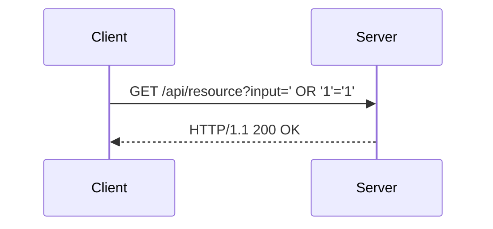
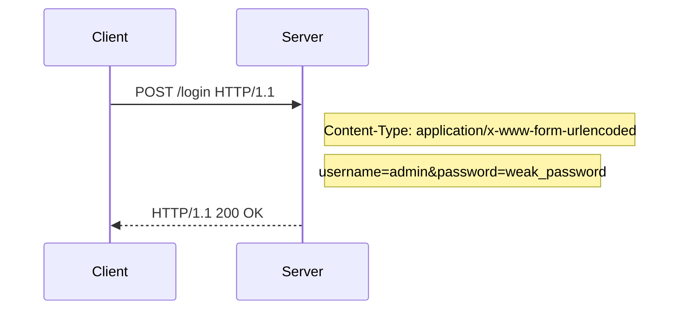
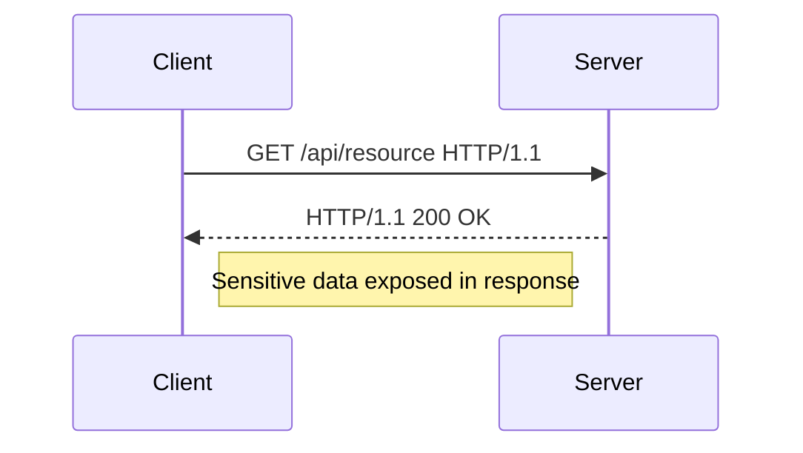
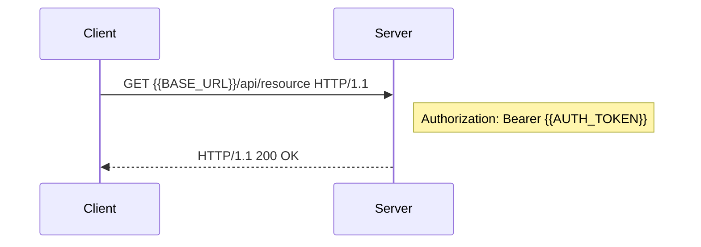
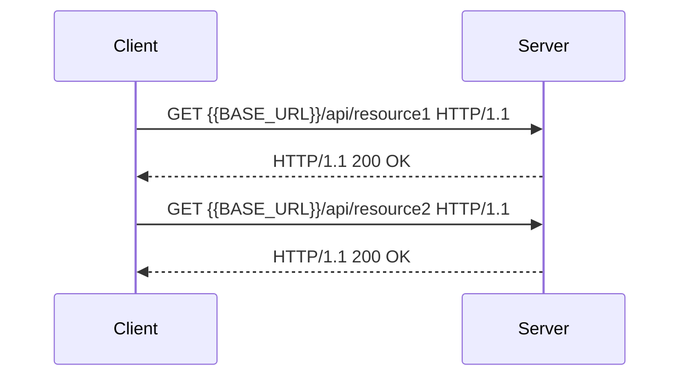
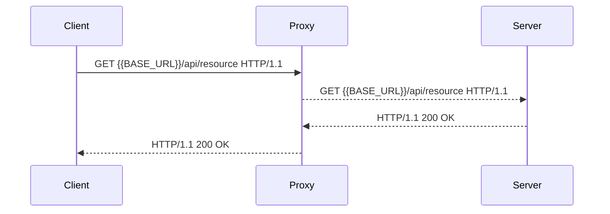

## Advanced Topics in API Security Testing with Postman

Now that we've covered the fundamentals of authentication and authorization in Postman, let's delve into some advanced topics. These include testing for common vulnerabilities, using Postman environments and collections, and integrating with other security tools.

### Testing for Common Vulnerabilities

When testing APIs, it's essential to look for common vulnerabilities such as injection attacks, broken authentication, and sensitive data exposure.

#### Injection Attacks

Injection attacks occur when untrusted data is sent as part of a command or query. Common types include SQL injection, NoSQL injection, and command injection.

##### Example Configuration in Postman

1. Open Postman and create a new request.
2. Send a request with untrusted input to test for injection vulnerabilities.



#### Broken Authentication

Broken authentication occurs when authentication mechanisms are implemented incorrectly, allowing attackers to bypass authentication or impersonate other users.

##### Example Configuration in Postman

1. Open Postman and create a new request.
2. Test for weak password requirements or session management issues.



#### Sensitive Data Exposure

Sensitive data exposure occurs when sensitive data is transmitted or stored insecurely, allowing attackers to intercept or access it.

##### Example Configuration in Postman

1. Open Postman and create a new request.
2. Test for the presence of sensitive data in HTTP responses.



### Using Postman Environments and Collections

Postman environments and collections are powerful features that allow you to organize and manage your API testing workflow.

#### Environments

Environments in Postman allow you to store and manage environment-specific variables, such as API endpoints, authentication tokens, and other configuration settings.

##### Example Configuration in Postman

1. Create a new environment in Postman.
2. Add variables such as `BASE_URL` and `AUTH_TOKEN`.
3. Use these variables in your requests.



#### Collections

Collections in Postman allow you to group related requests together, making it easier to manage and run multiple tests.

##### Example Configuration in Postman

1. Create a new collection in Postman.
2. Add requests to the collection.
3. Run the collection to test multiple endpoints.



### Integrating with Other Security Tools

Postman can be integrated with other security tools to enhance your API testing capabilities. Some popular tools include:

- **OWASP ZAP**: A free, open-source web application security scanner.
- **Burp Suite**: A commercial web application security testing tool.
- **SonarQube**: A static code analysis tool for finding security vulnerabilities.

#### Example Integration with OWASP ZAP

1. Install and start OWASP ZAP.
2. Configure Postman to use the ZAP proxy.
3. Run your API tests in Postman.
4. Review the results in ZAP to identify potential security issues.



### How to Prevent / Defend Against Advanced Vulnerabilities

To defend against advanced vulnerabilities, follow these best practices:

1. **Regular Security Testing**: Conduct regular security testing using tools like OWASP ZAP and Burp Suite.
2. **Code Reviews**: Perform code reviews to identify and fix security vulnerabilities.
3. **Penetration Testing**: Conduct penetration testing to simulate real-world attacks and identify weaknesses.
4. **Security Training**: Provide security training to developers and testers to ensure they are aware of common vulnerabilities and best practices.

#### Secure Coding Fixes

Here is an example of a vulnerable and secure implementation of a sensitive data exposure scenario:

**Vulnerable Code**

```python
import os
from flask import Flask, request

app = Flask(__name__)

@app.route('/api/resource')
def get_resource():
    return {"message": "Resource retrieved successfully", "sensitive_data": "secret"}

if __name__ == '__main__':
    app.run()
```

**Secure Code**

```python
import os
from flask import Flask, request

app = Flask(__name__)

@app.route('/api/resource')
def get_resource():
    return {"message": "Resource retrieved successfully"}

if __name__ == '__main__':
    app.run()
```

### Summary

In this section, we covered advanced topics in API security testing with Postman. We explored how to test for common vulnerabilities such as injection attacks, broken authentication, and sensitive data exposure. We also demonstrated how to use Postman environments and collections to organize and manage your testing workflow. Additionally, we discussed how to integrate Postman with other security tools and provided best practices for defending against advanced vulnerabilities.

---
<!-- nav -->
[[API Security/04-Using Postman tool for API Security Testing/02-Authentication in Postman/01-Introduction to API Security Testing with Postman|Introduction to API Security Testing with Postman]] | [[API Security/04-Using Postman tool for API Security Testing/02-Authentication in Postman/00-Overview|Overview]] | [[03-Hands-On Practice with Postman|Hands-On Practice with Postman]]
