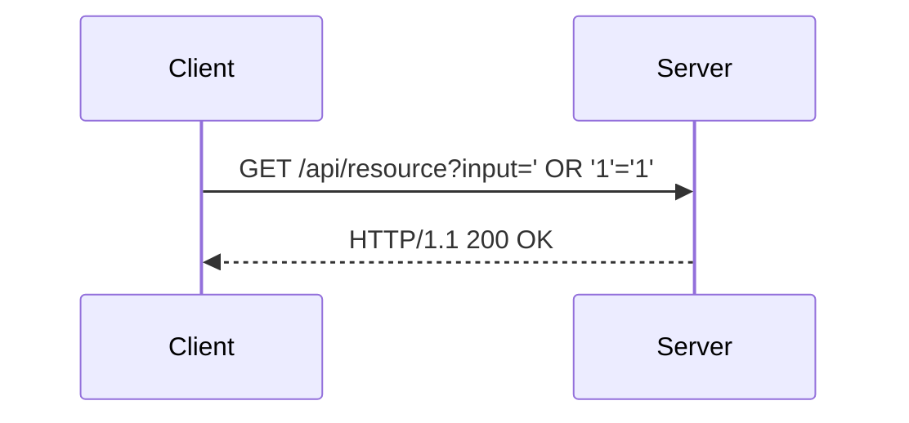

## Hands-On Practice with Postman

To solidify your understanding of API security testing with Postman, it's essential to practice with real-world scenarios. Here are some recommended hands-on labs and exercises:

### Recommended Labs

- **PortSwigger Web Security Academy**: Offers a series of interactive labs covering various aspects of web security, including API security.
- **OWASP Juice Shop**: A deliberately insecure web application designed for security training and research.
- **DVWA (Damn Vulnerable Web Application)**: A PHP/MySQL web application that is riddled with vulnerabilities for educational purposes.
- **WebGoat**: An interactive, gamified training application for learning about web application security.

### Example Lab Exercise

Let's walk through an example lab exercise using PortSwigger Web Security Academy:

1. **Objective**: Test an API endpoint for SQL injection vulnerabilities.
2. **Steps**:
   - Open Postman and create a new request.
   - Send a request with untrusted input to the API endpoint.
   - Analyze the response to identify potential SQL injection vulnerabilities.



### Full HTTP Request and Response

Here is an example of a full HTTP request and response for the lab exercise:

```http
GET /api/resource?input=' OR '1'='1' HTTP/1.1
Host: example.com

HTTP/1.1 200 OK
Content-Type: application/json
{
    "message": "Resource retrieved successfully"
}
```

### How to Prevent / Defend Against Lab Exercises

To defend against lab exercises, follow these best practices:

1. **Input Validation**: Validate all user inputs to prevent injection attacks.
2. **Parameterized Queries**: Use parameterized queries to prevent SQL injection.
3. **Error Handling**: Implement proper error handling to avoid exposing sensitive information.
4. **Regular Testing**: Conduct regular security testing to identify and fix vulnerabilities.

#### Secure Coding Fixes

Here is an example of a vulnerable and secure implementation of a SQL injection scenario:

**Vulnerable Code**

```python
import os
from flask import Flask, request

app = Flask(__name__)

@app.route('/api/resource')
def get_resource():
    input = request.args.get('input')
    query = f"SELECT * FROM resources WHERE input = '{input}'"
    # Execute query and return results
    return {"message": "Resource retrieved successfully"}

if __name__ == '__main__':
    app.run()
```

**Secure Code**

```python
import os
from flask import Flask, request

app = Flask(__name__)

@app.route('/api/resource')
def get_resource():
    input = request.args.get('input')
    query = "SELECT * FROM resources WHERE input = %s"
    # Execute query with parameterized input
    return {"message": "Resource retrieved successfully"}

if __name__ == '__main__':
    app.run()
```

### Summary

In this section, we covered hands-on practice with Postman for API security testing. We recommended several labs and exercises to practice with real-world scenarios. We walked through an example lab exercise using PortSwigger Web Security Academy and provided best practices for defending against lab exercises. Additionally, we provided secure coding fixes for common vulnerabilities.

---
<!-- nav -->
[[02-Advanced Topics in API Security Testing with Postman|Advanced Topics in API Security Testing with Postman]] | [[API Security/04-Using Postman tool for API Security Testing/02-Authentication in Postman/00-Overview|Overview]] | [[04-Setting Up Authentication in Postman|Setting Up Authentication in Postman]]
