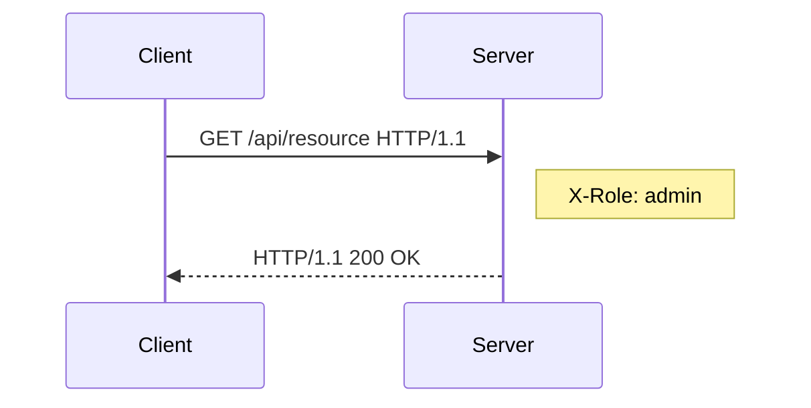
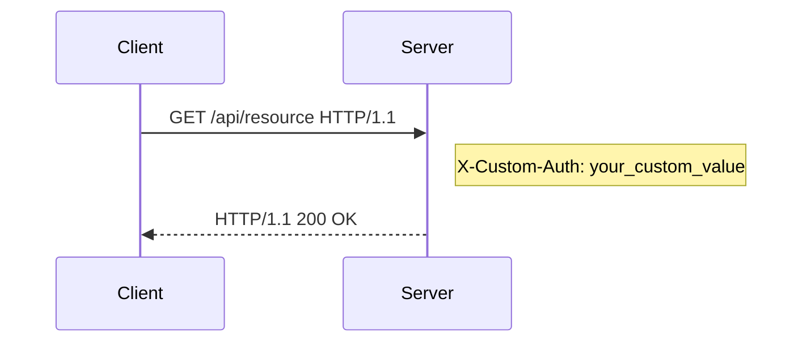

## Setting Up Authorization in Postman

Next, let's focus on setting up authorization in Postman. While authentication verifies the identity of a user or system, authorization determines what actions they are allowed to perform. We'll explore how to implement role-based access control (RBAC) and other authorization mechanisms in Postman.

### Role-Based Access Control (RBAC)

Role-Based Access Control (RBAC) is a method of restricting system access to authorized users. It defines roles and assigns permissions to those roles, ensuring that users can only perform actions appropriate to their role.

#### How RBAC Works

1. **Roles**: Define roles such as `admin`, `user`, and `guest`.
2. **Permissions**: Assign permissions to each role, such as read, write, or delete.
3. **User Assignment**: Assign users to roles based on their responsibilities.

#### Example Configuration in Postman

1. Open Postman and create a new request.
2. Click on the "Authorization" tab.
3. Select "Custom" from the dropdown menu.
4. Enter the necessary headers to indicate the user's role and permissions.



#### Full HTTP Request and Response

Here is an example of a full HTTP request and response using RBAC:

```http
GET /api/resource HTTP/1.1
Host: example.com
X-Role: admin

HTTP/1.1 200 OK
Content-Type: application/json
{
    "message": "Resource retrieved successfully"
}
```

### Custom Authorization Headers

In addition to predefined authentication methods, you can also use custom headers to implement authorization logic.

#### How Custom Headers Work

1. **Header Definition**: Define custom headers to convey authorization information.
2. **Header Usage**: Include these headers in the HTTP request.
3. **Server Validation**: The server validates the headers to determine the user's permissions.

#### Example Configuration in Postman

1. Open Postman and create a new request.
2. Click on the "Authorization" tab.
3. Select "Custom" from the dropdown menu.
4. Enter the necessary headers to convey authorization information.



#### Full HTTP Request and Response

Here is an example of a full HTTP request and response using custom headers:

```http
GET /api/resource HTTP/1.1
Host: example.com
X-Custom-Auth: your_custom_value

HTTP/1.1 200 OK
Content-Type: application/json
{
    "message": "Resource retrieved successfully"
}
```

### How to Prevent / Defend Against Authorization Vulnerabilities

To defend against authorization vulnerabilities, follow these best practices:

1. **Implement RBAC**: Use role-based access control to manage user permissions effectively.
2. **Least Privilege Principle**: Ensure users have the minimum permissions necessary to perform their tasks.
3. **Regular Audits**: Conduct regular audits to verify that roles and permissions are correctly assigned.
4. **Monitor and Log**: Monitor and log authorization attempts to detect and respond to suspicious activity.

#### Secure Coding Fixes

Here is an example of a vulnerable and secure implementation of RBAC:

**Vulnerable Code**

```python
import os
from flask import Flask, request

app = Flask(__name__)

@app.route('/api/resource')
def get_resource():
    role = request.headers.get('X-Role')
    if role == 'admin':
        return {"message": "Resource retrieved successfully"}
    else:
        return {"error": "Insufficient permissions"}, 403

if __name__ == '__main__':
    app.run()
```

**Secure Code**

```python
import os
from flask import Flask, request

app = Flask(__name__)

# Load roles and permissions from environment variables
ROLES = os.getenv('ROLES', '').split(',')
PERMISSIONS = {
    'admin': ['read', 'write', 'delete'],
    'user': ['read'],
    'guest': []
}

@app.route('/api/resource')
def get_resource():
    role = request.headers.get('X-Role')
    if role in ROLES and 'read' in PERMISSIONS[role]:
        return {"message": "Resource retrieved successfully"}
    else:
        return {"error": "Insufficient permissions"}, 403

if __name__ == '__main__':
    app.run()
```

### Summary

In this section, we covered the basics of authorization in APIs and demonstrated how to configure role-based access control (RBAC) and custom authorization headers in Postman. We explored how to implement RBAC and custom headers to manage user permissions effectively. Additionally, we discussed best practices for preventing authorization vulnerabilities and provided secure coding fixes.

---
<!-- nav -->
[[04-Setting Up Authentication in Postman|Setting Up Authentication in Postman]] | [[API Security/04-Using Postman tool for API Security Testing/02-Authentication in Postman/00-Overview|Overview]] | [[API Security/04-Using Postman tool for API Security Testing/02-Authentication in Postman/06-Conclusion|Conclusion]]
