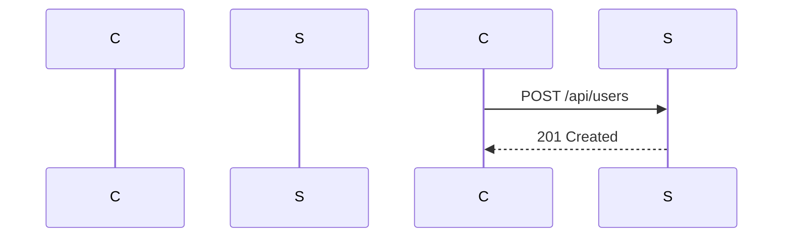

## Introduction to Postman Tool for API Security Testing

Postman is a powerful tool used for testing APIs. It allows developers and security professionals to send HTTP requests and view the responses, making it an essential component in the development and security testing phases of API-based applications. In this chapter, we will delve into the installation process of Postman, explore its features, and discuss how to use it effectively for API security testing.

### Why Use Postman?

Postman offers several advantages that make it indispensable for API testing:

- **Ease of Use**: Postman provides a user-friendly interface that simplifies the process of sending HTTP requests and analyzing responses.
- **Extensive Features**: It supports various HTTP methods (GET, POST, PUT, DELETE, etc.), custom headers, form data, and raw data input.
- **Collaboration**: Postman allows users to share their work with others, making it easier to collaborate on API testing.
- **Automation**: It supports automated testing through collections and environments, which can be scheduled to run at specific intervals.
- **Security Testing**: Postman can be used to test for vulnerabilities such as SQL injection, cross-site scripting (XSS), and other security issues.

### Installing Postman

To begin using Postman, you first need to install it on your system. Here’s a step-by-step guide to installing Postman:

#### Step 1: Download Postman

Visit the official Postman website at [https://www.postman.com/downloads/](https://www.postman.com/downloads/) and download the appropriate version for your operating system (Windows, macOS, or Linux).

#### Step 2: Install Postman

Once you have downloaded the installer, follow these steps to install Postman:

- **Windows**: Double-click the downloaded `.exe` file and follow the on-screen instructions to install Postman.
- **macOS**: Open the downloaded `.zip` file, drag the Postman application to your Applications folder, and double-click it to start.
- **Linux**: Extract the downloaded `.tar.gz` file and run the `Postman` executable inside the extracted directory.

#### Step 3: Launch Postman

After installation, launch Postman. You should see the main interface, which includes a request builder, a response viewer, and various tabs for managing collections, environments, and monitors.

### Creating an Account

To fully utilize Postman, it is recommended to create an account. This allows you to save and share your work across different devices and collaborate with others.

#### Step 1: Sign Up

1. Click on the "Sign up" button in the top-right corner of the Postman interface.
2. Enter your email address and create a password.
3. Follow the on-screen instructions to complete the registration process.

#### Step -2: Log In

1. After creating your account, click on the "Log in" button.
2. Enter your email address and password.
3. Click "Log in" to access your account.

### Setting Up Your First Request

Now that you have installed and logged into Postman, let’s set up your first API request.

#### Step 1: Create a New Request

1. Click on the "New" button in the top-left corner of the interface.
2. Select "Request" from the dropdown menu.
3. Name your request and choose a location to save it (e.g., a collection).

#### Step 2: Configure the Request

1. In the request builder, select the HTTP method (e.g., GET, POST).
2. Enter the URL of the API endpoint you want to test.
3. Add any necessary headers, form data, or raw data.

#### Example: Sending a GET Request

```http
GET /api/users HTTP/1.1
Host: example.com
Authorization: Bearer <your_token>
```

#### Step 3: Send the Request

Click the "Send" button to send the request. Postman will display the response in the response viewer.

### Common Pitfalls and How to Avoid Them

#### 1. Incorrect Headers

**Problem**: Missing or incorrect headers can cause API requests to fail.

**Solution**: Always verify that you have included all required headers. For example, authentication tokens should be correctly formatted and included in the `Authorization` header.

#### 2. Invalid Data Formats

**Problem**: Sending data in an unsupported format can result in errors.

**Solution**: Ensure that the data format matches the API requirements. For instance, if the API expects JSON data, make sure to set the `Content-Type` header to `application/json`.

#### 3. Network Issues

**Problem**: Network connectivity problems can prevent requests from reaching the server.

**Solution**: Check your internet connection and ensure that the API endpoint is accessible. You can use tools like `ping` or `curl` to verify connectivity.

### Real-World Examples and Recent CVEs

#### Example: SQL Injection Vulnerability

Consider an API endpoint that accepts user input and performs a database query. If the input is not properly sanitized, it could lead to a SQL injection attack.

**Vulnerable Code**:

```sql
SELECT * FROM users WHERE username = '$username';
```

**Secure Code**:

```sql
SELECT * FROM users WHERE username = ?;
```

In Postman, you can simulate this attack by sending a request with malicious input and observing the response.

#### Example: Cross-Site Scripting (XSS)

An API endpoint that reflects user input back to the client without proper sanitization can be exploited for XSS attacks.

**Vulnerable Code**:

```html
<div>{{user_input}}</div>
```

**Secure Code**:

```html
<div>{{sanitize(user_input)}}</div>
```

In Postman, you can test this by sending a request with a script tag and checking if the response contains the script.

### How to Prevent / Defend

#### 1. Input Validation

Always validate and sanitize user input to prevent injection attacks.

#### 2. Use Prepared Statements

For database queries, use prepared statements to prevent SQL injection.

#### 3. Content Security Policy (CSP)

Implement CSP to mitigate XSS attacks by specifying which sources of content are allowed to be executed.

#### 4. Regular Security Audits

Conduct regular security audits and penetration testing to identify and fix vulnerabilities.

### Complete Example: Testing an API Endpoint

Let’s walk through a complete example of testing an API endpoint using Postman.

#### Step 1: Set Up the Request

1. Create a new request named "Test User API".
2. Set the HTTP method to `POST`.
3. Enter the URL: `https://example.com/api/users`.
4. Add the following headers:

```http
Content-Type: application/json
Authorization: Bearer <your_token>
```

5. Add the following raw JSON data:

```json
{
  "username": "testuser",
  "email": "test@example.com",
  "password": "securepassword"
}
```

#### Step 2: Send the Request

Click the "Send" button to send the request. Postman will display the response in the response viewer.

#### Expected Response:

```http
HTTP/1.1 201 Created
Content-Type: application/json

{
  "id": 1,
  "username": "testuser",
  "email": "test@example.com"
}
```

### Mermaid Diagrams

#### Sequence Diagram: API Request and Response Flow



### Conclusion

Postman is a versatile tool that simplifies the process of testing APIs. By following the steps outlined in this chapter, you can effectively use Postman for both development and security testing. Remember to always validate and sanitize user input, use prepared statements, implement CSP, and conduct regular security audits to prevent common vulnerabilities.

### Practice Labs

For hands-on practice with API security testing using Postman, consider the following labs:

- **PortSwigger Web Security Academy**: Offers interactive labs that cover various aspects of web security, including API testing.
- **OWASP Juice Shop**: A deliberately insecure web application that can be used to practice security testing techniques.
- **DVWA (Damn Vulnerable Web Application)**: Another intentionally vulnerable web application that can be used to learn and practice security testing.

By combining theoretical knowledge with practical experience, you can become proficient in using Postman for API security testing.

---
<!-- nav -->
[[API Security/04-Using Postman tool for API Security Testing/03-Installation of Postman tool/00-Overview|Overview]] | [[API Security/04-Using Postman tool for API Security Testing/03-Installation of Postman tool/02-Introduction to Postman for API Security Testing|Introduction to Postman for API Security Testing]]
