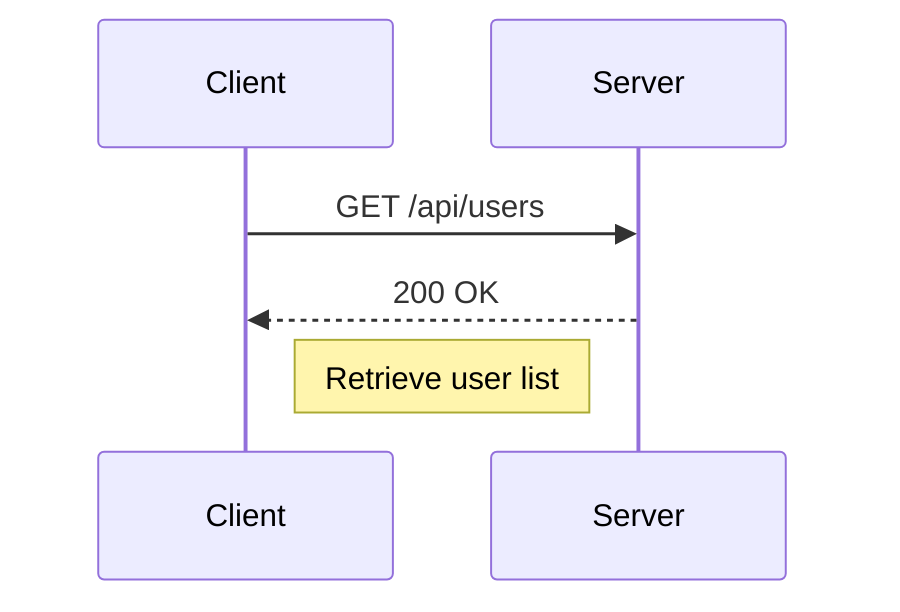

## Introduction to Postman for API Security Testing

Welcome to the course on offensive API security testing. In this section, we will focus on the installation and setup of Postman, a powerful tool used for testing APIs. Postman is widely recognized for its user-friendly interface and robust feature set, making it an essential tool for developers and security professionals alike.

### Background Theory

Postman is a collaborative platform for building and using APIs. It allows users to send HTTP requests and view the responses, which is crucial for testing and debugging APIs. Postman supports various types of HTTP requests, including GET, POST, PUT, DELETE, and more. Additionally, it provides features such as environment variables, collections, and monitoring, which enhance the efficiency and effectiveness of API testing.

### Why Use Postman?

Postman simplifies the process of interacting with APIs by providing a graphical interface that abstracts away the complexities of manual HTTP requests. This makes it easier for developers to test their APIs without needing to write extensive scripts or use command-line tools like `curl`. Moreover, Postman's collaboration features enable teams to share and manage API tests, ensuring consistency and reducing errors.

### Installation Process

Postman is available as a standalone application for Windows, macOS, and Linux. It can also be used as a Chrome extension, although the standalone application offers more features and flexibility. Here’s a detailed guide on how to install Postman:

#### Downloading Postman

1. **Visit the Postman Website**: Open your web browser and navigate to the official Postman website at [https://www.postman.com/downloads/](https://www.postman.com/downloads/).

2. **Select Your Operating System**: Choose the appropriate version of Postman for your operating system. The website provides options for Windows, macOS, and Linux.

3. **Download the Installer**: Click on the download link for your chosen operating system. The installer will be downloaded to your computer.

#### Installing Postman

The installation process varies slightly depending on your operating system. Below are detailed steps for each OS:

##### Windows

1. **Run the Installer**: Locate the downloaded `.exe` file and double-click it to start the installation process.

2. **Follow the Prompts**: The installer will guide you through the installation steps. Ensure you read and accept the license agreement.

3. **Complete Installation**: Once the installation is complete, you can launch Postman from the Start menu or desktop shortcut.

##### macOS

1. **Open the Downloaded File**: Locate the downloaded `.zip` file and double-click it to extract the contents.

2. **Move Postman to Applications Folder**: Drag the extracted `Postman.app` file to your Applications folder.

3. **Launch Postman**: Double-click the `Postman.app` icon in your Applications folder to start the application.

##### Linux

1. **Install Dependencies**: Depending on your distribution, you may need to install dependencies first. For example, on Ubuntu, you can use:
    ```bash
    sudo apt-get update
    sudo apt-get install libappindicator1
    ```

2. **Extract the Archive**: Extract the downloaded `.tar.gz` file using a terminal command:
    ```bash
    tar -xvf Postman.tar.gz
    ```

3. **Run Postman**: Navigate to the extracted directory and run the `Postman` executable:
    ```bash
    ./Postman
    ```

### Creating an Account

To fully utilize Postman's features, you need to create an account. Here’s how to do it:

1. **Sign Up**: Open Postman and click on the "Sign Up" button. Enter your email address and create a password.

2. **Verify Email**: Check your email for a verification link and click on it to confirm your account.

3. **Log In**: After verifying your email, log in to Postman using your credentials.

### Common Pitfalls and Troubleshooting

During the installation process, you might encounter some issues. Here are some common problems and their solutions:

- **Application Not Responding**: If Postman does not respond after installation, try force quitting the application and restarting it. On macOS, you can force quit an application by pressing `Command + Option + Esc`.

- **Installation Errors**: If you receive an error during installation, ensure that your system meets the minimum requirements and that you have administrative privileges to install software.

### Real-World Examples

Postman is widely used in both development and security contexts. For instance, in the context of API security, Postman can be used to test for vulnerabilities such as SQL injection, cross-site scripting (XSS), and unauthorized access. A recent example is the CVE-2021-21972, where a vulnerability in the Jenkins API allowed attackers to execute arbitrary code. Postman could be used to simulate such attacks and verify the presence of the vulnerability.

### How to Prevent / Defend

To ensure the security of your APIs, it is crucial to follow best practices and implement proper security measures. Here are some key points:

- **Input Validation**: Always validate input data to prevent injection attacks. Use libraries and frameworks that provide built-in validation mechanisms.

- **Authentication and Authorization**: Implement strong authentication mechanisms and enforce role-based access control to restrict access to sensitive resources.

- **Secure Communication**: Use HTTPS to encrypt data transmitted between clients and servers. Ensure that your server certificates are valid and up-to-date.

- **Regular Audits**: Conduct regular security audits and penetration testing to identify and mitigate potential vulnerabilities.

### Example Code and Diagrams

Here’s an example of how you might use Postman to test an API endpoint:

```http
GET /api/users HTTP/1.1
Host: example.com
Authorization: Bearer <your_access_token>
```

In this example, we are sending a GET request to retrieve a list of users from the `/api/users` endpoint. The `Authorization` header contains a bearer token for authentication.

### Mermaid Diagrams

A mermaid diagram can help visualize the interaction between the client and the server:



### Practice Labs

For hands-on practice, consider using the following labs:

- **PortSwigger Web Security Academy**: Offers comprehensive modules on API security, including practical exercises and challenges.
- **OWASP Juice Shop**: A deliberately insecure web application that includes numerous API-related vulnerabilities.

By following these steps and utilizing the provided resources, you can effectively install and use Postman for API security testing.

---
<!-- nav -->
[[API Security/04-Using Postman tool for API Security Testing/03-Installation of Postman tool/01-Introduction to Postman Tool for API Security Testing|Introduction to Postman Tool for API Security Testing]] | [[API Security/04-Using Postman tool for API Security Testing/03-Installation of Postman tool/00-Overview|Overview]] | [[API Security/04-Using Postman tool for API Security Testing/03-Installation of Postman tool/03-Practice Questions & Answers|Practice Questions & Answers]]
