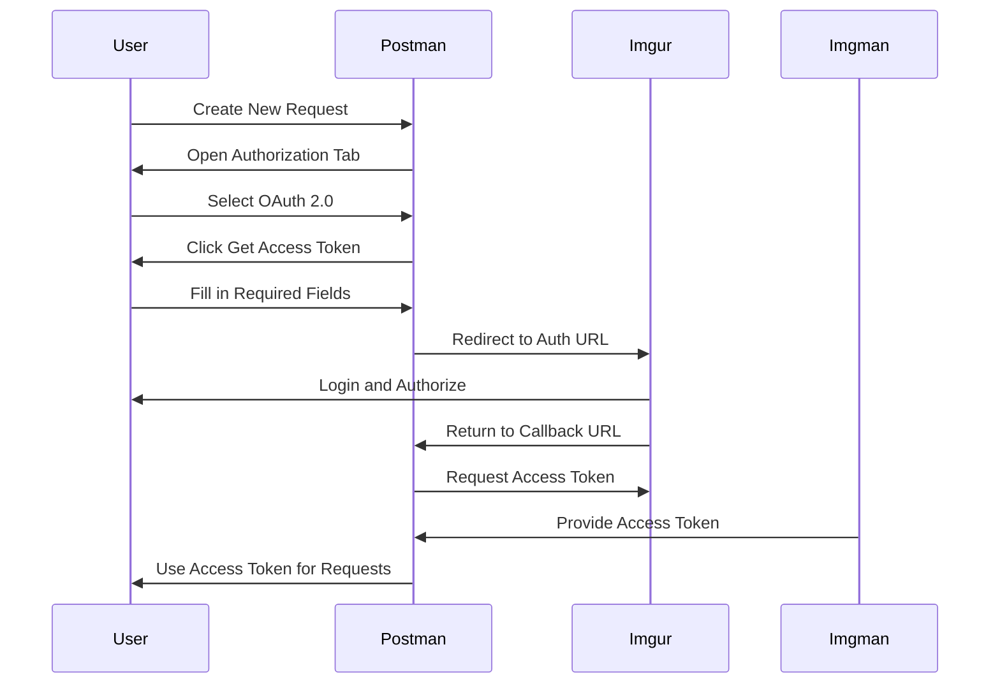

## Introduction to OAuth 2.0 Authentication in Postman

OAuth 2.0 is an open standard for access delegation, commonly used as a way for Internet users to grant websites or applications access to their information on other websites but without giving them the passwords. This is particularly useful in API security testing, where you need to authenticate and authorize requests to APIs.

### What is OAuth 2.0?

OAuth 2.0 is a protocol that enables applications to securely access resources on behalf of a user without exposing the user's credentials. It provides a framework for authorization and is widely adopted across various platforms and services. OAuth 2.0 defines several "flows" or "grant types," which determine how the client obtains an access token.

#### Why is OAuth 2.0 Important?

OAuth 2.0 is crucial for API security because it allows for fine-grained access control and minimizes the exposure of sensitive user data. By using OAuth 2.0, developers can ensure that their applications only have the permissions necessary to perform their tasks, reducing the risk of unauthorized access.

### OAuth 2.0 Flows

There are several OAuth 2.0 flows, including:

- **Authorization Code Flow**: This is the most secure flow and is typically used for server-side applications.
- **Implicit Grant Flow**: This flow is used for client-side applications and does not require a server-side component.
- **Resource Owner Password Credentials Grant**: This flow is used when the client has direct access to the user's credentials.
- **Client Credentials Grant**: This flow is used when the client itself needs to access resources on its own behalf.

### Using OAuth 2.0 in Postman

Postman is a powerful tool for API development and testing. It supports OAuth 2.0 authentication, making it easy to test APIs that require OAuth 2.0 tokens.

#### Setting Up OAuth 2.0 in Postman

To set up OAuth 2.0 in Postman, follow these steps:

1. **Log into the Application**: First, log into the application you want to test. For example, let's use Imgur, a popular image-sharing platform.

2. **Access API Documentation**: Once logged in, navigate to the API documentation. For Imgur, you can find the API documentation at `https://api.imgur.com`.

3. **Register Your Application**: To use OAuth 2.0 tokens in Postman, you need to register your application with the service provider. In the case of Imgur, you can register your application by following the instructions in the API documentation.

4. **Obtain Client ID and Secret**: After registering your application, you will receive a Client ID and Client Secret. These are essential for obtaining OAuth 2.0 tokens.

5. **Set Up OAuth 2.0 in Postman**:
    - Open Postman and create a new request.
    - Click on the "Authorization" tab.
    - Select "OAuth 2.0" from the dropdown menu.
    - Click on "Get Access Token".
    - Fill in the required fields:
        - **Grant Type**: Choose the appropriate grant type (e.g., Authorization Code).
        - **Callback URL**: Enter the callback URL provided by the service provider.
        - **Auth URL**: Enter the authorization URL provided by the service provider.
        - **Access Token URL**: Enter the access token URL provided by the service provider.
        - **Client ID**: Enter the Client ID obtained during registration.
        - **Client Secret**: Enter the Client Secret obtained during registration.
        - **Scope**: Enter the scope required for your application.
        - **State**: Optionally, enter a state parameter.
    - Click on "Request Token".

6. **Use the Access Token**: Once you obtain the access token, Postman will automatically use it for subsequent requests.

### Example: OAuth 2.0 in Postman with Imgur

Let's walk through a detailed example of setting up OAuth 2.0 in Postman with Imgur.

#### Step 1: Register Your Application

1. **Navigate to Imgur API Documentation**: Visit `https://api.imgur.com`.
2. **Register Your Application**: Follow the instructions to register your application. You will receive a Client ID and Client Secret.

#### Step 2: Set Up OAuth 2.0 in Postman

1. **Open Postman**: Create a new request.
2. **Click on the "Authorization" Tab**: Select "OAuth 2.0".
3. **Click on "Get Access Token"**:
    - **Grant Type**: Authorization Code.
    - **Callback URL**: `http://localhost/callback`.
    - **Auth URL**: `https://api.imgur.com/oauth2/authorize`.
    - **Access Token URL**: `https://api.imgur.com/oauth2/token`.
    - **Client ID**: Enter your Client ID.
    - **Client Secret**: Enter your Client Secret.
    - **Scope**: `read` (or any other required scope).
    - **State**: Optional.
4. **Click on "Request Token"**: Postman will redirect you to the authorization page. Log in and authorize the application.
5. **Postman Will Automatically Obtain the Access Token**: Use this token for subsequent requests.

### Full Example with Code

Here is a complete example of how to set up and use OAuth 2.0 in Postman with Imgur:



#### Raw HTTP Request and Response

Here is an example of the HTTP request and response for obtaining an OAuth 2.0 access token:

```http
POST https://api.imgur.com/oauth2/token HTTP/1.1
Host: api.imgur.com
Content-Type: application/x-www-form-urlencoded

client_id=YOUR_CLIENT_ID&client_secret=YOUR_CLIENT_SECRET&grant_type=authorization_code&code=AUTHORIZATION_CODE&redirect_uri=http://localhost/callback
```

```http
HTTP/1.1 200 OK
Content-Type: application/json

{
    "access_token": "ACCESS_TOKEN",
    "token_type": "bearer",
    "expires_in": 3600,
    "refresh_token": "REFRESH_TOKEN",
    "scope": "read"
}
```

### Common Pitfalls and How to Prevent Them

#### Pitfall 1: Incorrect Scope

**Problem**: Using incorrect scopes can lead to insufficient or excessive permissions.

**Solution**: Always specify the exact scope required for your application. Review the API documentation to understand the available scopes.

#### Pitfall 2: Exposing Client Secret

**Problem**: Exposing the client secret can allow unauthorized access to your application.

**Solution**: Keep the client secret confidential. Use environment variables or secure storage mechanisms to manage secrets.

#### Pitfall 3: Insufficient Token Validation

**Problem**: Failing to validate tokens can lead to unauthorized access.

**Solution**: Always validate tokens on the server side. Use libraries or frameworks that provide built-in support for token validation.

### Real-World Examples and Breaches

#### Example: CVE-2021-21972

In 2021, a vulnerability was discovered in the OAuth 2.0 implementation of a popular social media platform. The vulnerability allowed attackers to bypass authorization checks and gain unauthorized access to user data.

**Impact**: This vulnerability could have led to the exposure of sensitive user data.

**Mitigation**: Ensure that your OAuth 2.0 implementation follows best practices and is regularly audited for vulnerabilities.

### How to Prevent / Defend

#### Detection

- **Monitor API Logs**: Regularly review API logs for suspicious activity.
- **Use Security Tools**: Utilize tools like Burp Suite or OWASP ZAP to detect and mitigate security issues.

#### Prevention

- **Secure Storage**: Store client secrets securely using environment variables or secure storage mechanisms.
- **Regular Audits**: Conduct regular security audits to identify and mitigate vulnerabilities.
- **Secure Coding Practices**: Follow secure coding practices to prevent common security issues.

#### Secure-Coding Fixes

Here is an example of a vulnerable code snippet and its secure counterpart:

**Vulnerable Code**:
```python
import requests

def get_access_token(client_id, client_secret, code):
    url = "https://api.imgur.com/oauth2/token"
    data = {
        "client_id": client_id,
        "client_secret": client_secret,
        "grant_type": "authorization_code",
        "code": code,
        "redirect_uri": "http://localhost/callback"
    }
    response = requests.post(url, data=data)
    return response.json()["access_token"]
```

**Secure Code**:
```python
import os
import requests

def get_access_token(code):
    client_id = os.getenv("IMGUR_CLIENT_ID")
    client_secret = os.getenv("IMGUR_CLIENT_SECRET")
    url = "https://api.imgur.com/oauth2/token"
    data = {
        "client_id": client_id,
        "client_secret": client_secret,
        "grant_type": "authorization_code",
        "code": code,
        "redirect_uri": "http://localhost/callback"
    }
    response = requests.post(url, data=data)
    return response.json()["access_token"]
```

### Configuration Hardening

#### Nginx Configuration

Here is an example of securing Nginx configuration to prevent unauthorized access:

```nginx
server {
    listen 80;
    server_name example.com;

    location /oauth2/token {
        auth_request /auth;
        proxy_pass http://backend;
    }

    location /auth {
        internal;
        proxy_pass http://auth_service;
    }
}
```

### Practice Labs

For hands-on practice with OAuth 2.0 in Postman, consider the following labs:

- **PortSwigger Web Security Academy**: Offers comprehensive labs on OAuth 2.0 and other web security topics.
- **OWASP Juice Shop**: A deliberately insecure web application for practicing web security skills.
- **DVWA (Damn Vulnerable Web Application)**: A PHP/MySQL web application that is riddled with vulnerabilities.

By following these steps and best practices, you can effectively use OAuth 2.0 in Postman for API security testing.

---
<!-- nav -->
[[API Security/04-Using Postman tool for API Security Testing/05-Oauth20 Authentication in Postman/01-Introduction to API Security Testing with Postman|Introduction to API Security Testing with Postman]] | [[API Security/04-Using Postman tool for API Security Testing/05-Oauth20 Authentication in Postman/00-Overview|Overview]] | [[03-Introduction to OAuth 2.0 and API Security Testing with Postman|Introduction to OAuth 2.0 and API Security Testing with Postman]]
