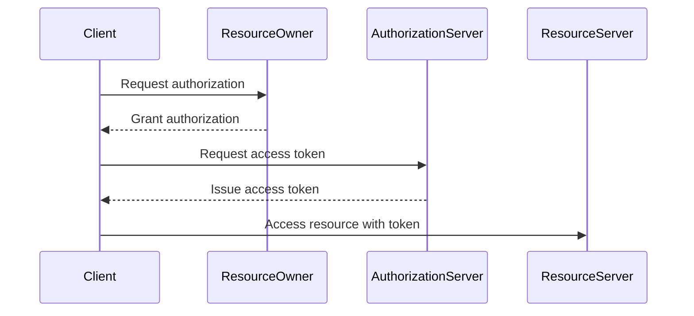

## Introduction to OAuth 2.0 and API Security Testing with Postman

OAuth 2.0 is an open standard for access delegation, commonly used as a way for Internet users to approve one application interacting with another on their behalf without giving away their credentials. This protocol enables applications to obtain limited access to user resources without exposing the user’s password. In the context of API security testing, tools like Postman provide a convenient interface to test OAuth 2.0 authentication mechanisms.

### What is OAuth 2.0?

OAuth 2.0 is a widely adopted protocol for authorization. It allows applications to access resources from other services on behalf of a user, without sharing the user's credentials. Instead, OAuth uses tokens to grant temporary access to resources.

#### Why Use OAuth 2.0?

- **Security**: OAuth 2.0 provides a more secure method of accessing resources compared to traditional username/password methods.
- **Flexibility**: It supports various types of clients, including web applications, mobile apps, and desktop applications.
- **Scalability**: OAuth 2.0 can be easily integrated into existing systems and scaled up as needed.

### OAuth 2.0 Flow Overview

The OAuth 2.0 flow typically involves the following steps:

1. **Authorization Request**: The client requests authorization from the resource owner.
2. **Authorization Grant**: The resource owner grants authorization to the client.
3. **Token Request**: The client requests an access token from the authorization server using the authorization grant.
4. **Access Token**: The authorization server issues an access token to the client.
5. **Resource Access**: The client uses the access token to access the protected resources.



### Setting Up OAuth 2.0 in Postman

Postman is a powerful tool for API development and testing. It supports OAuth 2.0 out of the box, making it easy to test APIs that require OAuth 2.0 authentication.

#### Step-by-Step Guide

1. **Create a Postman Application**:
   - Go to the Postman website and log in to your account.
   - Navigate to the "Applications" section.
   - Click on "New Application" and fill in the necessary details such as the name, description, and callback URL.

2. **Configure OAuth 2.0 Settings**:
   - In the Postman application settings, configure the OAuth 2.0 settings.
   - Set the authorization type to "OAuth 2.0".
   - Enter the callback URL provided by the OAuth provider.
   - Provide the client ID and client secret.

3. **Set Up OAuth 2.0 in a Collection**:
   - Open the collection where you want to test the OAuth 2.0 authenticated API.
   - Click on the "Authorization" tab.
   - Select "OAuth 2.0" as the type.
   - Fill in the required fields such as the grant type, client ID, client secret, and callback URL.

4. **Generate Access Token**:
   - Click on the "Get New Access Token" button.
   - Postman will redirect you to the OAuth provider's login page.
   - Log in and authorize the application.
   - Postman will receive the access token and store it for future requests.

### Example: OAuth 2.0 Authentication in Postman

Let's walk through a detailed example of setting up OAuth 2.0 authentication in Postman.

#### Creating a Postman Application

1. **Log in to Postman**:
   - Go to https://www.postman.com and log in to your account.

2. **Create a New Application**:
   - Navigate to the "Applications" section.
   - Click on "New Application".
   - Fill in the details such as the name, description, and callback URL.

3. **Configure OAuth 2.0 Settings**:
   - In the application settings, configure the OAuth 2.0 settings.
   - Set the authorization type to "OAuth 2.0".
   - Enter the callback URL provided by the OAuth provider.
   - Provide the client ID and client secret.

#### Configuring OAuth 2.0 in a Collection

1. **Open a Collection**:
   - Open the collection where you want to test the OAuth 2.0 authenticated API.

2. **Set Up OAuth 2.0**:
   - Click on the "Authorization" tab.
   - Select "OAuth 2.0" as the type.
   - Fill in the required fields such as the grant type, client ID, client secret, and callback URL.

3. **Generate Access Token**:
   - Click on the "Get New Access Token" button.
   - Postman will redirect you to the OAuth provider's login page.
   - Log in and authorize the application.
   - Postman will receive the access token and store it for future requests.

### Full HTTP Request and Response Example

Here is a complete example of an HTTP request and response using OAuth 2.0 in Postman.

#### HTTP Request

```http
GET /api/resource HTTP/1.1
Host: api.example.com
Authorization: Bearer <access_token>
```

#### HTTP Response

```http
HTTP/1.1 200 OK
Content-Type: application/json
Cache-Control: no-cache

{
  "data": {
    "id": 1,
    "name": "John Doe",
    "email": "john.doe@example.com"
  }
}
```

### Common Pitfalls and How to Avoid Them

#### Pitfall 1: Incorrect Callback URL

- **Issue**: If the callback URL is incorrect, the OAuth provider will not be able to redirect back to Postman after authorization.
- **Solution**: Ensure that the callback URL matches exactly with the one provided by the OAuth provider.

#### Pitfall 2: Missing Client Secret

- **Issue**: If the client secret is missing, the OAuth provider will not be able to authenticate the application.
- **Solution**: Ensure that the client secret is correctly entered in the Postman application settings.

### Real-World Examples and Recent Breaches

#### Example: Twitter API Breach

In 2020, a breach involving the Twitter API exposed sensitive information due to improper handling of OAuth 2.0 tokens. The attackers were able to obtain access tokens and use them to gain unauthorized access to user data.

#### Example: GitHub OAuth Vulnerability

In 2019, GitHub disclosed a vulnerability in their OAuth implementation that allowed attackers to obtain access tokens and gain unauthorized access to user repositories.

### How to Prevent / Defend Against OAuth 2.0 Attacks

#### Detection

- **Monitor Access Logs**: Regularly monitor access logs to detect any unauthorized access attempts.
- **Use Security Tools**: Utilize security tools like OAuth scanners to detect vulnerabilities in OAuth implementations.

#### Prevention

- **Secure Storage of Tokens**: Store OAuth tokens securely and avoid storing them in plain text.
- **Implement Token Expiry**: Implement token expiry to ensure that tokens are valid only for a limited time.
- **Use Strong Authentication Methods**: Use strong authentication methods like multi-factor authentication (MFA) to enhance security.

#### Secure Coding Fixes

##### Vulnerable Code

```python
# Vulnerable code
def get_access_token():
    return "your-access-token"
```

##### Secure Code

```python
# Secure code
import os

def get_access_token():
    return os.getenv("ACCESS_TOKEN")
```

### Conclusion

OAuth 2.0 is a crucial component of modern API security. By using tools like Postman, developers can easily test and ensure the security of their OAuth 2.0 implementations. Understanding the OAuth 2.0 flow, common pitfalls, and real-world examples can help in building more secure and robust APIs.

### Practice Labs

For hands-on practice with OAuth 2.0 and API security testing, consider the following labs:

- **PortSwigger Web Security Academy**: Offers comprehensive modules on OAuth 2.0 and API security.
- **OWASP Juice Shop**: A deliberately insecure web application for practicing security testing.
- **DVWA (Damn Vulnerable Web Application)**: A PHP/MySQL web application that contains many vulnerabilities.

By leveraging these resources, you can gain practical experience in securing APIs using OAuth 2.0.

---
<!-- nav -->
[[02-Introduction to OAuth 2.0 Authentication in Postman|Introduction to OAuth 2.0 Authentication in Postman]] | [[API Security/04-Using Postman tool for API Security Testing/05-Oauth20 Authentication in Postman/00-Overview|Overview]] | [[API Security/04-Using Postman tool for API Security Testing/05-Oauth20 Authentication in Postman/04-Practice Questions & Answers|Practice Questions & Answers]]
