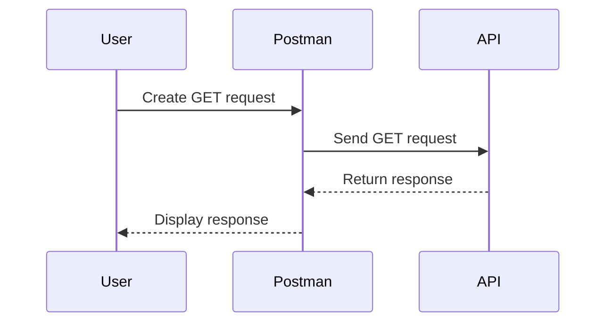
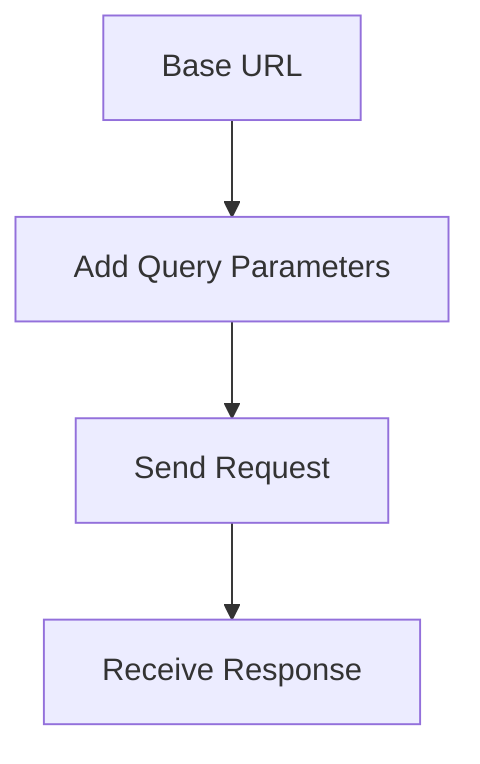

## Introduction to API Security Testing with Postman

API security testing is an essential aspect of ensuring that your application's backend services are robust and secure against potential threats. One of the most popular tools for performing these tests is Postman, a powerful and user-friendly API development environment. This chapter will guide you through the basics of using Postman for API security testing, covering key concepts such as request types, parameters, and response handling.

### What is Postman?

Postman is a comprehensive API development environment that allows developers to test, document, and monitor APIs. It provides a graphical interface for sending HTTP requests and viewing responses, making it easier to interact with APIs and debug issues. Postman supports various types of HTTP methods, including GET, POST, PUT, DELETE, and more, and offers extensive features for managing and organizing API requests.

### Why Use Postman for API Security Testing?

Using Postman for API security testing offers several advantages:

1. **Ease of Use**: Postman's intuitive interface makes it easy to construct and send complex API requests without needing to write extensive code.
2. **Comprehensive Features**: Postman supports a wide range of HTTP methods, authentication mechanisms, and request parameters, allowing you to test various aspects of your API.
3. **Collaboration**: Postman enables teams to collaborate on API testing by sharing collections, environments, and documentation.
4. **Automation**: Postman can be used to automate API testing through scripts and integrations with continuous integration/continuous deployment (CI/CD) pipelines.

### Setting Up Postman

Before diving into API security testing, ensure you have Postman installed on your machine. You can download it from the [official Postman website](https://www.postman.com/downloads/).

Once installed, launch Postman and familiarize yourself with the interface. The main components include:

- **Collections**: Organized groups of API requests.
- **Environments**: Sets of variables that can be used across requests.
- **Requests**: Individual API calls with specific configurations.
- **Responses**: Outputs from API calls.

### Creating a New Request in Postman

To start testing an API, you need to create a new request in Postman. Here’s a step-by-step guide:

1. **Open Postman**: Launch the Postman application.
2. **Create a Collection**: Click on the "Collections" tab and create a new collection by clicking the "+" icon.
3. **Add a Request**: Within the collection, click the "+" icon again to add a new request.
4. **Configure the Request**:
    - **URL**: Enter the API endpoint you want to test.
    - **Method**: Select the HTTP method (GET, POST, etc.) you want to use.
    - **Headers**: Add any necessary headers, such as `Content-Type` or `Authorization`.
    - **Body**: If required, configure the request body with the appropriate format (form-data, raw, etc.).

Here’s an example of creating a GET request to fetch data from an API:



### Understanding Request Parameters

Request parameters are additional pieces of information sent to the server along with the request. They can be included in the URL, headers, or body of the request. Understanding how to use these parameters effectively is crucial for thorough API testing.

#### Query Parameters

Query parameters are appended to the URL and are used to pass additional data to the server. For example, consider the following URL:

```
https://api.example.com/users?search=hackersera&limit=10
```

In this URL:
- `search=hackersera` is a query parameter that filters the results to include only users related to "hackersera".
- `limit=10` is another query parameter that limits the number of results returned to 10.

To set up query parameters in Postman:

1. **Enter the Base URL**: In the request editor, enter the base URL of the API.
2. **Add Query Parameters**: Click on the "Params" tab and add the necessary query parameters.

Here’s an example of setting up query parameters in Postman:



#### Example Code Block

```http
GET https://api.example.com/users?search=hackersera&limit=10 HTTP/1.1
Host: api.example.com
Accept: application/json
```

### Handling Response Data

When you send an API request, the server responds with data in a specific format, typically JSON or XML. Postman displays the response in a readable format, often with syntax highlighting and indentation for better readability.

#### Example Response

```json
{
    "status": "success",
    "data": [
        {
            "id": 1,
            "name": "Hackersera User 1",
            "email": "user1@hackersera.com"
        },
        {
            "id": 2,
            "name": "Hackersera User 2",
            "email": "user2@hackersera.com"
        }
    ]
}
```

### Common Pitfalls and How to Avoid Them

#### Incorrect Parameter Formatting

One common mistake is incorrectly formatting query parameters. Ensure that each parameter is properly encoded and separated by an ampersand (`&`). For example, `search=hackersera&limit=10` is correct, whereas `search=hackersera limit=10` would result in an error.

#### Missing Required Headers

Some APIs require specific headers to be present in the request. Forgetting to include these headers can lead to errors. Always refer to the API documentation to ensure you include all necessary headers.

#### Example of Missing Headers

```http
POST https://api.example.com/users HTTP/1.1
Host: api.example.com
Content-Type: application/json

{
    "name": "New User",
    "email": "newuser@example.com"
}
```

If the API requires an `Authorization` header, the above request would fail. The correct request should include the `Authorization` header:

```http
POST https://api.example.com/users HTTP/1.1
Host: api.example.com
Content-Type: application/json
Authorization: Bearer <token>

{
    "name": "New User",
    "email": "newuser@example.com"
}
```

### Real-World Examples and Recent CVEs

#### Example: CVE-2021-21972

CVE-2021-21972 is a vulnerability in the Jenkins CI/CD platform that allows unauthorized access to sensitive information due to improper validation of input parameters. This vulnerability highlights the importance of validating and sanitizing input parameters in API requests.

#### Example Code Block

```http
GET https://jenkins.example.com/api/json?tree=jobs[name,url] HTTP/1.1
Host: jenkins.example.com
Authorization: Bearer <token>
```

Without proper validation, an attacker could manipulate the `tree` parameter to extract sensitive information.

### How to Prevent / Defend

#### Secure Coding Practices

1. **Input Validation**: Always validate and sanitize input parameters to prevent injection attacks.
2. **Use Strong Authentication Mechanisms**: Implement strong authentication mechanisms such as OAuth2 or JWT to secure API endpoints.
3. **Rate Limiting**: Implement rate limiting to prevent abuse of API endpoints.

#### Example of Secure Input Validation

```python
def validate_input(param):
    if not param.isalnum():
        raise ValueError("Invalid input parameter")
    return param

# Usage
try:
    validated_param = validate_input(request.query_params.get('search'))
except ValueError as e:
    return {"error": str(e)}, 400
```

#### Example of Rate Limiting

```nginx
http {
    limit_req_zone $binary_remote_addr zone=one:10m rate=1r/s;

    server {
        location /api/ {
            limit_req zone=one burst=5;
            proxy_pass http://backend;
        }
    }
}
```

### Conclusion

This chapter has provided a comprehensive introduction to using Postman for API security testing. By understanding the basics of creating requests, configuring parameters, and handling responses, you can effectively test and secure your APIs. Remember to follow secure coding practices and stay vigilant against potential vulnerabilities.

### Practice Labs

For hands-on practice, consider the following labs:

- **PortSwigger Web Security Academy**: Offers interactive labs for learning web security concepts, including API security.
- **OWASP Juice Shop**: A deliberately insecure web application for practicing web security skills.
- **DVWA (Damn Vulnerable Web Application)**: Another intentionally vulnerable web application for learning security concepts.

By combining theoretical knowledge with practical experience, you can become proficient in API security testing using Postman.

---
<!-- nav -->
[[API Security/04-Using Postman tool for API Security Testing/06-Postman Basic API Calls/00-Overview|Overview]] | [[API Security/04-Using Postman tool for API Security Testing/06-Postman Basic API Calls/02-Introduction to Postman for API Security Testing|Introduction to Postman for API Security Testing]]
