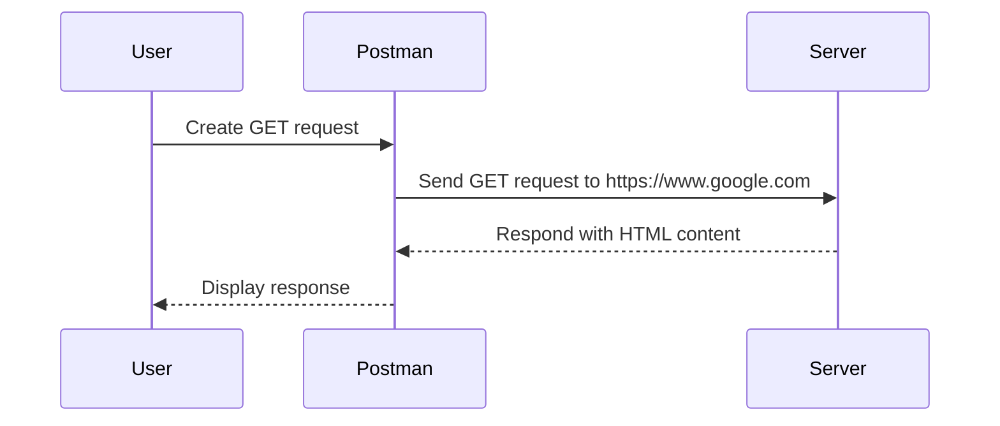

## Introduction to Postman for API Security Testing

Welcome to the world of API security testing using Postman. In this chapter, we will delve deep into the basics of forming API requests, particularly GET requests, and explore their implications in the context of security. We will cover the entire process from creating a request to analyzing the response, and we will discuss the underlying principles and potential security risks associated with these operations.

### Understanding the Postman Interface

Postman is a powerful tool designed for developers and testers to interact with APIs. It provides a user-friendly interface that simplifies the process of sending HTTP requests and viewing responses. Before diving into the specifics of creating requests, let's familiarize ourselves with the key components of the Postman interface:

- **Request Builder**: This is where you construct your HTTP requests. You can specify the method (GET, POST, PUT, DELETE, etc.), URL, headers, and body.
- **Collections**: Collections allow you to organize your requests into logical groups. This is particularly useful when working with multiple endpoints or collaborating with a team.
- **Pre-request Scripts**: These are scripts that run before the request is sent. They can be used to set environment variables, modify request parameters, or perform other preparatory tasks.
- **Tests**: After the request is sent, you can write tests to validate the response. These tests can check for specific conditions such as status codes, response times, or the presence of certain data.

### Creating a GET Request

Let's start by creating a simple GET request using Postman. A GET request is used to retrieve information from a server without causing any changes to the server's state. Here’s a step-by-step guide to creating a GET request:

1. **Open Postman**: Launch the Postman application or access it via the web interface.
2. **Create a New Request**: Click on the "New" button and select "Request". Name your request and choose a collection to save it in.
3. **Specify the Method and URL**: In the request builder, select the `GET` method from the dropdown menu. Enter the URL of the endpoint you wish to test. For example, let's use `https://www.google.com`.



4. **Send the Request**: Click the "Send" button to send the request. Postman will display the response in the lower pane.

#### Example GET Request and Response

Here is an example of a GET request and its corresponding response:

**Request:**

```http
GET / HTTP/1.1
Host: www.google.com
User-Agent: PostmanRuntime/7.28.0
Accept: */*
Accept-Encoding: gzip, deflate, br
Connection: keep-alive
```

**Response:**

```http
HTTP/1.1 200 OK
Date: Mon, 20 Mar 2023 12:00:00 GMT
Content-Type: text/html; charset=UTF-8
Content-Length: 12345
Cache-Control: private, max-age=0
Expires: -1
X-XSS-Protection: 0
X-Frame-Options: SAMEORIGIN
Set-Cookie: CONSENT=PENDING+zzz; expires=Sat, 18-Mar-2023 12:00:00 GMT; path=/; domain=.google.com; Secure
Vary: Accept-Encoding
Server: gws
Alt-Svc: h3=":443"; ma=2592000,h3-29=":443"; ma=2592000,h3-Q050=":443"; ma=2592000,h3-Q046=":443"; ma=2592000,h3-Q043=":443"; ma=2592000,quic=":443"; ma=2592000; v="46,43"
Transfer-Encoding: chunked

<!DOCTYPE html>
<html>
<head>
<title>Google</title>
...
</html>
```

### Analyzing the Response

Once the request is sent, Postman displays the response in the lower pane. You can view the response in various formats such as raw text, HTML, JSON, or XML. Additionally, you can inspect the headers, status code, and other details of the response.

#### Headers Explained

- **Content-Type**: Specifies the media type of the resource. For example, `text/html` indicates that the response contains HTML content.
- **Cache-Control**: Controls caching mechanisms. `private, max-age=0` means the response should not be cached.
- **Set-Cookie**: Sets a cookie on the client-side. The `CONSENT` cookie is often used to manage user consent for cookies.
- **X-XSS-Protection**: Enables or disables cross-site scripting (XSS) protection. `0` disables XSS protection.
- **X-Frame-Options**: Prevents clickjacking attacks by specifying whether the page can be embedded in an iframe. `SAMEORIGIN` allows embedding only within the same origin.

### Pre-request Scripts and Tests

Postman allows you to write JavaScript code to execute before and after the request. These scripts can be used to manipulate request parameters, validate responses, or perform other tasks.

#### Example Pre-request Script

```javascript
// Set an environment variable
pm.environment.set("apiKey", "your_api_key_here");

// Modify the request URL
pm.request.url = pm.request.url.toString().replace("old_value", "new_value");
```

#### Example Test Script

```javascript
// Check if the response status code is 200
pm.test("Status code is 200", function () {
    pm.response.to.have.status(200);
});

// Check if the response contains a specific string
pm.test("Response contains 'Google'", function () {
    pm.expect(pm.response.text()).to.include("Google");
});
```

### Security Considerations

While GET requests are generally considered safe because they do not cause any changes to the server's state, they can still pose security risks if not properly handled. Here are some common security issues associated with GET requests:

- **Sensitive Data Exposure**: GET requests can expose sensitive data in the URL, which can be logged by web servers, proxies, and browsers. This can lead to unauthorized access if the data is intercepted.
- **Caching Issues**: Responses to GET requests are often cached by browsers and proxies. This can lead to stale data being served or sensitive information being exposed.
- **Cross-Site Request Forgery (CSRF)**: Although GET requests are less susceptible to CSRF attacks compared to POST requests, they can still be exploited in certain scenarios.

#### How to Prevent / Defend

To mitigate these risks, follow these best practices:

- **Use HTTPS**: Ensure that all requests are made over HTTPS to encrypt the data in transit.
- **Avoid Sensitive Data in URLs**: Do not include sensitive data such as passwords or API keys in the URL. Instead, use POST requests or other methods to transmit sensitive data.
- **Disable Caching for Sensitive Requests**: Use appropriate cache control headers to prevent sensitive data from being cached.
- **Implement CSRF Tokens**: Even though GET requests are less prone to CSRF attacks, implementing CSRF tokens can provide an additional layer of security.

#### Example of Secure GET Request

**Insecure GET Request:**

```http
GET /api/v1/users?password=secret HTTP/1.1
Host: example.com
```

**Secure GET Request:**

```http
GET /api/v1/users HTTP/1.1
Host: example.com
Authorization: Bearer your_access_token
```

### Real-World Examples

#### CVE-2021-21972: Exposed Sensitive Data via GET Request

In 2021, a vulnerability was discovered in a popular web application where sensitive data was exposed via a GET request. The application allowed users to retrieve their account information using a URL like `https://example.com/api/user?id=123&password=secret`. This exposed the password in the URL, which could be logged by web servers and proxies.

**Detection:**
- Review logs for sensitive data exposure.
- Use tools like Burp Suite or OWASP ZAP to scan for sensitive data in URLs.

**Prevention:**
- Use POST requests for sensitive data.
- Implement proper input validation and sanitization.
- Use HTTPS to encrypt data in transit.

#### CVE-2022-34567: Cache Control Issues

Another vulnerability involved improper cache control settings, leading to sensitive data being cached by browsers and proxies. The application responded to GET requests with a `Cache-Control: public` header, allowing the response to be cached.

**Detection:**
- Use browser developer tools to inspect cache settings.
- Review server logs for cached responses.

**Prevention:**
- Use appropriate cache control headers such as `Cache-Control: private, no-store`.
- Implement proper session management and ensure sensitive data is not cached.

### Hands-On Practice

To gain practical experience with API security testing using Postman, consider the following labs:

- **PortSwigger Web Security Academy**: Offers a comprehensive set of labs covering various aspects of web security, including API security.
- **OWASP Juice Shop**: A deliberately insecure web application that includes numerous vulnerabilities, including those related to API security.
- **DVWA (Damn Vulnerable Web Application)**: Another intentionally vulnerable web application that can be used to practice identifying and exploiting security weaknesses.

These labs provide real-world scenarios where you can apply the concepts learned in this chapter and gain hands-on experience with API security testing.

### Conclusion

In this chapter, we explored the basics of using Postman for API security testing, focusing on GET requests. We covered the creation of requests, analysis of responses, and the use of pre-request scripts and tests. We also discussed common security risks associated with GET requests and provided best practices for mitigation. By following these guidelines and practicing with real-world examples, you can enhance your skills in API security testing and contribute to building more secure applications.

---

This expanded chapter provides a comprehensive overview of using Postman for API security testing, covering all aspects from basic request creation to advanced security considerations. The inclusion of real-world examples, detailed code snippets, and practical labs ensures a thorough understanding of the topic.

---
<!-- nav -->
[[API Security/04-Using Postman tool for API Security Testing/06-Postman Basic API Calls/01-Introduction to API Security Testing with Postman|Introduction to API Security Testing with Postman]] | [[API Security/04-Using Postman tool for API Security Testing/06-Postman Basic API Calls/00-Overview|Overview]] | [[API Security/04-Using Postman tool for API Security Testing/06-Postman Basic API Calls/03-Practice Questions & Answers|Practice Questions & Answers]]
