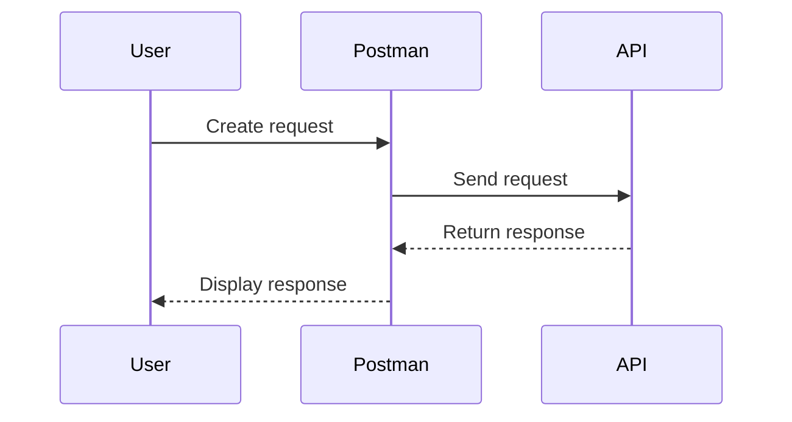
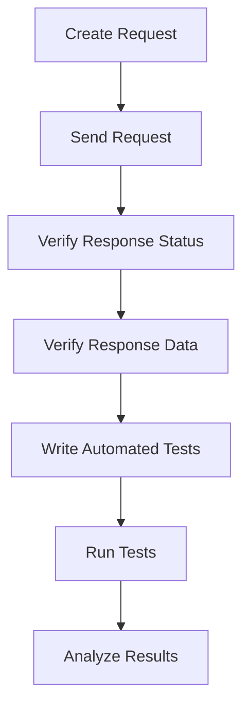

## Introduction to API Security Testing with Postman

API security testing is a critical aspect of ensuring that your application's backend services are robust and secure against various threats. One of the most popular tools for performing API security testing is Postman. This tool provides a user-friendly interface and powerful features that can help developers and security professionals test APIs effectively.

### What is Postman?

Postman is an API development environment that allows users to easily send HTTP requests and view the responses. It supports a wide range of features, including:

- Sending GET, POST, PUT, DELETE, and other HTTP methods.
- Setting headers, parameters, and body data.
- Saving and organizing requests into collections.
- Running automated tests using JavaScript.
- Integrating with other tools and services via plugins.

### Why Use Postman for API Security Testing?

Using Postman for API security testing offers several advantages:

- **Ease of Use**: Postman has a simple and intuitive interface that makes it easy to send requests and analyze responses.
- **Comprehensive Features**: It supports a wide range of features that are essential for thorough API testing, such as setting headers, parameters, and body data.
- **Automation**: Postman allows you to automate tests using JavaScript, which can save time and ensure consistency.
- **Collaboration**: You can share collections and environments with team members, making it easier to collaborate on API testing.

### Setting Up Postman for API Security Testing

Before diving into API security testing, it's important to set up Postman properly. Here’s a step-by-step guide to get started:

1. **Install Postman**: Download and install Postman from the official website.
2. **Create an Account**: Sign up for a free account to access additional features like collaboration and sharing.
3. **Set Up Environments**: Environments in Postman allow you to store variables that can be used across multiple requests. This is particularly useful for API security testing, as it enables you to easily switch between different environments (e.g., development, staging, production).

#### Creating an Environment

To create an environment in Postman:

1. Click on the "Environments" tab in the left sidebar.
2. Click on the "Add" button to create a new environment.
3. Enter a name for your environment (e.g., `Development`).
4. Add key-value pairs for variables that you want to use in your requests (e.g., `baseUrl`, `apiKey`).

```json
{
  "name": "Development",
  "values": {
    "baseUrl": "https://api.example.com",
    "apiKey": "your_api_key_here"
  }
}
```

### Creating and Sending Requests

Once you have set up your environment, you can start creating and sending requests to test your API.

#### Creating a Request

To create a new request in Postman:

1. Click on the "New" button in the top-left corner.
2. Select "Request" and give it a name.
3. Choose the HTTP method you want to use (e.g., GET, POST).
4. Enter the URL of the API endpoint you want to test.

For example, let's create a GET request to fetch user data:

```http
GET {{baseUrl}}/users/1
```

Here, `{{baseUrl}}` is a variable from your environment that will be replaced with the actual base URL.

#### Sending the Request

After creating the request, you can send it by clicking the "Send" button. Postman will display the response in the right panel, including the status code, headers, and body.

### Verifying Response Status

One of the primary goals of API security testing is to verify that the response status is as expected. This helps ensure that the API is functioning correctly and securely.

#### Checking Status Codes

HTTP status codes provide valuable information about the outcome of a request. Common status codes include:

- **200 OK**: The request was successful.
- **201 Created**: The request resulted in the creation of a resource.
- **400 Bad Request**: The server could not understand the request due to invalid syntax.
- **401 Unauthorized**: The client does not have valid authentication credentials for the target resource.
- **403 Forbidden**: The client does not have permission to access the requested resource.
- **404 Not Found**: The requested resource could not be found.
- **500 Internal Server Error**: The server encountered an unexpected condition that prevented it from fulfilling the request.

To check the status code in Postman, you can use the `Tests` tab to write a script that verifies the status code:

```javascript
pm.test("Status code is 200", function () {
    pm.response.to.have.status(200);
});
```

This script will pass if the status code is 200 and fail otherwise.

### Verifying Response Data

In addition to checking the status code, it's also important to verify that the response data is correct and secure. This includes checking for the presence of sensitive data and ensuring that the data is formatted correctly.

#### Checking Response Headers

Response headers provide metadata about the response and can be crucial for security. Some important headers to check include:

- **Content-Type**: Specifies the media type of the resource.
- **Cache-Control**: Controls caching mechanisms.
- **X-Frame-Options**: Protects against clickjacking attacks.
- **Strict-Transport-Security (HSTS)**: Forces the browser to use HTTPS.
- **Content-Security-Policy (CSP)**: Helps mitigate cross-site scripting (XSS) and other code injection attacks.

To check response headers in Postman, you can use the `Tests` tab to write a script that verifies specific headers:

```javascript
pm.test("Content-Type is application/json", function () {
    pm.expect(pm.response.headers.get("Content-Type")).to.eql("application/json");
});

pm.test("X-Frame-Options is present", function () {
    pm.expect(pm.response.headers.has("X-Frame-Options")).to.be.true;
});
```

### Automating Tests

Automating tests is a key feature of Postman that can save time and ensure consistency. You can write tests using JavaScript and run them automatically.

#### Writing Automated Tests

To write automated tests in Postman, you can use the `Tests` tab to write JavaScript code that verifies various aspects of the response. For example, to check that the response contains a specific piece of data:

```javascript
pm.test("Response has expected data", function () {
    var jsonData = pm.response.json();
    pm.expect(jsonData.name).to.eql("John Doe");
});
```

This script will pass if the response contains a `name` field with the value `"John Doe"` and fail otherwise.

### Real-World Examples

Let's look at some real-world examples of API security vulnerabilities and how Postman can be used to test for them.

#### Example 1: Insecure Direct Object References (IDOR)

Insecure Direct Object References (IDOR) occur when an API endpoint allows unauthorized access to resources based on predictable identifiers. For example, consider an API endpoint that returns user data based on a user ID:

```http
GET {{baseUrl}}/users/{userId}
```

To test for IDOR, you can send requests with different user IDs and check if the response contains data that should not be accessible:

```javascript
pm.test("User data is not accessible without proper authorization", function () {
    var userId = 2; // A user ID that should not be accessible
    pm.sendRequest({
        url: "{{baseUrl}}/users/" + userId,
        method: "GET",
        header: {
            "Authorization": "Bearer your_api_key_here"
        }
    }, function (err, res) {
        pm.expect(res.code).to.not.eql(200); // Ensure the response is not 200
    });
});
```

#### Example 2: SQL Injection

SQL injection occurs when an attacker is able to inject malicious SQL code into an API endpoint. To test for SQL injection, you can send requests with specially crafted input that attempts to manipulate the SQL query:

```http
POST {{baseUrl}}/search
Content-Type: application/json

{
    "query": "admin' OR '1'='1"
}
```

To test for SQL injection, you can use the `Tests` tab to verify that the response does not contain unexpected data:

```javascript
pm.test("SQL injection is not possible", function () {
    var jsonData = pm.response.json();
    pm.expect(jsonData.length).to.eql(0); // Ensure no results are returned
});
```

### How to Prevent / Defend

#### Preventing IDOR

To prevent IDOR, you should implement proper authorization checks to ensure that users can only access resources that they are authorized to access. This can be done by:

- Using role-based access control (RBAC) to restrict access based on user roles.
- Implementing session management to ensure that users are authenticated and authorized.
- Validating user input to ensure that it is within expected ranges.

#### Preventing SQL Injection

To prevent SQL injection, you should:

- Use parameterized queries or prepared statements to separate SQL code from user input.
- Validate and sanitize user input to ensure that it does not contain malicious SQL code.
- Use ORM (Object-Relational Mapping) libraries that handle SQL injection protection automatically.

### Complete Example: Testing an API Endpoint

Let's walk through a complete example of testing an API endpoint using Postman.

#### Step 1: Create the Request

Create a new request to fetch user data:

```http
GET {{baseUrl}}/users/1
```

#### Step 2: Send the Request

Click the "Send" button to send the request and view the response.

#### Step 3: Write Automated Tests

Write automated tests to verify the response status and data:

```javascript
pm.test("Status code is 200", function () {
    pm.response.to.have.status(200);
});

pm.test("Response has expected data", function () {
    var jsonData = pm.response.json();
    pm.expect(jsonData.name).to.eql("John Doe");
});
```

#### Step 4: Run the Tests

Run the tests by clicking the "Tests" button and viewing the results.

### Conclusion

API security testing is a critical aspect of ensuring that your application's backend services are robust and secure. Postman is a powerful tool that can help you test APIs effectively. By following the steps outlined in this chapter, you can set up Postman, create and send requests, verify response status and data, and automate tests to ensure that your API is secure.

### Practice Labs

For hands-on practice with API security testing using Postman, consider the following labs:

- **PortSwigger Web Security Academy**: Offers a series of labs that cover various aspects of web security, including API security.
- **OWASP Juice Shop**: A deliberately insecure web application that can be used to practice various security techniques, including API security testing.
- **DVWA (Damn Vulnerable Web Application)**: Another intentionally vulnerable web application that can be used to practice security testing techniques.

These labs provide real-world scenarios and challenges that can help you improve your skills in API security testing.

### Mermaid Diagrams

#### API Request-Response Flow



#### API Security Testing Workflow



By following this comprehensive guide, you can master API security testing using Postman and ensure that your applications are secure and reliable.

---
<!-- nav -->
[[API Security/04-Using Postman tool for API Security Testing/07-Postman Navigation/00-Overview|Overview]] | [[API Security/04-Using Postman tool for API Security Testing/07-Postman Navigation/02-Introduction to Postman for API Security Testing|Introduction to Postman for API Security Testing]]
