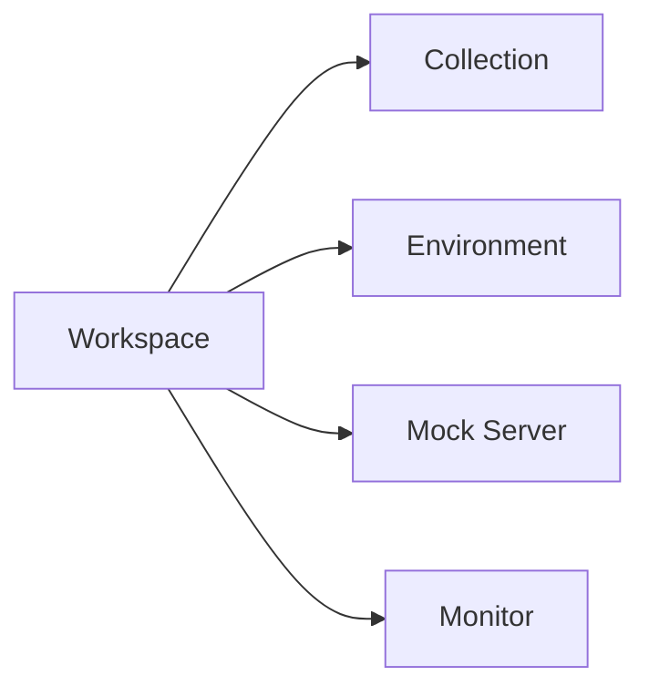
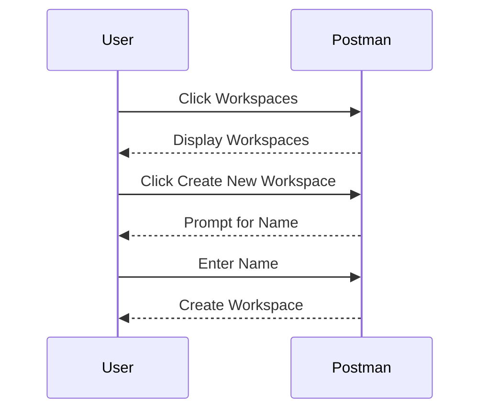
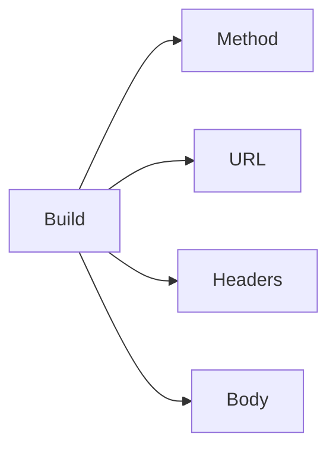
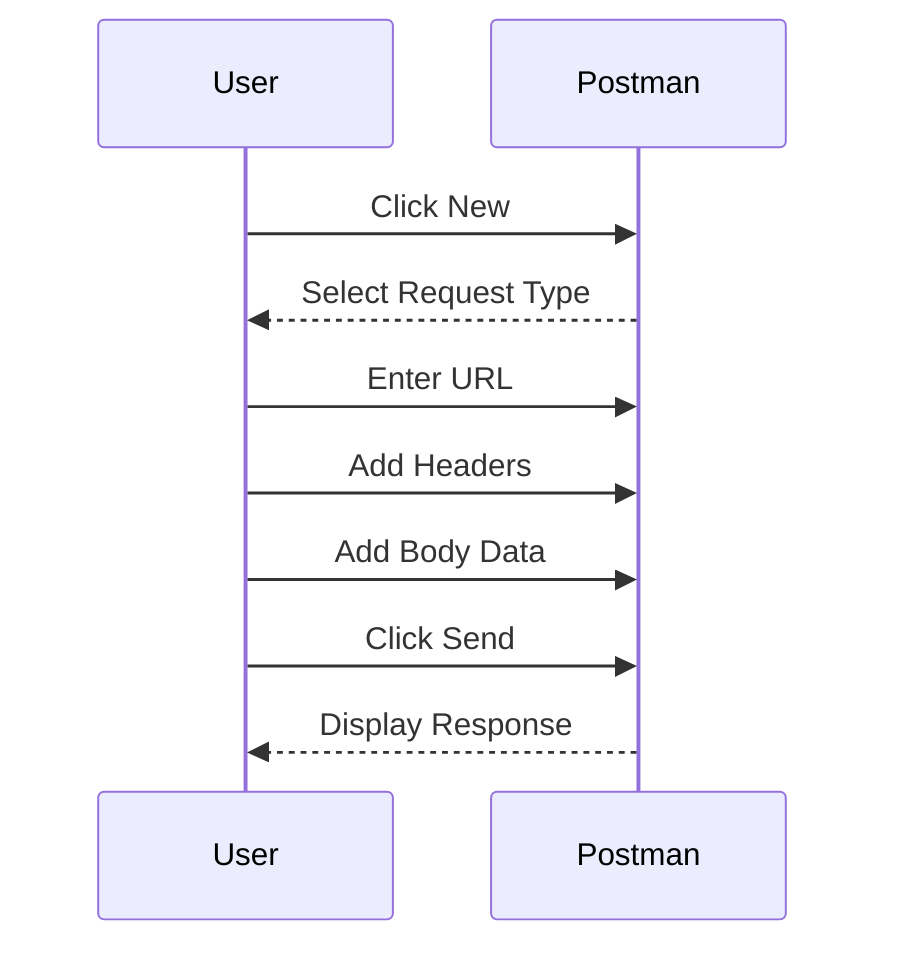
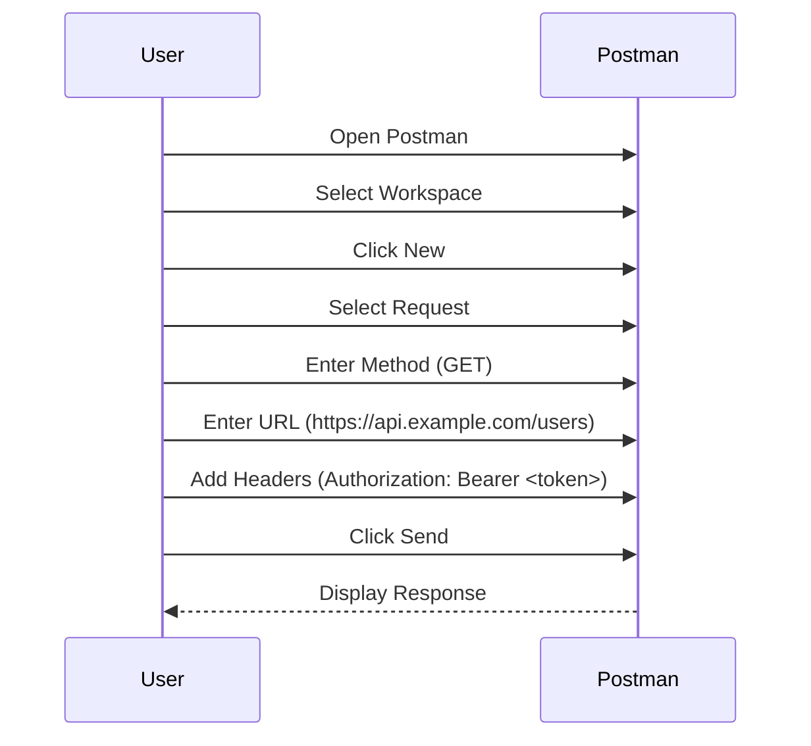
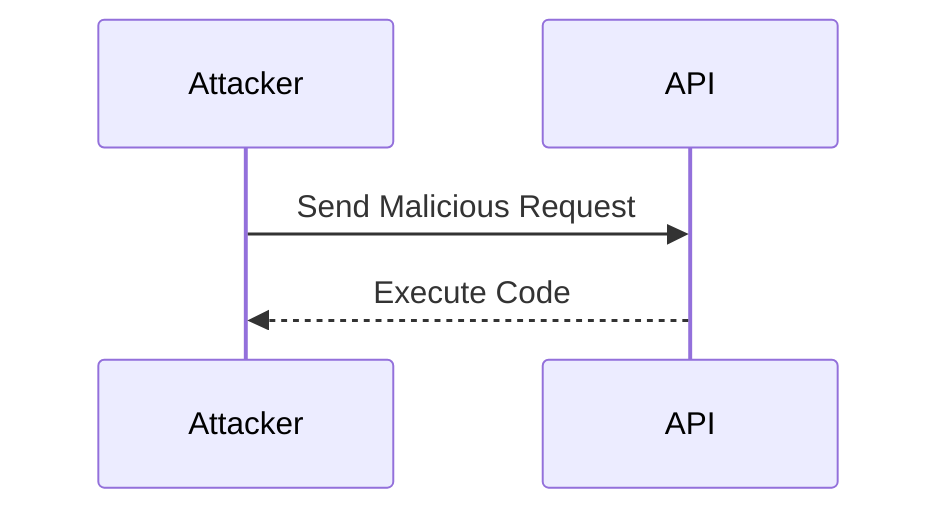

## Introduction to Postman for API Security Testing

Postman is a powerful tool used for testing APIs. It provides a user-friendly interface to send HTTP requests and analyze the responses. This chapter will delve into the various features and functionalities of Postman, focusing on how to use it effectively for API security testing. We will cover the UI components, navigation, and practical examples to ensure a comprehensive understanding.

### Understanding the Postman Interface

The Postman interface is divided into several sections, each serving a specific purpose. These sections include:

- **Workspace**: A container for your collections, environments, and other resources.
- **Build**: A section where you can create and send HTTP requests.
- **Browse**: A section where you can manage and organize your collections.
- **Console**: A section where you can see the output of your requests and responses.

#### Workspace

A workspace in Postman is a container for your collections, environments, and other resources. You can think of it as a project folder where you store all your API-related work.



**Creating a Workspace**

To create a new workspace, follow these steps:

1. Click on the "Workspaces" button in the left sidebar.
2. Click on the "Create New Workspace" button.
3. Enter a name for your workspace and click "Create".



#### Build Section

The Build section is where you create and send HTTP requests. Here, you can specify the method (GET, POST, PUT, DELETE, etc.), URL, headers, and body of the request.



**Creating an HTTP Request**

To create an HTTP request, follow these steps:

1. Click on the "New" button in the Build section.
2. Select the type of request (GET, POST, etc.).
3. Enter the URL of the API endpoint.
4. Add any necessary headers and body data.
5. Click "Send" to execute the request.



### Practical Example: Sending a GET Request

Let's walk through an example of sending a GET request to an API endpoint using Postman.

#### Step-by-Step Guide

1. **Open Postman**: Launch the Postman application.
2. **Select Workspace**: Choose the workspace where you want to create the request.
3. **Create a New Request**: Click on the "New" button and select "Request".
4. **Enter Request Details**:
    - **Method**: GET
    - **URL**: `https://api.example.com/users`
    - **Headers**: Add any necessary headers (e.g., `Authorization: Bearer <token>`).



#### Full HTTP Request and Response

Here is the full HTTP request and response for the GET request:

```http
GET https://api.example.com/users HTTP/1.1
Host: api.example.com
Authorization: Bearer <token>
```

```http
HTTP/1.1 200 OK
Content-Type: application/json
Date: Mon, 01 Jan 2024 00:00:00 GMT
Content-Length: 123

{
    "users": [
        {
            "id": 1,
            "name": "John Doe",
            "email": "john.doe@example.com"
        },
        {
            "id": 2,
            "name": "Jane Smith",
            "email": "jane.smith@example.com"
        }
    ]
}
```

### Common Pitfalls and Best Practices

When using Postman for API security testing, it's important to be aware of common pitfalls and follow best practices to ensure effective testing.

#### Common Pitfalls

1. **Incorrect Headers**: Forgetting to include necessary headers such as `Authorization` can lead to unauthorized access issues.
2. **Sensitive Data Exposure**: Accidentally exposing sensitive data in the request or response can lead to security vulnerabilities.
3. **Inconsistent Testing**: Not testing all possible scenarios and edge cases can result in missed vulnerabilities.

#### Best Practices

1. **Use Environments**: Store environment variables (like API keys) in Postman environments to avoid hardcoding them in requests.
2. **Test All Scenarios**: Ensure you test all possible scenarios, including edge cases and error conditions.
3. **Review Responses**: Carefully review the responses to identify any potential security issues.

### Real-World Examples and Recent Breaches

Recent breaches and CVEs often involve API security issues. For example, the 2021 breach of a popular social media platform was partly due to an insecure API endpoint that allowed unauthorized access to user data.

#### CVE Example: CVE-2021-3129

CVE-2021-3129 is a vulnerability in the Apache Struts framework that allows remote code execution via a specially crafted Content-Type header. This vulnerability could be exploited by sending a malicious request to an affected API endpoint.



### How to Prevent / Defend Against API Security Issues

To prevent and defend against API security issues, follow these steps:

1. **Validate Input**: Always validate input data to prevent injection attacks.
2. **Use Secure Protocols**: Ensure that all API endpoints use secure protocols like HTTPS.
3. **Implement Authentication and Authorization**: Use strong authentication mechanisms and enforce proper authorization checks.
4. **Regularly Test and Audit**: Regularly test and audit your APIs to identify and mitigate security vulnerabilities.

#### Secure Coding Fixes

Here is an example of a vulnerable API endpoint and its secure counterpart:

**Vulnerable Code**

```python
@app.route('/users/<int:user_id>', methods=['GET'])
def get_user(user_id):
    user = db.query(User).filter_by(id=user_id).first()
    return jsonify(user.to_dict())
```

**Secure Code**

```python
@app.route('/users/<int:user_id>', methods=['GET'])
@auth_required
def get_user(user_id):
    user = db.query(User).filter_by(id=user_id).first()
    if not user:
        abort(404)
    return jsonify(user.to_dict())
```

### Conclusion

Postman is a powerful tool for testing APIs, providing a user-friendly interface to send HTTP requests and analyze responses. By understanding the various features and functionalities of Postman, you can effectively perform API security testing. Remember to follow best practices and regularly test and audit your APIs to ensure their security.

### Practice Labs

For hands-on practice with API security testing using Postman, consider the following labs:

- **PortSwigger Web Security Academy**: Offers interactive labs for learning web security concepts, including API security.
- **OWASP Juice Shop**: A deliberately insecure web application for practicing web security skills, including API testing.
- **DVWA (Damn Vulnerable Web Application)**: A PHP/MySQL web application that is riddled with vulnerabilities for educational purposes.

These labs provide real-world scenarios and challenges to help you master API security testing with Postman.

---
<!-- nav -->
[[API Security/04-Using Postman tool for API Security Testing/07-Postman Navigation/01-Introduction to API Security Testing with Postman|Introduction to API Security Testing with Postman]] | [[API Security/04-Using Postman tool for API Security Testing/07-Postman Navigation/00-Overview|Overview]] | [[03-Sidebar Navigation in Postman|Sidebar Navigation in Postman]]
