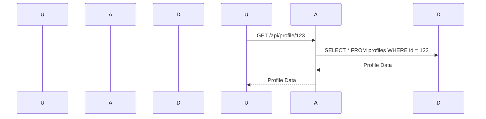
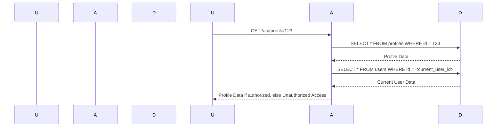

## Introduction to Broken Object-Level Authorization

Broken Object-Level Authorization (BOLA) is a critical vulnerability within the realm of API security. This vulnerability occurs when an API fails to properly restrict access to resources based on the identity of the requesting user. In essence, BOLA allows unauthorized users to access sensitive data or perform actions that should be restricted to specific roles or identities.

### What is Object-Level Authorization?

Object-Level Authorization refers to the process of ensuring that a user can only access or modify resources that they are explicitly authorized to interact with. This is different from Role-Based Access Control (RBAC), which grants permissions based on a user’s role within the system. Object-Level Authorization ensures that even if a user has the correct role, they cannot access resources that do not belong to them.

### Why is Object-Level Authorization Important?

Without proper Object-Level Authorization, an attacker could potentially access sensitive information or perform actions that they should not be allowed to do. This can lead to data breaches, unauthorized modifications, and other serious security issues. For instance, an attacker might be able to view or modify records that belong to other users, leading to privacy violations and potential legal ramifications.

### Real-World Example: CVE-2021-21972

One real-world example of BOLA is CVE-2021-21972, which affected the popular open-source project Keycloak. In this case, an attacker could bypass Object-Level Authorization by manipulating the `id` parameter in certain API calls. This allowed the attacker to access and modify resources that belonged to other users, leading to a significant security breach.

### How Does BOLA Work?

To understand how BOLA works, let's consider a simple example. Suppose we have an API that manages user profiles. Each profile has a unique identifier (`profile_id`). A typical API endpoint might look like this:

```http
GET /api/profile/{profile_id}
```

If the API does not properly check whether the requesting user is authorized to access the specified `profile_id`, an attacker could simply change the `profile_id` to access other users' profiles.

### Steps to Identify BOLA Vulnerabilities

Identifying BOLA vulnerabilities requires a thorough understanding of the business logic and the relationships between resources. Here are the steps to identify such vulnerabilities:

1. **Understand the Business Logic**: Analyze the application’s business logic to determine which resources are private and which are public.
2. **Identify API Endpoints**: List all API endpoints that receive object IDs from the client.
3. **Check Authorization Mechanisms**: Ensure that each endpoint properly checks whether the requesting user is authorized to access the specified object ID.
4. **Test with Different User Roles**: Test the API with different user roles to ensure that unauthorized access is prevented.

### Example Scenario

Let's consider an example scenario where an API manages user profiles. The API has the following endpoint:

```http
GET /api/profile/{profile_id}
```

#### Vulnerable Code

Here is a vulnerable implementation of the `/api/profile/{profile_id}` endpoint:

```python
@app.route('/api/profile/<int:profile_id>', methods=['GET'])
def get_profile(profile_id):
    # Fetch the profile from the database
    profile = Profile.query.get(profile_id)
    
    if profile:
        return jsonify(profile.to_dict())
    else:
        return jsonify({"error": "Profile not found"}), 404
```

In this implementation, the API simply fetches the profile from the database using the provided `profile_id` and returns it. There is no check to ensure that the requesting user is authorized to access the specified profile.

#### Secure Code

To secure this endpoint, we need to add an authorization check. Here is the secure implementation:

```python
@app.route('/api/profile/<int:profile_id>', methods=['GET'])
@jwt_required()
def get_profile(profile_id):
    current_user = get_jwt_identity()
    
    # Fetch the profile from the database
    profile = Profile.query.get(profile_id)
    
    if profile and profile.user_id == current_user['id']:
        return jsonify(profile.to_dict())
    else:
        return jsonify({"error": "Unauthorized access"}), 403
```

In this secure implementation, we first retrieve the current user’s identity using the JWT token. We then check if the `profile_id` belongs to the current user before returning the profile.

### Mermaid Diagram: Request Flow

Let's visualize the request flow using a mermaid diagram:



This diagram shows the flow of a request from the user to the API and then to the database. However, it does not include the authorization check.

### Adding Authorization Check

Now, let's add the authorization check to the diagram:



This updated diagram includes the additional step of checking the current user’s identity against the profile’s owner.

### Common Pitfalls

When implementing Object-Level Authorization, there are several common pitfalls to avoid:

1. **Hardcoding Authorization Checks**: Avoid hardcoding authorization checks within each API endpoint. Instead, use middleware or decorators to handle authorization.
2. **Ignoring Edge Cases**: Ensure that all edge cases are handled, such as when a user tries to access a non-existent resource or when the user is not authenticated.
3. **Over-relying on RBAC**: While RBAC is useful, it should not be the sole mechanism for authorization. Object-Level Authorization provides an additional layer of security.

### How to Prevent / Defend Against BOLA

#### Detection

To detect BOLA vulnerabilities, you can use automated tools and manual testing:

1. **Automated Tools**: Use tools like Burp Suite, OWASP ZAP, or commercial security scanners to test API endpoints for authorization vulnerabilities.
2. **Manual Testing**: Perform manual testing by changing object IDs and verifying that unauthorized access is prevented.

#### Prevention

To prevent BOLA vulnerabilities, follow these best practices:

1. **Implement Proper Authorization Checks**: Ensure that each API endpoint properly checks whether the requesting user is authorized to access the specified object ID.
2. **Use Middleware or Decorators**: Use middleware or decorators to handle authorization checks, rather than hardcoding them within each endpoint.
3. **Enforce Least Privilege Principle**: Ensure that users are granted the minimum level of access necessary to perform their tasks.

#### Secure Coding Practices

Here is an example of secure coding practices for handling Object-Level Authorization:

```python
from flask import Flask, jsonify, request
from flask_jwt_extended import jwt_required, get_jwt_identity

app = Flask(__name__)

@app.route('/api/profile/<int:profile_id>', methods=['GET'])
@jwt_required()
def get_profile(profile_id):
    current_user = get_jwt_identity()
    
    # Fetch the profile from the database
    profile = Profile.query.get(profile_id)
    
    if profile and profile.user_id == current_user['id']:
        return jsonify(profile.to_dict())
    else:
        return jsonify({"error": "Unauthorized access"}), 403
```

In this example, we use the `@jwt_required()` decorator to ensure that the user is authenticated. We then retrieve the current user’s identity and check if the `profile_id` belongs to the current user.

### Configuration Hardening

To further harden the configuration, consider the following:

1. **Enable Strict Transport Security (HSTS)**: Ensure that all API requests are made over HTTPS to prevent man-in-the-middle attacks.
2. **Configure CORS Policies**: Configure Cross-Origin Resource Sharing (CORS) policies to restrict which domains can access your API.
3. **Use Content Security Policy (CSP)**: Implement a Content Security Policy to prevent cross-site scripting (XSS) attacks.

### Hands-On Labs

For hands-on practice with BOLA vulnerabilities, consider the following labs:

- **PortSwigger Web Security Academy**: Offers a series of labs that cover various API security vulnerabilities, including BOLA.
- **OWASP Juice Shop**: Provides a vulnerable web application that includes API endpoints with BOLA vulnerabilities.
- **DVWA (Damn Vulnerable Web Application)**: Includes a variety of web application vulnerabilities, including BOLA.

These labs provide practical experience in identifying and preventing BOLA vulnerabilities.

### Conclusion

Broken Object-Level Authorization is a critical vulnerability that can lead to significant security breaches. By understanding the principles of Object-Level Authorization, identifying potential vulnerabilities, and implementing proper security measures, you can protect your API from unauthorized access. Always ensure that each API endpoint properly checks whether the requesting user is authorized to access the specified object ID, and use middleware or decorators to handle authorization checks. Regularly test your API using automated tools and manual testing to detect and prevent BOLA vulnerabilities.

---
<!-- nav -->
[[03-Introduction to Broken Object-Level Authorization (BOLA)|Introduction to Broken Object-Level Authorization (BOLA)]] | [[API Security/05-OWASP API TOP 10/01-API1 Broken Object Level Authorization/00-Overview|Overview]] | [[05-Overview of Broken Object Level Authorization|Overview of Broken Object Level Authorization]]
