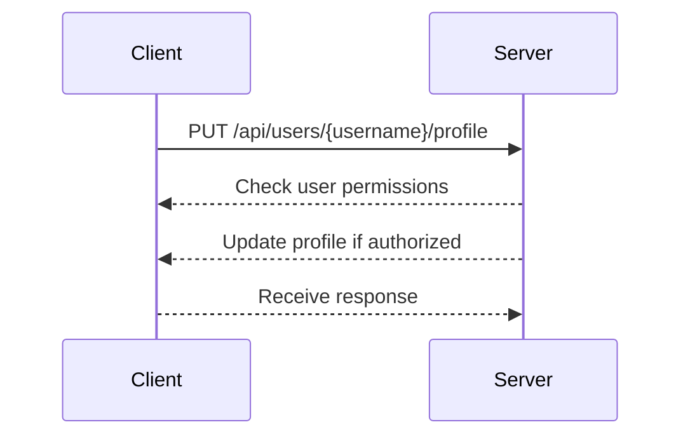

## Overview of Broken Object Level Authorization

Broken Object Level Authorization (BOLA) is a critical security issue within APIs that occurs when an API endpoint allows unauthorized access to resources based on user input. This vulnerability arises when the API does not properly validate whether the requesting user has the necessary permissions to access or modify specific objects or resources. 

### Why BOLA Matters

APIs are often designed to handle various types of requests, including those that involve sensitive data such as user profiles, financial records, or administrative controls. If an attacker can manipulate the input parameters to gain unauthorized access to these resources, they can potentially steal, modify, or delete sensitive data. This can lead to significant security breaches, loss of trust, and legal consequences for the organization.

### How BOLA Works Under the Hood

To understand BOLA, consider an API endpoint that allows users to update their profiles. The endpoint might look something like this:

```http
PUT /api/users/{username}/profile
```

In a typical scenario, the API should verify that the authenticated user is indeed the owner of the `username` parameter before allowing any modifications. However, if the API fails to perform this validation correctly, an attacker could manipulate the `username` parameter to target another user’s profile.

#### Example Scenario

Let's break down the example provided in the transcript:

1. **Initial Request**:
    - The user sends a request to update their profile using their own username.
    - The API returns a successful response indicating that the operation was completed.

2. **Manipulation Attempt**:
    - The user tries to change the `username` parameter to another user’s name.
    - The API should reject this request if the user does not have the necessary permissions.

3. **Security Implications**:
    - If the API does not properly validate the user’s permissions, the attacker could successfully modify another user’s profile.

### Real-World Examples

Recent breaches and vulnerabilities related to BOLA include:

- **CVE-2021-21972**: This vulnerability in the WordPress REST API allowed attackers to bypass authorization checks and modify posts and pages.
- **CVE-2022-22965**: A vulnerability in the Jenkins CI/CD platform allowed unauthorized access to sensitive configuration files due to improper authorization checks.

These examples highlight the importance of proper authorization mechanisms in APIs to prevent unauthorized access.

### Detailed Explanation with Code Examples

Consider an API endpoint that allows users to update their profile information:

```http
PUT /api/users/{username}/profile
Content-Type: application/json

{
  "email": "new.email@example.com",
  "phone": "123-456-7890"
}
```

#### Vulnerable Code Example

Here is a simplified example of a vulnerable API implementation:

```python
@app.route('/api/users/<username>/profile', methods=['PUT'])
def update_profile(username):
    data = request.get_json()
    user = User.query.filter_by(username=username).first()
    if user:
        user.email = data['email']
        user.phone = data['phone']
        db.session.commit()
        return jsonify({"success": True})
    else:
        return jsonify({"success": False}), 404
```

In this example, the API endpoint updates the profile information for the specified `username`. However, it does not check whether the authenticated user has the necessary permissions to modify the profile.

#### Secure Code Example

To prevent BOLA, the API should verify the user’s permissions before allowing any modifications:

```python
@app.route('/api/users/<username>/profile', methods=['PUT'])
@login_required
def update_profile(username):
    data = request.get_json()
    current_user = get_current_user()  # Function to retrieve the currently authenticated user
    if current_user.username == username:
        user = User.query.filter_by(username=username).first()
        if user:
            user.email = data['email']
            user.phone = data['phone']
            db.session.commit()
            return jsonify({"success": True})
        else:
            return jsonify({"success": False}), 404
    else:
        return jsonify({"success": False}), 403
```

In this secure implementation, the API first checks whether the authenticated user (`current_user`) is the owner of the `username` parameter. Only if the user is authorized, the profile information is updated.

### Mermaid Diagrams

#### Sequence Diagram

A sequence diagram can help visualize the interaction between the client and the server during a profile update request:



### Common Pitfalls and Detection

#### Common Pitfalls

1. **Insufficient Input Validation**: Failing to validate user input can lead to unauthorized access.
2. **Hardcoded Permissions**: Hardcoding permissions without dynamic checks can result in security vulnerabilities.
3. **Improper Error Handling**: Inadequate error handling can reveal sensitive information to attackers.

#### Detection

To detect BOLA vulnerabilities, organizations can use automated tools and manual testing techniques:

- **Static Application Security Testing (SAST)**: Tools like SonarQube and Fortify can analyze code for potential authorization issues.
- **Dynamic Application Security Testing (DAST)**: Tools like Burp Suite and OWASP ZAP can simulate attacks to identify vulnerabilities.
- **Manual Penetration Testing**: Experienced security testers can manually test APIs to uncover hidden vulnerabilities.

### How to Prevent / Defend

#### Prevention Strategies

1. **Proper Authorization Checks**: Always validate user permissions before allowing any modifications.
2. **Use Role-Based Access Control (RBAC)**: Implement RBAC to ensure that users have the appropriate permissions based on their roles.
3. **Least Privilege Principle**: Grant users the minimum level of access required to perform their tasks.

#### Secure Coding Practices

1. **Input Validation**: Validate all user inputs to ensure they meet expected criteria.
2. **Error Handling**: Implement robust error handling to prevent information leakage.
3. **Logging and Monitoring**: Log and monitor API activities to detect and respond to suspicious behavior.

#### Configuration Hardening

1. **Secure API Endpoints**: Ensure that all API endpoints are properly secured with authentication and authorization mechanisms.
2. **Rate Limiting**: Implement rate limiting to prevent abuse of API endpoints.
3. **Secure Communication**: Use HTTPS to encrypt communication between clients and servers.

### Complete Example

#### Full HTTP Request and Response

Here is a complete example of a profile update request and response:

```http
PUT /api/users/offensivehunter/profile HTTP/1.1
Host: example.com
Content-Type: application/json
Authorization: Bearer <access_token>

{
  "email": "new.email@example.com",
  "phone": "123-456-7890"
}

HTTP/1.1 200 OK
Content-Type: application/json

{
  "success": true,
  "message": "Profile updated successfully"
}
```

#### Expected Result

The API should return a successful response if the user is authorized to update the profile. Otherwise, it should return an error response.

### Hands-On Labs

For hands-on practice, consider the following labs:

- **PortSwigger Web Security Academy**: Offers interactive labs to practice identifying and exploiting BOLA vulnerabilities.
- **OWASP Juice Shop**: Provides a vulnerable web application to practice security testing and exploitation techniques.
- **DVWA (Damn Vulnerable Web Application)**: Another popular web application for practicing security testing.

By thoroughly understanding and implementing proper authorization mechanisms, organizations can significantly reduce the risk of BOLA vulnerabilities and protect sensitive data.

---
<!-- nav -->
[[04-Introduction to Broken Object-Level Authorization|Introduction to Broken Object-Level Authorization]] | [[API Security/05-OWASP API TOP 10/01-API1 Broken Object Level Authorization/00-Overview|Overview]] | [[06-Overview of Broken Object-Level Authorization|Overview of Broken Object-Level Authorization]]
