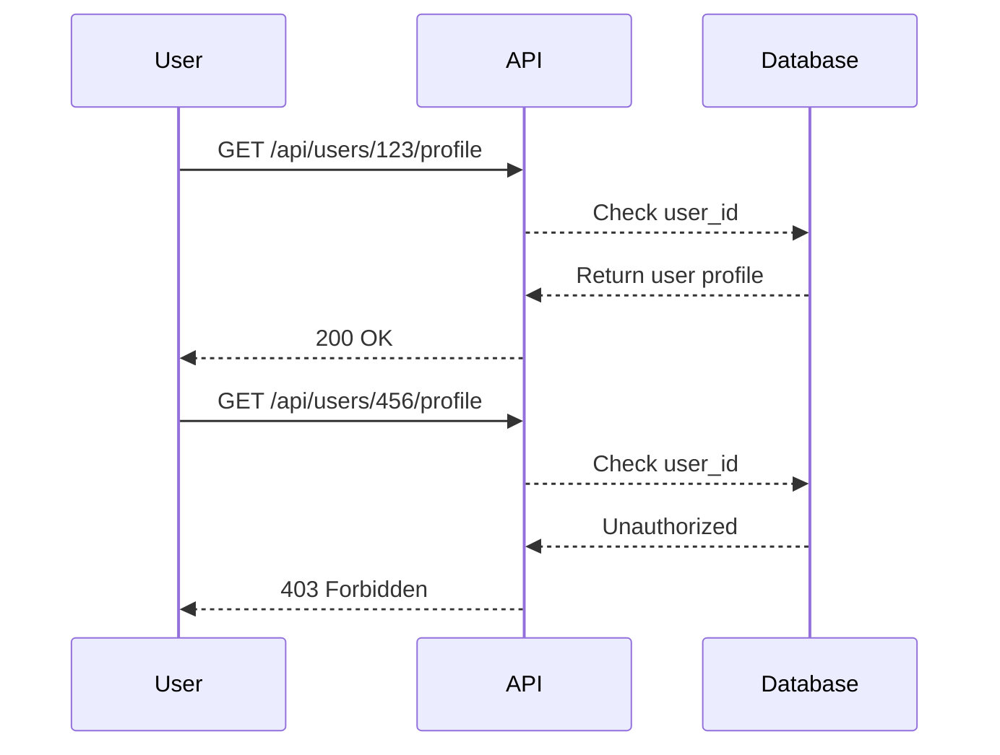
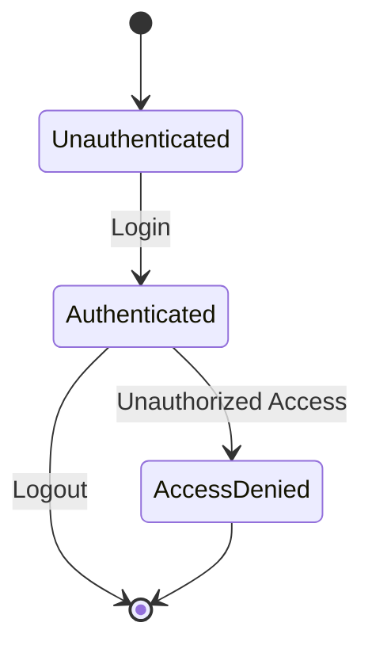

## Overview of Broken Object-Level Authorization

Broken Object-Level Authorization (BOLA) is a critical vulnerability that occurs when an application fails to properly restrict access to resources based on user permissions. This means that users can manipulate identifiers in requests to gain unauthorized access to sensitive data or perform actions they should not be permitted to do. This vulnerability is ranked as one of the top issues in the OWASP API Security Top 10 due to its prevalence and potential impact.

### What is Broken Object-Level Authorization?

Broken Object-Level Authorization refers to a situation where an application does not enforce proper access controls at the object level. In other words, the application allows users to access or modify objects (such as records in a database) that they should not have access to. This typically happens when the application relies solely on URL parameters or other easily manipulated inputs to determine which objects a user can access.

#### Why Does BOLA Matter?

BOLA is significant because it can lead to severe security breaches. If an attacker can manipulate object identifiers, they can access sensitive data or perform actions that could compromise the integrity and confidentiality of the system. For example, an attacker might be able to view another user’s financial details or modify their account settings.

### How Does BOLA Work Under the Hood?

To understand how BOLA works, consider a typical scenario where a user accesses a resource through an API endpoint. The endpoint might look something like this:

```
GET /api/users/{userId}/profile
```

In this case, `{userId}` is a parameter that identifies the user whose profile is being accessed. If the application does not properly validate whether the current user is authorized to access the specified `userId`, an attacker can simply change the `userId` to access profiles of other users.

#### Example Scenario

Let's break down the example provided in the lecture:

1. **Initial Request**:
    - User sends a request to `/api/users/{userId}/verify-email`.
    - The request includes the `userId` parameter.
    - The application checks if the current user is authorized to access the specified `userId`.

2. **Exploitation**:
    - An attacker changes the `userId` parameter to a different value.
    - The application does not properly validate the new `userId`.
    - The attacker gains unauthorized access to another user’s email verification status.

Here is a more detailed breakdown using a hypothetical API:

```http
GET /api/users/123/verify-email HTTP/1.1
Host: example.com
Authorization: Bearer <access_token>
```

If the application does not check whether the user associated with `<access_token>` is authorized to access `userId=123`, an attacker can change `123` to any other valid `userId` and gain unauthorized access.

### Real-World Examples

Several real-world vulnerabilities have been identified due to BOLA. Here are some notable examples:

1. **CVE-2021-21972**: A vulnerability in the WordPress REST API allowed attackers to bypass authorization checks and access sensitive data. This was due to improper validation of user IDs in certain API endpoints.

2. **CVE-2020-14182**: A vulnerability in the Shopify API allowed attackers to access customer data by manipulating object identifiers. This was caused by insufficient access control mechanisms.

These examples highlight the importance of implementing robust access control mechanisms to prevent such vulnerabilities.

### Detection and Prevention

#### How to Detect BOLA

Detecting BOLA involves analyzing API endpoints and ensuring that proper access controls are in place. Here are some steps to detect BOLA:

1. **Review API Endpoints**: Identify all API endpoints that accept user IDs or other identifying parameters.
2. **Check Access Control Mechanisms**: Ensure that each endpoint properly validates whether the current user is authorized to access the specified object.
3. **Penetration Testing**: Use tools like Burp Suite or Postman to manually test endpoints by changing object identifiers and observing the responses.

#### How to Prevent BOLA

Preventing BOLA requires implementing strong access control mechanisms. Here are some best practices:

1. **Validate User Permissions**: Always validate whether the current user is authorized to access the specified object. This should be done server-side, not client-side.
2. **Use Role-Based Access Control (RBAC)**: Implement RBAC to ensure that users can only access objects based on their roles and permissions.
3. **Audit Logs**: Maintain audit logs to track access attempts and detect any unauthorized access.

### Secure Coding Fixes

Here is an example of how to implement proper access control in a hypothetical API:

#### Vulnerable Code

```python
@app.route('/api/users/<int:user_id>/profile', methods=['GET'])
def get_user_profile(user_id):
    user = User.query.get(user_id)
    return jsonify(user.profile)
```

In this code, the application retrieves the user profile based on the `user_id` parameter without checking if the current user is authorized to access it.

#### Secure Code

```python
from flask import abort

@app.route('/api/users/<int:user_id>/profile', methods=['GET'])
@jwt_required()
def get_user_profile(user_id):
    current_user_id = get_jwt_identity()
    if current_user_id != user_id:
        abort(403, description="Access denied")
    
    user = User.query.get(user_id)
    return jsonify(user.profile)
```

In the secure version, the application checks if the `current_user_id` matches the `user_id` parameter. If they do not match, the application returns a `403 Forbidden` error.

### Configuration Hardening

Configuration hardening involves ensuring that your application’s configuration files and settings are secure. Here are some steps to harden your configuration:

1. **Disable Debug Mode**: Ensure that debug mode is disabled in production environments.
2. **Secure Environment Variables**: Store sensitive information such as API keys and secrets in environment variables rather than hardcoding them.
3. **Use HTTPS**: Ensure that all API endpoints are served over HTTPS to protect data in transit.

### Complete Example

Here is a complete example of an API endpoint with proper access control:

#### Vulnerable API Endpoint

```http
GET /api/users/123/profile HTTP/1.1
Host: example.com
Authorization: Bearer <access_token>
```

Response:

```http
HTTP/1.1 200 OK
Content-Type: application/json

{
  "name": "John Doe",
  "email": "john@example.com"
}
```

#### Secure API Endpoint

```http
GET /api/users/123/profile HTTP/1.1
Host: example.com
Authorization: Bearer <access_token>
```

Response:

```http
HTTP/1.1 403 Forbidden
Content-Type: application/json

{
  "error": "Access denied"
}
```

### Mermaid Diagrams

#### Sequence Diagram



#### State Machine Diagram



### Practice Labs

For hands-on practice with BOLA, consider the following labs:

- **PortSwigger Web Security Academy**: Offers interactive labs on API security, including BOLA.
- **OWASP Juice Shop**: Provides a vulnerable web application for practicing various security attacks, including BOLA.
- **DVWA (Damn Vulnerable Web Application)**: Another popular platform for learning web security through practical exercises.

By thoroughly understanding and implementing the principles discussed here, you can significantly reduce the risk of BOLA in your applications.

---
<!-- nav -->
[[05-Overview of Broken Object Level Authorization|Overview of Broken Object Level Authorization]] | [[API Security/05-OWASP API TOP 10/01-API1 Broken Object Level Authorization/00-Overview|Overview]] | [[07-Broken Object-Level Authorization (BOLA)|Broken Object-Level Authorization (BOLA)]]
