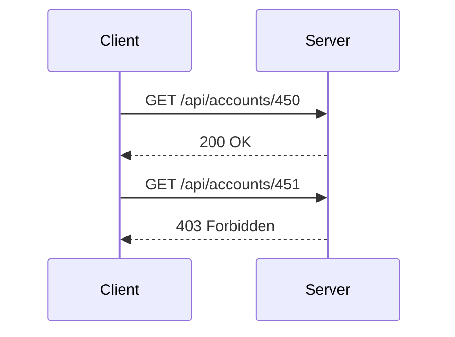
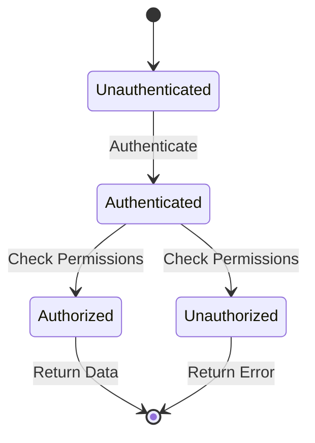

## Broken Object-Level Authorization (BOLA)

### Introduction

Broken Object-Level Authorization (BOLA), also known as Insecure Direct Object References (IDOR), is a critical vulnerability in API security. This issue arises when an application fails to properly restrict access to sensitive objects based on user permissions. An object could be a database record, a file, or any other resource that the application manages. The core problem is that attackers can manipulate object identifiers to gain unauthorized access to sensitive data.

### Understanding BOLA

#### What is BOLA?

BOLA occurs when an application exposes object identifiers (IDs) that can be manipulated by an attacker to access unauthorized resources. For instance, consider an API endpoint `/api/accounts/{id}` where `{id}` is a parameter that specifies which account information to retrieve. If the application does not verify whether the requesting user has the necessary permissions to access the specified account, an attacker could simply change the `id` value to access other users' accounts.

#### Why Does BOLA Matter?

BOLA is significant because it can lead to unauthorized access to sensitive data, such as financial information, personal details, or confidential business records. This can result in data breaches, identity theft, and other serious security incidents. Moreover, it undermines the trust users place in the application and can have severe legal and financial consequences for the organization.

### How BOLA Works

#### Example Scenario

Let's delve deeper into the scenario described in the lecture:

- **Resources**: Assume we have a database of financial accounts.
- **API Call**: An authenticated user makes an API call to retrieve information about a specific account using an ID.
- **Vulnerability**: If the API does not validate whether the user has the right to access the specified account, an attacker can manipulate the ID to access other accounts.

#### Detailed Explanation

Consider the following API endpoint:

```http
GET /api/accounts/{id}
```

Here, `{id}` is a parameter that specifies which account to retrieve. Suppose the user is authenticated but the API does not check whether the user has the right to access the specified account. An attacker can exploit this by changing the `id` value to access other accounts.

For example, if the user is supposed to access account `450`, the attacker might change the `id` to `451` or any other valid account ID to access unauthorized data.

### Real-World Examples

#### Recent Breaches and CVEs

Several high-profile breaches have been attributed to BOLA vulnerabilities:

- **CVE-2021-21972**: A vulnerability in the WordPress REST API allowed attackers to bypass authentication and access sensitive data by manipulating object IDs.
- **CVE-2022-22965**: A vulnerability in the Microsoft Exchange Server allowed attackers to access internal emails and documents by manipulating object references.

These examples highlight the severity of BOLA and the importance of proper authorization checks.

### Code Examples

#### Vulnerable Code

Consider the following Python Flask API endpoint that retrieves account information based on an ID:

```python
from flask import Flask, jsonify, request

app = Flask(__name__)

# Simulated database
accounts = {
    450: {"name": "John Doe", "balance": 1000},
    451: {"name": "Jane Smith", "balance": 2000},
}

@app.route('/api/accounts/<int:id>', methods=['GET'])
def get_account(id):
    if id in accounts:
        return jsonify(accounts[id])
    else:
        return jsonify({"error": "Account not found"}), 404

if __name__ == '__main__':
    app.run(debug=True)
```

In this example, the API endpoint `/api/accounts/{id}` returns the account information for the specified `id`. However, there is no check to ensure that the requesting user has the right to access the specified account.

#### Full HTTP Request and Response

**Request:**

```http
GET /api/accounts/450 HTTP/1.1
Host: localhost:5000
Authorization: Bearer <valid_token>
```

**Response:**

```http
HTTP/1.1 200 OK
Content-Type: application/json

{
    "name": "John Doe",
    "balance": 1000
}
```

**Attacker's Request:**

```http
GET /api/accounts/451 HTTP/1.1
Host: localhost:5000
Authorization: Bearer <valid_token>
```

**Attacker's Response:**

```http
HTTP/1.1 200 OK
Content-Type: application/json

{
    "name": "Jane Smith",
    "balance": 2000
}
```

### How to Prevent / Defend

#### Secure Coding Practices

To prevent BOLA, it is essential to implement proper authorization checks. Here are some steps to follow:

1. **Validate User Permissions**: Ensure that the user has the necessary permissions to access the specified object.
2. **Use Role-Based Access Control (RBAC)**: Implement RBAC to manage user permissions based on roles.
3. **Audit Logs**: Maintain detailed audit logs to track access attempts and detect suspicious activity.

#### Corrected Code

Here is the corrected version of the previous code snippet with proper authorization checks:

```python
from flask import Flask, jsonify, request

app = Flask(__name__)

# Simulated database
accounts = {
    450: {"name": "John Doe", "balance": 1000},
    451: {"name": "Jane Smith", "balance": 2000},
}

# Simulated user roles
user_roles = {
    "john_doe": ["user"],
    "jane_smith": ["admin"]
}

@app.route('/api/accounts/<int:id>', methods=['GET'])
def get_account(id):
    user = request.headers.get('Authorization')
    if user in user_roles:
        if 'admin' in user_roles[user]:
            if id in accounts:
                return jsonify(accounts[id])
            else:
                return jsonify({"error": "Account not found"}), 404
        elif id == 450 and user == "john_doe":
            return jsonify(accounts[id])
        else:
            return jsonify({"error": "Unauthorized access"}), 403
    else:
        return jsonify({"error": "Invalid user"}), 401

if __name__ == '__main__':
    app.run(debug=True)
```

#### Full HTTP Request and Response

**Request:**

```http
GET /api/accounts/450 HTTP/1.1
Host: localhost:5000
Authorization: Bearer john_doe
```

**Response:**

```http
HTTP/1.1 200 OK
Content-Type: application/json

{
    "name": "John Doe",
    "balance": 1000
}
```

**Attacker's Request:**

```http
GET /api/accounts/451 HTTP/1.1
Host: localhost:5000
Authorization: Bearer john_doe
```

**Attacker's Response:**

```http
HTTP/1.1 403 Forbidden
Content-Type: application/json

{
    "error": "Unauthorized access"
}
```

### Mermaid Diagrams

#### Sequence Diagram

A sequence diagram can help visualize the interaction between the client and the server:



#### State Machine Diagram

A state machine diagram can illustrate the different states and transitions in the authorization process:



### Common Pitfalls

#### Trusting User Input

One common pitfall is trusting user input without proper validation. Always assume that user-provided data is malicious until proven otherwise.

#### Lack of Audit Logs

Another common mistake is not maintaining detailed audit logs. Audit logs are crucial for detecting and investigating unauthorized access attempts.

### Detection and Prevention

#### Detection

Detection involves monitoring access patterns and identifying unusual behavior. Tools like intrusion detection systems (IDS) and security information and event management (SIEM) systems can help detect BOLA attacks.

#### Prevention

Prevention involves implementing robust authorization mechanisms and conducting regular security audits. Automated tools like static application security testing (SAST) and dynamic application security testing (DAST) can help identify and mitigate BOLA vulnerabilities.

### Hands-On Labs

For hands-on practice with BOLA, consider the following labs:

- **PortSwigger Web Security Academy**: Offers interactive labs on API security, including BOLA.
- **OWASP Juice Shop**: Provides a vulnerable web application for practicing various security attacks, including BOLA.
- **DVWA (Damn Vulnerable Web Application)**: Another popular platform for learning web security, including BOLA.

### Conclusion

Broken Object-Level Authorization (BOLA) is a critical vulnerability in API security. By understanding the underlying principles, recognizing real-world examples, and implementing proper authorization checks, developers can significantly reduce the risk of unauthorized access to sensitive data. Regular security audits and the use of automated tools are essential for maintaining a secure API environment.

---
<!-- nav -->
[[06-Overview of Broken Object-Level Authorization|Overview of Broken Object-Level Authorization]] | [[API Security/05-OWASP API TOP 10/01-API1 Broken Object Level Authorization/00-Overview|Overview]] | [[08-Detailed Explanation of Broken Object-Level Authorization|Detailed Explanation of Broken Object-Level Authorization]]
