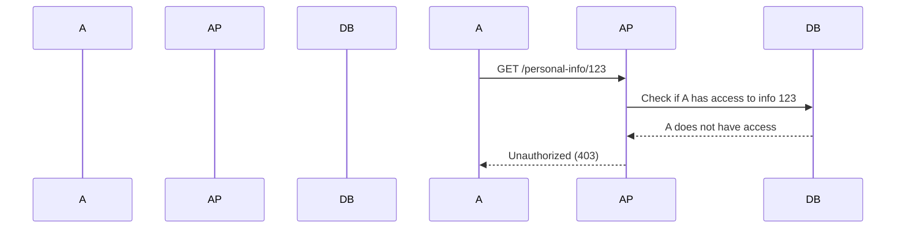
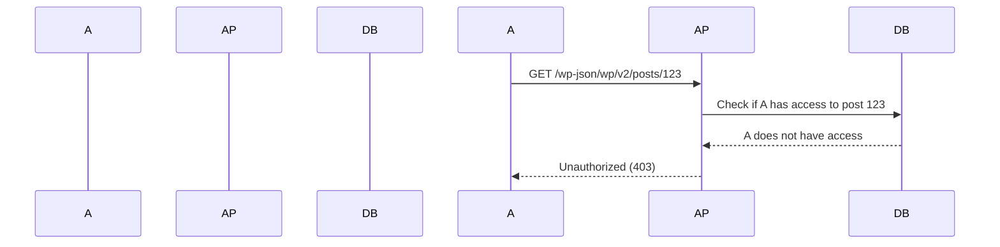

## Detailed Explanation of Broken Object-Level Authorization

### How Authorization Works Under the Hood

Authorization typically involves several components:

- **Authentication**: Verifying the identity of the user.
- **Role-Based Access Control (RBAC)**: Assigning roles to users and defining permissions based on those roles.
- **Attribute-Based Access Control (ABAC)**: Using attributes to determine access permissions dynamically.
- **Policy Enforcement**: Applying the defined policies to enforce access control.

### Common Pitfalls

#### Lack of Proper Role Assignment

If roles are not assigned correctly, users might end up with more permissions than they should have. For example, a user with a "guest" role might accidentally be given "admin" privileges.

#### Insufficient Attribute Checking

In ABAC systems, if the attributes are not checked thoroughly, users might bypass intended restrictions. For instance, a user might be allowed to access a document because the attribute check failed to consider all necessary conditions.

#### Inadequate Policy Enforcement

Even if roles and attributes are defined correctly, if the policies are not enforced effectively, users can still access unauthorized resources. This can happen due to bugs in the enforcement logic or misconfigurations.

### Real-World Example: Equifax Breach

The Equifax breach in 2017 involved a vulnerability in their API that allowed attackers to access sensitive personal information. The root cause was a combination of improper authorization controls and insufficient validation of user inputs.

### Real-World Example: WordPress REST API Vulnerability

CVE-2021-21972 involved a vulnerability in the WordPress REST API that allowed attackers to bypass authentication and access sensitive data. The issue was due to a flaw in the authorization mechanism, which did not properly restrict access to certain resources.

---
<!-- nav -->
[[07-Broken Object-Level Authorization (BOLA)|Broken Object-Level Authorization (BOLA)]] | [[API Security/05-OWASP API TOP 10/01-API1 Broken Object Level Authorization/00-Overview|Overview]] | [[09-How to Prevent  Defend Against Broken Object-Level Authorization|How to Prevent  Defend Against Broken Object-Level Authorization]]
