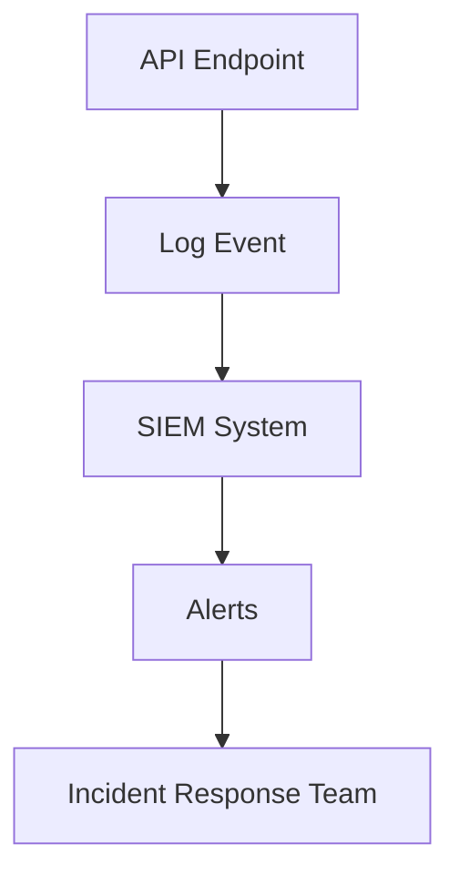
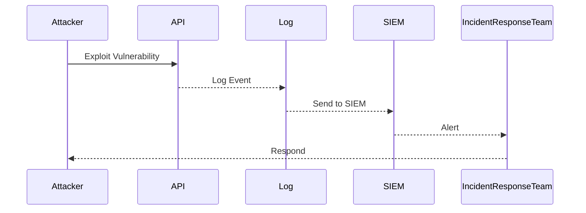

## Introduction to Insufficient Logging and Monitoring

Insufficient logging and monitoring is a critical aspect of API security that often goes overlooked but can have severe consequences. In the context of API security, insufficient logging and monitoring refers to the lack of proper mechanisms to track and alert on suspicious activities, which can allow attackers to operate undetected. This oversight can lead to significant data breaches and other security incidents, as attackers may exploit vulnerabilities without being noticed.

### What is Insufficient Logging and Monitoring?

Insufficient logging and monitoring occurs when an organization fails to implement adequate logging and monitoring practices. This includes:

- **Logging**: Recording events and activities within the system. Proper logging should capture detailed information about various operations, including API calls, user actions, and system events.
- **Monitoring**: Analyzing the logged data to detect anomalies and potential threats. Effective monitoring involves setting up alerts and notifications based on predefined criteria.

When these practices are insufficient, attackers can exploit vulnerabilities without being detected, leading to unauthorized access, data theft, and other malicious activities.

### Why Does Insufficient Logging and Monitoring Matter?

Proper logging and monitoring are essential for several reasons:

- **Detection of Attacks**: Without adequate logging and monitoring, it becomes difficult to identify and respond to security incidents promptly. Attackers can operate undetected, causing significant damage.
- **Incident Response**: Detailed logs provide valuable information for incident response teams to understand the extent of an attack and take appropriate actions.
- **Compliance**: Many regulatory frameworks require organizations to maintain detailed logs and monitor their systems to ensure compliance.

### How Does Insufficient Logging and Monitoring Work?

In a typical scenario, insufficient logging and monitoring can manifest in several ways:

- **Incomplete Logs**: Logs may not capture all necessary information, making it difficult to trace the origin and nature of an attack.
- **Manual Monitoring**: Relying solely on manual processes for monitoring can lead to delays and human errors, allowing attackers to slip through the cracks.
- **Lack of Integration**: Logs may not be integrated into security information and event management (SIEM) systems, reducing the effectiveness of automated monitoring and alerting.

### Real-World Example: 7-Eleven Japan Breach

One notable example of insufficient logging and monitoring is the 7-Eleven Japan breach involving the 7-Pay mobile payment application. The application had a vulnerable API for password reset, which required users to provide personal information such as date of birth, phone number, and email address. Due to insufficient logging and monitoring, attackers were able to exploit this vulnerability without being detected.

#### Vulnerable API Endpoint

The vulnerable API endpoint for password reset might look something like this:

```http
POST /api/reset-password HTTP/1.1
Host: api.7eleven.jp
Content-Type: application/json

{
  "dob": "1990-01-01",
  "phone_number": "1234567890",
  "email": "user@example.com"
}
```

#### Response

```http
HTTP/1.1 200 OK
Content-Type: application/json

{
  "status": "success",
  "message": "Password reset initiated"
}
```

### Impact of Insufficient Logging and Monitoring

The impact of insufficient logging and monitoring can be severe:

- **Data Breaches**: Attackers can steal sensitive data without being detected.
- **Reputation Damage**: Organizations may suffer reputational damage due to security incidents.
- **Financial Losses**: Data breaches can result in significant financial losses, including legal costs and compensation to affected individuals.

### How to Prevent / Defend Against Insufficient Logging and Monitoring

To prevent and defend against insufficient logging and monitoring, organizations should implement the following measures:

#### Secure Coding Practices

Ensure that APIs are designed with security in mind. Here’s an example of a secure API endpoint for password reset:

```http
POST /api/reset-password HTTP/1.1
Host: api.7eleven.jp
Content-Type: application/json

{
  "token": "secure_token",
  "new_password": "new_secure_password"
}
```

#### Response

```http
HTTP/1.1 200 OK
Content-Type: application/json

{
  "status": "success",
  "message": "Password reset successful"
}
```

#### Logging Best Practices

Implement comprehensive logging practices:

- **Log Everything**: Capture all relevant information, including API calls, user actions, and system events.
- **Use Structured Logs**: Use structured formats like JSON for easier parsing and analysis.
- **Secure Logs**: Ensure that logs are protected from tampering and unauthorized access.

#### Monitoring Best Practices

Set up effective monitoring mechanisms:

- **Integrate with SIEM Systems**: Integrate logs with security information and event management (SIEM) systems for automated monitoring and alerting.
- **Automate Alerts**: Set up automated alerts based on predefined criteria to detect anomalies and potential threats.
- **Regular Audits**: Conduct regular audits to ensure that logging and monitoring practices are effective and up-to-date.

### Mermaid Diagrams

#### Logging and Monitoring Architecture



#### Attack Chain



### Conclusion

Insufficient logging and monitoring is a critical vulnerability in API security that can have severe consequences. By implementing comprehensive logging and monitoring practices, organizations can detect and respond to security incidents promptly, thereby protecting their systems and data from unauthorized access and exploitation.

### Practice Labs

For hands-on practice in API security, consider the following labs:

- **PortSwigger Web Security Academy**: Offers interactive labs on API security, including logging and monitoring.
- **OWASP Juice Shop**: Provides a vulnerable web application for practicing security testing, including API security.
- **DVWA (Damn Vulnerable Web Application)**: Another resource for practicing web application security, including API-related vulnerabilities.

By engaging with these resources, you can gain practical experience in identifying and mitigating insufficient logging and monitoring vulnerabilities in API environments.

---
<!-- nav -->
[[API Security/05-OWASP API TOP 10/02-API10 Insufficient Logging Monitoring/00-Overview|Overview]] | [[02-Insufficient Logging and Monitoring (API10)|Insufficient Logging and Monitoring (API10)]]
