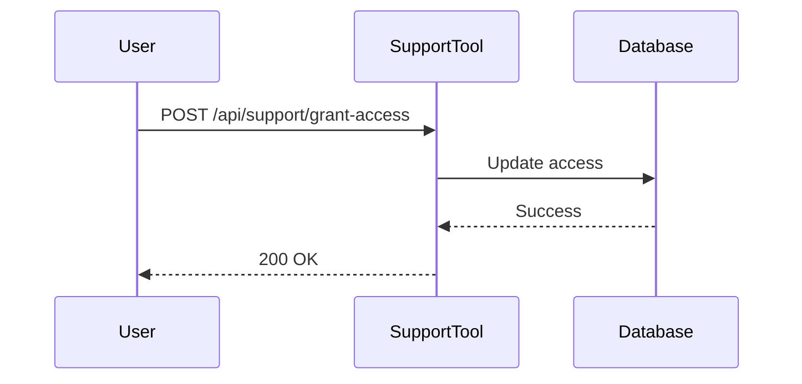
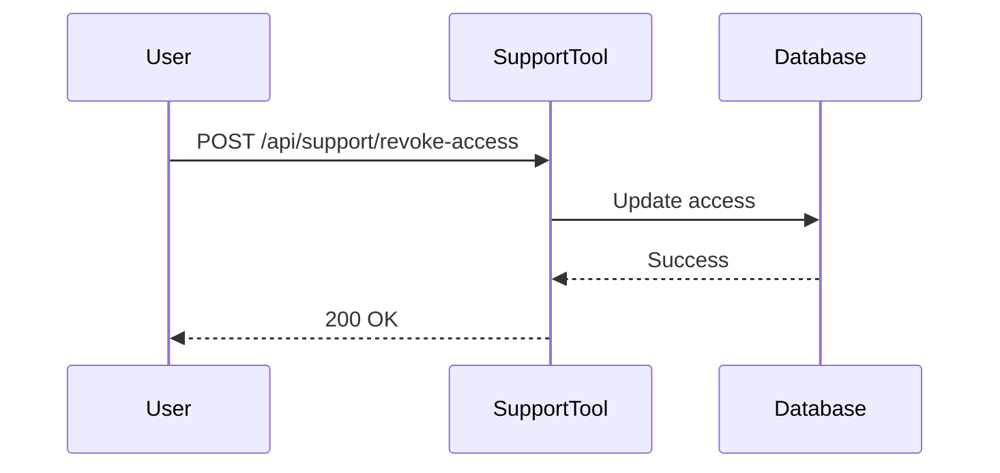

## Insufficient Logging and Monitoring (API10)

### Overview

Insufficient logging and monitoring is a critical issue in API security. This vulnerability occurs when an application does not maintain adequate logs or does not effectively monitor its activities. As a result, it becomes difficult to detect unauthorized access, malicious activities, or other security incidents. In the context of APIs, this can lead to severe consequences such as data breaches, unauthorized access, and loss of sensitive information.

### Importance of Logging and Monitoring

Logging and monitoring are essential components of any security strategy. They help in:

- **Detecting Unauthorized Access:** By maintaining detailed logs, you can identify unauthorized access attempts and take appropriate actions.
- **Identifying Malicious Activities:** Logs can reveal patterns of behavior that indicate malicious activities, such as repeated failed login attempts or unusual data access patterns.
- **Auditing Compliance:** Many regulatory requirements mandate the maintenance of detailed logs for auditing purposes.
- **Incident Response:** Detailed logs are crucial for incident response, helping to understand the scope and impact of a security breach.

### Example Scenario

Let's consider a support system for an application. This system requires a username and password for authentication. Once authenticated, a user can manage access to various features, such as granting or revoking access to specific courses.

#### Support Tool Example

Imagine a support tool where a user can grant access to specific features or revoke access. Here’s a simplified example:

```plaintext
Support Tool
- Username: admin
- Password: admin123
```

The user can perform actions like granting access to a specific feature or revoking access. For instance:

```plaintext
Action: Grant access to user@example.com
Action: Revoke access to user@example.com
```

Now, imagine that the password for this support tool is leaked. Without proper logging and monitoring, the system administrator would not be aware of the unauthorized access and the actions performed by the attacker.

### Real-World Examples

Several high-profile breaches have occurred due to insufficient logging and monitoring. Here are some recent examples:

- **CVE-2021-22204 (Microsoft Exchange Server):** This vulnerability allowed attackers to gain unauthorized access to Microsoft Exchange servers. Due to insufficient logging, many organizations were unaware of the breach until it was too late.
- **SolarWinds Supply Chain Attack (2020):** This attack involved the compromise of SolarWinds Orion software, which affected numerous organizations. The lack of proper logging and monitoring made it difficult to detect the initial breach and subsequent activities.

### Detailed Explanation

#### What is Insufficient Logging and Monitoring?

Insufficient logging and monitoring refers to the absence or inadequacy of mechanisms to record and analyze the activities within an application. This includes:

- **Logging:** Recording events and activities within the application.
- **Monitoring:** Analyzing the recorded logs to detect anomalies and potential security issues.

#### Why Does It Matter?

Without proper logging and monitoring, it becomes extremely difficult to:

- Detect unauthorized access or malicious activities.
- Understand the scope and impact of a security breach.
- Comply with regulatory requirements.
- Perform effective incident response.

#### How Does It Work Under the Hood?

When an application lacks proper logging and monitoring, it means that:

- **Logs are not maintained:** There are no records of important events, such as login attempts, data access, or configuration changes.
- **Monitoring is ineffective:** There are no mechanisms to analyze the logs and detect anomalies.

This can lead to several issues:

- **Unauthorized Access:** Attackers can gain access to the system without leaving any trace.
- **Data Exfiltration:** Sensitive data can be exfiltrated without being detected.
- **Malicious Activities:** Attackers can perform malicious activities without being noticed.

### Realistic Example

Consider a support tool that allows users to manage access to specific features. Here’s a more detailed example:

```plaintext
Support Tool
- Username: admin
- Password: admin123
```

The user can perform actions like granting access to a specific feature or revoking access. For instance:

```plaintext
Action: Grant access to user@example.com
Action: Revoke access to user@example.com
```

Now, imagine that the password for this support tool is leaked. Without proper logging and monitoring, the system administrator would not be aware of the unauthorized access and the actions performed by the attacker.

### Full Raw HTTP Messages

Here’s an example of a full HTTP request and response for granting access:

#### Request

```http
POST /api/support/grant-access HTTP/1.1
Host: example.com
Content-Type: application/json
Authorization: Bearer <access_token>

{
  "email": "user@example.com",
  "feature": "course_access"
}
```

#### Response

```http
HTTP/1.1 200 OK
Content-Type: application/json

{
  "status": "success",
  "message": "Access granted to user@example.com for course_access"
}
```

### Full Raw HTTP Messages for Revoking Access

#### Request

```http
POST /api/support/revoke-access HTTP/1.1
Host: example.com
Content-Type: application/json
Authorization: Bearer <access_token>

{
  "email": "user@example.com",
  "feature": "course_access"
}
```

#### Response

```http
HTTP/1.1 200 OK
Content-Type: application/json

{
  "status": "success",
  "message": "Access revoked for user@example.com for course_access"
}
```

### Common Mistakes

Some common mistakes that lead to insufficient logging and monitoring include:

- **Not logging important events:** Failing to log critical events such as login attempts, data access, and configuration changes.
- **Inadequate log analysis:** Not analyzing logs to detect anomalies and potential security issues.
- **Poor log retention policies:** Not retaining logs for a sufficient period to allow for effective incident response.

### How to Prevent / Defend

To prevent and defend against insufficient logging and monitoring, follow these steps:

#### Secure Coding Fixes

Compare the vulnerable and secure versions of the code:

##### Vulnerable Code

```python
def grant_access(email, feature):
    # Grant access logic
    pass
```

##### Secure Code

```python
import logging

# Configure logging
logging.basicConfig(filename='app.log', level=logging.INFO)

def grant_access(email, feature):
    # Grant access logic
    logging.info(f"Granting access to {email} for {feature}")
```

#### Configuration Hardening

Ensure that your logging and monitoring configurations are hardened:

##### Nginx Configuration

```nginx
log_format combined '$remote_addr - $remote_user [$time_local] '
                     '"$request" $status $body_bytes_sent '
                     '"$http_referer" "$http_user_agent"';

access_log /var/log/nginx/access.log combined;
error_log /var/log/nginx/error.log warn;
```

##### Apache Configuration

```apache
LogFormat "%h %l %u %t \"%r\" %>s %b \"%{Referer}i\" \"%{User-Agent}i\"" combined
CustomLog /var/log/apache2/access.log combined
ErrorLog /var/log/apache2/error.log
LogLevel warn
```

#### Detection

Use tools to detect insufficient logging and monitoring:

- **Log Analysis Tools:** Tools like Splunk, ELK Stack, or Graylog can help in analyzing logs and detecting anomalies.
- **Security Information and Event Management (SIEM) Systems:** SIEM systems can correlate logs from multiple sources to detect security incidents.

#### Prevention

Implement the following preventive measures:

- **Enable Detailed Logging:** Ensure that all critical events are logged.
- **Regular Log Analysis:** Regularly analyze logs to detect anomalies and potential security issues.
- **Retention Policies:** Retain logs for a sufficient period to allow for effective incident response.

### Mermaid Diagrams

#### Sequence Diagram for Granting Access



#### Sequence Diagram for Revoking Access



### Hands-On Labs

For hands-on practice, consider the following labs:

- **PortSwigger Web Security Academy:** Offers a comprehensive set of labs covering various aspects of web security, including logging and monitoring.
- **OWASP Juice Shop:** A deliberately insecure web application for security training, which includes scenarios related to logging and monitoring.
- **DVWA (Damn Vulnerable Web Application):** Another popular web application for security training, which includes scenarios related to logging and monitoring.

By thoroughly understanding and implementing proper logging and monitoring practices, you can significantly enhance the security of your API and protect against unauthorized access and malicious activities.

---
<!-- nav -->
[[01-Introduction to Insufficient Logging and Monitoring|Introduction to Insufficient Logging and Monitoring]] | [[API Security/05-OWASP API TOP 10/02-API10 Insufficient Logging Monitoring/00-Overview|Overview]] | [[03-Insufficient Logging and Monitoring in APIs|Insufficient Logging and Monitoring in APIs]]
