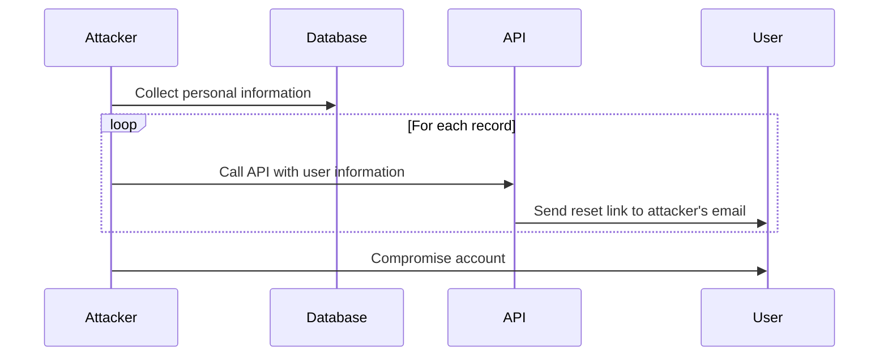
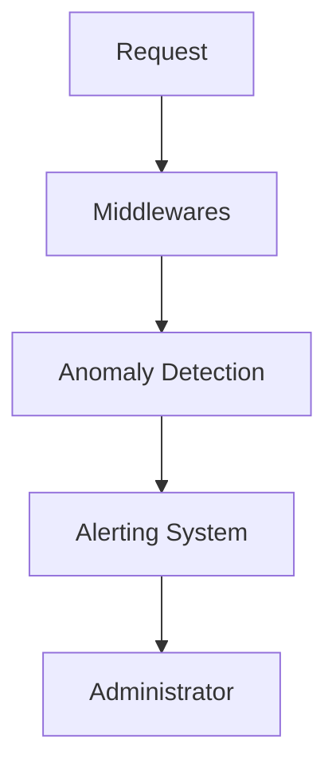

## Insufficient Logging and Monitoring in APIs

### Background Theory

Insufficient logging and monitoring are critical issues in API security, as they allow attackers to exploit vulnerabilities without being detected. This can lead to significant damage, such as unauthorized access, data breaches, and financial losses. In the context of APIs, insufficient logging and monitoring can manifest in several ways:

1. **Lack of Detailed Logs**: APIs may not log sufficient details about incoming requests, making it difficult to trace malicious activities.
2. **Inadequate Monitoring**: There may be no real-time monitoring mechanisms in place to detect unusual patterns or suspicious activities.
3. **Poor Log Management**: Logs may not be stored securely, analyzed regularly, or retained for a sufficient period, leading to potential loss of evidence.

### Real-World Example: 7-Eleven API Breach

One notable real-world example of insufficient logging and monitoring is the breach of the 7-Eleven API. In this case, the API allowed users to specify a different email address for receiving password reset links compared to the email used during registration. This design flaw enabled attackers to exploit the system by using a database containing personal information of Japanese residents to automate password reset requests.

#### Attack Chain

The attack chain can be broken down into the following steps:

1. **Data Collection**: Attackers gathered personal information from a database containing Japanese residents' details.
2. **Automated Requests**: Using a script, attackers called the API for each record to test the required user information.
3. **Password Reset**: Attackers specified their own email addresses to receive password reset links.
4. **Account Compromise**: With the password reset links, attackers were able to compromise 900 user accounts.
5. **Financial Loss**: Before the vulnerability was discovered, attackers spent the compromised users' money.

#### Timeline

- **Day 1**: The application was introduced to the market.
- **Day 2-3**: Attackers began exploiting the vulnerability.
- **Day 4**: The vendor pulled the application from the market due to the breach.

### Detailed Explanation of the Vulnerability

#### Design Flaw

The primary design flaw in the 7-Eleven API was allowing password reset codes to be sent to an arbitrary email address. This design decision lacked proper validation and verification mechanisms, making it easy for attackers to exploit the system.

#### Lack of Logging

The API did not maintain detailed logs of incoming requests, which made it challenging to trace the source of the attacks. Without comprehensive logging, it was difficult to identify the specific actions taken by the attackers and the extent of the breach.

#### Inadequate Monitoring

There were no real-time monitoring mechanisms in place to detect unusual patterns or suspicious activities. This allowed attackers to operate undetected for several days, causing significant damage before the breach was discovered.

### How to Prevent / Defend

#### Secure Coding Practices

To prevent such vulnerabilities, it is essential to follow secure coding practices. Here are some key recommendations:

1. **Validate User Input**: Ensure that user input is validated and verified before processing. For example, validate the email address provided for password reset against the registered email address.
2. **Use Strong Authentication Mechanisms**: Implement strong authentication mechanisms, such as multi-factor authentication (MFA), to enhance security.
3. **Log Detailed Information**: Maintain detailed logs of incoming requests, including IP addresses, timestamps, and user actions. This helps in tracing malicious activities and identifying patterns.

#### Example Code: Secure Password Reset

Here is an example of how to implement a secure password reset mechanism:

```python
def reset_password(user_id, email):
    # Validate the email address
    if email != get_registered_email(user_id):
        raise ValueError("Email does not match registered email")

    # Generate a unique token
    token = generate_unique_token()

    # Send the reset link to the email address
    send_reset_link(email, token)

    # Store the token in the database
    store_token(user_id, token)
```

#### Example Code: Insecure Password Reset

Here is an example of an insecure password reset mechanism:

```python
def reset_password(user_id, email):
    # Generate a unique token
    token = generate_unique_token()

    # Send the reset link to the email address
    send_reset_link(email, token)

    # Store the token in the database
    store_token(user_id, token)
```

#### Real-Time Monitoring

Implement real-time monitoring mechanisms to detect unusual patterns or suspicious activities. This can be achieved through:

1. **Anomaly Detection**: Use anomaly detection algorithms to identify unusual patterns in incoming requests.
2. **Alerting Systems**: Set up alerting systems to notify administrators of suspicious activities in real time.

#### Example Code: Anomaly Detection

Here is an example of how to implement anomaly detection:

```python
def monitor_requests(requests):
    # Analyze the requests for unusual patterns
    if detect_anomalies(requests):
        # Notify administrators of suspicious activities
        notify_administrators()
```

#### Example Code: Alerting System

Here is an example of how to set up an alerting system:

```python
def notify_administrators():
    # Send an alert to administrators
    send_alert("Suspicious activity detected")
```

### Complete HTTP Request and Response

Here is an example of a complete HTTP request and response for a password reset:

#### HTTP Request

```http
POST /api/reset-password HTTP/1.1
Host: example.com
Content-Type: application/json

{
    "user_id": "12345",
    "email": "user@example.com"
}
```

#### HTTP Response

```http
HTTP/1.1 200 OK
Content-Type: application/json

{
    "message": "Reset link sent to user@example.com"
}
```

### Mermaid Diagrams

#### Attack Chain Diagram



#### Monitoring System Diagram



### Hands-On Labs

For hands-on practice, consider the following labs:

- **PortSwigger Web Security Academy**: Offers interactive labs to practice API security, including logging and monitoring.
- **OWASP Juice Shop**: Provides a vulnerable web application for practicing various security techniques, including logging and monitoring.
- **DVWA (Damn Vulnerable Web Application)**: Another vulnerable web application for practicing security techniques.

By following these guidelines and implementing secure coding practices, real-time monitoring, and detailed logging, you can significantly reduce the risk of API vulnerabilities and protect your applications from malicious attacks.

---
<!-- nav -->
[[02-Insufficient Logging and Monitoring (API10)|Insufficient Logging and Monitoring (API10)]] | [[API Security/05-OWASP API TOP 10/02-API10 Insufficient Logging Monitoring/00-Overview|Overview]] | [[04-Insufficient Logging and Monitoring|Insufficient Logging and Monitoring]]
