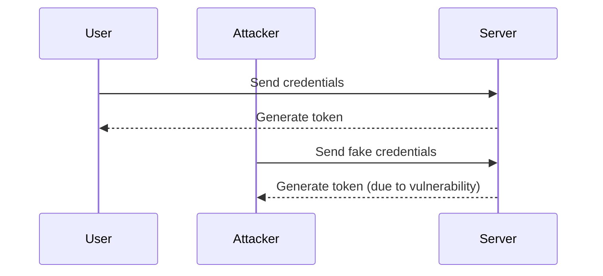
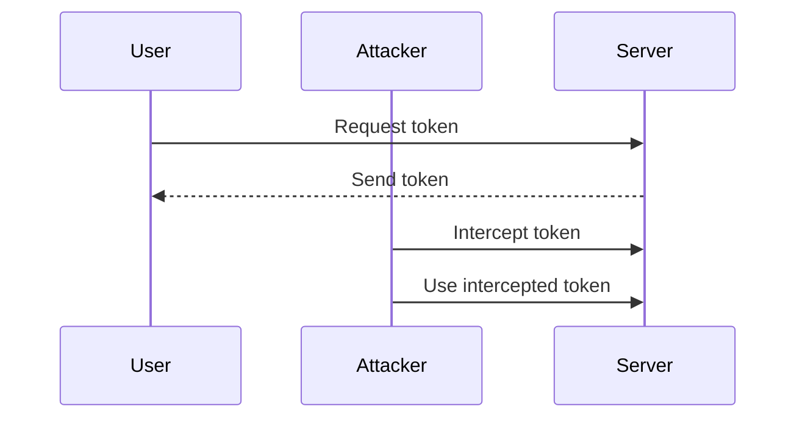
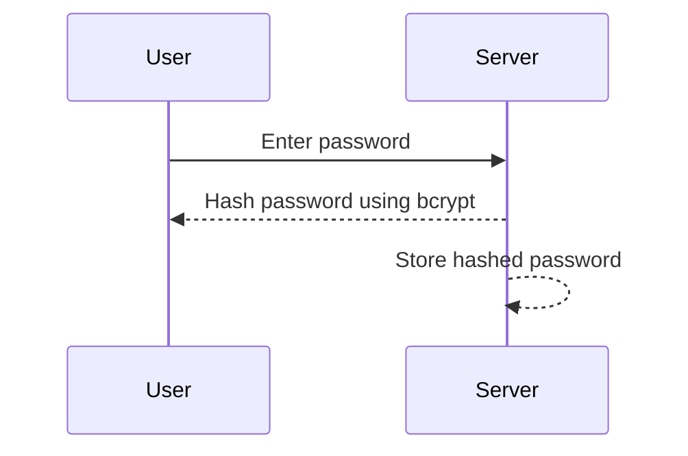
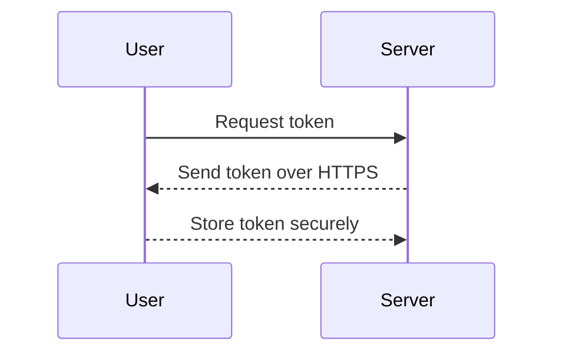
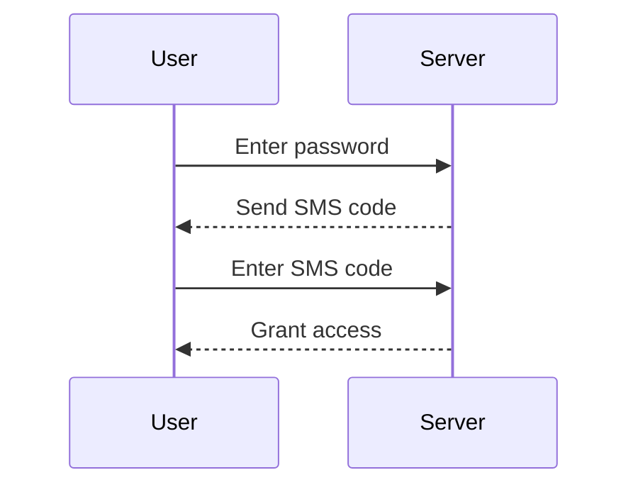
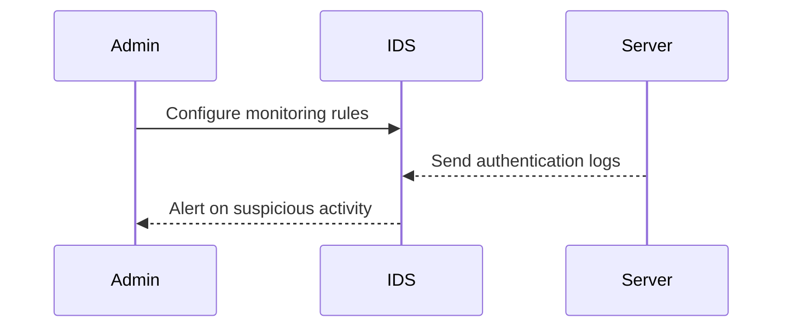

## Introduction to Broken Authentication

Broken authentication is one of the most critical vulnerabilities listed in the OWASP API Top 10. This vulnerability occurs when an application fails to properly authenticate users, allowing attackers to gain unauthorized access to sensitive data or perform actions as other users. This chapter will delve deep into the concepts, mechanisms, and practical aspects of broken authentication, providing a comprehensive understanding of how to identify, mitigate, and prevent such vulnerabilities.

### What is Authentication?

Authentication is the process of verifying the identity of a user or system. In the context of APIs, authentication typically involves validating a user's credentials (such as a username and password) and issuing a token that can be used to access protected resources. The goal is to ensure that only authorized entities can interact with the API.

### Why is Authentication Important?

Authentication is crucial because it forms the first line of defense against unauthorized access. Without proper authentication, an attacker could impersonate legitimate users and gain access to sensitive information or perform malicious actions. This can lead to data breaches, financial losses, and reputational damage.

### How Does Authentication Work?

The typical workflow for authentication involves the following steps:

1. **User Credentials**: A user provides their credentials (e.g., username and password).
2. **Validation**: The server validates these credentials against a stored set of valid credentials.
3. **Token Generation**: Upon successful validation, the server generates an authentication token (often a JWT—JSON Web Token).
4. **Token Usage**: The client uses this token to access protected resources.

### Common Authentication Mechanisms

- **Basic Authentication**: Sends credentials in plain text.
- **Digest Authentication**: Uses a hash function to protect credentials.
- **OAuth**: An open standard for access delegation.
- **JWT (JSON Web Tokens)**: A compact, URL-safe means of representing claims to be transferred between two parties.

### Real-World Examples of Broken Authentication

#### Example 1: CVE-2021-3129 (Microsoft Exchange Server)

In March 2021, Microsoft disclosed a series of vulnerabilities in its Exchange Server, including a broken authentication issue. Attackers could exploit this vulnerability to bypass authentication and gain unauthorized access to the server. This led to widespread attacks and data breaches.



#### Example 2: OAuth 2.0 Token Leakage

In 2019, a vulnerability was discovered in several OAuth 2.0 implementations where tokens were leaked due to improper handling. This allowed attackers to intercept and reuse tokens, leading to unauthorized access.



### Common Pitfalls in Authentication Implementation

1. **Weak Password Policies**: Weak passwords are easily guessable and can be cracked using brute-force attacks.
2. **Improper Token Handling**: Tokens should be securely transmitted and stored. Improper handling can lead to leakage.
3. **Insufficient Token Expiry**: Tokens should expire after a certain period to limit the window of opportunity for attackers.
4. **Lack of Multi-Factor Authentication (MFA)**: Relying solely on passwords increases the risk of unauthorized access.

### How to Prevent / Defend Against Broken Authentication

#### Secure Password Policies

Implement strong password policies that enforce complexity requirements and regular password changes. Use password hashing algorithms like bcrypt or Argon2 to store passwords securely.



#### Proper Token Handling

Ensure that tokens are transmitted over secure channels (HTTPS) and stored securely. Use short-lived tokens and implement refresh tokens to minimize exposure.



#### Implement Multi-Factor Authentication (MFA)

Require users to provide additional verification factors (e.g., SMS codes, biometric data) to enhance security.



#### Regular Audits and Monitoring

Regularly audit authentication mechanisms and monitor for suspicious activities. Use tools like intrusion detection systems (IDS) to detect and respond to potential threats.



### Complete Code Examples

#### Vulnerable Code Example

```python
# Vulnerable code example
def authenticate(username, password):
    # Check if the provided credentials match the stored ones
    if username == "admin" and password == "password":
        return True
    return False

# Example usage
if authenticate("admin", "password"):
    print("Access granted")
else:
    print("Access denied")
```

#### Secure Code Example

```python
import bcrypt

def hash_password(password):
    # Hash the password using bcrypt
    salt = bcrypt.gensalt()
    hashed_password = bcrypt.hashpw(password.encode('utf-8'), salt)
    return hashed_password

def authenticate(username, stored_hashed_password, provided_password):
    # Check if the provided password matches the stored hashed password
    if bcrypt.checkpw(provided_password.encode('utf-8'), stored_hashed_password):
        return True
    return False

# Example usage
stored_hashed_password = hash_password("password")
if authenticate("admin", stored_hashed_password, "password"):
    print("Access granted")
else:
    1
```

### Practical Labs

To gain hands-on experience with broken authentication, consider the following labs:

- **PortSwigger Web Security Academy**: Offers interactive labs on various authentication vulnerabilities.
- **OWASP Juice Shop**: A deliberately insecure web application for practicing security testing.
- **DVWA (Damn Vulnerable Web Application)**: Provides a range of web application vulnerabilities, including broken authentication.

By thoroughly understanding and implementing the principles outlined in this chapter, you can significantly reduce the risk of broken authentication vulnerabilities in your applications.

---
<!-- nav -->
[[01-Introduction to API2 Broken Authentication|Introduction to API2 Broken Authentication]] | [[API Security/05-OWASP API TOP 10/03-API2 Broken Authentication/00-Overview|Overview]] | [[03-Overview of Broken Authentication in APIs|Overview of Broken Authentication in APIs]]
