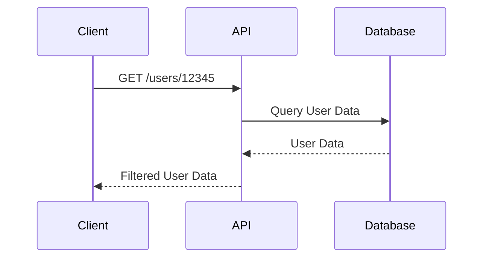
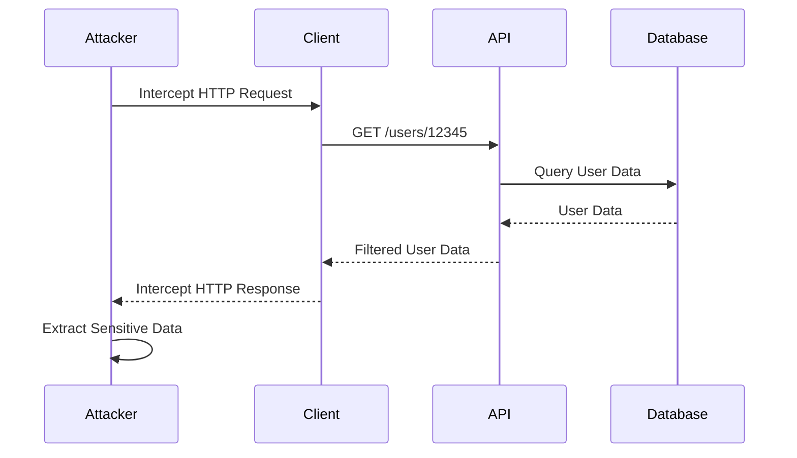

## Excessive Data Exposure (API3)

### Overview

Excessive data exposure is a critical vulnerability within the realm of API security. This issue occurs when an API returns more information than necessary, potentially exposing sensitive data to unauthorized users. Automatic tools can often detect this type of vulnerability, but identifying the difference between legitimate data and sensitive data requires a deep understanding of the application's context and data handling practices.

### What is Excessive Data Exposure?

Excessive data exposure happens when an API endpoint returns more data than required for a specific operation. This can lead to the unintentional disclosure of sensitive information such as personal identifiers, financial details, or other confidential data. The primary concern is that attackers can exploit this vulnerability to gain unauthorized access to sensitive information, leading to potential data breaches and privacy violations.

### Why Does Excessive Data Exposure Matter?

The consequences of excessive data exposure can be severe:

- **Data Breaches**: Unauthorized access to sensitive data can result in significant data breaches, leading to financial losses, reputational damage, and legal liabilities.
- **Privacy Violations**: Exposure of personal identifiable information (PII) can violate privacy laws and regulations, such as GDPR, CCPA, and HIPAA, resulting in hefty fines and penalties.
- **Identity Theft**: Leaked personal identifiers can be used by attackers to commit identity theft, causing significant harm to individuals.

### How Does Excessive Data Exposure Occur?

Excessive data exposure typically occurs due to poor data handling practices and inadequate validation mechanisms. Here are some common scenarios:

- **Over-fetching Data**: An API endpoint fetches more data than needed for a particular operation.
- **Improper Filtering**: Insufficient filtering of data before returning it to the client.
- **Sensitive Data in Responses**: Including sensitive data in API responses without proper authorization checks.

### Real-World Example: Uber Account Takeover

One notable example of excessive data exposure is the Uber account takeover incident. In this case, an API endpoint returned sensitive information, including unique user identifiers (UUIDs), which were then used to take over user accounts.

#### Background

Uber's API allowed third-party developers to access certain user data through their API endpoints. However, the API did not properly filter the data being returned, leading to the exposure of sensitive user information.

#### Vulnerable Code Example

Consider the following simplified example of an API endpoint that returns user data:

```python
@app.route('/users/<user_id>', methods=['GET'])
def get_user(user_id):
    user = User.query.get(user_id)
    return jsonify(user.to_dict())
```

In this example, the `to_dict` method might include sensitive fields like `uuid`, `email`, and `phone_number`.

#### Full HTTP Request and Response

Here is a full HTTP request and response for the above scenario:

**HTTP Request:**

```http
GET /users/12345 HTTP/1.1
Host: api.uber.com
Authorization: Bearer <access_token>
```

**HTTP Response:**

```http
HTTP/1.1 200 OK
Content-Type: application/json
Cache-Control: no-cache
Pragma: no-cache

{
  "id": 12345,
  "name": "John Doe",
  "uuid": "123e4567-e89b-12d3-a456-426614174000",
  "email": "john.doe@example.com",
  "phone_number": "+1234567890"
}
```

### How to Prevent / Defend Against Excessive Data Exposure

To prevent excessive data exposure, follow these best practices:

#### Secure Coding Practices

Ensure that your API endpoints only return the minimum necessary data. Use data filtering and validation techniques to control what data is exposed.

**Vulnerable Code:**

```python
@app.route('/users/<user_id>', methods=['GET'])
def get_user(user_id):
    user = User.query.get(user_id)
    return jsonify(user.to_dict())
```

**Secure Code:**

```python
@app.route('/users/<user_id>', methods=['GET'])
def get_user(user_id):
    user = User.query.get(user_id)
    return jsonify({
        "id": user.id,
        "name": user.name
    })
```

#### Proper Authorization Checks

Implement robust authorization mechanisms to ensure that sensitive data is only accessible to authorized users.

**Vulnerable Code:**

```python
@app.route('/users/<user_id>', methods=['GET'])
def get_user(user_id):
    user = User.query.get(user_id)
    return jsonify(user.to_dict())
```

**Secure Code:**

```python
@app.route('/users/<user_id>', methods=['GET'])
@auth_required
def get_user(user_id):
    user = User.query.get(user_id)
    if current_user.id == user.id:
        return jsonify({
            "id": user.id,
            "name": user.name
        })
    else:
        abort(403)
```

#### Data Masking and Redaction

Use data masking and redaction techniques to protect sensitive information in API responses.

**Vulnerable Code:**

```python
@app.route('/users/<user_id>', methods=['GET'])
def get_user(user_id):
    user = User.query.get(user_id)
    return jsonify(user.to_dict())
```

**Secure Code:**

```python
@app.route('/users/<user_id>', methods=['GET'])
def get_user(user_id):
    user = User.query.get(user_id)
    return jsonify({
        "id": user.id,
        "name": user.name,
        "email": mask_email(user.email),
        "phone_number": mask_phone_number(user.phone_number)
    })
```

#### Detection and Monitoring

Regularly monitor API traffic and use security tools to detect and alert on excessive data exposure.

**Example Tool:**

- **Burp Suite**: A comprehensive toolkit for web application security testing that includes features for detecting excessive data exposure.

### Mermaid Diagrams

#### API Request/Response Flow



#### Attack Chain



### Hands-On Labs

For hands-on practice with API security, consider the following labs:

- **PortSwigger Web Security Academy**: Offers interactive labs on API security, including excessive data exposure.
- **OWASP Juice Shop**: A deliberately insecure web application for practicing web security skills, including API security.
- **DVWA (Damn Vulnerable Web Application)**: Provides various web application vulnerabilities, including API-related issues.

By thoroughly understanding and implementing these best practices, you can significantly reduce the risk of excessive data exposure in your APIs, ensuring the security and privacy of your users' data.

---
<!-- nav -->
[[API Security/05-OWASP API TOP 10/04-API3 Excessive Data Exposure/00-Overview|Overview]] | [[API Security/05-OWASP API TOP 10/04-API3 Excessive Data Exposure/02-Excessive Data Exposure in APIs|Excessive Data Exposure in APIs]]
