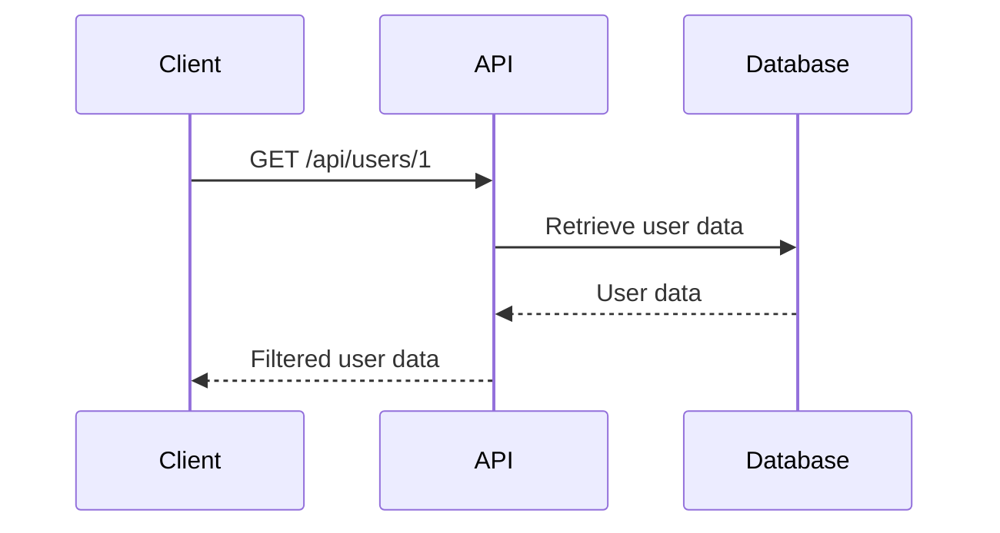

## Excessive Data Exposure in APIs

### Introduction

Excessive data exposure is a critical security issue within APIs where an application returns more sensitive data than necessary to the client. This can lead to unauthorized access to sensitive information, such as personal data, financial details, or internal system configurations. The problem arises when the server does not properly filter the data before sending it to the client, thereby exposing more information than required.

### Understanding Excessive Data Exposure

#### What is Excessive Data Exposure?

Excessive data exposure occurs when an API returns more data than the client legitimately needs. This can happen due to poor design choices, lack of proper validation, or insufficient filtering mechanisms. For instance, consider an API endpoint that retrieves user details. Instead of returning only the necessary fields like `username` and `email`, the API might return additional fields like `password_hash`, `security_questions`, and `internal_notes`.

#### Why Does Excessive Data Exposure Matter?

Excessive data exposure is a significant concern because it can lead to several security risks:

1. **Data Breaches**: Unauthorized access to sensitive information can result in data breaches, leading to financial losses, reputational damage, and legal consequences.
2. **Identity Theft**: Exposed personal data can be used for identity theft, allowing attackers to impersonate users and perform fraudulent activities.
3. **Internal System Compromise**: Exposure of internal system configurations can provide attackers with insights into the architecture and vulnerabilities of the system, making it easier to launch targeted attacks.

### Real-World Examples

#### Recent CVEs and Breaches

Several high-profile breaches have been attributed to excessive data exposure:

1. **Equifax Data Breach (2017)**: Equifax exposed sensitive personal data of over 143 million individuals due to a vulnerability in their API. The breach included names, Social Security numbers, birth dates, addresses, and, in some cases, driver’s license numbers.
2. **Capital One Data Breach (2019)**: A misconfigured web application firewall allowed an attacker to access sensitive customer data, including names, addresses, credit scores, and social security numbers.

### How Excessive Data Exposure Occurs

#### Scenario Breakdown

Consider a scenario where an authenticated user requests information from an API. The API should only return the necessary data, but instead, it returns a large amount of unnecessary data. Here’s a detailed breakdown of the scenario:

1. **Authenticated User Request**: An authenticated user sends a GET request to the API to retrieve specific information.
2. **API Response**: The API retrieves the requested data from the backend database and returns it to the client.
3. **Data Filtering**: If the API does not properly filter the data, it may return additional fields that the client does not need.

#### Example Code

Let’s look at an example of an API endpoint that retrieves user details:

```python
from flask import Flask, jsonify, request

app = Flask(__name__)

users = [
    {"id": 1, "username": "john_doe", "email": "john@example.com", "password_hash": "hashed_password", "security_questions": ["What is your mother's maiden name?", "What was your first pet's name?"], "internal_notes": "User is a VIP"},
    {"id": 2, "username": "jane_smith", "email": "jane@example.com", "password_hash": "hashed_password", "security_questions": ["What is your favorite book?", "What is your favorite movie?"], "internal_notes": "User is a regular"}
]

@app.route('/api/users/<int:user_id>', methods=['GET'])
def get_user(user_id):
    user = next((u for u in users if u['id'] == user_id), None)
    if user:
        return jsonify(user)
    else:
        return jsonify({"error": "User not found"}), 404

if __name__ == '__main__':
    app.run(debug=True)
```

In this example, the API returns all fields of the user object, including sensitive fields like `password_hash` and `internal_notes`. This is an example of excessive data exposure.

### Detection and Prevention

#### How to Detect Excessive Data Exposure

Detecting excessive data exposure involves monitoring API responses and ensuring that they only contain the necessary data. Tools like static code analyzers, dynamic analysis tools, and security scanners can help identify potential issues.

1. **Static Code Analysis**: Analyze the code to ensure that only necessary fields are returned.
2. **Dynamic Analysis**: Monitor API responses to check if they contain unnecessary data.
3. **Security Scanners**: Use tools like Burp Suite, OWASP ZAP, or commercial security scanners to scan for excessive data exposure.

#### How to Prevent Excessive Data Exposure

Preventing excessive data exposure requires implementing proper data filtering and validation mechanisms. Here are some best practices:

1. **Data Filtering**: Ensure that only the necessary fields are returned in API responses.
2. **Role-Based Access Control (RBAC)**: Implement RBAC to restrict access to sensitive data based on user roles.
3. **Input Validation**: Validate input parameters to ensure that only valid and necessary data is processed.

#### Secure Coding Practices

Here’s an example of how to securely implement an API endpoint to prevent excessive data exposure:

```python
from flask import Flask, jsonify, request

app = Flask(__name__)

users = [
    {"id": 1, "username": "john_doe", "email": "john@example.com", "password_hash": "hashed_password", "security_questions": ["What is your mother's maiden name?", "What was your first pet's name?"], "internal_notes": "User is a VIP"},
    {"id": 2, "username": "jane_smith", "email": "jane@example.com", "password_hash": "hashed_password", "security_questions": ["What is your favorite book?", "What is your favorite movie?"], "internal_notes": "User is a regular"}
]

@app.route('/api/users/<int:user_id>', methods=['GET'])
def get_user(user_id):
    user = next((u for u in users if u['id'] == user_id), None)
    if user:
        # Filter out sensitive fields
        filtered_user = {k: v for k, v in user.items() if k in ['id', 'username', 'email']}
        return jsonify(filtered_user)
    else:
        return jsonify({"error": "User not found"}), 404

if __name__ == '__main__':
    app.run(debug=True)
```

In this example, only the necessary fields (`id`, `username`, and `email`) are returned in the API response, preventing excessive data exposure.

### Mermaid Diagrams

#### API Request and Response Flow



This diagram illustrates the flow of an API request and response, highlighting the importance of filtering data before returning it to the client.

### Hands-On Labs

To practice and understand excessive data exposure in APIs, you can use the following labs:

1. **PortSwigger Web Security Academy**: Offers interactive labs to learn about API security, including excessive data exposure.
2. **OWASP Juice Shop**: A deliberately insecure web application for practicing web security skills, including API security.
3. **DVWA (Damn Vulnerable Web Application)**: A PHP/MySQL web application that is riddled with vulnerabilities, including those related to API security.

By following these guidelines and practicing with real-world examples, you can effectively prevent excessive data exposure in your APIs and ensure the security of sensitive information.

---
<!-- nav -->
[[01-Excessive Data Exposure (API3)|Excessive Data Exposure (API3)]] | [[API Security/05-OWASP API TOP 10/04-API3 Excessive Data Exposure/00-Overview|Overview]] | [[API Security/05-OWASP API TOP 10/04-API3 Excessive Data Exposure/03-Practice Questions & Answers|Practice Questions & Answers]]
