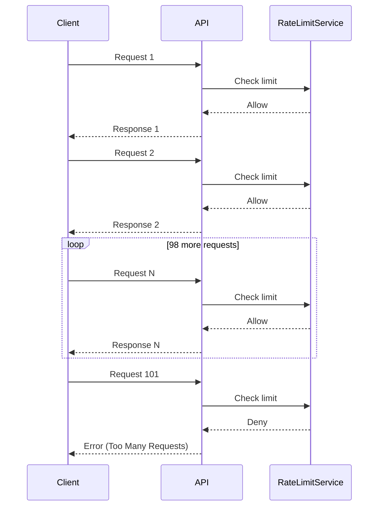
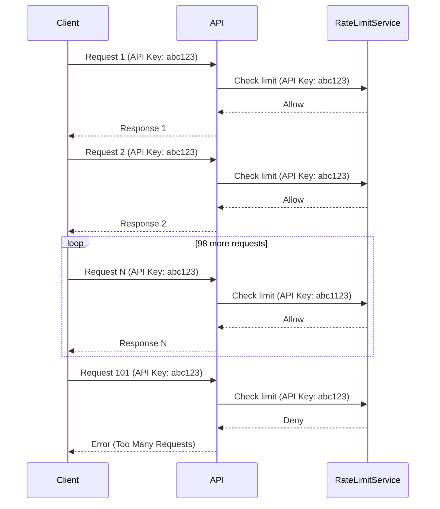
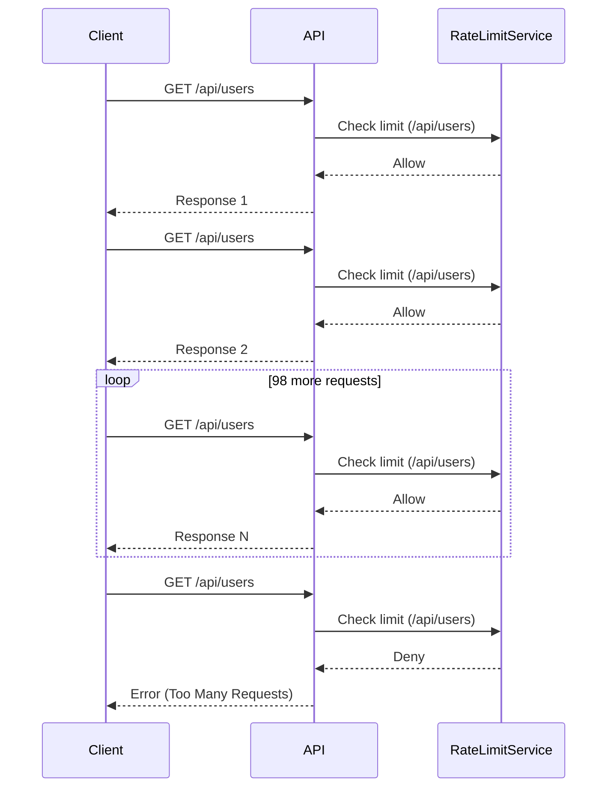
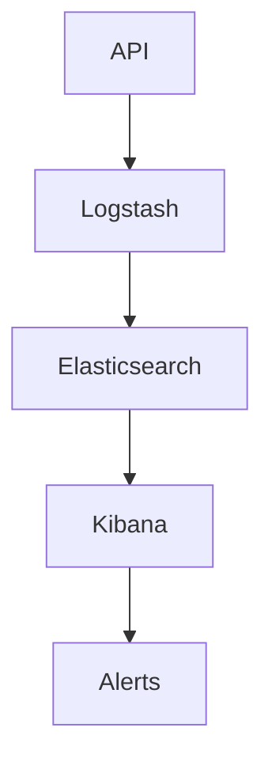

## Lack of Resource and Rate Limiting

### Introduction

Resource and rate limiting are critical aspects of securing APIs. Without proper controls, an attacker can exploit the API by making excessive requests, leading to denial-of-service (DoS) attacks, data theft, or other malicious activities. This section will delve into the importance of resource and rate limiting, how they work, and how to implement them effectively.

### What is Resource and Rate Limiting?

Resource and rate limiting involve setting constraints on the number of requests a client can make within a given time frame. This helps prevent abuse and ensures fair usage of resources. Rate limiting can be applied at different levels:

- **Per-client**: Limiting the number of requests based on the client's identity (e.g., API key, IP address).
- **Per-endpoint**: Limiting the number of requests to specific endpoints.
- **Global**: Limiting the total number of requests across all clients and endpoints.

#### Why is Resource and Rate Limiting Important?

Without rate limiting, an attacker can flood the API with requests, causing the server to become unresponsive or crash. This can lead to a denial-of-service (DoS) attack, where legitimate users are unable to access the service. Additionally, attackers can use excessive requests to gather sensitive information or perform brute-force attacks.

### How Does Resource and Rate Limiting Work?

Rate limiting typically involves tracking the number of requests made by a client and enforcing limits based on predefined rules. There are several strategies for implementing rate limiting:

- **Fixed Window**: Limits are reset at regular intervals (e.g., every minute).
- **Sliding Window**: Limits are adjusted based on the time of the last request.
- **Token Bucket**: Requests consume tokens from a bucket that refills at a constant rate.

#### Example: Fixed Window Rate Limiting

Let's consider a simple example using fixed window rate limiting. Suppose we want to limit a client to 100 requests per minute.



In this example, the `RateLimitService` tracks the number of requests made by the client within a one-minute window. Once the limit is reached, subsequent requests are denied.

### Real-World Examples

#### Recent Breaches and CVEs

Several high-profile breaches have been attributed to a lack of proper rate limiting:

- **CVE-2021-21972**: A vulnerability in the Microsoft Exchange Server allowed attackers to bypass rate limiting and perform brute-force attacks on user accounts.
- **CVE-2022-22965**: A vulnerability in the Log4j library allowed attackers to send excessive requests, leading to a denial-of-service attack.

These examples highlight the importance of implementing robust rate limiting mechanisms to prevent such attacks.

### Implementation Details

#### Per-client Rate Limiting

To implement per-client rate limiting, you can use an API key or IP address to identify the client. Here’s an example using an API key:



#### Per-endpoint Rate Limiting

To implement per-endpoint rate limiting, you can track the number of requests made to specific endpoints. Here’s an example using an endpoint `/api/users`:



### Common Pitfalls

#### Overly Restrictive Limits

Setting overly restrictive rate limits can lead to legitimate users being blocked. It’s important to balance security with usability.

#### Inconsistent Enforcement

Inconsistent enforcement of rate limits can lead to vulnerabilities. Ensure that rate limits are consistently enforced across all endpoints and clients.

### How to Prevent / Defend

#### Detection

To detect rate-limiting violations, you can monitor API logs and set up alerts for excessive requests. Here’s an example using a log monitoring tool like ELK Stack:



#### Prevention

To prevent rate-limiting violations, implement rate limiting at the API gateway level. Here’s an example using NGINX:

```nginx
http {
    limit_req_zone $binary_remote_addr zone=one:10m rate=1r/s;

    server {
        listen 80;
        location /api/ {
            limit_req zone=one burst=5 nodelay;
            proxy_pass http://backend;
        }
    }
}
```

#### Secure Coding Fixes

Here’s an example of a vulnerable API endpoint without rate limiting:

```python
@app.route('/api/users', methods=['GET'])
def get_users():
    return jsonify(User.query.all())
```

And here’s the same endpoint with rate limiting implemented using Flask-Limiter:

```python
from flask import Flask, jsonify
from flask_limiter import Limiter
from flask_sqlalchemy import SQLAlchemy

app = Flask(__name__)
limiter = Limiter(app, key_func=get_remote_address)
db = SQLAlchemy(app)

class User(db.Model):
    id = db.Column(db.Integer, primary_key=True)
    name = db.Column(db.String(50))

@limiter.limit("100 per minute")
@app.route('/api/users', methods=['GET'])
def get_users():
    return jsonify(User.query.all())
```

#### Configuration Hardening

Ensure that your rate-limiting configurations are hardened against attacks. Here’s an example of hardening NGINX configurations:

```nginx
http {
    limit_req_zone $binary_remote_addr zone=one:10m rate=1r/s;

    server {
        listen 80;
        location /api/ {
            limit_req zone=one burst=5 nodelay;
            proxy_pass http://backend;
            allow 192.168.1.0/24; # Allow trusted IPs
            deny all; # Deny all others
        }
    }
}
```

### Hands-On Labs

For hands-on practice, consider the following labs:

- **PortSwigger Web Security Academy**: Offers exercises on rate limiting and DoS attacks.
- **OWASP Juice Shop**: Provides a vulnerable application to practice rate limiting and other security measures.
- **DVWA**: A deliberately vulnerable web application for practicing security techniques.

By thoroughly understanding and implementing resource and rate limiting, you can significantly enhance the security of your APIs and protect against various types of attacks.

---
<!-- nav -->
[[API Security/05-OWASP API TOP 10/05-API4 Lack of Resources and Rate Limiting/00-Overview|Overview]] | [[02-Lack of Resources and Rate Limiting|Lack of Resources and Rate Limiting]]
