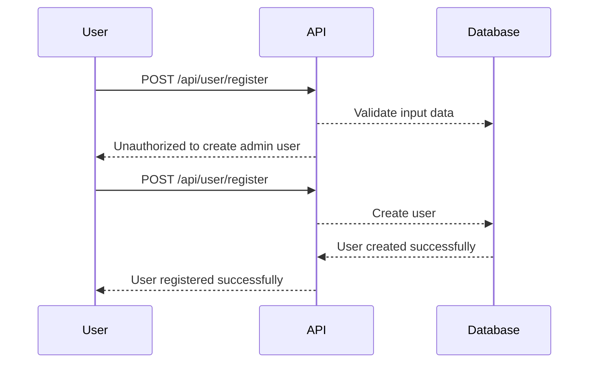

## Overview of Broken Function Level Authorization

Broken Function Level Authorization is a critical security issue within the realm of API security. This vulnerability occurs when an application fails to properly enforce access controls at the function level, allowing unauthorized users to perform actions they should not have permission to execute. This can lead to significant security breaches, including data theft, privilege escalation, and unauthorized modifications to system resources.

### Understanding Function Level Authorization

Function Level Authorization refers to the process of ensuring that a user has the appropriate permissions to execute specific functions within an application. This is typically achieved through role-based access control (RBAC) mechanisms, where different roles are assigned various levels of access based on their responsibilities within the system.

#### Role-Based Access Control (RBAC)

Role-Based Access Control (RBAC) is a widely used method for managing access rights in software systems. In RBAC, permissions are associated with roles rather than individual users. Users are then assigned to these roles, thereby inheriting the permissions associated with those roles. This approach simplifies the management of access rights and ensures that users have only the necessary permissions to perform their job functions.

### Why Function Level Authorization Matters

Proper function level authorization is crucial because it helps prevent unauthorized access to sensitive operations and resources. Without adequate authorization checks, attackers can exploit vulnerabilities to gain elevated privileges and perform malicious actions. This can result in data breaches, service disruptions, and financial losses.

### How Function Level Authorization Works

In a typical scenario, an API endpoint might be designed to handle various operations such as creating, reading, updating, and deleting resources. Each operation may require different levels of authorization. For instance, a user might be allowed to read data but not modify it. This is enforced through authorization checks that verify whether the requesting user has the required permissions to perform the requested action.

#### Example Scenario

Consider an API endpoint `/api/user/register` which allows users to create new accounts. The endpoint might accept a POST request with a JSON payload containing user details, including an `isAdmin` flag. A legitimate user would typically set this flag to `false`, but an attacker might attempt to set it to `true` to gain administrative privileges.

```json
{
  "username": "newuser",
  "password": "securepassword",
  "isAdmin": false
}
```

If the API does not properly validate the `isAdmin` flag, an attacker could exploit this vulnerability by sending a modified request:

```json
{
  "username": "attacker",
  "password": "hackedpassword",
  "isAdmin": true
}
```

This would allow the attacker to register an account with administrative privileges, bypassing the intended access controls.

### Real-World Examples

Several high-profile breaches have been attributed to broken function level authorization. One notable example is the Capital One breach in 2019, where an attacker exploited a misconfigured web application firewall to access sensitive customer data. The attacker was able to bypass the intended access controls and gain unauthorized access to over 100 million records.

Another example is the Equifax breach in 2017, where attackers exploited a vulnerability in Apache Struts to gain unauthorized access to sensitive data. The breach resulted in the exposure of personal information for over 143 million individuals.

### Common Pitfalls

Implementing proper function level authorization can be challenging due to several factors:

1. **Complex User Hierarchies**: Modern applications often have intricate user hierarchies with multiple roles and permissions. Ensuring that all possible combinations are correctly enforced can be difficult.
   
2. **Configuration Management**: Authorization rules are often managed through configuration files or code. Misconfigurations or errors in these settings can lead to vulnerabilities.

3. **Dynamic Permissions**: Some applications may dynamically adjust permissions based on user actions or context. Ensuring that these dynamic changes are correctly enforced can be complex.

### How to Prevent / Defend

To prevent broken function level authorization, several best practices should be followed:

1. **Implement Strong RBAC**: Ensure that all roles and permissions are clearly defined and enforced. Regularly review and update these configurations to reflect changes in the system.

2. **Validate Input Data**: Always validate input data to ensure that it conforms to expected formats and values. This includes checking for unauthorized modifications to sensitive fields.

3. **Use Secure Coding Practices**: Follow secure coding guidelines to avoid common vulnerabilities such as SQL injection, cross-site scripting (XSS), and other injection attacks.

4. **Regular Audits and Testing**: Conduct regular security audits and penetration testing to identify and mitigate potential vulnerabilities. Use tools such as static application security testing (SAST) and dynamic application security testing (DAST) to automate this process.

5. **Logging and Monitoring**: Implement comprehensive logging and monitoring to detect and respond to unauthorized access attempts. This includes logging all access attempts and reviewing logs regularly for suspicious activity.

### Secure Code Example

Here is an example of how to implement proper function level authorization using a hypothetical API endpoint:

#### Vulnerable Code

```python
@app.route('/api/user/register', methods=['POST'])
def register_user():
    data = request.get_json()
    username = data['username']
    password = data['password']
    is_admin = data['isAdmin']

    # Create user in database
    user = User(username=username, password=password, is_admin=is_admin)
    db.session.add(user)
    db.session.commit()

    return jsonify({"message": "User registered successfully"}), 201
```

#### Secure Code

```python
@app.route('/api/user/register', methods=['POST'])
def register_user():
    data = request.get_json()
    username = data['username']
    password = data['password']
    is_admin = data['isAdmin']

    # Validate input data
    if not isinstance(is_admin, bool):
        return jsonify({"error": "Invalid value for isAdmin"}), 400

    # Check user role
    current_user = get_current_user()
    if not current_user.is_admin and is_admin:
        return jsonify({"error": "Unauthorized to create admin user"}), 403

    # Create user in database
    user = User(username=username, password=password, is_admin=is_admin)
    db.session.add(user)
    db.session.commit()

    return jsonify({"message": "User registered successfully"}), 201
```

### Mermaid Diagrams

#### Authorization Flow Diagram



### Conclusion

Broken Function Level Authorization is a serious security concern that can lead to significant breaches if not properly addressed. By implementing strong RBAC, validating input data, following secure coding practices, conducting regular audits, and logging and monitoring access attempts, organizations can significantly reduce the risk of such vulnerabilities. Regular training and awareness programs can also help ensure that developers and administrators are aware of the importance of proper authorization checks.

### Practice Labs

For hands-on practice with API security, consider the following labs:

- **PortSwigger Web Security Academy**: Offers interactive labs covering various aspects of web security, including API security.
- **OWASP Juice Shop**: A deliberately insecure web application for practicing web security skills.
- **DVWA (Damn Vulnerable Web Application)**: A PHP/MySQL web application that is riddled with vulnerabilities for educational purposes.

These labs provide practical experience in identifying and mitigating broken function level authorization vulnerabilities.

---
<!-- nav -->
[[API Security/05-OWASP API TOP 10/06-API5 Broken Function Level Authorization/00-Overview|Overview]] | [[02-Broken Function Level Authorization (API5)|Broken Function Level Authorization (API5)]]
