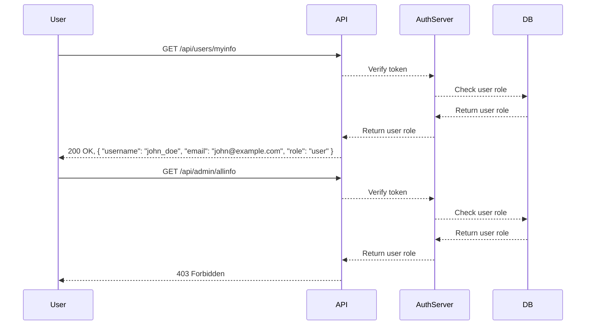
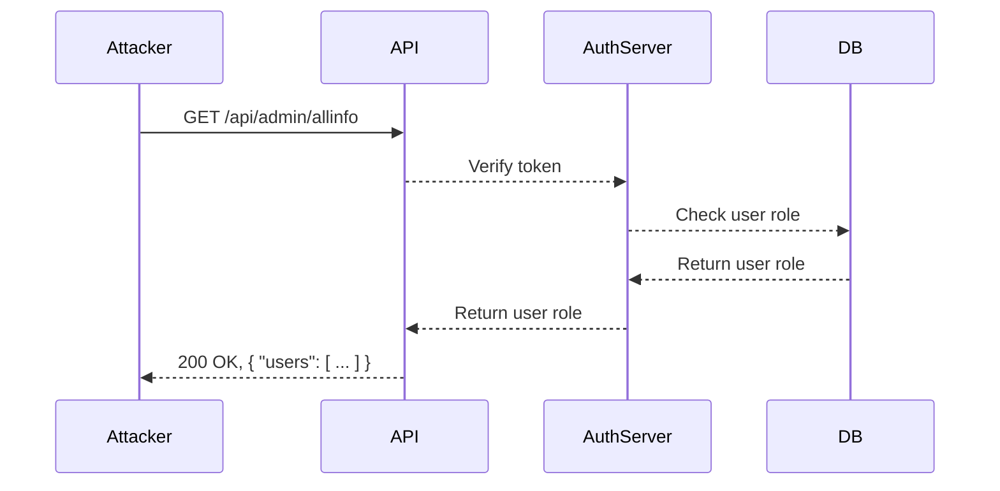

## Broken Function Level Authorization (API5)

### Introduction

Broken Function Level Authorization (BFLOA) is a critical security issue within APIs where the API does not properly enforce access controls at the function level. This means that an authenticated user might be able to perform actions intended only for higher-privileged roles, such as administrators. This vulnerability can lead to unauthorized access to sensitive data, modification of critical resources, and even full system compromise.

### Understanding Function Level Authorization

Function Level Authorization (FLA) refers to the process of ensuring that a user can only access or perform specific functions based on their role and permissions. In a well-designed system, each API endpoint should check whether the requesting user has the necessary privileges to execute the requested operation.

#### Why Function Level Authorization Matters

In many systems, authentication alone is not sufficient to ensure security. An authenticated user might still attempt to access or modify resources that they should not have access to. Function Level Authorization ensures that even after a user is authenticated, they can only perform actions that are explicitly allowed for their role.

#### How Function Level Authorization Works

When a user makes a request to an API endpoint, the system first authenticates the user to verify their identity. After authentication, the system checks the user's role and permissions to determine if they are authorized to perform the requested action. This is typically done using role-based access control (RBAC) or attribute-based access control (ABAC).

### Example Scenario

Let's consider a scenario where a user is authenticated but attempts to access an administrative function that they should not have access to.

#### Normal Request

```http
GET /api/users/myinfo HTTP/1.1
Host: example.com
Authorization: Bearer <token>
```

The server responds with the user's information:

```http
HTTP/1.1 200 OK
Content-Type: application/json

{
  "username": "john_doe",
  "email": "john@example.com",
  "role": "user"
}
```

#### Malicious Request

Now, let's consider what happens if the user tries to access an administrative function:

```http
GET /api/admin/allinfo HTTP/1.1
Host: example.com
Authorization: Bearer <token>
```

If the server does not properly enforce function level authorization, it might respond with:

```http
HTTP/1.1 200 OK
Content-Type: application/json

{
  "users": [
    {"username": "john_doe", "email": "john@example.com", "role": "user"},
    {"username": "admin_user", "email": "admin@example.com", "role": "admin"}
  ]
}
```

This response reveals sensitive information that the user should not have access to, indicating a broken function level authorization vulnerability.

### Real-World Examples

#### Recent Breaches and CVEs

One notable example of a broken function level authorization vulnerability is CVE-2021-3129, which affected the Jenkins Continuous Integration server. The vulnerability allowed authenticated users to bypass authorization checks and execute arbitrary code on the server.

Another example is CVE-2020-14182, which affected the Atlassian Jira software. This vulnerability allowed authenticated users to access and modify sensitive data that they should not have access to.

### How to Prevent / Defend

#### Detection

To detect broken function level authorization vulnerabilities, you can use automated tools like static application security testing (SAST) and dynamic application security testing (DAST) tools. These tools can help identify areas where proper authorization checks are missing.

Additionally, manual code reviews and penetration testing can help identify these vulnerabilities. During a penetration test, testers can attempt to access restricted functions to see if the system properly enforces authorization.

#### Prevention

To prevent broken function level authorization vulnerabilities, you should implement proper authorization checks at the function level. Here are some best practices:

1. **Role-Based Access Control (RBAC)**: Use RBAC to define roles and permissions for different users. Ensure that each API endpoint checks the user's role before allowing access to sensitive functions.

2. **Attribute-Based Access Control (ABAC)**: ABAC allows more granular control by defining policies based on attributes such as user roles, resource types, and actions. This can provide more fine-grained access control than RBAC.

3. **Least Privilege Principle**: Follow the principle of least privilege by granting users only the minimum permissions required to perform their tasks. Avoid granting unnecessary administrative privileges to regular users.

4. **Input Validation**: Validate all input parameters to ensure that they conform to expected values. This can help prevent attackers from bypassing authorization checks through crafted input.

5. **Logging and Monitoring**: Implement logging and monitoring to detect and respond to unauthorized access attempts. Log all access attempts and review logs regularly to identify suspicious activity.

#### Secure Code Fix

Here is an example of how to implement proper function level authorization in a Python Flask application:

**Vulnerable Code**

```python
from flask import Flask, request

app = Flask(__name__)

@app.route('/api/users/myinfo', methods=['GET'])
def get_user_info():
    return {
        "username": "john_doe",
        "email": "john@example.com",
        "role": "user"
    }

@app.route('/api/admin/allinfo', methods=['GET'])
def get_admin_info():
    return {
        "users": [
            {"username": "john_doe", "email": "john@example.com", "role": "user"},
            {"username": "admin_user", "email": "admin@example.com", "role": "admin"}
        ]
    }
```

**Fixed Code**

```python
from flask import Flask, request, abort

app = Flask(__name__)

def check_authorization(role_required):
    user_role = request.headers.get('X-User-Role')
    if user_role != role_required:
        abort(403, description="Unauthorized access")

@app.route('/api/users/myinfo', methods=['GET'])
def get_user_info():
    check_authorization('user')
    return {
        "username": "john_doe",
        "email": "john@example.com",
        "role": "user"
    }

@app.route('/api/admin/allinfo', methods=['GET'])
def get_admin_info():
    check_authorization('admin')
    return {
        "users": [
            {"username": "john_doe", "email": "john@example.com", "role": "user"},
            {"username": "admin_user", "email": "admin@example.com", "role": "admin"}
        ]
    }
```

In the fixed code, we added a `check_authorization` function that verifies the user's role before allowing access to the requested function. If the user does not have the required role, the function returns a 403 Forbidden error.

### Configuration Hardening

To further harden your system against broken function level authorization vulnerabilities, you can implement the following configurations:

1. **Disable Unnecessary Endpoints**: Disable or remove endpoints that are not needed. This reduces the attack surface and makes it harder for attackers to find and exploit vulnerabilities.

2. **Use HTTPS**: Ensure that all API communications are encrypted using HTTPS. This prevents attackers from intercepting and modifying requests in transit.

3. **Rate Limiting**: Implement rate limiting to prevent brute-force attacks. Rate limiting can help prevent attackers from making too many requests in a short period of time.

4. **Security Headers**: Use security headers such as Content Security Policy (CSP), X-Frame-Options, and X-Content-Type-Options to protect against various types of attacks.

### Mermaid Diagrams

#### Authorization Flow



#### Attack Chain



### Practice Labs

For hands-on practice with API security, you can use the following labs:

- **PortSwigger Web Security Academy**: Offers a series of labs that cover various aspects of API security, including broken function level authorization.
- **OWASP Juice Shop**: A deliberately insecure web application that includes several API-related vulnerabilities, including broken function level authorization.
- **DVWA (Damn Vulnerable Web Application)**: Another intentionally vulnerable web application that includes API security challenges.

By practicing with these labs, you can gain a deeper understanding of how to identify and mitigate broken function level authorization vulnerabilities in real-world scenarios.

### Conclusion

Broken Function Level Authorization is a serious security issue that can lead to unauthorized access to sensitive data and functions. By implementing proper authorization checks, using RBAC or ABAC, and following best practices, you can prevent these vulnerabilities and ensure the security of your API. Regularly reviewing and testing your system can help you identify and address any potential issues before they can be exploited.

---
<!-- nav -->
[[01-Overview of Broken Function Level Authorization|Overview of Broken Function Level Authorization]] | [[API Security/05-OWASP API TOP 10/06-API5 Broken Function Level Authorization/00-Overview|Overview]] | [[03-Understanding Broken Function Level Authorization|Understanding Broken Function Level Authorization]]
