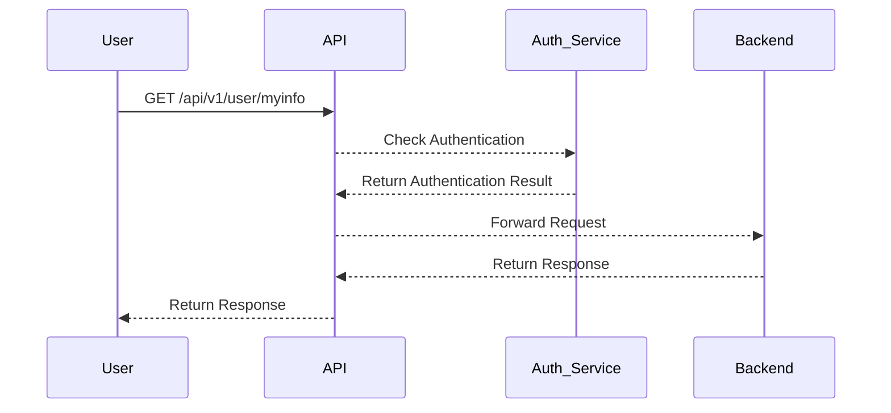
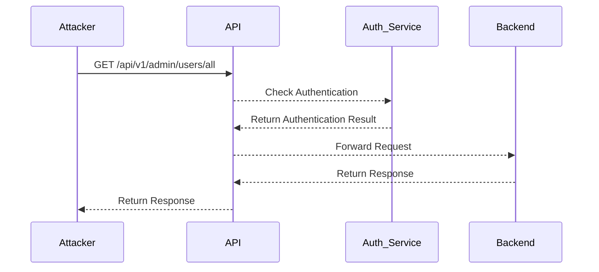

## Understanding Broken Function Level Authorization

### What is Broken Function Level Authorization?

Broken Function Level Authorization (BFALA) is a critical security vulnerability that occurs when an application fails to properly enforce access controls at the function level. This means that non-privileged users can access sensitive functions or data by simply knowing the correct URL or parameters. In other words, the application does not correctly verify whether a user has the necessary permissions to perform certain actions.

### Why Does BFALA Matter?

BFALA is significant because it allows unauthorized users to access sensitive functionalities and data that they should not have access to. This can lead to various security issues such as data breaches, unauthorized modifications, and even complete system compromise. The impact can be severe, especially if the affected functions deal with sensitive operations like administrative tasks or financial transactions.

### How Does BFALA Work Under the Hood?

To understand how BFALA works, let's consider a typical scenario where an application exposes different endpoints for various functionalities. For instance, an API might have endpoints for retrieving user information and administrative tasks:

```plaintext
/api/v1/user/myinfo
/api/v1/admin/users/all
```

In a properly secured application, the `/api/v1/admin/users/all` endpoint would only be accessible to users with administrative privileges. However, if the application fails to enforce this restriction, a regular user could potentially access this endpoint by simply knowing the URL.

### Example Scenario

Let's break down the example provided in the lecture:

1. **Normal User Request**:
    ```plaintext
    GET /api/v1/user/myinfo
    ```

2. **Admin Endpoint Access**:
    ```plaintext
    GET /api/v1/admin/users/all
    ```

If the application does not properly check the user's role before allowing access to the `/api/v1/admin/users/all` endpoint, a regular user could exploit this by simply changing the URL.

### Real-World Examples

#### Recent CVEs and Breaches

One notable example of BFALA is the breach at Capital One in 2019 (CVE-2019-11510). An attacker exploited a misconfigured server to gain unauthorized access to sensitive customer data. The attacker was able to access internal APIs that were not properly secured, leading to the exposure of over 100 million records.

Another example is the Equifax breach in 2017 (CVE-2017-5638), where attackers exploited a vulnerability in Apache Struts to gain unauthorized access to sensitive data. The attackers were able to bypass authentication checks and access internal APIs, leading to the exposure of personal information of millions of customers.

### Detailed Mechanics of BFALA

To better understand how BFALA works, let's look at a more detailed example involving an API that exposes user and admin functionalities.

#### Normal User Request

Consider a normal user making a request to retrieve their own information:

```http
GET /api/v1/user/myinfo HTTP/1.1
Host: example.com
Authorization: Bearer <access_token>
```

The response might look like this:

```http
HTTP/1.1 200 OK
Content-Type: application/json

{
  "username": "john_doe",
  "email": "john@example.com"
}
```

#### Admin Endpoint Access

Now, consider a scenario where a regular user tries to access the admin endpoint:

```http
GET /api/v1/admin/users/all HTTP/1.1
Host: example.com
Authorization: Bearer <access_token>
```

If the application does not properly enforce role-based access control, the response might look like this:

```http
HTTP/1.1 200 OK
Content-Type: application/json

[
  {
    "username": "admin_user",
    "email": "admin@example.com"
  },
  {
    "username": "another_admin",
    "email": "another_admin@example.com"
  }
]
```

### How to Detect BFALA

Detecting BFALA involves several steps:

1. **Review Access Control Mechanisms**: Ensure that all endpoints are properly protected by access control mechanisms. This includes checking user roles and permissions before allowing access to sensitive functionalities.

2. **Penetration Testing**: Conduct penetration testing to identify any vulnerabilities in the access control mechanisms. Automated tools like Burp Suite, OWASP ZAP, and Metasploit can help in identifying potential issues.

3. **Logging and Monitoring**: Implement logging and monitoring to detect any unauthorized access attempts. This can help in identifying and responding to potential attacks in real-time.

### How to Prevent / Defend Against BFALA

Preventing BFALA involves implementing robust access control mechanisms and ensuring that all endpoints are properly secured. Here are some steps to follow:

1. **Role-Based Access Control (RBAC)**: Implement RBAC to ensure that users can only access functionalities based on their roles. For example, a regular user should not be able to access admin endpoints.

2. **Least Privilege Principle**: Follow the least privilege principle, which means granting users the minimum level of access required to perform their job functions.

3. **Secure Coding Practices**: Implement secure coding practices to ensure that access control mechanisms are properly enforced. This includes validating user input and ensuring that all endpoints are properly authenticated and authorized.

4. **Configuration Hardening**: Harden the application configuration to prevent unauthorized access. This includes disabling unnecessary features and ensuring that all security settings are properly configured.

### Secure Code Fix Example

Let's compare a vulnerable code snippet with a secure code snippet to illustrate how to prevent BFALA.

#### Vulnerable Code Snippet

```python
@app.route('/api/v1/admin/users/all', methods=['GET'])
def get_all_users():
    users = User.query.all()
    return jsonify([user.to_dict() for user in users])
```

#### Secure Code Snippet

```python
from flask import abort

@app.route('/api/v1/admin/users/all', methods=['GET'])
@requires_admin_role
def get_all_users():
    if not current_user.is_admin:
        abort(403)
    users = User.query.all()
    return jsonify([user.to_dict() for user in users])

def requires_admin_role(f):
    @wraps(f)
    def decorated_function(*args, **kwargs):
        if not current_user.is_admin:
            abort(403)
        return f(*args, **kwargs)
    return decorated_function
```

### Configuration Hardening

Here is an example of how to configure an API gateway to enforce access control:

#### Nginx Configuration

```nginx
server {
    listen 80;
    server_name example.com;

    location /api/v1/user/myinfo {
        auth_request /auth;
        proxy_pass http://backend;
    }

    location /api/v1/admin/users/all {
        auth_request /auth;
        proxy_pass http://backend;
    }

    location = /auth {
        internal;
        proxy_pass http://auth_service;
    }
}
```

### Mermaid Diagrams

#### Access Control Flow



#### Attack Chain



### Practice Labs

For hands-on practice with API security, consider the following labs:

- **PortSwigger Web Security Academy**: Offers comprehensive modules on API security, including broken function level authorization.
- **OWASP Juice Shop**: A deliberately insecure web application for practicing web security skills, including API security.
- **DVWA (Damn Vulnerable Web Application)**: Provides a variety of web application vulnerabilities, including API-related issues.

By thoroughly understanding and implementing the principles outlined above, you can significantly reduce the risk of BFALA in your applications.

---
<!-- nav -->
[[02-Broken Function Level Authorization (API5)|Broken Function Level Authorization (API5)]] | [[API Security/05-OWASP API TOP 10/06-API5 Broken Function Level Authorization/00-Overview|Overview]] | [[API Security/05-OWASP API TOP 10/06-API5 Broken Function Level Authorization/04-Practice Questions & Answers|Practice Questions & Answers]]
