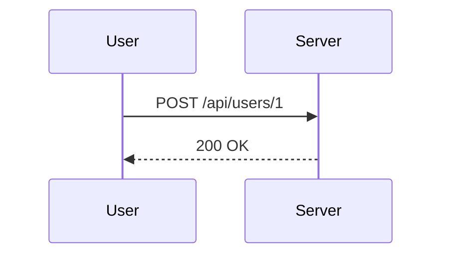

## Introduction to Mass Assignment Vulnerability

Mass assignment, also known as overposting, is a common vulnerability in web applications where an attacker can manipulate the input data to modify unintended fields in the application's database. This vulnerability arises when an application allows an attacker to set arbitrary object properties via a form or API call, leading to unauthorized modifications of sensitive data.

### What is Mass Assignment?

Mass assignment occurs when an application accepts a large number of parameters from a user and automatically maps these parameters to the corresponding fields in a model or database entity. The problem arises when the application does not properly validate or filter these inputs, allowing an attacker to set fields that should not be modifiable by the user.

#### Why Does Mass Assignment Matter?

Mass assignment vulnerabilities can lead to serious security issues such as privilege escalation, data corruption, and unauthorized access to sensitive information. For instance, an attacker might be able to change a user's role from "user" to "admin" by manipulating the input data sent to the server.

### How Does Mass Assignment Work Under the Hood?

To understand mass assignment, let's consider a typical scenario where a user updates their profile information. Suppose the user can update their name, email, and password. However, due to a lack of proper validation, an attacker could send additional fields in the request, such as `isAdmin`, which would normally be restricted.

#### Example Scenario

Consider a simple user model:

```python
class User:
    def __init__(self, name, email, password, isAdmin=False):
        self.name = name
        self.email = email
        self.password = password
        self.isAdmin = isAdmin
```

In a vulnerable implementation, the server might accept a POST request with the following data:

```json
{
    "name": "John Doe",
    "email": "john@example.com",
    "password": "securepassword",
    "isAdmin": true
}
```

If the server blindly assigns these values to the `User` object, the `isAdmin` field would be set to `true`, granting the user administrative privileges.

### Real-World Examples and Recent Breaches

#### CVE-2019-16759: WordPress REST API Mass Assignment Vulnerability

In 2019, a mass assignment vulnerability was discovered in the WordPress REST API. Attackers could exploit this vulnerability to elevate their privileges by sending a crafted request to the `/wp-json/wp/v2/users/<id>` endpoint. This allowed them to set the `role` field to `administrator`, effectively gaining admin access.

#### Example Exploit

The following is a simplified example of how an attacker might exploit this vulnerability using a tool like `curl`:

```bash
curl -X PUT \
     -H "Content-Type: application/json" \
     -d '{"roles":["administrator"]}' \
     https://example.com/wp-json/wp/v2/users/1
```

This request would attempt to set the `roles` field to `["administrator"]` for the user with ID `1`.

### Detection and Prevention

#### How to Detect Mass Assignment Vulnerabilities

Detecting mass assignment vulnerabilities requires a thorough review of the application's input handling logic. Automated tools such as static analysis scanners and dynamic analysis tools can help identify potential issues. Additionally, manual code reviews and penetration testing are essential to ensure that all input fields are properly validated.

#### Secure Coding Practices

To prevent mass assignment vulnerabilities, developers should follow these best practices:

1. **Whitelist Input Fields**: Only allow specific fields to be updated based on the user's role and permissions.
2. **Use Strong Input Validation**: Validate all input fields to ensure they contain expected values.
3. **Sanitize Inputs**: Sanitize all inputs to remove any potentially harmful characters or patterns.
4. **Role-Based Access Control (RBAC)**: Implement RBAC to restrict which fields can be modified by different user roles.

#### Example Secure Code Implementation

Here is an example of how to securely handle user updates in Python using Flask:

```python
from flask import Flask, request, jsonify
from werkzeug.security import generate_password_hash

app = Flask(__name__)

class User:
    def __init__(self, name, email, password, isAdmin=False):
        self.name = name
        self.email = email
        self.password = generate_password_hash(password)
        self.isAdmin = isAdmin

@app.route('/users/<int:user_id>', methods=['PUT'])
def update_user(user_id):
    data = request.json
    user = get_user_by_id(user_id)  # Assume this function retrieves the user from the database

    if 'name' in data:
        user.name = data['name']
    if 'email' in data:
        user.email = data['email']
    if 'password' in data:
        user.password = generate_password_hash(data['password'])

    # Ensure isAdmin cannot be changed by the user
    if 'isAdmin' in data:
        return jsonify({"error": "Unauthorized modification"}), 403

    save_user_to_db(user)  # Assume this function saves the user to the database
    return jsonify({"message": "User updated successfully"}), 200

if __name__ == '__main__':
    app.run(debug=True)
```

### Complete Example: Full HTTP Request and Response

#### Vulnerable Version

**HTTP Request:**

```http
POST /api/users/1 HTTP/1.1
Host: example.com
Content-Type: application/json

{
    "name": "John Doe",
    "email": "john@example.com",
    "password": "securepassword",
    "isAdmin": true
}
```

**HTTP Response:**

```http
HTTP/1.1 200 OK
Content-Type: application/json

{
    "message": "User updated successfully"
}
```

#### Secure Version

**HTTP Request:**

```http
POST /api/users/1 HTTP/1.1
Host: example.com
Content-Type: application/json

{
    "name": "John Doe",
    "email": "john@example.com",
    "password": "securepassword"
}
```

**HTTP Response:**

```http
HTTP/1.1 200 OK
Content-Type: application/json

{
    "message": "User updated successfully"
}
```

### Mermaid Diagrams

#### Sequence Diagram for Vulnerable Scenario



#### Sequence Diagram for Secure Scenario


### Hands-On Labs

For hands-on practice with mass assignment vulnerabilities, consider the following labs:

- **PortSwigger Web Security Academy**: Offers a module on mass assignment vulnerabilities where you can practice identifying and exploiting these vulnerabilities.
- **OWASP Juice Shop**: A deliberately insecure web application that includes various security challenges, including mass assignment vulnerabilities.

By thoroughly understanding and implementing the best practices outlined above, developers can significantly reduce the risk of mass assignment vulnerabilities in their applications.

---
<!-- nav -->
[[API Security/05-OWASP API TOP 10/07-API6 Mass Assignment/00-Overview|Overview]] | [[02-Introduction to Mass Assignment|Introduction to Mass Assignment]]
