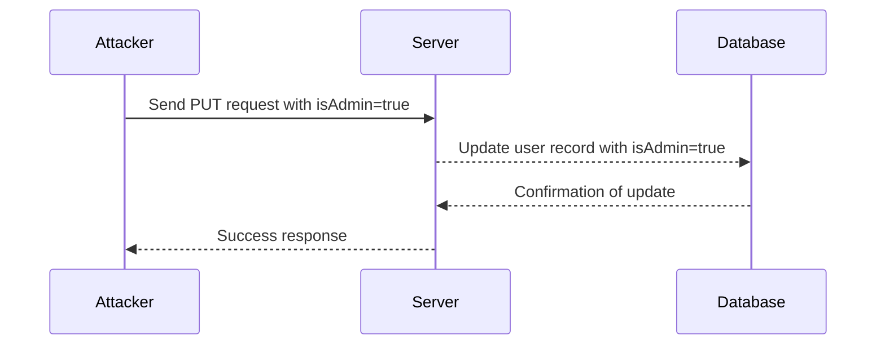
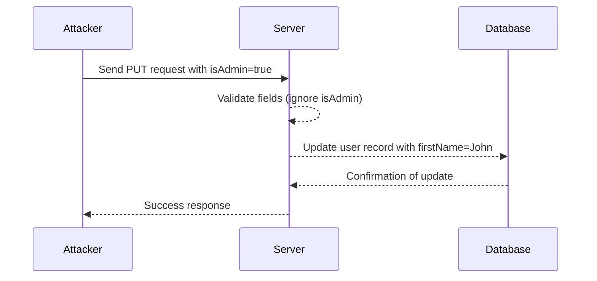

## API6 Mass Assignment

### What is Mass Assignment?

Mass assignment is a vulnerability that occurs when an application allows an attacker to modify sensitive fields of an object through a single API call. This typically happens when the application automatically maps incoming request parameters to object properties without properly validating or sanitizing them. In simpler terms, mass assignment vulnerabilities arise when an application blindly accepts and updates multiple object properties based on user input, potentially allowing unauthorized modifications to sensitive data.

### Why Does Mass Assignment Matter?

Mass assignment vulnerabilities can lead to serious security issues such as privilege escalation, data corruption, and unauthorized access to sensitive information. For instance, an attacker might exploit this vulnerability to change a user's role from a regular user to an administrator, thereby gaining elevated privileges within the system. This can result in significant damage, including unauthorized access to confidential data, manipulation of critical business processes, and even complete system compromise.

### How Does Mass Assignment Work Under the Hood?

To understand mass assignment, let's consider a typical scenario involving a user profile update. Suppose we have a `User` object with properties like `firstName`, `address`, `isVIP`, and `isAdmin`. An attacker might send a request to update the user's profile, but instead of updating only the intended fields, they might include additional fields that should not be modifiable by the user, such as `isAdmin`.

#### Example Code

Here’s a simplified example of how this might look in code:

```python
class User:
    def __init__(self, firstName, address, isVIP, isAdmin):
        self.firstName = firstName
        self.address = address
        self.isVIP = isVIP
        self.isAdmin = isAdmin

def update_user(user_id, data):
    user = get_user_by_id(user_id)
    for key, value in data.items():
        setattr(user, key, value)
    save_user(user)
```

In this example, the `update_user` function takes a dictionary of data and updates the corresponding properties of the `User` object. If an attacker sends a request with a dictionary like `{"firstName": "John", "isAdmin": True}`, the `isAdmin` field would be updated, potentially granting administrative privileges to the user.

### Real-World Examples

#### Recent Breaches and CVEs

One notable example of mass assignment vulnerabilities leading to serious security breaches is the case of the popular open-source project, OpenEMR. In 2021, a vulnerability was discovered in OpenEMR that allowed attackers to escalate their privileges using mass assignment. Specifically, the vulnerability allowed users to set themselves as administrators by manipulating certain fields in the user profile update form.

**CVE-2021-39719**: This CVE details a mass assignment vulnerability in OpenEMR, which allowed authenticated users to gain administrative privileges by modifying their own user profile.

### How to Detect Mass Assignment Vulnerabilities

Detecting mass assignment vulnerabilities requires a thorough review of the codebase to identify areas where user input is directly mapped to object properties without proper validation. Automated tools can also help in identifying potential vulnerabilities. Here are some steps to detect mass assignment vulnerabilities:

1. **Code Review**: Manually review the code to identify functions that accept user input and map it to object properties.
2. **Static Analysis Tools**: Use static analysis tools like SonarQube, Fortify, or Veracode to scan the codebase for potential mass assignment vulnerabilities.
3. **Dynamic Analysis Tools**: Use dynamic analysis tools like Burp Suite or OWASP ZAP to test the application for mass assignment vulnerabilities by sending crafted requests.

### How to Prevent / Defend Against Mass Assignment

Preventing mass assignment vulnerabilities involves implementing strict validation and sanitization mechanisms to ensure that only authorized fields can be modified. Here are some best practices to defend against mass assignment:

#### Secure Coding Practices

1. **Whitelist Fields**: Only allow specific fields to be updated based on user input. Use a whitelist approach to define which fields can be modified.
2. **Role-Based Access Control (RBAC)**: Implement RBAC to ensure that only users with appropriate roles can modify sensitive fields.
3. **Input Validation**: Validate all input fields to ensure they meet the expected format and constraints.

#### Example Code: Secure Version

Here’s how the previous example can be modified to prevent mass assignment:

```python
class User:
    def __init__(self, firstName, address, isVIP, isAdmin):
        self.firstName = firstName
        self.address = address
        self.isVIP = isVIP
        self.isAdmin = isAdmin

def update_user(user_id, data):
    user = get_user_by_id(user_id)
    allowed_fields = ["firstName", "address"]
    for key, value in data.items():
        if key in allowed_fields:
            setattr(user, key, value)
    save_user(user)
```

In this secure version, only the `firstName` and `address` fields can be updated, preventing unauthorized modification of sensitive fields like `isAdmin`.

### HTTP Request and Response Example

Let’s consider a full HTTP request and response example to illustrate how mass assignment can occur and how it can be prevented.

#### Vulnerable Scenario

**HTTP Request**:
```http
PUT /api/users/123 HTTP/1.1
Host: example.com
Content-Type: application/json

{
  "firstName": "John",
  "isAdmin": true
}
```

**HTTP Response**:
```http
HTTP/1.1 200 OK
Content-Type: application/json

{
  "message": "User updated successfully"
}
```

#### Secure Scenario

**HTTP Request**:
```http
PUT /api/users/123 HTTP/1.1
Host: example.com
Content-Type: application/json

{
  "firstName": "John",
  "isAdmin": true
}
```

**HTTP Response**:
```http
HTTP/1.1 200 OK
Content-Type: application/json

{
  "message": "User updated successfully"
}
```

In the secure scenario, the server would ignore the `isAdmin` field and only update the `firstName` field.

### Mermaid Diagrams

#### Attack Chain Diagram



#### Secure Flow Diagram



### Common Pitfalls and Mistakes

1. **Overlooking Input Validation**: Failing to validate input fields can lead to mass assignment vulnerabilities.
2. **Using Blacklist Instead of Whitelist**: Relying on blacklists to restrict fields can be less effective than whitelists, as attackers can find ways to bypass blacklisted fields.
3. **Ignoring Role-Based Access Control**: Not implementing RBAC can allow unauthorized users to modify sensitive fields.

### Hands-On Labs

For hands-on practice with API security and mass assignment vulnerabilities, consider the following labs:

- **PortSwigger Web Security Academy**: Offers interactive labs to practice detecting and preventing mass assignment vulnerabilities.
- **OWASP Juice Shop**: Provides a vulnerable web application to practice finding and fixing security issues, including mass assignment vulnerabilities.
- **DVWA (Damn Vulnerable Web Application)**: A deliberately insecure web application for practicing penetration testing and learning about web application security.

By thoroughly understanding and implementing the best practices outlined above, developers can significantly reduce the risk of mass assignment vulnerabilities in their applications.

---
<!-- nav -->
[[02-Introduction to Mass Assignment|Introduction to Mass Assignment]] | [[API Security/05-OWASP API TOP 10/07-API6 Mass Assignment/00-Overview|Overview]] | [[04-Mass Assignment Vulnerability in APIs|Mass Assignment Vulnerability in APIs]]
