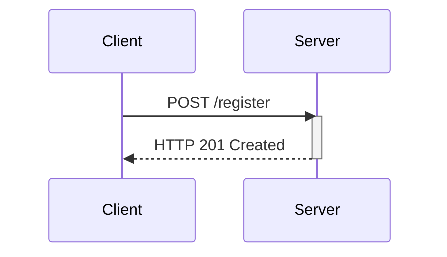

## Mass Assignment Vulnerability in APIs

### Introduction

Mass assignment, also known as overposting, is a common security vulnerability found in web applications and APIs. This vulnerability occurs when an application allows an attacker to set arbitrary object properties through a form or API call, potentially leading to unauthorized privilege escalation or data manipulation. In the context of API security, this can be particularly dangerous because APIs often handle sensitive operations and data.

### Understanding Mass Assignment

#### What is Mass Assignment?

Mass assignment refers to the practice of allowing an application to automatically map incoming data to an object's properties. Typically, this happens during the creation or update of an entity in a database. For instance, when a user registers on a website, their input might be mapped directly to a `User` object in the backend.

#### Why Does Mass Assignment Matter?

The primary concern with mass assignment is that it can allow an attacker to manipulate fields that should not be accessible via the API. For example, an attacker might be able to set a user's `isAdmin` flag to `true`, thereby gaining administrative privileges.

#### How Does Mass Assignment Work Under the Hood?

In many frameworks, such as Ruby on Rails, Django, or Spring Boot, developers can easily map incoming request data to model objects using ORM (Object-Relational Mapping) tools. This convenience comes with a risk if proper validation and sanitization are not implemented.

### Example Scenario: User Registration

Let's consider a scenario where a user is registering on a website through an API endpoint. The registration process involves sending a POST request to the `/register` endpoint with user details.

#### User Structure

Assume the `User` object has the following properties:

```json
{
  "userId": "unique_id",
  "username": "john_doe",
  "email": "john@example.com",
  "hasAdminRole": false
}
```

Here, `hasAdminRole` is a boolean property that indicates whether the user has administrative privileges.

#### Vulnerable Code Example

Consider the following vulnerable code snippet in a hypothetical framework:

```python
class UserController:
    def register(self, request):
        user_data = request.json
        user = User(**user_data)
        db.session.add(user)
        db.session.commit()
        return {"message": "User registered successfully"}
```

In this code, the `User` object is created directly from the incoming JSON data (`user_data`). An attacker can exploit this by sending a request with the `hasAdminRole` field set to `true`.

#### Exploiting Mass Assignment

An attacker can craft a malicious request like this:

```http
POST /register HTTP/1.1
Host: example.com
Content-Type: application/json

{
  "username": "attacker",
  "email": "attacker@example.com",
  "hasAdminRole": true
}
```

If the server processes this request without proper validation, the attacker will be registered with administrative privileges.

### Real-World Examples

#### Recent Breaches and CVEs

Several high-profile breaches have been attributed to mass assignment vulnerabilities. For example:

- **CVE-2019-11510**: A mass assignment vulnerability was discovered in the popular PHP framework Laravel. Attackers could exploit this to gain unauthorized access to administrative functions.
- **CVE-2020-14882**: A similar issue was found in the Ruby on Rails framework, allowing attackers to escalate privileges by manipulating certain fields in API requests.

### Detection and Prevention

#### How to Detect Mass Assignment Vulnerabilities

To detect mass assignment vulnerabilities, you can perform static code analysis and dynamic testing:

1. **Static Code Analysis**: Use tools like SonarQube, Fortify, or Veracode to scan your codebase for patterns that indicate mass assignment.
2. **Dynamic Testing**: Use automated testing tools like Burp Suite, OWASP ZAP, or Postman to simulate attacks and check if the application allows unauthorized field manipulation.

#### How to Prevent Mass Assignment

To prevent mass assignment vulnerabilities, follow these best practices:

1. **Whitelist Attributes**: Explicitly specify which attributes can be updated through the API. This ensures that only allowed fields can be modified.
2. **Input Validation**: Validate all incoming data against strict rules. Ensure that only expected values are accepted for each field.
3. **Use Strong Typing**: Utilize strong typing in your programming language to enforce type constraints on input data.
4. **Role-Based Access Control (RBAC)**: Implement RBAC to ensure that users can only modify fields appropriate to their roles.

#### Secure Coding Fixes

Here’s how you can implement these best practices in code:

##### Whitelisting Attributes

```python
class UserController:
    def register(self, request):
        allowed_fields = ['username', 'email']
        user_data = {k: v for k, v in request.json.items() if k in allowed_fields}
        user = User(**user_data)
        db.session.add(user)
        db.session.commit()
        return {"message": "User registered successfully"}
```

##### Input Validation

```python
from flask import request
from werkzeug.exceptions import BadRequest

class UserController:
    def register(self, request):
        user_data = request.json
        if 'username' not in user_data or 'email' not in user_data:
            raise BadRequest("Missing required fields")
        
        if not isinstance(user_data['username'], str) or not isinstance(user_data['email'], str):
            raise BadRequest("Invalid field types")
        
        user = User(username=user_data['username'], email=user_data['email'])
        db.session.add(user)
        db.session.commit()
        return {"message": "User registered successfully"}
```

### Mermaid Diagrams

#### Request Flow Diagram



#### Vulnerable vs. Secure Code Comparison

```mermaid
graph LR
    A[Vulnerable Code] --> B[User(**request.json)]
    C[Secure Code] --> D[allowed_fields = ['username', 'email']]
    E[filtered_data = {k: v for k, v in request.json.items() if k in allowed_fields}]
    F[User(**filtered_data)]
```

### Hands-On Labs

For practical experience with mass assignment vulnerabilities, consider the following labs:

- **PortSwigger Web Security Academy**: Offers detailed modules on mass assignment and other API security issues.
- **OWASP Juice Shop**: A deliberately insecure web app for practicing various security techniques, including mass assignment exploitation.
- **DVWA (Damn Vulnerable Web Application)**: Provides a variety of web application vulnerabilities, including mass assignment, for hands-on learning.

By thoroughly understanding and implementing the best practices outlined above, you can significantly reduce the risk of mass assignment vulnerabilities in your APIs.

---
<!-- nav -->
[[03-API6 Mass Assignment|API6 Mass Assignment]] | [[API Security/05-OWASP API TOP 10/07-API6 Mass Assignment/00-Overview|Overview]] | [[05-Understanding Mass Assignment Vulnerability|Understanding Mass Assignment Vulnerability]]
