## Introduction to API7 Security Misconfiguration

Security misconfiguration is one of the most critical issues in the OWASP API Top 10. It encompasses a wide range of vulnerabilities that arise from improper setup, configuration, and maintenance of an API environment. This chapter delves deep into the various aspects of security misconfiguration, providing comprehensive explanations, real-world examples, and practical guidance on how to prevent and defend against such vulnerabilities.

### Goals of Security Configuration

The primary goals of proper security configuration include:

1. **Unpatched Systems**: Ensuring that all systems and components are up-to-date with the latest security patches.
2. **Protected Files and Directories**: Securing sensitive files and directories to prevent unauthorized access.
3. **Properly Configured Images**: Ensuring that Docker images and other containerized environments are configured securely.
4. **Up-to-Date and Properly Configured TLS**: Implementing Transport Layer Security (TLS) correctly to protect data in transit.
5. **Exposed Storage or Server Management Panels**: Protecting storage and management interfaces from unauthorized exposure.
6. **Missing CORS Policy**: Implementing Cross-Origin Resource Sharing (CORS) policies to control access to resources.
7. **Security Headers**: Adding security headers to HTTP responses to enhance security.
8. **Error Messages with Stack Traces**: Avoiding the exposure of detailed error messages that can reveal sensitive information.
9. **Unnecessary Features Enabled**: Disabling unnecessary features to reduce the attack surface.

### Unpatched Systems

#### What is an Unpatched System?

An unpatched system refers to a software component or system that has not been updated with the latest security patches. These patches typically address known vulnerabilities that could be exploited by attackers.

#### Why is it Important?

Unpatched systems are a significant security risk because they leave the door open for attackers to exploit known vulnerabilities. Regular patching ensures that the system remains secure against the latest threats.

#### How Does it Work?

When a vulnerability is discovered in a software component, the vendor releases a patch to fix the issue. If the system is not updated with this patch, it remains vulnerable to attacks targeting that specific vulnerability.

#### Real-World Example

One of the most notable examples of an unpatched system leading to a major breach is the Equifax data breach in 2017. The breach was caused by a vulnerability in Apache Struts, which had been patched, but Equifax failed to apply the update. This resulted in the exposure of sensitive personal data of millions of individuals.

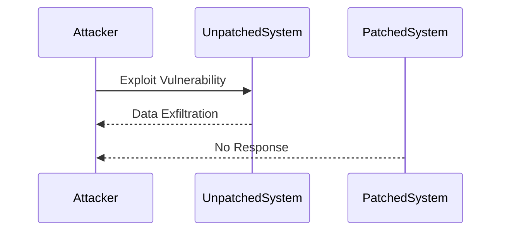

#### How to Prevent / Defend

**Detection**: Regularly scan systems for known vulnerabilities using tools like Nessus, Qualys, or OpenVAS.

**Prevention**: Implement a robust patch management process to ensure that all systems are regularly updated with the latest security patches.

**Secure Coding Fix**: Ensure that all software components are kept up-to-date with the latest security patches.

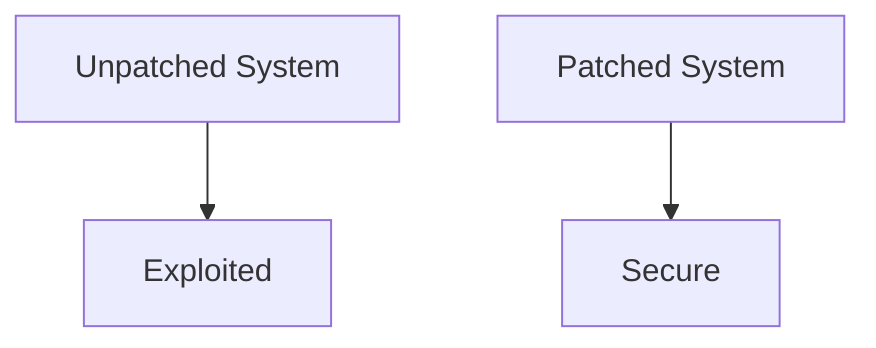

### Protected Files and Directories

#### What are Protected Files and Directories?

Protected files and directories refer to sensitive files and directories that are secured to prevent unauthorized access. This includes ensuring that sensitive data is stored in a secure location and that appropriate access controls are in place.

#### Why is it Important?

Sensitive data, such as user credentials, financial information, and intellectual property, should be protected from unauthorized access. Improperly securing these files and directories can lead to data breaches and other security incidents.

#### How Does it Work?

Access controls, such as file permissions and directory restrictions, are used to limit who can access sensitive files and directories. Additionally, encryption can be used to further protect the data.

#### Real-World Example

In 22, a healthcare provider suffered a data breach due to improperly secured files containing sensitive patient information. The breach occurred because the files were accessible to unauthorized users due to weak access controls.

#### How to Prevent / Defend

**Detection**: Regularly audit file permissions and directory restrictions to ensure that sensitive data is properly secured.

**Prevention**: Implement strong access controls and encryption to protect sensitive files and directories.

**Secure Coding Fix**: Ensure that sensitive data is stored in a secure location and that appropriate access controls are in place.

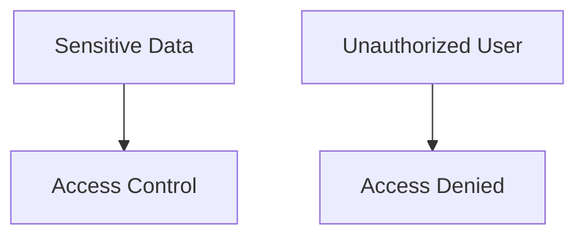

### Properly Configured Images

#### What are Properly Configured Images?

Properly configured images refer to Docker images and other containerized environments that are set up securely. This includes removing unnecessary packages, setting appropriate permissions, and ensuring that the image is based on a trusted base image.

#### Why is it Important?

Improperly configured images can introduce security risks, such as exposing sensitive data or allowing unauthorized access. Ensuring that images are properly configured helps to minimize these risks.

#### How Does it Work?

Container images are built using a Dockerfile, which specifies the steps to build the image. By following best practices, such as removing unnecessary packages and setting appropriate permissions, the image can be made more secure.

#### Real-World Example

In 2021, a vulnerability was discovered in a popular Docker image that allowed attackers to gain unauthorized access to the underlying system. The vulnerability was caused by improper configuration of the image.

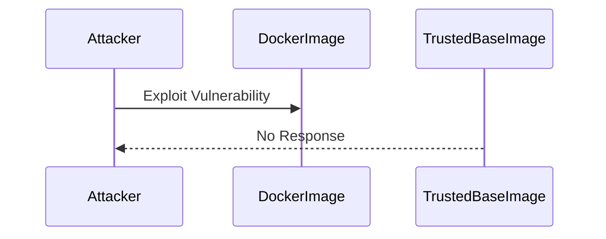

#### How to Prevent / Defend

**Detection**: Regularly scan Docker images for known vulnerabilities using tools like Clair or Trivy.

**Prevention**: Follow best practices for building Docker images, such as removing unnecessary packages and setting appropriate permissions.

**Secure Coding Fix**: Ensure that Docker images are based on trusted base images and follow best practices for building secure images.

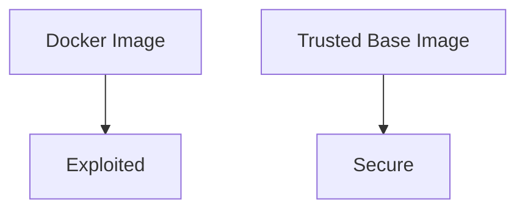

### Up-to-Date and Properly Configured TLS

#### What is Up-to-Date and Properly Configured TLS?

Transport Layer Security (TLS) is a cryptographic protocol that provides communication security over a computer network. Ensuring that TLS is up-to-date and properly configured helps to protect data in transit from eavesdropping and tampering.

#### Why is it Important?

TLS is crucial for protecting sensitive data during transmission. Improperly configured TLS can leave the data vulnerable to attacks, such as man-in-the-middle (MITM) attacks.

#### How Does it Work?

TLS uses a combination of symmetric and asymmetric cryptography to encrypt data in transit. Proper configuration involves selecting strong ciphers, enabling forward secrecy, and ensuring that the TLS version is up-to-date.

#### Real-World Example

In 2018, a vulnerability was discovered in the TLS implementation of a popular web server, which allowed attackers to decrypt traffic. The vulnerability was caused by improper configuration of TLS.

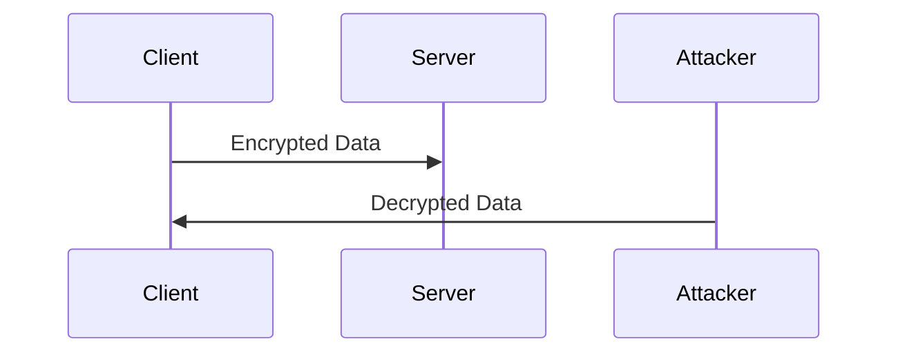

#### How to Prevent / Defend

**Detection**: Regularly audit TLS configurations using tools like SSL Labs or Qualys SSL Server Test.

**Prevention**: Ensure that TLS is up-to-date and properly configured, including selecting strong ciphers and enabling forward secrecy.

**Secure Coding Fix**: Ensure that TLS is properly configured and up-to-date.

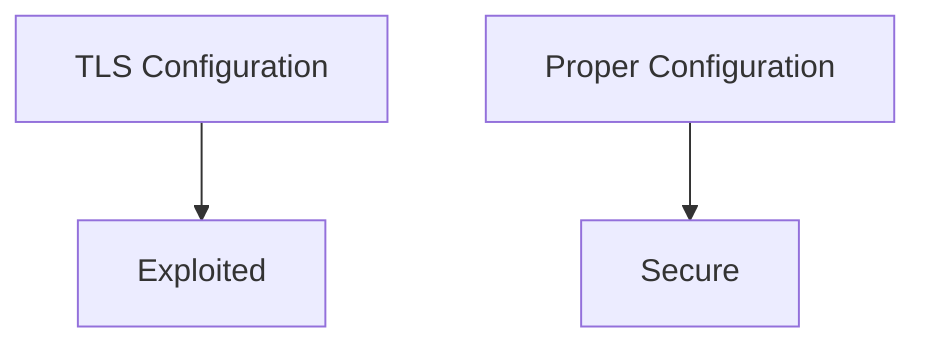

### Exposed Storage or Server Management Panels

#### What are Exposed Storage or Server Management Panels?

Exposed storage or server management panels refer to storage and management interfaces that are accessible to unauthorized users. This can include FTP servers, database management interfaces, and other administrative tools.

#### Why is it Important?

Exposing storage or server management panels can allow attackers to gain unauthorized access to sensitive data and perform malicious actions. Ensuring that these interfaces are properly secured helps to minimize these risks.

#### How Does it Work?

Access controls, such as authentication and authorization, are used to limit who can access storage and server management panels. Additionally, encryption can be used to further protect the data.

#### Real-World Example

In 2020, a vulnerability was discovered in a popular FTP server that allowed attackers to gain unauthorized access to sensitive data. The vulnerability was caused by improper configuration of the FTP server.

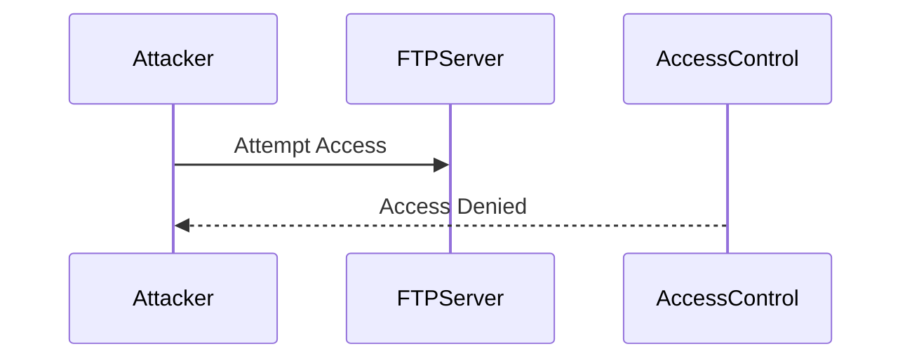

#### How to Prevent / Defend

**Detection**: Regularly audit access controls and encryption settings to ensure that storage and server management panels are properly secured.

**Prevention**: Implement strong access controls and encryption to protect storage and server management panels.

**Secure Coding Fix**: Ensure that storage and server management panels are properly secured.

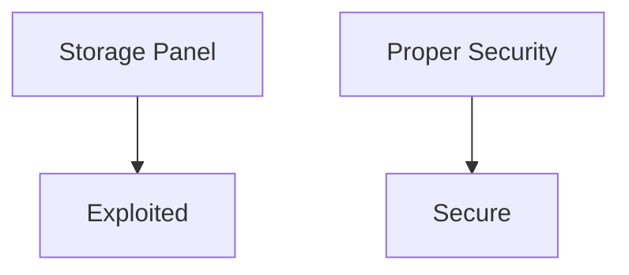

### Missing CORS Policy

#### What is a CORS Policy?

Cross-Origin Resource Sharing (CORS) is a mechanism that allows web applications to make requests to a different origin than the one that served the web page. A CORS policy defines which origins are allowed to make requests to a particular resource.

#### Why is it Important?

A missing CORS policy can allow attackers to make unauthorized requests to a resource, potentially leading to data theft or other malicious actions. Ensuring that a CORS policy is in place helps to minimize these risks.

#### How Does it Work?

A CORS policy is defined using HTTP headers, such as `Access-Control-Allow-Origin`. By specifying which origins are allowed to make requests, the policy helps to control access to the resource.

#### Real-World Example

In 2019, a vulnerability was discovered in a popular web application that allowed attackers to make unauthorized requests to a resource due to a missing CORS policy. The vulnerability was caused by the absence of a CORS policy.

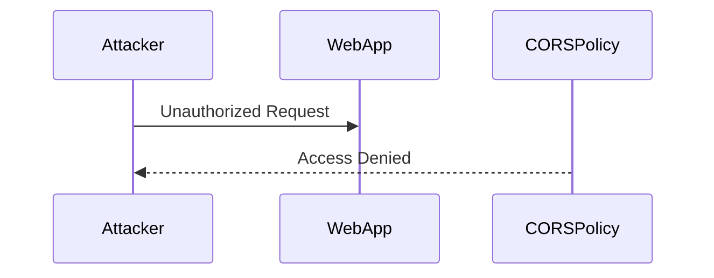

#### How to Prevent / Defend

**Detection**: Regularly audit CORS policies to ensure that they are properly configured.

**Prevention**: Implement a CORS policy to control access to resources.

**Secure Coding Fix**: Ensure that a CORS policy is in place to control access to resources.

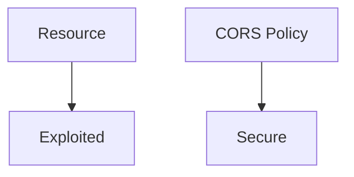

### Security Headers

#### What are Security Headers?

Security headers are HTTP headers that are added to responses to enhance security. These headers include `Content-Security-Policy`, `X-Frame-Options`, `X-Content-Type-Options`, and others.

#### Why is it Important?

Adding security headers to HTTP responses helps to mitigate various types of attacks, such as cross-site scripting (XSS) and clickjacking. Ensuring that security headers are properly configured helps to minimize these risks.

#### How Does it Work?

Security headers are added to HTTP responses using the `Header` directive in the web server configuration. By specifying the appropriate values for these headers, the server can help to protect the application from various types of attacks.

#### Real-World Example

In 2021, a vulnerability was discovered in a popular web application that allowed attackers to inject malicious scripts due to the absence of a `Content-Security-Policy` header. The vulnerability was caused by the absence of a security header.

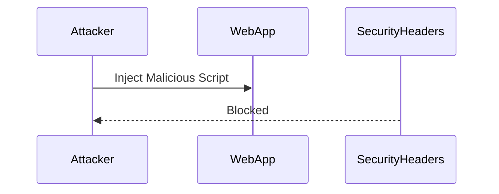

#### How to Prevent / Defend

**Detection**: Regularly audit security headers to ensure that they are properly configured.

**Prevention**: Implement security headers to protect the application from various types of attacks.

**Secure Coding Fix**: Ensure that security headers are properly configured.

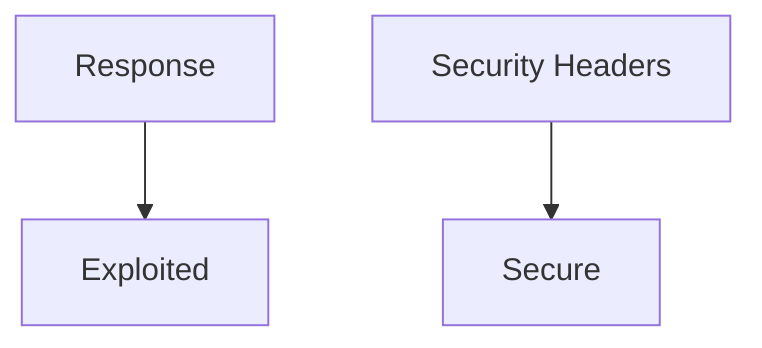

### Error Messages with Stack Traces

#### What are Error Messages with Stack Traces?

Error messages with stack traces refer to detailed error messages that are displayed to users, which can reveal sensitive information about the underlying system. These messages can provide attackers with valuable information that can be used to exploit vulnerabilities.

#### Why is it Important?

Displaying detailed error messages can provide attackers with valuable information that can be used to exploit vulnerabilities. Ensuring that error messages are properly configured helps to minimize these risks.

#### How Does it Work?

Error messages are generated by the application when an error occurs. By default, many applications display detailed error messages that can reveal sensitive information. Proper configuration involves disabling detailed error messages and displaying generic error messages instead.

#### Real-World Example

In 2020, a vulnerability was discovered in a popular web application that allowed attackers to obtain sensitive information due to the presence of detailed error messages. The vulnerability was caused by the presence of detailed error messages.

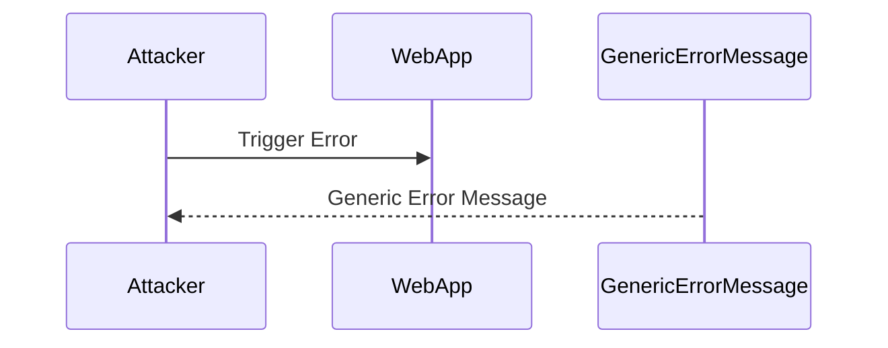

#### How to Prevent / Defend

**Detection**: Regularly audit error messages to ensure that they are properly configured.

**Prevention**: Disable detailed error messages and display generic error messages instead.

**Secure Coding Fix**: Ensure that error messages are properly configured.

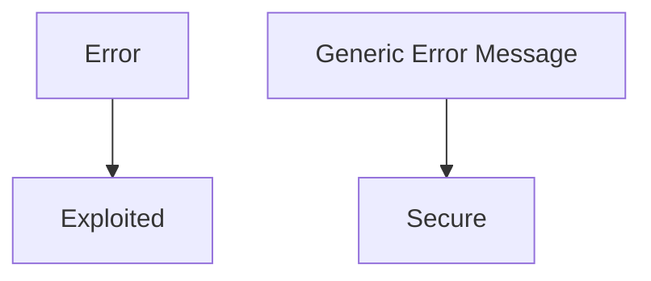

### Unnecessary Features Enabled

#### What are Unnecessary Features Enabled?

Unnecessary features enabled refer to features that are enabled in an application but are not required for its operation. Enabling unnecessary features increases the attack surface and can introduce security risks.

#### Why is it Important?

Enabling unnecessary features increases the attack surface and can introduce security risks. Ensuring that only necessary features are enabled helps to minimize these risks.

#### How Does it Work?

Features are enabled in an application using configuration settings. By disabling unnecessary features, the attack surface can be reduced, making the application more secure.

#### Real-World Example

In 2019, a vulnerability was discovered in a popular web application that allowed attackers to exploit an unnecessary feature. The vulnerability was caused by the presence of an unnecessary feature.

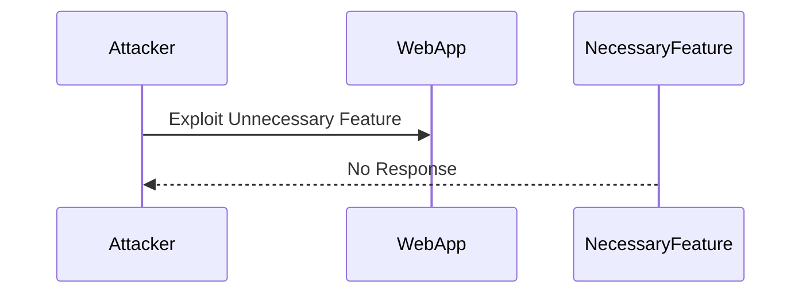

#### How to Prevent / Defend

**Detection**: Regularly audit features to ensure that only necessary features are enabled.

**Prevention**: Disable unnecessary features to reduce the attack surface.

**Secure Coding Fix**: Ensure that only necessary features are enabled.

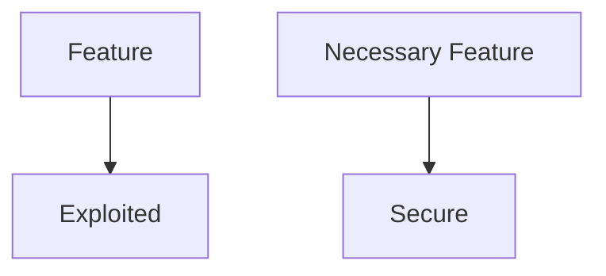

### Conclusion

Security misconfiguration is a critical issue that can lead to serious security vulnerabilities. By ensuring that systems are properly configured, files and directories are protected, images are properly configured, TLS is up-to-date, storage and management panels are secured, CORS policies are in place, security headers are added, error messages are properly configured, and unnecessary features are disabled, the risk of security misconfiguration can be minimized.

### Practice Labs

For hands-on practice with API security, consider the following labs:

- **PortSwigger Web Security Academy**: Offers interactive labs to practice identifying and exploiting security misconfigurations.
- **OWASP Juice Shop**: Provides a vulnerable web application to practice identifying and exploiting security misconfigurations.
- **DVWA (Damn Vulnerable Web Application)**: Offers a vulnerable web application to practice identifying and exploiting security misconfigurations.
- **WebGoat**: Provides a vulnerable web application to practice identifying and exploiting security misconfigurations.

These labs provide a safe environment to practice and improve your skills in identifying and defending against security misconfigurations.

---
<!-- nav -->
[[API Security/05-OWASP API TOP 10/08-API7 Security Misconfiguration/00-Overview|Overview]] | [[02-API7 Security Misconfiguration|API7 Security Misconfiguration]]
