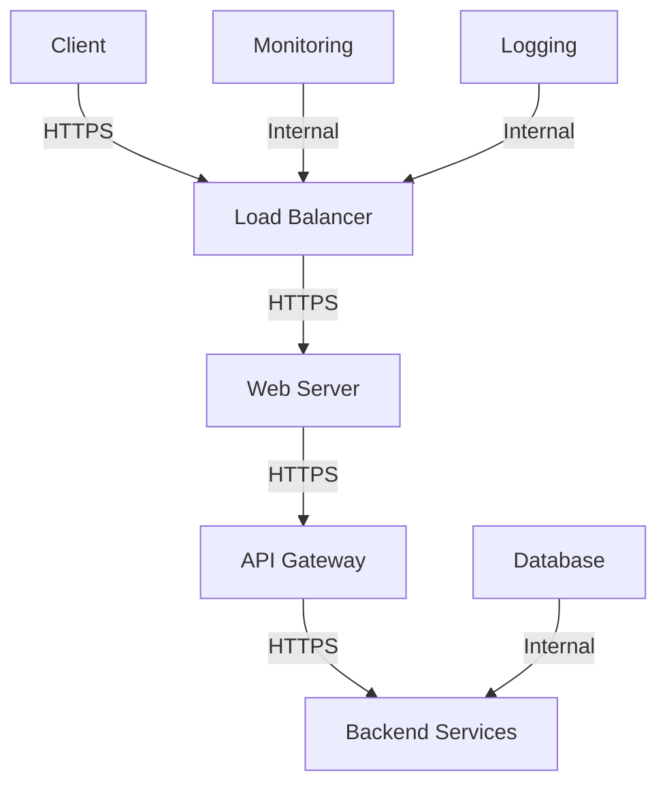

## Security Misconfiguration in APIs

### Introduction to Security Misconfiguration

Security misconfiguration is a critical issue that can expose sensitive user data and system details, leading to potential full server compromise. This vulnerability can occur at any level of the API stack, from the network level to the application level. Automated tools are available to detect and exploit these misconfigurations, making it essential to understand and mitigate them effectively.

### Understanding Security Misconfiguration

#### Definition and Importance

Security misconfiguration refers to the improper setup or configuration of security settings within an API environment. This can include:

- **Network Level**: Improper firewall rules, open ports, and unsecured network protocols.
- **Application Level**: Insecure default configurations, missing security patches, and misconfigured authentication mechanisms.

Misconfigurations can provide attackers with unauthorized access to sensitive information and system details, potentially leading to full server compromise. Therefore, it is crucial to ensure that all security settings are properly configured and regularly reviewed.

#### Real-World Examples

Recent real-world examples of security misconfiguration include:

- **CVE-2021-21972**: A misconfiguration in the Apache Tomcat server allowed unauthorized access to sensitive files and directories. This vulnerability was exploited to gain unauthorized access to internal systems.
- **Breaches involving exposed credentials**: In several incidents, attackers gained access to internal systems by exploiting misconfigured servers that exposed sensitive credentials, such as API keys and tokens.

### Detailed Example: Exposed Bash History File

One common example of security misconfiguration is the exposure of a Bash history file (`~/.bash_history`). This file contains a record of commands executed by users, including those used to access internal APIs.

#### Scenario

Imagine an attacker discovers a Bash history file located in the root directory of a server. The file contains commands used by DevOps teams to access internal APIs. Here is an example of such a command:

```bash
curl -X GET https://api.example.com/endpoint -H "Authorization: Bearer <token>"
```

The attacker can extract the `Authorization` token from this command and use it to make unauthorized API calls.

#### Vulnerable Code Example

Here is a vulnerable code snippet showing how an attacker might exploit this misconfiguration:

```python
import requests

# Extracted from the Bash history file
authorization_token = "<token>"

# Construct the API request
url = "https://api.example.com/endpoint"
headers = {
    "Authorization": f"Bearer {authorization_token}"
}

response = requests.get(url, headers=headers)
print(response.text)
```

#### Secure Code Example

To prevent such vulnerabilities, it is essential to ensure that sensitive information is not stored in easily accessible locations. Here is a secure code example:

```python
import os
import requests

# Retrieve the authorization token securely
authorization_token = os.getenv("API_TOKEN")

# Construct the API request
url = "https://api.example.com/endpoint"
headers = {
    "Authorization": f"Bearer {authorization_token}"
}

response = requests.get(url, headers=headers)
print(response.text)
```

In this secure example, the authorization token is retrieved from an environment variable, ensuring that it is not stored in plain text.

### How to Prevent / Defend Against Security Misconfiguration

#### Detection

To detect security misconfigurations, organizations should implement automated scanning tools and regular security audits. These tools can identify misconfigured settings and alert administrators to potential vulnerabilities.

#### Prevention

Preventing security misconfigurations involves several best practices:

1. **Regular Audits**: Conduct regular security audits to identify and correct misconfigurations.
2. **Automated Scanning Tools**: Use automated scanning tools to detect misconfigurations and vulnerabilities.
3. **Secure Default Configurations**: Ensure that all systems are configured with secure default settings.
4. **Patch Management**: Regularly apply security patches and updates to all systems.
5. **Least Privilege Principle**: Implement the least privilege principle to minimize the risk of unauthorized access.

#### Secure Configuration Example

Here is an example of a secure configuration for an API server:

```json
{
  "server": {
    "port": 8080,
    "ssl": {
      "enabled": true,
      "keyStorePath": "/etc/ssl/private/server.key",
      "trustStorePath": "/etc/ssl/certs/server.crt"
    }
  },
  "security": {
    "auth": {
      "type": "bearer",
      "tokenValidation": {
        "issuer": "https://auth.example.com",
        "audience": "api.example.com"
      }
    },
    "cors": {
      "allowedOrigins": ["https://client.example.com"],
      "allowedMethods": ["GET", "POST", "PUT", "DELETE"]
    }
  }
}
```

In this configuration, SSL is enabled, and secure authentication mechanisms are implemented. Additionally, CORS settings are configured to restrict access to trusted origins.

### Network Topology Diagram

A network topology diagram can help visualize the different layers where security misconfigurations can occur. Here is a mermaid diagram illustrating a typical API network topology:



In this diagram, each layer should be configured securely to prevent unauthorized access.

### Conclusion

Security misconfiguration is a significant threat to API security. By understanding the risks and implementing best practices, organizations can mitigate these vulnerabilities and protect sensitive data. Regular audits, automated scanning tools, and secure default configurations are essential components of a robust security strategy.

### Hands-On Labs

For hands-on practice, consider using the following labs:

- **PortSwigger Web Security Academy**: Offers interactive labs to practice identifying and exploiting security misconfigurations.
- **OWASP Juice Shop**: Provides a vulnerable web application to practice finding and fixing security issues.
- **DVWA (Damn Vulnerable Web Application)**: A deliberately insecure web application for practicing web security skills.

These labs provide practical experience in detecting and preventing security misconfigurations in real-world scenarios.

---
<!-- nav -->
[[03-Security Misconfiguration (API7)|Security Misconfiguration (API7)]] | [[API Security/05-OWASP API TOP 10/08-API7 Security Misconfiguration/00-Overview|Overview]] | [[API Security/05-OWASP API TOP 10/08-API7 Security Misconfiguration/05-Practice Questions & Answers|Practice Questions & Answers]]
