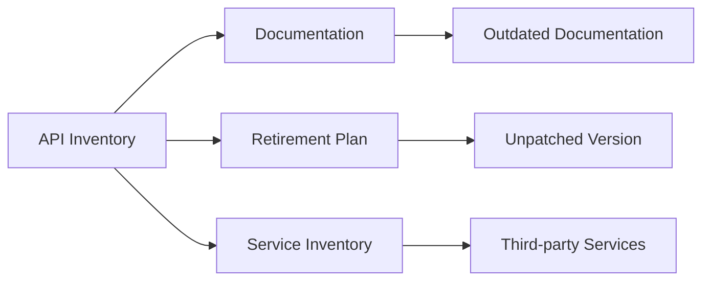
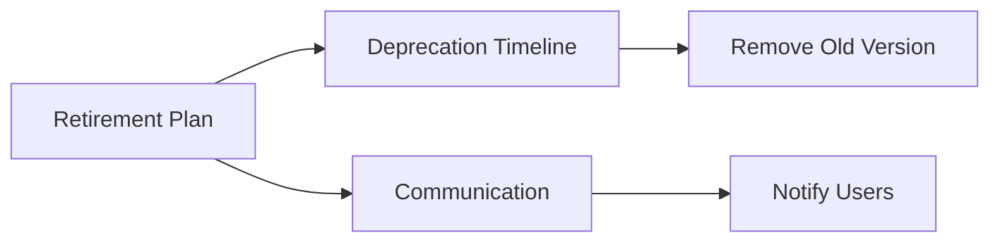
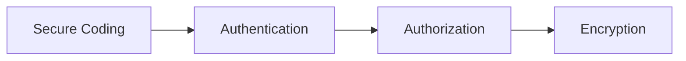

## Improper Asset Management in APIs

### Introduction

Improper asset management in APIs is a critical issue that can lead to significant security vulnerabilities. This problem encompasses several aspects, including outdated documentation, lack of retirement plans for API versions, missing or inaccurate host and service inventories, and the presence of unpatched or unprotected older API versions. Each of these issues can expose your system to various attacks, such as unauthorized access, data breaches, and exploitation of known vulnerabilities.

### Documentation Issues

#### Outdated Documentation

**What:** Documentation is essential for developers and users to understand how to interact with an API. Outdated documentation can lead to confusion and misuse of the API.

**Why:** Proper documentation ensures that users have accurate information about the API's capabilities, endpoints, and usage patterns. Without up-to-date documentation, users might rely on incorrect or obsolete information, leading to potential security risks.

**How:** Documentation should be regularly reviewed and updated to reflect any changes in the API. This includes adding new features, deprecating old ones, and providing clear instructions on how to use the API securely.

**Example:** Consider an API endpoint `/api/v1/users` that was deprecated in favor of `/api/v2/users`. If the documentation still references the old endpoint, users might continue to use it, potentially exposing them to vulnerabilities that were fixed in the newer version.

```markdown
### Vulnerable Documentation Example
```
GET /api/v1/users
```

### Secure Documentation Example
```
GET /api/v2/users
Deprecated: GET /api/v1/users
```

### Retirement Plans for API Versions

#### Lack of Retirement Plans

**What:** A retirement plan for API versions ensures that older versions are phased out in a controlled manner, reducing the risk of continued exposure to vulnerabilities.

**Why:** Older API versions may contain known vulnerabilities that have been fixed in newer versions. Without a retirement plan, these older versions might remain active, posing a security risk.

**How:** A retirement plan should include a timeline for deprecating and eventually removing older API versions. This process should be communicated to users through documentation and notifications.

**Example:** Suppose an API version `/api/v1` has a known vulnerability that was fixed in `/api/v2`. The retirement plan should specify a date by which `/api/v1` will be deprecated and removed, ensuring that all users migrate to the newer version.

```markdown
### Retirement Plan Example
```
Deprecation Timeline:
- Deprecate /api/v1 on 2023-12-31
- Remove /api/v1 on 2024-01-31
```

### Host and Service Inventories

#### Missing or Inaccurate Inventories

**What:** Host and service inventories provide a comprehensive list of all systems and services within an organization, including their configurations and dependencies.

**Why:** Accurate inventories help in identifying and managing all assets, ensuring that none are overlooked during security assessments and updates.

**How:** Regular audits and updates to the inventory ensure that all systems and services are accounted for. This includes both internal and third-party services.

**Example:** An organization might have an internal API `/api/v1` and a third-party service `/thirdparty/api/v1`. Both should be listed in the inventory to ensure they are included in security checks.

```markdown
### Inventory Example
```
Host Inventory:
- Internal API: /api/v1
- Third-party API: /thirdparty/api/v1
```

### Unpatched or Unprotected Older API Versions

#### Running Unpatched or Unprotected Versions

**What:** Unpatched or unprotected older API versions pose a significant security risk, as they may contain known vulnerabilities that have been fixed in newer versions.

**Why:** These older versions can be exploited by attackers to gain unauthorized access or perform malicious actions. Ensuring that all versions are patched and protected minimizes the risk of such attacks.

**How:** Regularly updating and patching all API versions ensures that known vulnerabilities are addressed. Additionally, implementing security measures such as authentication, authorization, and encryption helps protect the API.

**Example:** An older API version `/api/v1` might have a known vulnerability that allows unauthorized access to user data. By updating to `/api/v2`, which includes a fix for this vulnerability, the risk is mitigated.

```markdown
### Vulnerable API Version Example
```
GET /api/v1/users
```

### Secure API Version Example
```
GET /api/v2/users
```

### Real-World Examples

#### Recent Breaches and CVEs

**Example 1:** In 2021, a major financial institution suffered a data breach due to an unpatched API version. The older version contained a vulnerability that allowed attackers to access sensitive user data. The institution had failed to update its API documentation and retirement plan, leaving the older version exposed.

**Example 2:** A recent CVE (CVE-2022-XXXX) identified a vulnerability in an older API version used by a popular e-commerce platform. The vulnerability allowed attackers to bypass authentication and access user accounts. The platform had not properly documented the deprecation of the older version, leading to continued exposure.

### How to Prevent / Defend

#### Detection

**What:** Detecting improper asset management requires regular audits and monitoring of API versions, documentation, and inventories.

**How:** Implement automated tools to scan for outdated documentation, unpatched versions, and missing inventories. Regularly review logs and alerts to identify any discrepancies.

**Example:** Use a tool like `API Inventory Scanner` to automatically check for outdated documentation and unpatched versions.

```markdown
### Detection Example
```
API Inventory Scanner Output:
- Outdated Documentation: /api/v1
- Unpatched Version: /api/v1
```

#### Prevention

**What:** Preventing improper asset management involves maintaining accurate documentation, implementing retirement plans, and regularly updating and patching API versions.

**How:** Establish a process for reviewing and updating documentation, creating retirement plans, and conducting regular security assessments. Ensure that all API versions are patched and protected.

**Example:** Create a process for reviewing documentation every quarter and updating it as needed. Implement a retirement plan for each API version, specifying a timeline for deprecation and removal.

```markdown
### Prevention Example
```
Documentation Review Process:
- Quarterly review
- Update as needed

Retirement Plan:
- Deprecate /api/v1 on 2023-12-31
- Remove /api/v1 on 2024-01-31
```

#### Secure Coding Fixes

**What:** Secure coding practices help mitigate the risks associated with improper asset management.

**How:** Implement authentication, authorization, and encryption to protect API versions. Ensure that all code is reviewed and tested for security vulnerabilities.

**Example:** Compare the insecure and secure versions of an API endpoint.

```markdown
### Insecure Code Example
```
GET /api/v1/users
```

### Secure Code Example
```
GET /api/v2/users
Authentication Required
Authorization Required
Encryption Enabled
```

### Conclusion

Improper asset management in APIs can lead to significant security vulnerabilities. By maintaining accurate documentation, implementing retirement plans, and regularly updating and patching API versions, organizations can minimize the risk of exposure to known vulnerabilities. Regular audits and monitoring are essential to detect and prevent improper asset management. Secure coding practices further enhance the security of API versions, ensuring that they are protected against unauthorized access and malicious actions.

### Practice Labs

For hands-on practice with API security, consider the following well-known labs:

- **PortSwigger Web Security Academy**: Offers a variety of labs focused on web application security, including API security.
- **OWASP Juice Shop**: A deliberately insecure web application for practicing web security skills, including API security.
- **DVWA (Damn Vulnerable Web Application)**: A PHP/MySQL web application that is riddled with vulnerabilities, including those related to API security.
- **WebGoat**: An interactive, gamified training application for learning about web application security.

These labs provide practical experience in identifying and mitigating improper asset management in APIs, helping to reinforce the concepts covered in this chapter.

### Diagrams

#### API Inventory Diagram



#### Retirement Plan Diagram



#### Secure Coding Practices Diagram



By following these guidelines and using the provided examples, you can effectively manage your API assets and mitigate the risks associated with improper asset management.

---
<!-- nav -->
[[API Security/05-OWASP API TOP 10/10-API9 Improper assets management/00-Overview|Overview]] | [[02-Improper Assets Management in API Security|Improper Assets Management in API Security]]
