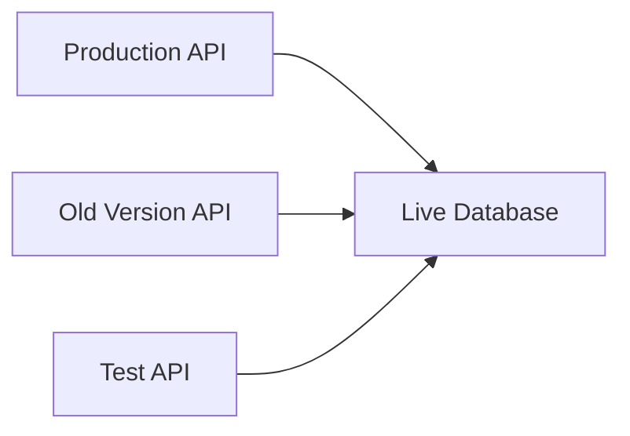
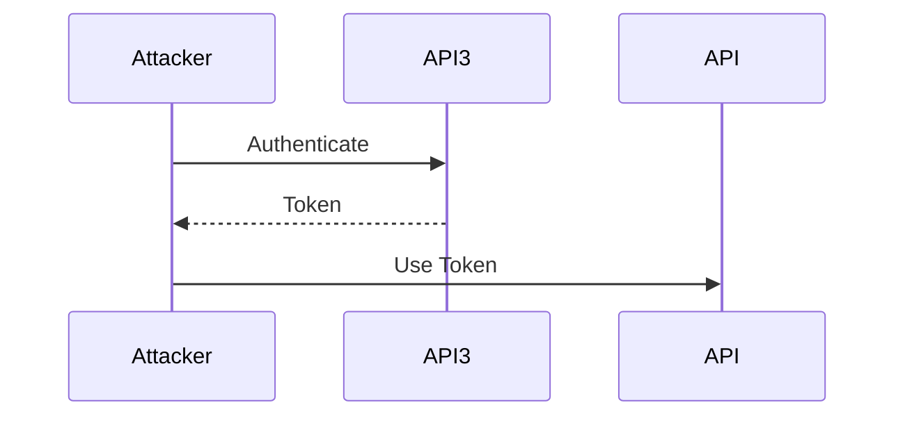

## Improper Assets Management in APIs

### Introduction

Improper assets management in APIs is a critical issue that can lead to significant security vulnerabilities. This problem arises when old or non-production versions of APIs are not properly maintained but still have access to the production environment. This situation can expose the system to various attacks, as attackers can exploit these unpatched and less-secured endpoints to gain unauthorized access to sensitive data or perform malicious actions.

### Understanding the Problem

#### What is Improper Assets Management?

Improper assets management refers to the lack of proper maintenance and control over different versions of APIs, especially those that are not in active production use. These non-production APIs often remain connected to the live database or other critical resources, making them potential entry points for attackers.

#### Why Does It Matter?

Improper assets management is a significant concern because:

1. **Unpatched Vulnerabilities**: Old or non-production APIs are often left unpatched, meaning they may contain known vulnerabilities that can be exploited.
2. **Access to Production Resources**: These APIs can still access production databases and other critical resources, providing a direct path to sensitive data.
3. **Easier Targets**: Attackers prefer targeting older, less-secured endpoints because they require fewer sophisticated techniques compared to modern, well-protected APIs.

### Real-World Examples

#### Recent Breaches and CVEs

Several recent breaches highlight the risks associated with improper assets management:

1. **CVE-2021-44228 (Log4j)**: Although not directly related to APIs, this vulnerability demonstrates how unpatched components can be exploited. In many cases, older versions of APIs using vulnerable libraries were targeted.
2. **SolarWinds Supply Chain Attack**: This attack involved the exploitation of unpatched systems and underscores the importance of maintaining all systems, including non-production environments.

### Detailed Explanation

#### Example Scenario

Consider a company with multiple APIs:

- `api.hackerser.com` (production)
- `api3.hackerser.com` (old version)
- `test.hackerser.com` (testing)

All these APIs are connected to the same live database. If `api3.hackerser.com` and `test.hackerser.com` are not properly maintained, they can become easy targets for attackers.



### How It Functions

#### Authentication and Token Reuse

If an attacker gains access to one endpoint, they might be able to reuse authentication tokens to access other endpoints. For instance, if an attacker authenticates with `api3.hackerser.com`, they might use the same token to access `api.hackerser.com`.



### Detection and Prevention

#### How to Detect

To detect improper assets management, organizations should:

1. **Inventory All APIs**: Maintain a comprehensive list of all APIs, including their versions and purposes.
2. **Monitor Access Logs**: Regularly review logs to identify unauthorized access attempts to non-production APIs.
3. **Use Security Scanners**: Employ automated tools to scan for vulnerabilities in all APIs, including non-production ones.

#### How to Prevent

To prevent improper assets management, organizations should:

1. **Patch Regularly**: Ensure that all APIs, including non-production ones, are regularly patched against known vulnerabilities.
2. **Segregate Environments**: Use separate databases and resources for non-production environments to minimize the risk of exposure.
3. **Implement Access Controls**: Use strict access controls and authentication mechanisms to prevent unauthorized access to non-production APIs.

### Secure Coding Practices

#### Vulnerable Code Example

Consider an API endpoint that uses a shared token across multiple environments:

```python
# Vulnerable Code
from flask import Flask, request

app = Flask(__name__)

@app.route('/authenticate', methods=['POST'])
def authenticate():
    token = request.json['token']
    # Validate token logic here
    return {'status': 'success'}

if __name__ == '__main__':
    app.run()
```

#### Secure Code Example

To secure this, ensure that tokens are unique and validated appropriately:

```python
# Secure Code
from flask import Flask, request
import secrets

app = Flask(__name__)
TOKENS = {}

@app.route('/generate_token', methods=['POST'])
def generate_token():
    user_id = request.json['user_id']
    token = secrets.token_urlsafe(16)
    TOKENS[user_id] = token
    return {'token': token}

@app.route('/authenticate', methods=['POST'])
def authenticate():
    token = request.json['token']
    user_id = request.json['user_id']
    if TOKENS.get(user_id) == token:
        return {'status': 'success'}
    else:
        return {'status': 'failure'}

if __name__ == '__main__':
    app.run()
```

### Configuration Hardening

#### Example Configuration

Ensure that your API configurations are hardened to prevent unauthorized access:

```yaml
# Example Nginx Configuration
server {
    listen 80;
    server_name api.hackerser.com;

    location / {
        auth_basic "Restricted";
        auth_basic_user_file /etc/nginx/.htpasswd;
        proxy_pass http://localhost:5000;
    }
}
```

### Hands-On Labs

For practical experience with API security, consider the following labs:

- **PortSwigger Web Security Academy**: Offers detailed modules on API security, including improper assets management.
- **OWASP Juice Shop**: Provides a vulnerable application for practicing various security techniques.
- **DVWA (Damn Vulnerable Web Application)**: Useful for learning about web application security, including API-related issues.

### Conclusion

Improper assets management in APIs is a serious security concern that can lead to significant vulnerabilities. By understanding the risks, detecting and preventing improper management, and implementing secure coding practices, organizations can significantly reduce the likelihood of such attacks. Regular maintenance, strict access controls, and comprehensive monitoring are essential to ensuring the security of all API environments.

---
<!-- nav -->
[[02-Improper Assets Management in API Security|Improper Assets Management in API Security]] | [[API Security/05-OWASP API TOP 10/10-API9 Improper assets management/00-Overview|Overview]] | [[API Security/05-OWASP API TOP 10/10-API9 Improper assets management/04-Practice Questions & Answers|Practice Questions & Answers]]
