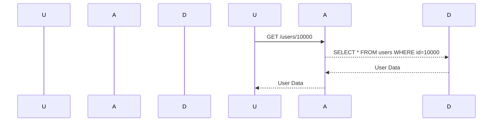
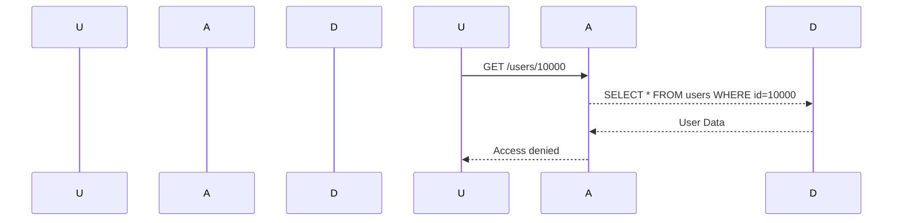

## Introduction to Broken Object-Level Authorization (BOLA)

Broken Object-Level Authorization (BOLA) is a critical security issue that arises when an application fails to properly restrict access to specific objects based on user permissions. This vulnerability can lead to unauthorized access to sensitive data, which can have severe consequences for both the organization and its users. In this section, we will delve deep into the concept of BOLA, its implications, and how to effectively prevent and defend against such vulnerabilities.

### What is BOLA?

BOLA occurs when an application exposes a reference to an internal implementation object, allowing attackers to reveal and understand the real identifier and format patterns used in the application's storage mechanism. By leveraging this behavior, attackers can enumerate identifiers and gain unauthorized access to data belonging to other users of the application.

#### Example Scenario

Consider an API call to a sensitive page, such as `/users/{userId}`. If the application does not enforce proper authorization checks, an attacker can manipulate the `userId` parameter to access data belonging to other users. For instance, if the current user ID is `123`, an attacker might try changing it to `10000` and see if they can retrieve data for another user.

### How BOLA Works

To understand BOLA, let's break down the process step-by-step:

1. **Exposure of Internal Identifiers**: The application exposes internal identifiers (such as user IDs) in a way that allows attackers to infer the structure and format of these identifiers.
   
2. **Enumeration of Identifiers**: Attackers can systematically try different identifier values to determine valid ones. This process is known as enumeration.

3. **Unauthorized Access**: Once valid identifiers are found, attackers can access sensitive data associated with those identifiers.

#### Real-World Example

A real-world example of BOLA can be seen in the case of a web application that exposes user profiles via an API endpoint like `/profile/{userId}`. If the application does not properly validate the `userId` parameter, an attacker can enumerate through various `userId` values to access other users' profiles.

### Background Theory

To fully grasp BOLA, it's essential to understand the underlying principles of object-level authorization and how it should be implemented correctly.

#### Object-Level Authorization

Object-level authorization refers to the practice of ensuring that users have the appropriate permissions to access specific objects within an application. This is typically achieved through mechanisms such as role-based access control (RBAC) and attribute-based access control (ABAC).

#### Role-Based Access Control (RBAC)

RBAC is a method of controlling access to resources based on the roles assigned to users. Each role is associated with a set of permissions, and users are granted access based on their roles.

#### Attribute-Based Access Control (ABAC)

ABAC is a more flexible approach that allows access decisions to be made based on attributes of the user, resource, and environment. This provides a fine-grained level of control over access.

### Recent Real-World Examples

Several high-profile breaches have been attributed to BOLA vulnerabilities. Here are a couple of recent examples:

#### CVE-2021-21972: Microsoft Exchange Server

In March 2021, a series of vulnerabilities were discovered in Microsoft Exchange Server, including a BOLA issue. Attackers exploited these vulnerabilities to gain unauthorized access to email servers, leading to widespread compromise.

#### CVE-2022-22965: Apache Log4j

The Log4j vulnerability (CVE-2022-22965) allowed attackers to execute arbitrary code on affected systems. While not directly related to BOLA, the exploitation of this vulnerability often involved unauthorized access to sensitive data, highlighting the importance of proper authorization controls.

### Complete Code Example

Let's consider a simple API endpoint that retrieves user information based on a user ID. We'll demonstrate both the vulnerable and secure versions of this code.

#### Vulnerable Code

```python
@app.route('/users/<int:user_id>', methods=['GET'])
def get_user(user_id):
    user = User.query.get(user_id)
    if user:
        return jsonify(user.to_dict())
    else:
        return jsonify({"error": "User not found"}), 404
```

In this example, the `get_user` function retrieves a user based on the provided `user_id` without checking if the requesting user has the necessary permissions to access this information.

#### Secure Code

```python
@app.route('/users/<int:user_id>', methods=['GET'])
@login_required
def get_user(user_id):
    current_user = get_current_user()
    if current_user.id == user_id:
        user = User.query.get(user_id)
        if user:
            return jsonify(user.to_dict())
        else:
            return jsonify({"error": "User not found"}), 404
    else:
        return jsonify({"error": "Access denied"}), 403
```

In the secure version, we check if the requesting user (`current_user`) has the same `id` as the requested `user_id`. If not, we return an "Access denied" error.

### HTTP Request and Response Example

Here is a complete HTTP request and response example for both the vulnerable and secure scenarios.

#### Vulnerable HTTP Request and Response

**Request:**

```http
GET /users/10000 HTTP/1.1
Host: example.com
Authorization: Bearer <access_token>
```

**Response:**

```http
HTTP/1.1 200 OK
Content-Type: application/json

{
  "id": 10000,
  "name": "John Doe",
  "email": "john.doe@example.com"
}
```

#### Secure HTTP Request and Response

**Request:**

```http
GET /users/10000 HTTP/1.1
Host: example.com
Authorization: Bearer <access_token>
```

**Response:**

```http
HTTP/1.1 403 Forbidden
Content-Type: application/json

{
  "error": "Access denied"
}
```

### Mermaid Diagrams

#### Sequence Diagram for BOLA Attack



#### Sequence Diagram for Secure Implementation



### Common Pitfalls

When implementing object-level authorization, several common pitfalls can lead to BOLA vulnerabilities:

1. **Insufficient Validation**: Failing to validate user input can allow attackers to manipulate identifiers.
   
2. **Lack of Authorization Checks**: Not checking if the requesting user has the necessary permissions to access the requested resource.

3. **Hardcoded Identifiers**: Using hardcoded identifiers in the application can make it easier for attackers to guess valid values.

### How to Prevent / Defend Against BOLA

#### Detection

To detect BOLA vulnerabilities, you can use automated tools and manual testing techniques:

1. **Static Analysis Tools**: Tools like SonarQube and Fortify can help identify insecure coding practices.
   
2. **Dynamic Analysis Tools**: Tools like Burp Suite and OWASP ZAP can simulate attacks and detect unauthorized access.

#### Prevention

To prevent BOLA vulnerabilities, follow these best practices:

1. **Implement Strong Authorization Controls**: Ensure that each user is properly authenticated and authorized before accessing any resources.

2. **Use RBAC or ABAC**: Implement role-based or attribute-based access control to manage permissions effectively.

3. **Validate Input**: Always validate user input to ensure it meets expected criteria.

#### Secure Coding Fixes

Compare the vulnerable and secure versions of the code to understand the differences:

**Vulnerable Code:**

```python
@app.route('/users/<int:user_id>', methods=['GET'])
def get_user(user_id):
    user = User.query.get(user_id)
    if user:
        return jsonify(user.to_dict())
    else:
        return jsonify({"error": "User not found"}), 404
```

**Secure Code:**

```python
@app.route('/users/<int:user_id>', methods=['GET'])
@login_required
def get_user(user_id):
    current_user = get_current_user()
    if current_user.id == user_id:
        user = User.query.get(user_id)
        if user:
            return jsonify(user.to_dict())
        else:
            return jsonify({"error": "User not found"}), 404
    else:
        return jsonify({"error": "Access denied"}), 200
```

### Configuration Hardening

Ensure that your application's configuration is hardened to prevent unauthorized access:

1. **Disable Directory Listing**: Disable directory listing in web servers to prevent exposure of internal files and directories.

2. **Enable HTTPS**: Use HTTPS to encrypt data in transit and prevent man-in-the-middle attacks.

3. **Limit Access to Sensitive Endpoints**: Restrict access to sensitive endpoints using firewall rules and network segmentation.

### Hands-On Labs

To practice and reinforce your understanding of BOLA, consider the following hands-on labs:

- **PortSwigger Web Security Academy**: Offers interactive labs on broken object-level authorization.
- **OWASP Juice Shop**: Provides a vulnerable web application to practice finding and exploiting security vulnerabilities.
- **DVWA (Damn Vulnerable Web Application)**: A deliberately insecure web application for practicing web hacking techniques.

By thoroughly understanding BOLA and implementing robust security measures, you can significantly reduce the risk of unauthorized access to sensitive data in your applications.

---
<!-- nav -->
[[API Security/06-Broken Object Level Authorization issues/01-BOLA Concept/01-Introduction to Broken Object Level Authorization (BOLA)|Introduction to Broken Object Level Authorization (BOLA)]] | [[API Security/06-Broken Object Level Authorization issues/01-BOLA Concept/00-Overview|Overview]] | [[API Security/06-Broken Object Level Authorization issues/01-BOLA Concept/03-Broken Object Level Authorization (BOLA)|Broken Object Level Authorization (BOLA)]]
