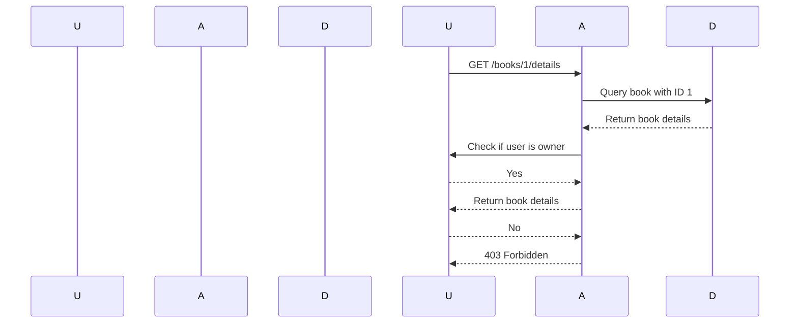

## Introduction to Broken Object Level Authorization (BOLA)

Broken Object Level Authorization (BOLA) is a critical security issue that arises when an application fails to properly restrict access to sensitive objects based on the user's permissions. This vulnerability allows unauthorized users to access, modify, or delete objects that should be restricted to specific users or roles. In the context of APIs, BOLA often manifests as a failure to enforce proper access controls on resources such as user data, financial records, or administrative functions.

### Background Theory

To understand BOLA, it's essential to grasp the fundamental concepts of authentication and authorization in web applications:

1. **Authentication**: The process of verifying the identity of a user. Common methods include username/password combinations, OAuth tokens, and multi-factor authentication (MFA).

2. **Authorization**: The process of determining whether a user has the necessary permissions to perform certain actions within the application. This typically involves checking the user's role or group membership against a set of predefined rules.

In a well-designed system, authentication and authorization work together to ensure that only authorized users can access specific resources. However, when authorization is improperly implemented, it can lead to significant security vulnerabilities.

### Example Scenario

Let's consider the scenario described in the lecture:

- An API allows users to manage their books.
- Users can register themselves and add books to their account.
- The API provides endpoints to retrieve book details.

The key issue here is that the API does not properly enforce object-level authorization. Specifically, the API allows any authenticated user to access the details of any book, regardless of ownership.

#### API Endpoints

Here are the relevant API endpoints:

- `POST /register`: Registers a new user.
- `POST /books`: Adds a new book to the user's collection.
- `GET /books/{book_id}/details`: Retrieves the details of a specific book.

### Vulnerability Analysis

The core of the vulnerability lies in the `GET /books/{book_id}/details` endpoint. The backend logic for this endpoint is flawed because it does not check whether the requesting user is the owner of the book.

#### Backend Logic

The backend logic for retrieving book details might look something like this:

```python
def get_book_details(book_id):
    book = Book.query.get(book_id)
    if book:
        return book.details
    else:
        return None
```

This code snippet retrieves a book by its ID and returns its details. However, it lacks any checks to ensure that the requesting user is the owner of the book.

### Real-World Examples

Several high-profile breaches have been attributed to BOLA vulnerabilities:

- **CVE-2021-21972**: A vulnerability in the WordPress REST API allowed unauthorized users to access and modify posts and pages. This was due to improper authorization checks.
- **CVE-2022-22965**: A vulnerability in the Atlassian Jira Software allowed attackers to access sensitive project data by exploiting a flaw in the object-level authorization mechanism.

These examples highlight the importance of implementing robust authorization mechanisms to prevent unauthorized access to sensitive data.

### Detailed Code Example

Let's delve deeper into the code and demonstrate the vulnerability and how to fix it.

#### Vulnerable Code

Consider the following vulnerable code snippet:

```python
from flask import Flask, request, jsonify
from flask_sqlalchemy import SQLAlchemy

app = Flask(__name__)
app.config['SQLALCHEMY_DATABASE_URI'] = 'sqlite:///books.db'
db = SQLAlchemy(app)

class User(db.Model):
    id = db.Column(db.Integer, primary_key=True)
    username = db.Column(db.String(80), unique=True, nullable=False)

class Book(db.Model):
    id = db.Column(db.Integer, primary_key=True)
    title = db.Column(db.String(120), nullable=False)
    user_id = db.Column(db.Integer, db.ForeignKey('user.id'), nullable=False)
    user = db.relationship('User', backref=db.backref('books', lazy=True))

@app.route('/register', methods=['POST'])
def register():
    username = request.json.get('username')
    user = User(username=username)
    db.session.add(user)
    db.session.commit()
    return jsonify({'message': 'User registered successfully'}), 201

@app.route('/books', methods=['POST'])
def add_book():
    title = request.json.get('title')
    user_id = request.json.get('user_id')
    book = Book(title=title, user_id=user_id)
    db.session.add(book)
    db.session.commit()
    return jsonify({'message': 'Book added successfully'}), 201

@app.route('/books/<int:book_id>/details', methods=['GET'])
def get_book_details(book_id):
    book = Book.query.get(book_id)
    if book:
        return jsonify({'title': book.title}), 2
    else:
        return jsonify({'message': 'Book not found'}), 404

if __name__ == '__main__':
    app.run(debug=True)
```

#### Vulnerability Explanation

The `get_book_details` function retrieves a book by its ID and returns its details. However, it does not check whether the requesting user is the owner of the book. This means that any authenticated user can access the details of any book, leading to a BOLA vulnerability.

### How to Prevent / Defend

To prevent BOLA vulnerabilities, it's crucial to implement proper object-level authorization. Here’s how to fix the code:

#### Secure Code Fix

1. **Add User Authentication**: Ensure that the user is authenticated before accessing any resource.
2. **Check Ownership**: Verify that the requesting user is the owner of the book before returning its details.

Here’s the corrected code:

```python
from flask import Flask, request, jsonify, abort
from flask_sqlalchemy import SQLAlchemy
from flask_httpauth import HTTPBasicAuth

app = Flask(__name__)
app.config['SQLALCHEMY_DATABASE_URI'] = 'sqlite:///books.db'
db = SQLAlchemy(app)
auth = HTTPBasicAuth()

class User(db.Model):
    id = db.Column(db.Integer, primary_key=True)
    username = db.Column(db.String(80), unique=True, nullable=False)
    password = db.Column(db.String(120), nullable=False)

class Book(db.Model):
    id = db.Column(db.Integer, primary_key=True)
    title = db.Column(db.String(120), nullable=False)
    user_id = db.Column(db.Integer, db.ForeignKey('user.id'), nullable=False)
    user = db.relationship('User', backref=db.backref('books', lazy=True))

@auth.verify_password
def verify_password(username, password):
    user = User.query.filter_by(username=username).first()
    if user and user.password == password:
        return user

@app.route('/register', methods=['POST'])
def register():
    username = request.json.get('username')
    password = request.json.get('password')
    user = User(username=username, password=password)
    db.session.add(user)
    db.session.commit()
    return jsonify({'message': 'User registered successfully'}), 201

@app.route('/books', methods=['POST'])
@auth.login_required
def add_book():
    title = request.json.get('title')
    book = Book(title=title, user=auth.current_user())
    db.session.add(book)
    db.session.commit()
    return jsonify({'message': 'Book added successfully'}), 201

@app.route('/books/<int:book_id>/details', methods=['GET'])
@auth.login_required
def get_book_details(book_id):
    book = Book.query.get(book_id)
    if book and book.user == auth.current_user():
        return jsonify({'title': book.title}), 200
    else:
        abort(403)

if __name__ == '__main__':
    app.run(debug=True)
```

### Explanation of Fixes

1. **User Authentication**: The `verify_password` function ensures that the user is authenticated before accessing any resource.
2. **Ownership Check**: The `get_book_details` function now checks whether the requesting user is the owner of the book before returning its details. If the user is not the owner, a `403 Forbidden` error is returned.

### Mermaid Diagrams

#### Request/Response Flow



### Pitfalls and Common Mistakes

1. **Ignoring Authentication**: Failing to authenticate users before allowing them to access resources.
2. **Hardcoding Permissions**: Hardcoding permissions instead of dynamically checking them based on user roles.
3. **Inconsistent Authorization Checks**: Implementing authorization checks inconsistently across different parts of the application.

### Detection and Prevention

#### Detection

- **Static Code Analysis**: Use tools like SonarQube or Bandit to scan for potential BOLA vulnerabilities.
- **Dynamic Analysis**: Use penetration testing tools like Burp Suite or OWASP ZAP to test for unauthorized access.

#### Prevention

- **Implement Role-Based Access Control (RBAC)**: Define roles and permissions for different types of users.
- **Use Least Privilege Principle**: Grant users the minimum permissions necessary to perform their tasks.
- **Regular Audits**: Conduct regular security audits to identify and fix vulnerabilities.

### Conclusion

Broken Object Level Authorization (BOLA) is a serious security issue that can lead to unauthorized access to sensitive data. By implementing proper authentication and authorization mechanisms, developers can prevent these vulnerabilities and ensure the security of their applications.

### Practice Labs

For hands-on practice with API security, consider the following labs:

- **PortSwigger Web Security Academy**: Offers comprehensive modules on API security, including BOLA.
- **OWASP Juice Shop**: A deliberately insecure web application for practicing security skills.
- **DVWA (Damn Vulnerable Web Application)**: A PHP/MySQL web application that demonstrates common security issues.

By engaging with these labs, you can gain practical experience in identifying and mitigating BOLA vulnerabilities in real-world scenarios.

---
<!-- nav -->
[[API Security/06-Broken Object Level Authorization issues/02-BOLA Demonstration Live/00-Overview|Overview]] | [[API Security/06-Broken Object Level Authorization issues/02-BOLA Demonstration Live/02-Introduction to Broken Object-Level Authorization (BOLA)|Introduction to Broken Object-Level Authorization (BOLA)]]
