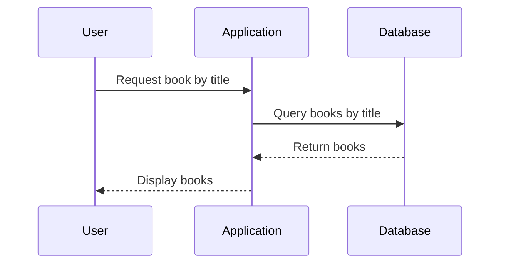
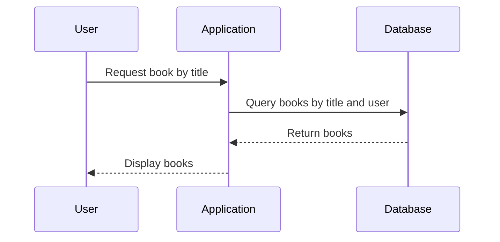

## Broken Object Level Authorization (BOLA)

### Introduction to Broken Object Level Authorization

Broken Object Level Authorization (BOLA) is a critical security issue that arises when an application fails to properly restrict access to objects based on the user's identity or role. In other words, the application does not enforce fine-grained access control policies, leading to unauthorized access to sensitive data. This vulnerability can result in significant data breaches, as attackers can manipulate queries to retrieve information that should be restricted to specific users.

### Understanding the Vulnerability

To understand BOLA, let's break down the components involved:

1. **User Identity**: Each user in the system has a unique identifier, such as a username or user ID.
2. **Object Access**: Objects in the system (e.g., books, documents, records) should be accessible only to authorized users.
3. **Access Control**: The application must enforce access control policies to ensure that users can only access objects they are permitted to access.

#### Example Scenario

Consider an e-commerce platform where users can view their orders. If the application does not properly restrict access to orders based on the user's identity, an attacker could potentially view other users' orders by manipulating the query parameters.

### Real-World Examples

Recent breaches and vulnerabilities have highlighted the importance of proper access control:

1. **CVE-2021-21972**: A vulnerability in the WordPress plugin "WP Simple Pay" allowed unauthorized access to payment data due to improper object-level authorization.
2. **CVE-2020-14882**: A vulnerability in the Atlassian Jira application allowed unauthorized access to project data due to insufficient access controls.

### Detailed Explanation of the Vulnerable Code

Let's analyze the provided code snippet to understand the vulnerability:

```python
# Vulnerable code
query = Book.objects.filter(book_title__icontains=book_title)
first_book = query.first()
```

In this code, the `Book` model is queried based on the `book_title`. However, there is no restriction based on the user's identity. This means that any user can potentially access books belonging to other users by manipulating the `book_title`.

### Proper Code Implementation

To fix this vulnerability, we need to include the user's identity in the query:

```python
# Proper code
query = Book.objects.filter(user=user, book_title__icontains=book_title)
first_book = query.first()
```

Here, the `user` field is added to the query, ensuring that only books belonging to the authenticated user are returned.

### Detailed Breakdown of the Proper Code

1. **User Authentication**: Ensure that the user is authenticated and their identity is verified.
2. **Query Construction**: Include the user's identity in the query to restrict access to only their own books.
3. **Result Retrieval**: Retrieve the first matching book from the filtered results.

### Mermaid Diagrams

Let's visualize the flow of the query and the access control mechanism using Mermaid diagrams.

#### Vulnerable Query Flow



#### Proper Query Flow



### Common Pitfalls and Mistakes

1. **Hardcoding User IDs**: Avoid hardcoding user IDs in queries, as this can lead to bypassing access controls.
2. **Ignoring User Context**: Always consider the user context when constructing queries, especially in multi-user environments.
3. **Improper Token Validation**: Ensure that tokens used for authentication are properly validated and cannot be tampered with.

### How to Prevent / Defend

#### Detection

1. **Static Analysis Tools**: Use static analysis tools like SonarQube, Fortify, or Veracode to identify potential BOLA vulnerabilities in the codebase.
2. **Dynamic Analysis Tools**: Employ dynamic analysis tools like Burp Suite, ZAP, or OWASP Dependency Check to test the application for runtime vulnerabilities.

#### Prevention

1. **Enforce Access Controls**: Implement strict access controls based on user roles and identities.
2. **Use ORM Features**: Leverage ORM features to automatically include user-specific filters in queries.
3. **Regular Audits**: Conduct regular security audits and penetration testing to identify and mitigate BOLA vulnerabilities.

#### Secure Coding Fixes

##### Vulnerable Code

```python
# Vulnerable code
query = Book.objects.filter(book_title__icontains=book_title)
first_book = query.first()
```

##### Secure Code

```python
# Secure code
query = Book.objects.filter(user=user, book_title__icontains=book_title)
first_book = query.first()
```

### Complete Example with HTTP Requests and Responses

#### Vulnerable Scenario

**HTTP Request**

```http
GET /api/books?title=example HTTP/1.1
Host: example.com
Authorization: Bearer <token>
```

**HTTP Response**

```http
HTTP/1.1 200 OK
Content-Type: application/json

[
    {
        "id": 1,
        "title": "Example Book",
        "author": "John Doe"
    },
    {
        "id": 2,
        "title": "Another Example Book",
        "author": "Jane Smith"
    }
]
```

#### Secure Scenario

**HTTP Request**

```http
GET /api/books?title=example HTTP/1.1
Host: example.com
Authorization: Bearer <token>
```

**HTTP Response**

```http
HTTP/1.1 200 OK
Content-Type: application/json

[
    {
        "id": 1,
        "title": "Example Book",
        "author": "John Doe"
    }
]
```

### Hands-On Labs

For practical experience with BOLA, consider the following labs:

- **PortSwigger Web Security Academy**: Offers interactive labs on broken object-level authorization.
- **OWASP Juice Shop**: Provides a vulnerable web application to practice identifying and fixing BOLA vulnerabilities.
- **DVWA (Damn Vulnerable Web Application)**: Another excellent resource for practicing web security concepts, including BOLA.

By thoroughly understanding and implementing proper access controls, developers can significantly reduce the risk of BOLA vulnerabilities and protect sensitive data.

---
<!-- nav -->
[[API Security/06-Broken Object Level Authorization issues/02-BOLA Demonstration Live/02-Introduction to Broken Object-Level Authorization (BOLA)|Introduction to Broken Object-Level Authorization (BOLA)]] | [[API Security/06-Broken Object Level Authorization issues/02-BOLA Demonstration Live/00-Overview|Overview]] | [[04-Understanding Broken Object-Level Authorization (BOLA)|Understanding Broken Object-Level Authorization (BOLA)]]
