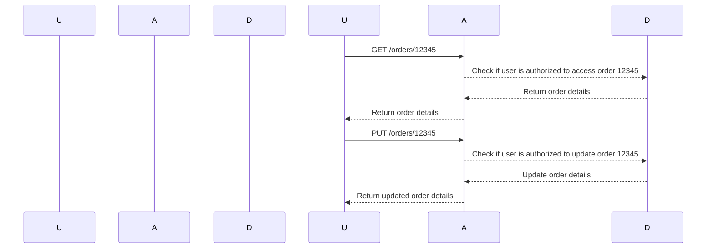

## Introduction to Broken Object-Level Authorization (BOLA)

Broken Object-Level Authorization (BOLA) is a critical security issue that occurs when an application fails to properly restrict access to sensitive objects based on user permissions. This vulnerability allows unauthorized users to access, modify, or delete objects that should be restricted to specific users or roles. In the context of APIs, BOLA can lead to significant data breaches and unauthorized actions.

### What is BOLA?

BOLA arises when an API endpoint does not enforce proper authorization checks on the objects being accessed. For instance, consider an API endpoint that allows users to retrieve their own orders. If the API does not verify that the requesting user is authorized to view the specified order, an attacker could potentially access any order by simply changing the order ID in the request.

### Why Does BOLA Matter?

BOLA is particularly dangerous because it can expose sensitive data and allow unauthorized modifications. This can lead to financial losses, privacy violations, and reputational damage. For example, if an e-commerce platform suffers from BOLA, attackers could access and manipulate orders belonging to other users, leading to fraudulent transactions and customer dissatisfaction.

### How Does BOLA Work Under the Hood?

To understand BOLA, we need to delve into the typical structure of an API and how authorization is supposed to work. An API typically consists of endpoints that handle various operations such as creating, reading, updating, and deleting resources (CRUD operations).

#### Example API Structure

Consider an API with the following endpoints:

- `POST /orders`: Create a new order.
- `GET /orders/{orderId}`: Retrieve an order by its ID.
- `PUT /orders/{orderId}`: Update an order by its ID.
- `DELETE /orders/{orderId}`: Delete an order by its ID.

In a properly secured API, each of these endpoints should enforce authorization checks to ensure that only authorized users can perform these operations.

### Real-World Examples of BOLA

Several real-world incidents highlight the severity of BOLA:

- **CVE-2021-3427**: A vulnerability in the WordPress REST API allowed unauthorized users to modify posts and pages. Attackers could exploit this to inject malicious content or deface websites.
- **CVE-2020-14882**: A vulnerability in the Shopify API allowed unauthorized users to access and modify orders. This could result in unauthorized changes to order details and potential financial losses.

### Detailed Explanation of BOLA in Action

Let's break down the scenario described in the lecture transcript using a more detailed example.

#### Scenario: RazorPay API

The lecture mentions the RazorPay API, which handles payment processing. Suppose the API has the following endpoints:

- `GET /orders/{orderId}`: Retrieve an order by its ID.
- `PUT /orders/{orderId}`: Update an order by its ID.

If the API does not enforce proper authorization checks, an attacker could exploit this to access or modify orders belonging to other users.

### Full Raw HTTP Messages

Here are the full HTTP messages for the GET and PUT requests:

```http
GET /orders/12345 HTTP/1.1
Host: api.razorpay.com
Authorization: Bearer <access_token>
```

```http
HTTP/1.1 200 OK
Content-Type: application/json
{
    "id": "12345",
    "customer_id": "cust_123",
    "amount": 1000,
    "currency": "USD"
}
```

```http
PUT /orders/12345 HTTP/1.1
Host: api.razorpay.com
Authorization: Bearer <access_token>
Content-Type: application/json

{
    "notes": "This is a modified note."
}
```

```http
HTTP/1.1 200 OK
Content-Type: application/json
{
    "id": "12345",
    "customer_id": "cust_123",
    "amount": 1000,
    "currency": "USD",
    "notes": "This is a modified note."
}
```

### Mermaid Diagrams

#### Sequence Diagram for BOLA Exploit



### Common Pitfalls and Mistakes

One common mistake is assuming that authentication alone is sufficient for authorization. Authentication verifies the identity of the user, but authorization ensures that the user has the necessary permissions to perform specific actions. Another pitfall is hardcoding permissions or relying solely on client-side checks, which can be easily bypassed.

### How to Prevent / Defend Against BOLA

#### Detection

To detect BOLA, you can use automated tools and manual testing:

- **Static Analysis Tools**: Tools like SonarQube and Fortify can identify insecure coding patterns.
- **Dynamic Analysis Tools**: Tools like Burp Suite and OWASP ZAP can simulate attacks and detect vulnerabilities.
- **Manual Testing**: Conduct thorough manual testing to verify that authorization checks are enforced correctly.

#### Prevention

To prevent BOLA, follow these best practices:

1. **Enforce Authorization Checks**: Ensure that every API endpoint enforces proper authorization checks.
2. **Use Role-Based Access Control (RBAC)**: Implement RBAC to define and enforce user roles and permissions.
3. **Audit Logs**: Maintain detailed audit logs to track access and modification attempts.
4. **Input Validation**: Validate all input parameters to prevent injection attacks.

#### Secure Coding Fixes

Here is an example of how to implement proper authorization checks in a Python Flask API:

**Vulnerable Code**

```python
from flask import Flask, request

app = Flask(__name__)

@app.route('/orders/<int:order_id>', methods=['GET', 'PUT'])
def manage_order(order_id):
    if request.method == 'GET':
        return get_order(order_id)
    elif request.method == 'PUT':
        return update_order(order_id, request.json)

def get_order(order_id):
    # Fetch order from database
    return {"id": order_id, "customer_id": "cust_123", "amount": 1000, "currency": "USD"}

def update_order(order_id, data):
    # Update order in database
    return {"id": order_id, "customer_id": "cust_123", "amount": 1000, "currency": "USD", "notes": data.get("notes")}

if __name__ == '__main__':
    app.run()
```

**Secure Code**

```python
from flask import Flask, request
from functools import wraps

app = Flask(__name__)

def require_auth(f):
    @wraps(f)
    def decorated_function(*args, **kwargs):
        # Simulate authorization check
        if not is_user_authorized(request.user_id, kwargs['order_id']):
            return "Unauthorized", 403
        return f(*args, **kwargs)
    return decorated_function

@app.route('/orders/<int:order_id>', methods=['GET', 'PUT'])
@require_auth
def manage_order(order_id):
    if request.method == 'GET':
        return get_order(order_id)
    elif request.method == 'PUT':
        return update_order(order_id, request.json)

def get_order(order_id):
    # Fetch order from database
    return {"id": order_id, "customer_id": "cust_123", "amount": 1000, "currency": "USD"}

def update_order(order_id, data):
    # Update order in database
    return {"id": order_id, "customer_id": "cust_123", "amount": 1000, "currency": "USD", "notes": data.get("notes")}

def is_user_authorized(user_id, order_id):
    # Simulate authorization check logic
    return True  # Replace with actual authorization logic

if __name__ == '__main__':
    app.run()
```

### Configuration Hardening

Ensure that your API server configurations are hardened to prevent unauthorized access:

- **Rate Limiting**: Implement rate limiting to prevent brute-force attacks.
- **Input Sanitization**: Sanitize all inputs to prevent injection attacks.
- **HTTPS**: Use HTTPS to encrypt data in transit.

### Hands-On Labs

For hands-on practice, consider the following labs:

- **PortSwigger Web Security Academy**: Offers comprehensive labs on API security, including BOLA.
- **OWASP Juice Shop**: Provides a vulnerable web application for practicing security testing.
- **DVWA (Damn Vulnerable Web Application)**: Useful for learning and testing various web application vulnerabilities.

By thoroughly understanding and implementing the preventive measures discussed, you can significantly reduce the risk of BOLA in your applications.

---
<!-- nav -->
[[API Security/06-Broken Object Level Authorization issues/03-BOLA Demonstration Part 2/00-Overview|Overview]] | [[02-Broken Object Level Authorization (BOLA)|Broken Object Level Authorization (BOLA)]]
