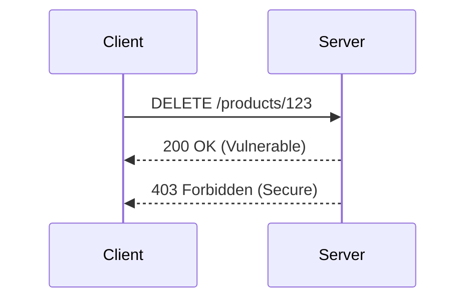

## Broken Object Level Authorization (BOLA)

### Introduction to BOLA

Broken Object-Level Authorization (BOLA) is a critical security issue that arises when an application fails to properly restrict access to resources based on the identity of the user. This means that a user might be able to access or manipulate objects (such as records, files, or accounts) that they should not have access to. This vulnerability can lead to unauthorized data exposure, modification, or deletion, which can have severe consequences for both the organization and its users.

### Understanding BOLA

To understand BOLA, let's break down the key components:

1. **Object**: An object can be any resource managed by the application, such as a database record, a file, or an account.
2. **Authorization**: This refers to the process of determining whether a user is allowed to perform a specific action on a given object.
3. **Level**: The level of authorization indicates the granularity at which access control is enforced. In the context of BOLA, the level is typically at the individual object level.

#### Example Scenario

Consider an e-commerce platform where each user has their own set of orders. If the application does not properly enforce authorization at the order level, a malicious user might be able to view, modify, or delete orders belonging to other users. This is a classic case of BOLA.

### Identifying BOLA Vulnerabilities

To identify BOLA vulnerabilities, we need to examine how the application handles user authentication and authorization. Specifically, we need to look at how the application verifies that a user is authorized to access or modify a particular object.

#### Steps to Identify BOLA

1. **Review Authentication Mechanisms**: Ensure that the application uses strong authentication mechanisms, such as OAuth, JWT, or session-based authentication.
2. **Examine Authorization Logic**: Check how the application determines whether a user is authorized to access or modify a specific object. Look for any logic that bypasses proper authorization checks.
3. **Test Access Controls**: Perform penetration testing to verify that users cannot access or modify objects they should not have access to.

### Real-World Examples of BOLA

#### Recent CVEs and Breaches

One notable example of BOLA is the breach at Equifax in 2017 (CVE-2017-5638). The attackers exploited a vulnerability in the Apache Struts framework, which allowed them to execute arbitrary code on the server. This led to unauthorized access to sensitive customer data, including names, social security numbers, birth dates, addresses, and driver’s license numbers.

Another example is the Capital One breach in 2019 (CVE-2019-11510). The attacker exploited a misconfigured web application firewall (WAF) to gain unauthorized access to sensitive customer data. This breach exposed the personal information of over 100 million customers.

### Detailed Example: Deleting Another User's Product

Let's consider a detailed example where a user can delete another user's product. Suppose we have an API endpoint `/products/{product_id}` that allows users to delete products.

#### Vulnerable Code

```python
@app.route('/products/<int:product_id>', methods=['DELETE'])
def delete_product(product_id):
    # Fetch the product from the database
    product = get_product_by_id(product_id)
    
    # Delete the product
    delete_product_from_db(product)
    
    return jsonify({"message": "Product deleted successfully"})
```

In this code, the `delete_product` function simply deletes the product with the given `product_id` without checking if the current user is authorized to delete this product. This is a classic case of BOLA.

#### Secure Code

To fix this vulnerability, we need to ensure that the user is authorized to delete the product. We can achieve this by adding an authorization check:

```python
@app.route('/products/<int:product_id>', methods=['DELETE'])
def delete_product(product_id):
    # Fetch the product from the database
    product = get_product_by_id(product_id)
    
    # Get the current user's ID from the authentication token
    current_user_id = get_current_user_id()
    
    # Check if the current user is authorized to delete this product
    if product.user_id != current_user_id:
        abort(403, description="You are not authorized to delete this product")
    
    # Delete the product
    delete_product_from_db(product)
    
    return jsonify({"message": "Product deleted successfully"})
```

### HTTP Requests and Responses

Let's look at the full HTTP request and response for both the vulnerable and secure versions of the code.

#### Vulnerable Version

**HTTP Request**

```http
DELETE /products/123 HTTP/1.1
Host: example.com
Authorization: Bearer <access_token>
```

**HTTP Response**

```http
HTTP/1.1 200 OK
Content-Type: application/json

{
    "message": "Product deleted successfully"
}
```

#### Secure Version

**HTTP Request**

```http
DELETE /products/123 HTTP/1.1
Host: example.com
Authorization: Bearer <access_token>
```

**HTTP Response**

```http
HTTP/1.1 403 Forbidden
Content-Type: application/json

{
    "description": "You are not authorized to delete this product"
}
```

### Sequence Diagram

A sequence diagram can help visualize the interaction between the client and the server in both the vulnerable and secure scenarios.



### How to Prevent / Defend Against BOLA

#### Detection

To detect BOLA vulnerabilities, you can perform the following steps:

1. **Static Analysis**: Use static analysis tools to scan your codebase for potential authorization issues.
2. **Dynamic Analysis**: Conduct dynamic analysis using penetration testing tools to simulate attacks and identify vulnerabilities.
3. **Logging and Monitoring**: Implement logging and monitoring to detect unauthorized access attempts.

#### Prevention

To prevent BOLA vulnerabilities, follow these best practices:

1. **Enforce Granular Authorization**: Ensure that authorization checks are performed at the individual object level.
2. **Use Role-Based Access Control (RBAC)**: Implement RBAC to define roles and permissions for different types of users.
3. **Audit and Review Access Controls**: Regularly audit and review your access control mechanisms to ensure they are effective.

#### Secure Coding Practices

1. **Validate User Input**: Always validate user input to ensure it meets expected criteria.
2. **Use Strong Authentication Mechanisms**: Implement strong authentication mechanisms, such as OAuth, JWT, or session-based authentication.
3. **Implement Least Privilege Principle**: Grant users the minimum level of access necessary to perform their tasks.

### Conclusion

Broken Object-Level Authorization (BOLA) is a serious security issue that can lead to unauthorized access to sensitive data. By understanding the concepts, identifying vulnerabilities, and implementing secure coding practices, you can effectively prevent and defend against BOLA attacks.

### Practice Labs

For hands-on practice with BOLA, consider the following labs:

- **PortSwigger Web Security Academy**: Offers interactive labs on broken access controls.
- **OWASP Juice Shop**: A deliberately insecure web application for practicing web security skills.
- **DVWA (Damn Vulnerable Web Application)**: A PHP/MySQL web application that is riddled with vulnerabilities for educational purposes.

By engaging with these labs, you can gain practical experience in identifying and mitigating BOLA vulnerabilities.

---
<!-- nav -->
[[01-Introduction to Broken Object-Level Authorization (BOLA)|Introduction to Broken Object-Level Authorization (BOLA)]] | [[API Security/06-Broken Object Level Authorization issues/03-BOLA Demonstration Part 2/00-Overview|Overview]] | [[API Security/06-Broken Object Level Authorization issues/03-BOLA Demonstration Part 2/03-Practice Questions & Answers|Practice Questions & Answers]]
