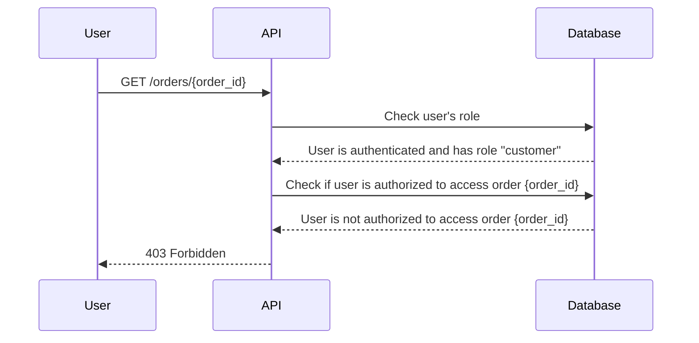

## Introduction to Broken Object Level Authorization (BOLA)

Broken Object Level Authorization (BOLA) is a critical security issue that arises when an application fails to properly restrict access to sensitive objects based on the user's privileges. This vulnerability allows unauthorized users to access, modify, or delete objects that should be restricted to specific roles or permissions. Understanding BOLA is essential for securing APIs and ensuring that sensitive data remains protected.

### What is BOLA?

BOLA occurs when an application does not enforce proper authorization checks at the object level. Typically, an application might verify that a user is authenticated and has certain roles, but it may fail to check whether the user is authorized to access a specific object or resource. This oversight can lead to unauthorized access to sensitive data.

#### Why Does BOLA Matter?

In many applications, especially those with complex permission structures, it is crucial to ensure that users can only access the resources they are explicitly allowed to interact with. Without proper object-level authorization, an attacker could exploit this vulnerability to gain access to sensitive information or perform unauthorized actions.

### How BOLA Works Under the Hood

To understand BOLA, let's break down the typical flow of an API request and how authorization checks are supposed to work:

1. **Authentication**: The user provides credentials to authenticate themselves.
2. **Authorization**: The system verifies that the authenticated user has the necessary permissions to access the requested resource.
3. **Object-Level Authorization**: The system further checks whether the user is authorized to access the specific object or resource.

If the system fails to perform the third step, an attacker could potentially access objects they should not be able to.

#### Example Scenario

Consider an e-commerce platform where users can view their orders. Each order is associated with a unique identifier. If the application does not properly check whether the user is authorized to view a specific order, an attacker could manipulate the order ID to access other users' orders.

### Real-World Examples of BOLA

Several high-profile breaches have been attributed to BOLA vulnerabilities. Here are a couple of recent examples:

1. **CVE-2021-3129**: This vulnerability affected a popular content management system (CMS). An attacker could exploit this flaw to access and modify posts that were not intended for them. The CMS failed to properly check the user's authorization to access specific posts.

2. **CVE-2022-22965**: This vulnerability was found in a widely used API framework. The framework did not enforce proper object-level authorization, allowing attackers to access and modify sensitive data belonging to other users.

### Detailed Example: BOLA Demonstration

Let's walk through a detailed example to illustrate how BOLA can occur and how to detect and prevent it.

#### Background Theory

In our example, we have an API endpoint that allows users to read and modify their orders. The API uses JWT tokens for authentication and role-based access control (RBAC) for authorization.



#### Step-by-Step Mechanics

1. **User Authentication**:
   - The user sends a request to the `/orders/{order_id}` endpoint with a valid JWT token.
   - The API verifies the JWT token to ensure the user is authenticated.

2. **Role-Based Access Control**:
   - The API checks the user's role to determine if they have the necessary permissions to access orders.
   - If the user has the "customer" role, they are allowed to proceed.

3. **Object-Level Authorization**:
   - The API should check whether the user is authorized to access the specific order with the given `order_id`.
   - If the user is not authorized, the API should return a 403 Forbidden response.

#### Complete Example Code

Here is a complete example of how the API endpoint might be implemented:

```python
from flask import Flask, request, jsonify
import jwt

app = Flask(__name__)

# Sample database
orders = {
    1: {"user_id": 1, "items": ["item1", "item2"]},
    2: {"user_id": 2, "items": ["item3", "item4"]}
}

@app.route('/orders/<int:order_id>', methods=['GET'])
def get_order(order_id):
    token = request.headers.get('Authorization')
    if not token:
        return jsonify({"error": "Unauthorized"}), 401
    
    try:
        decoded_token = jwt.decode(token, 'secret', algorithms=['HS256'])
        user_id = decoded_token['user_id']
    except jwt.ExpiredSignatureError:
        return jsonify({"error": "Token expired"}), 401
    except jwt.InvalidTokenError:
        return jsonify({"error": "Invalid token"}), 401
    
    if order_id not in orders:
        return jsonify({"error": "Order not found"}), 404
    
    order = orders[order_id]
    if order['user_id'] != user_id:
        return jsonify({"error": "Forbidden"}), 403
    
    return jsonify(order)

if __name__ == '__main__':
    app.run(debug=True)
```

### Pitfalls and Common Mistakes

When implementing object-level authorization, several common mistakes can lead to BOLA vulnerabilities:

1. **Missing Authorization Checks**: Failing to check whether the user is authorized to access a specific object.
2. **Hardcoded Permissions**: Using hardcoded permissions instead of dynamic checks based on user roles and object ownership.
3. **Inconsistent Authorization Logic**: Having inconsistent authorization logic across different parts of the application.

### How to Prevent / Defend Against BOLA

#### Detection

To detect BOLA vulnerabilities, you can perform the following steps:

1. **Code Review**: Conduct thorough code reviews to ensure that all API endpoints properly enforce object-level authorization.
2. **Penetration Testing**: Use automated tools and manual testing to identify potential BOLA vulnerabilities.
3. **Logging and Monitoring**: Implement logging and monitoring to detect unauthorized access attempts.

#### Prevention

To prevent BOLA, follow these best practices:

1. **Enforce Object-Level Authorization**: Ensure that all API endpoints check whether the user is authorized to access a specific object.
2. **Use Dynamic Permissions**: Avoid hardcoding permissions and use dynamic checks based on user roles and object ownership.
3. **Consistent Authorization Logic**: Maintain consistent authorization logic across all parts of the application.

#### Secure Coding Fixes

Here is an example of how to implement secure coding practices to prevent BOLA:

**Vulnerable Code**:

```python
@app.route('/orders/<int:order_id>', methods=['GET'])
def get_order(order_id):
    token = request.headers.get('Authorization')
    if not token:
        return jsonify({"error": "Unauthorized"}), 401
    
    try:
        decoded_token = jwt.decode(token, 'secret', algorithms=['HS256'])
        user_id = decoded_token['user_id']
    except jwt.ExpiredSignatureError:
        return jsonify({"error": "Token expired"}), 401
    except jwt.InvalidTokenError:
        return jsonify({"error": "Invalid token"}), 401
    
    if order_id not in orders:
        return jsonify({"error": "Order not found"}), 404
    
    order = orders[order_id]
    return jsonify(order)
```

**Secure Code**:

```python
@app.route('/orders/<int:order_id>', methods=['GET'])
def get_order(order_id):
    token = request.headers.get('Authorization')
    if not token:
        return jsonify({"error": "Unauthorized"}), 401
    
    try:
        decoded_token = jwt.decode(token, 'secret', algorithms=['HS256'])
        user_id = decoded_token['user_id']
    except jwt.ExpiredSignatureError:
        return jsonify({"error": "Token expired"}), 401
    except jwt.InvalidTokenError:
        return jsonify({"error": "Invalid token"}), 401
    
    if order_id not in orders:
        return jsonify({"error": "Order not found"}), 404
    
    order = orders[order_id]
    if order['user_id'] != user_id:
        return jsonify({"error": "Forbidden"}), _403
    
    return jsonify(order)
```

### Configuration Hardening

To further harden your application against BOLA, consider the following configuration settings:

1. **Enable Strict Mode**: Enable strict mode in your application to catch potential authorization errors.
2. **Use Role-Based Access Control (RBAC)**: Implement RBAC to ensure that users can only access resources they are authorized to.
3. **Audit Logs**: Enable audit logs to track access attempts and detect unauthorized access.

### Conclusion

Understanding and preventing BOLA is crucial for securing APIs and ensuring that sensitive data remains protected. By enforcing proper object-level authorization, conducting thorough code reviews, and implementing robust security measures, you can significantly reduce the risk of BOLA vulnerabilities.

### Practice Labs

For hands-on practice with BOLA, consider the following labs:

- **PortSwigger Web Security Academy**: Offers interactive labs on broken object-level authorization.
- **OWASP Juice Shop**: Provides a vulnerable web application for practicing security testing.
- **DVWA (Damn Vulnerable Web Application)**: A deliberately insecure web application for practicing web security.

By engaging with these labs, you can gain practical experience in identifying and mitigating BOLA vulnerabilities.

---
<!-- nav -->
[[API Security/06-Broken Object Level Authorization issues/04-BOLA Demonstration/00-Overview|Overview]] | [[API Security/06-Broken Object Level Authorization issues/04-BOLA Demonstration/02-Introduction to Broken Object-Level Authorization (BOLA)|Introduction to Broken Object-Level Authorization (BOLA)]]
